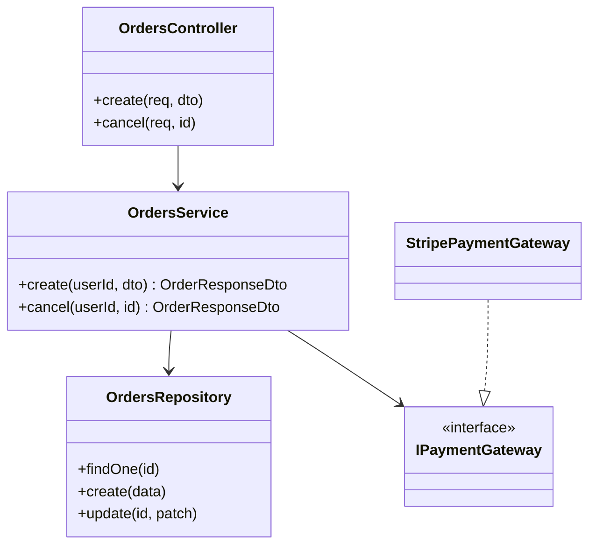
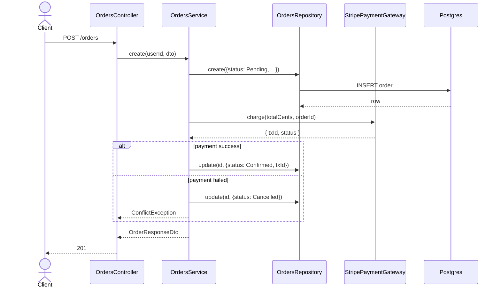
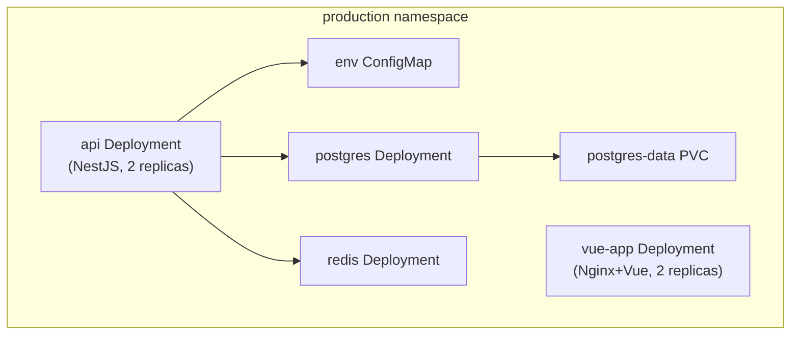

# Full-Stack Implementation Doc Writer

Phase 4 of spec → test → code → doc workflow. Runs after implementation. Reads actual code and manifests, produces developer-facing reference. Distinct from spec — spec = forward-looking design intent; this doc = backward-looking ground truth covering Vue 3 frontend, NestJS backend, and k8s infra.

## When to invoke

- "Document the orders implementation"
- "Write the docs for this feature"
- "Now write the doc"
- "Wrap up with docs"
- "Update the docs to reflect what we built"
- After any implementation cycle, even terse prompts like "and now docs"

## Output location

`docs/implementation/<feature-name>.md` — parallel to `docs/specs/<feature-name>.md`. Same kebab-case naming.

**Single document rule:** Output always **one self-contained file**. Never split into sub-pages. Never link external doc files for content belonging here.

If doc exists, **update** not rewrite — preserve human-added context (operational notes, known gotchas) unless implementation invalidated them.

## How this differs from the spec doc

| Aspect | Spec doc (phase 1) | Implementation doc (phase 4) |
|---|---|---|
| Audience | Reviewers, planners, future-self deciding what to build | Developers using or extending module *now* |
| Source of truth | User's intent | Code on disk |
| Tense | Future / conditional ("the system will...") | Present indicative ("the module exposes...") |
| Diagrams | Design diagrams (often abstracted) | Reality diagrams (actual classes, actual interactions) |
| Acceptance criteria | Yes, central | No — that's the test suite's job |
| Configuration | Maybe ("we'll need a Stripe key") | Yes, exact env var names with defaults |
| Errors | Listed by status code | Listed by status code, with actual exception class that throws each |

Spec/implementation conflict → implementation doc wins. **Spec drift** section explains divergence.

## Source extraction — read these files

Scan all layers before writing to collect ground truth:

| File pattern | What to extract |
|---|---|
| `server/src/*.controller.ts` | Endpoint table: method, path, guards, request DTO, return type, status codes (success + every `throw`) |
| `server/src/*.module.ts` | `imports`, `exports`, `providers` (especially custom providers with tokens) |
| `server/src/dto/*.ts` | Field names, types, validators, transforms — both request and response shapes |
| `server/src/entities/*.ts` | Columns, types, indexes, relations (for data model section) |
| `server/src/*.service.ts` | Public method signatures + JSDoc — become "use from other modules" section |
| `server/src/interfaces/*.ts` + `tokens.ts` | Extension points — interfaces consumers can implement |
| `server/src/*.spec.ts` / `server/src/*.e2e-spec.ts` | Cross-reference: which AC IDs / behaviors have tests (don't re-document tests, but verify coverage claims) |
| `ConfigService.get(...)` calls + `process.env` references | Configuration table |
| `@nestjs/event-emitter` `emit()` / Bull queue `add()` / etc. | Events emitted, jobs enqueued (extension surface) |
| `frontend/src/<feature>/**/*.vue` | Component props, emits, slots, exposed composables |
| `frontend/src/<feature>/stores/*.ts` | Pinia store state shape, actions, getters exposed to components |
| `frontend/src/<feature>/composables/*.ts` | Composable inputs/outputs, what they encapsulate |
| `frontend/e2e/<feature>.spec.ts` | Playwright test coverage — which AC IDs are covered end-to-end |
| `k8s/base/*.yaml` + `k8s/overlays/**/*.yaml` | Deployed resources per environment, env var keys, image tags, replica counts |
| `k8s/validate/*.sh` | Validation commands runnable against the cluster |

No source material for section → write "None". Never invent.

## Required doc structure

```markdown
# <Feature Name>

> **Status:** stable | in-progress | deprecated
> **Spec:** [docs/specs/<feature>.md](../specs/<feature>.md)
> **Backend module:** `server/src/<feature>/`
> **Frontend module:** `frontend/src/<feature>/`

## Table of Contents

- [1. Overview](#1-overview)
- [2. Public API (HTTP)](#2-public-api-http)
- [2b. Frontend pages & components](#2b-frontend-pages--components)
- [3. Module surface](#3-module-surface)
- [4. System architecture](#4-system-architecture)
- [5. Data model](#5-data-model)
- [6. DTOs](#6-dtos)
- [7. Configuration](#7-configuration)
- [8. Dependencies](#8-dependencies)
- [9. Extension points](#9-extension-points)
- [10. Errors](#10-errors)
- [11. Operational notes](#11-operational-notes)
- [12. Spec drift](#12-spec-drift)
- [13. Changelog](#13-changelog)

## 1. Overview
One paragraph: what the feature does, present tense, from consumer's POV. Full system role — not feature in isolation, but where it fits in the deployed system (upstream producers, downstream consumers, infra services it depends on, Vue pages that surface it to users).

## 2. Public API (HTTP)
Table of endpoints, then subsection per endpoint with full request/response detail and runnable example.

## 2b. Frontend pages & components
Vue Router routes introduced or modified by this feature, followed by component-level detail.

## 3. Module surface
What the NestJS module exports, how to import from another module, what it requires (DI tokens, env vars).

## 4. System architecture
Four mermaid diagrams — all required, all scoped to the full deployed system.

## 5. Data model
ER diagram of entities as implemented (with actual column names, types, indexes).

## 6. DTOs
Request and response shapes with validators noted inline.

## 7. Configuration
Every env var / config key the feature reads, with type, default, and what happens if missing.

## 8. Dependencies
Internal modules imported, external services called, libraries with non-obvious roles.

## 9. Extension points
Interfaces consumers can implement, events emitted, hooks exposed.

## 10. Errors
Exception class → status code → trigger condition.

## 11. Operational notes
Performance characteristics, observability hooks (log topics, metrics, traces), known limits, rate limits, idempotency guarantees. Validation commands.

## 12. Spec drift
What's in implementation that spec didn't anticipate, or vice versa. Empty if perfectly aligned.

## 13. Changelog
Date-stamped entries summarizing what changed in each implementation pass.
```

## Section-by-section guidance

### 2. Public API (HTTP)

Open with quick-reference table, then expand each endpoint.

```markdown
| Method | Path | Auth | Description |
|---|---|---|---|
| POST | `/orders` | JWT (customer) | Create a new order and charge payment |
| GET | `/orders/:id` | JWT (owner or admin) | Fetch one order |
| DELETE | `/orders/:id` | JWT (owner) | Cancel an order |

### POST /orders

Creates new order, charges configured payment gateway, persists in `Confirmed` status.

**Request**
~~~http
POST /orders
Authorization: Bearer <jwt>
Content-Type: application/json

{
  "items": [{ "productId": "uuid", "quantity": 2 }],
  "shippingAddressId": "uuid"
}
~~~

**Responses**
- `201 Created` — `OrderResponseDto`
- `400 Bad Request` — `BadRequestException` from `ValidationPipe` (empty items, invalid UUID, etc.)
- `401 Unauthorized` — `JwtAuthGuard` rejected token
- `409 Conflict` — `ConflictException` from `OrdersService.create` when payment fails

**Example**
~~~bash
curl -X POST https://api.example.com/orders \
  -H "Authorization: Bearer $TOKEN" \
  -H "Content-Type: application/json" \
  -d '{"items":[{"productId":"...","quantity":2}],"shippingAddressId":"..."}'
~~~
```

Use fenced code blocks with `~~~` if doc itself is rendered inside Markdown that already uses ` ``` `.

### 2b. Frontend pages & components

Route table first, then per-component detail for non-trivial components.

```markdown
## 2b. Frontend pages & components

| Route | Named route | Component | Auth | Description |
|---|---|---|---|---|
| `/orders` | `orders-list` | `OrdersView.vue` | required | Lists all user orders with pagination |
| `/orders/:id` | `order-detail` | `OrderDetailView.vue` | required | Single order detail and status timeline |

### OrdersView.vue

What it renders: paginated list of `OrderCard` components. Fetches on mount via `orders.store.ts`.

**Store consumed:** `useOrdersStore()` — calls `fetchOrders()` on mount, reads `orders`, `loading`, `error`.

**Events emitted:** none (page-level view, no parent).

**Error states handled:** loading skeleton while `loading === true`; inline error banner on `error !== null`; empty state with CTA when `orders.length === 0`.

### OrderCard.vue

**Props:**
| Prop | Type | Required | Description |
|---|---|---|---|
| `order` | `OrderSummary` | yes | Order data to render |
| `compact` | `boolean` | no | Renders compact variant without action buttons |

**Emits:**
| Event | Payload | When |
|---|---|---|
| `cancel` | `{ orderId: string }` | User clicks cancel button |
```

### 3. Module surface

Show import recipe so other developers don't have to read source.

```markdown
**Import the module:**
~~~ts
import { OrdersModule } from './orders/orders.module';

@Module({
  imports: [OrdersModule],
})
export class SomeFeatureModule {}
~~~

**Exports** (available for injection in importing modules):
- `OrdersService` — public service for cross-module use

**Required configuration:**
- `STRIPE_KEY` — env var, see [§7](#7-configuration)

**Required peer modules:**
- `PaymentsModule` — auto-imported
- `UsersModule` — auto-imported
```

### 4. System architecture

Four required mermaid diagrams, all scoped to the **full deployed system**. "Full deployed system" = every NestJS module, every infrastructure service (DB, Redis, queues), every external API, and every Vue page that participates at runtime — not just the feature being documented.

**4.1 Class diagram** — structural. Every class and public interface. Relationships from actual `*.module.ts` wiring (not design intent).

**4.2 Sequence diagram** — behavioral. Full runtime path for primary happy-path request: from external producer through every module, every infra service, and back.

**4.3 State machine** — entity lifecycle. States and transitions for core domain object (alert, order, etc.).

**4.4 Deployment topology** — infrastructure. K8s resources as defined in `k8s/base/` and `k8s/overlays/`. Show namespaces, deployments, services, PVCs, and how they connect. Use `graph TD`.

````markdown





````

### 5. Data model

ER diagram derived from `entities/*.ts`. Column types must match actual `@Column` / schema decorators, not spec's abstraction.

### 6. DTOs

Inline validator rules so consumers don't have to open source.

```markdown
### CreateOrderDto
| Field | Type | Validators | Notes |
|---|---|---|---|
| `items` | `OrderItemDto[]` | `@IsArray`, `@ArrayNotEmpty`, `@ValidateNested({ each: true })` | Cannot be empty |
| `shippingAddressId` | `string` | `@IsUUID` | |

### OrderItemDto
| Field | Type | Validators |
|---|---|---|
| `productId` | `string` | `@IsUUID` |
| `quantity` | `number` | `@IsInt`, `@Min(1)` |

### OrderResponseDto
| Field | Type | Notes |
|---|---|---|
| `id` | `string` | |
| `status` | `'Pending' \| 'Confirmed' \| 'Shipped' \| 'Cancelled'` | |
| `total` | `number` | In currency units (not cents) |
| `createdAt` | `Date` | ISO 8601 in JSON |
```

### 7. Configuration

Every env var the feature touches. Type, default, behavior if absent.

```markdown
| Key | Type | Default | Required | Behavior if missing |
|---|---|---|---|---|
| `STRIPE_KEY` | string | — | yes | App fails to start with config validation error |
| `ORDERS_DEFAULT_CURRENCY` | string | `"USD"` | no | Falls back to USD |
| `ORDERS_REFUND_WINDOW_HOURS` | number | `72` | no | 72-hour window for refunds |
```

### 9. Extension points

Interfaces future developer can implement to swap behavior, plus events module emits.

```markdown
**Swappable interfaces:**
- `PaymentGateway` (token: `PAYMENT_GATEWAY`) — current binding `StripePaymentGateway`. Implement and re-bind in `OrdersModule.providers` to use different gateway.

**Events emitted (via `EventEmitter2`):**
- `order.created` — payload: `{ orderId, userId, total }`
- `order.cancelled` — payload: `{ orderId, refundedAmount }`
```

### 10. Errors

Map exception classes → status codes → triggers. Operational debugging table.

```markdown
| Exception | Status | Thrown by | When |
|---|---|---|---|
| `BadRequestException` | 400 | `ValidationPipe` | Request body fails DTO validation |
| `UnauthorizedException` | 401 | `JwtAuthGuard` | Missing or invalid JWT |
| `NotFoundException` | 404 | `OrdersService.cancel`, `findOne` | Order doesn't exist OR caller not owner (intentional — don't leak existence) |
| `ConflictException` | 409 | `OrdersService.cancel` | Order in `Shipped` or later status |
| `ConflictException` | 409 | `OrdersService.create` | Payment gateway returned non-success |
```

### 11. Operational notes

Things learned only after operating the feature. Examples:

- **Idempotency**: `POST /orders` is **not** idempotent — repeated calls create duplicate orders. Add `Idempotency-Key` header strategy if needed.
- **Timeouts**: payment gateway call uses default Stripe SDK timeout (~80s). Long calls block request.
- **Logging**: emits structured logs under `OrdersService` logger context. Search `level=error context=OrdersService` for failures.
- **Metrics**: increments `orders_created_total` and `orders_payment_failed_total` (Prometheus, if `MetricsModule` registered).
- **Database load**: `findOne` indexed on `id` (PK). `findByUser` performs sequential scan if no `userId` index — verify in production.

Validation commands (run in order, all must pass before marking done):

```
- npx prisma generate — regenerate Prisma client after schema changes
- cd server && npm test — backend unit + integration
- cd server && npm run test:e2e — backend e2e
- cd frontend && npm run test:unit — frontend Vitest unit tests
- npx playwright test — frontend Playwright e2e tests
- minikube kubectl -- kustomize k8s/base/ | minikube kubectl -- apply --dry-run=server -f - — infra validation (dry-run)
- cd server && npm run lint && npm run build — must exit 0
```

### 12. Spec drift

Write honestly. Matches spec exactly: "No drift — implementation matches `docs/specs/<feature>.md` v<rev>." Otherwise list each divergence:

```markdown
- **Spec FR-7** required `Confirmed` → `Shipped` transition via `POST /orders/:id/ship`. **Implementation** uses internal worker (`ShipmentWorker`) triggered by `order.confirmed` event instead — no public endpoint. Update spec or accept divergence.
- **Spec section 6** showed `total` as `decimal(10,2)`. **Implementation** uses `int` (cents) at DB layer and converts in response DTO. Pragmatic call, no functional difference at API layer.
- **Spec section 15** showed `OrderDetailView` as a separate page. **Implementation** renders order detail in a slide-over panel within `OrdersView` instead. Vue Router route `order-detail` still exists but renders the panel, not a new page.
```

### 13. Changelog

Append-only. Old entries are audit trail.

```markdown
- **2025-05-04** — Initial implementation. Endpoints: POST /orders, DELETE /orders/:id. Stripe gateway. Module exports `OrdersService`.
- **2025-05-12** — Added GET /orders/:id (read endpoint). Added `order.cancelled` event emission. Added `OrdersView.vue`, `OrderCard.vue`, `OrderDetailView.vue`. K8s base manifests for `api` and `vue-app` deployments.
```

## Workflow

1. **Locate backend feature module.** Read `server/src/<feature>/*.module.ts` first to map surface (imports, exports, providers).
2. **Walk controller.** Build endpoint table. Per endpoint, follow chain into service to find every exception thrown — those are response codes.
3. **Walk DTOs.** Extract field tables with validator decorators inline.
4. **Walk entities.** Generate ER diagram from actual `@Column` / schema.
5. **Walk frontend module.** Read `frontend/src/<feature>/` — views, components, stores, composables. Build component table and Pinia store summary.
6. **Walk k8s manifests.** Read `k8s/base/` for base resources, then `k8s/overlays/` for per-environment patches. Build deployment topology diagram.
7. **Grep for config reads.** `ConfigService.get` calls and `process.env` access in backend; `import.meta.env` references in frontend — list all in configuration section.
8. **Diff against spec.** If spec exists at `docs/specs/<feature>.md`, read and check for drift. Note divergences honestly.
9. **Preserve human-added content.** If doc exists, keep operational notes, gotchas, changelog entries. Replace auto-derivable sections (endpoint table, DTOs, ER diagram, config table, component table, infra topology); keep rest.
10. **Append to changelog**, don't rewrite.

## Heuristics for what to include vs. skip

- **Include** anything developer needs to *use* module from outside (endpoints, routes, exports, config, errors).
- **Include** anything developer needs to *extend* module (interfaces, events, swappable tokens, composables).
- **Include** the k8s resource names and overlay differences — developers deploying need this to understand what's in each environment.
- **Skip** internal helper functions, private methods, implementation details not observable from outside — that's source code's job.
- **Skip** spec's "why we built this" reasoning. Link to spec instead.
- **Skip** test details. Test suite is authoritative behavior description — don't duplicate in prose.
- **Skip** Pinia store internal implementation — document the public state shape and actions, not the internal mutations.

## Anti-patterns

- **Regenerating the spec.** Doc ≠ "spec, but updated." Different artifact — present-tense, code-derived, developer-facing. Aspirational prose = stop.
- **Lying about coverage.** No event emitter in implementation → don't write "emits `order.created`" because spec said so. Read the code.
- **Rewriting the changelog.** Append. Always append. Old entries are audit trail.
- **Markdown blob walls.** Tables for tabular data (endpoints, DTOs, config, errors, components). Prose for narrative (overview, operational notes). Diagrams for relationships. Wrong tool = wrong output.
- **Out-of-date examples.** `curl` example with stale path or deleted field is worse than no example. Derive examples from current DTOs.
- **Ignoring drift.** Implementation diverged from spec → say so. Hidden divergence rots spec until nobody trusts it.
- **Skipping frontend or infra sections.** If `frontend/src/<feature>/` exists, section 2b is required. If `k8s/` was modified, section 4.4 topology must reflect actual manifests. "N/A" only if the layer genuinely wasn't touched.
- **Inventing k8s resource names.** Read the actual YAML. Don't guess Deployment names, image tags, or ConfigMap keys — they are canonical in the manifests.
