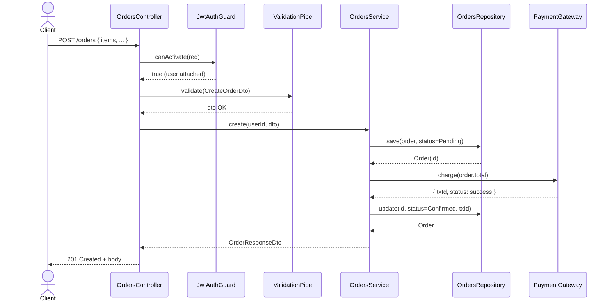
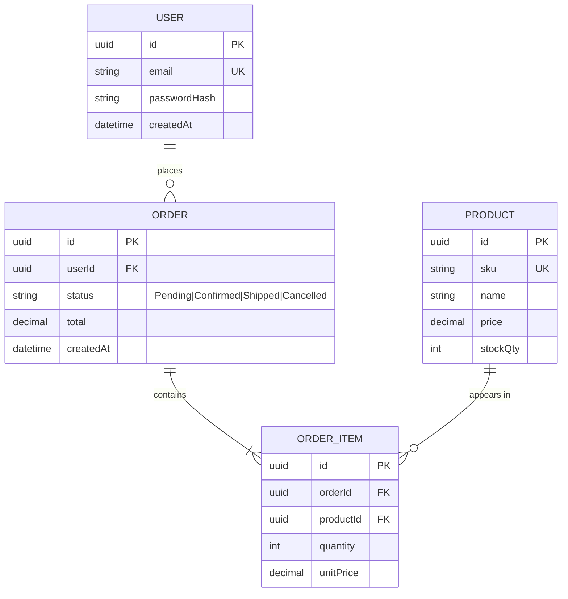
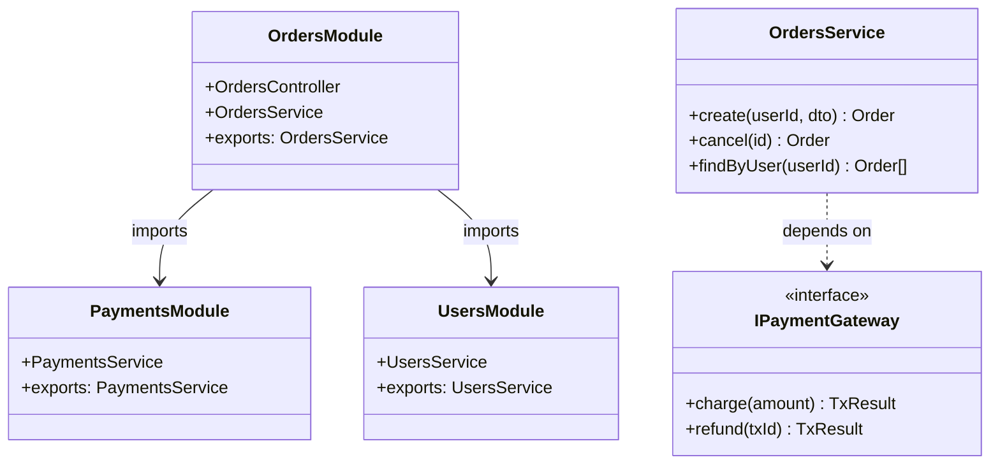
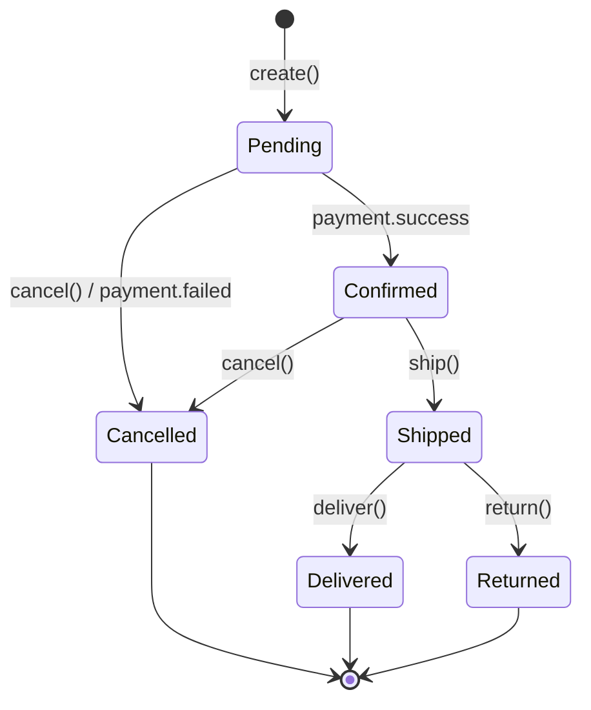
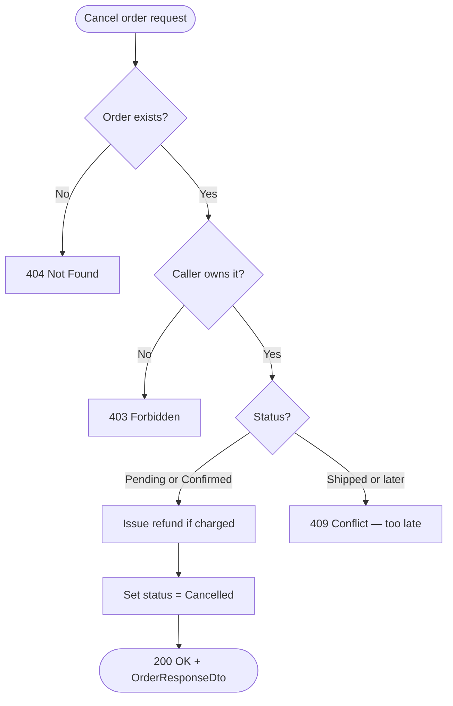
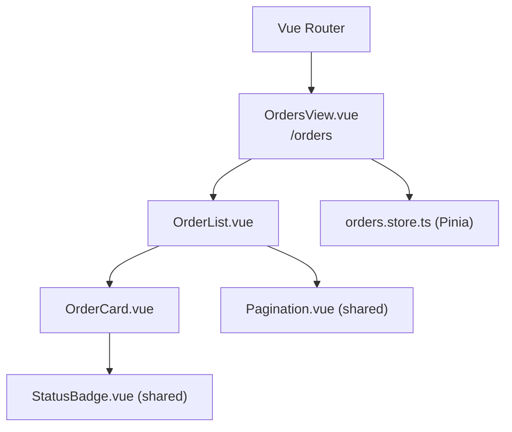
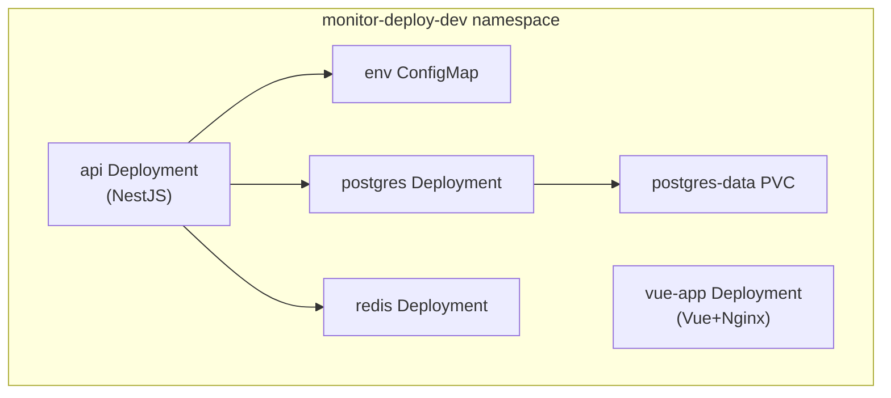

# Full-Stack Spec with Mermaid

Skill produces full-stack feature specs covering Vue 3 frontend, NestJS backend, and k8s infra. Spec = contract downstream phases (tests, implementation, doc-writer) must satisfy. Must be precise about behavior, data, boundaries, component hierarchy, and deployment topology.

## When to invoke

- "Write a spec for a notifications feature"
- "Design doc for the order checkout module"
- "Spec out the auth flow before we code it"
- "Document the requirements for the billing service"
- "Plan the Vue pages and API for this feature"
- "Spec the infra changes for this deployment"
- Any time user wants planning artifacts before code

## Output location and file shape

Write specs to `docs/specs/<feature-name>.md`, kebab-case. If `docs/specs/` missing, create it. Not inside `server/` or `frontend/` — project artifacts, not code.

One spec per feature/module. Multi-module feature: split specs that reference each other, or one spec with clear "Modules touched" section.

## Required spec structure

All sections in order. No omissions — write "N/A" if absent. Predictable structure lets testing and implementation skills consume it reliably.

```markdown
# <Feature Name>

## 1. Context
One paragraph: why this exists, what problem it solves, who uses it.

## 2. Scope
- **In scope**: bullet list of what this feature covers
- **Out of scope**: explicit list of what this feature does NOT cover (prevents scope creep)

## 3. Glossary
Define domain terms used in this spec (only the non-obvious ones).

## 4. Functional requirements
Numbered list (FR-1, FR-2, ...). Each is a single testable statement.
Bad: "Users should be able to manage orders."
Good: "FR-3: A customer can cancel an order while its status is `Pending` or `Confirmed`. After `Shipped`, cancellation returns 409 Conflict."

## 5. Non-functional requirements
Performance, security, observability, rate limits. Numbered (NFR-1, ...).

## 6. Data model
ER diagram + field-level table for each entity (type, constraints, indexes, default).

## 7. API contract
For each endpoint: method, path, auth, request DTO shape, response shape, status codes (success + every error case).
Also include frontend page routes: Vue Router named routes, path, component file, auth requirement.

## 8. Module boundaries
Class/component diagram showing which backend modules exist, what they expose, what they depend on. Include Vue module structure (views, components, stores, composables) alongside NestJS modules when the feature has a frontend.

## 9. Flows
Sequence diagrams for the primary use cases. One diagram per flow.

## 10. State machines
For any entity with a status field that progresses through stages, a state diagram.

## 11. Business rules / decision logic
Flowcharts for non-trivial branching logic.

## 12. Edge cases & error handling
Bullet list of edge cases and the expected behavior for each.

## 13. Acceptance criteria
Numbered list (AC-1, AC-2, ...). Each maps to one or more functional requirements and is phrased as "Given X, when Y, then Z." These become the test cases verbatim.

## 14. Open questions
Things the spec can't yet answer. Flag explicitly — don't hide ambiguity.

## 15. Frontend component hierarchy
Vue component tree for the feature. Use `graph TD` Mermaid diagram.

## 16. Infra topology
K8s namespace layout and resource topology. Use `graph TD` Mermaid diagram.
```

## Diagram type → use case map

Don't reach for one diagram type for everything. Each has a job:

| Diagram type | Use it for |
|---|---|
| `sequenceDiagram` | Request/response flows, multi-actor interactions over time |
| `erDiagram` | Database schema, entity relationships, cardinality |
| `classDiagram` | Module/class structure, interfaces, dependency direction |
| `stateDiagram-v2` | Entity lifecycle (status fields), workflow stages |
| `flowchart TD` / `LR` | Business decision logic, branching rules, validation pipelines |
| `flowchart` with `subgraph` | Module boundary / context diagram (poor man's C4) |
| `graph TD` (component) | Vue component tree, parent-child hierarchy |
| `graph TD` (topology) | K8s namespace layout, infra resource relationships |

## Diagram patterns (copy these)

### Request lifecycle — sequenceDiagram

Use for any HTTP flow. Show guards, pipes, service, repository, external services. Be honest about which calls are async.

````markdown

````

### Data model — erDiagram

Always include entity attribute block (`{ ... }`) — schema-of-record for implementation skill.

````markdown

````

Cardinality cheatsheet: `||--||` one-to-one, `||--o{` one-to-many, `}o--o{` many-to-many, `||--|{` one-to-one-or-more.

### Module boundaries — classDiagram

Show what each module exposes and what depends on what. Arrow direction = dependency direction (A → B means A depends on B). Use `<<interface>>` for ports/contracts.

````markdown

````

### Entity lifecycle — stateDiagram-v2

Use whenever entity has `status` field. Every transition here becomes an acceptance criterion.

````markdown

````

### Business logic — flowchart

For non-trivial decision logic. Not for request flow (use sequenceDiagram instead).

````markdown

````

### Vue component hierarchy — graph TD

Use for any feature that has a frontend. Show page views, layout components, feature components, shared components, Pinia stores, and Vue Router routes. Group by layer using subgraph when helpful.

````markdown

````

Rules:
- Page-level components (views) appear at the top of the tree below the router entry.
- Pinia stores are shown as nodes the view/component depends on, not as children.
- Shared components from a `components/shared/` directory are labeled `(shared)`.
- Composables a component depends on can be shown as nodes with `(composable)` label when non-trivial.
- Don't show every prop — just the structural wiring.

### K8s infra topology — graph TD with subgraph

Use for any feature that adds or changes k8s resources. Show namespaces as subgraphs, and inside them: Deployments, Services, ConfigMaps, PVCs, Ingress. Mark which overlays (dev/staging/prod) differ from base with a note or separate subgraph.

````markdown

````

Rules:
- One subgraph per namespace.
- Ingress → Service → Deployment chain flows top-to-bottom.
- PVCs are leaf nodes (no outgoing edges).
- ConfigMaps and Secrets are shown as dependencies of the Deployment that mounts them.
- Note overlay-specific differences (e.g., replica count, image tag) as a comment or annotation rather than a separate diagram unless differences are significant.

## Writing the requirements section

Each FR must be **atomic** (one statement, one behavior) and **testable** (can write passing/failing test). Can't write test for it → rewrite it.

| Bad | Good |
|---|---|
| "Users should be able to log in." | "FR-1: `POST /auth/login` with valid `email` + `password` returns 200 with `{ accessToken }` and a 7-day refresh cookie." |
| "Orders need to be paid." | "FR-7: Order moves from `Pending` to `Confirmed` only after `PaymentGateway.charge` returns `success`. Failure transitions to `Cancelled` and persists failure reason." |
| "The system should be fast." | "NFR-2: P95 latency for `GET /orders/:id` ≤ 150ms warm cache, ≤ 400ms cold." |
| "The orders page should show orders." | "FR-12: `OrdersView` fetches and renders all orders for the authenticated user. Empty state displays an 'Nenhum pedido encontrado' message with a CTA to create one." |

## Writing the acceptance criteria section

ACs bridge to phases 2 and 3 (tests). Use Given/When/Then. Each AC produces at least one test case. Tag which layer owns the test: `[backend]`, `[frontend]`, `[e2e]`, `[infra]`.

```markdown
- **AC-1** `[backend]`: Given an authenticated user, when they POST a valid `CreateOrderDto`, then the response is 201 with an `OrderResponseDto` whose `status` is `Pending`.
- **AC-2** `[backend]`: Given an order in `Shipped` status, when the owner calls `DELETE /orders/:id`, then the response is 409 and the order's status is unchanged.
- **AC-3** `[frontend]`: Given the user is on `/orders`, when the page loads, then `OrderList` renders one `OrderCard` per order returned by the API.
- **AC-4** `[e2e]`: Given an authenticated user, when they complete checkout via the UI, then an order appears in the list with status `Confirmed`.
- **AC-5** `[infra]`: Given `kustomize build k8s/overlays/prod`, when applied to a cluster, then the `api` Deployment has `replicas: 2` and uses the production image tag.
```

## API contract format

### Backend endpoints

Consistent block per endpoint:

```markdown
### POST /orders
- **Auth**: Bearer JWT (role: `customer`)
- **Request body** (`CreateOrderDto`):
  - `items: { productId: uuid, quantity: int >= 1 }[]` — non-empty
  - `shippingAddressId: uuid`
- **Responses**:
  - `201 Created` — `OrderResponseDto`
  - `400 Bad Request` — validation error
  - `401 Unauthorized` — missing/invalid token
  - `404 Not Found` — referenced product or address not found
  - `409 Conflict` — insufficient stock for any item
  - `502 Bad Gateway` — payment provider unavailable
```

### Frontend page routes

Table of Vue Router routes introduced or modified by this feature:

```markdown
| Named route | Path | Component | Auth required | Description |
|---|---|---|---|---|
| `orders-list` | `/orders` | `OrdersView.vue` | yes | Lists all user orders |
| `order-detail` | `/orders/:id` | `OrderDetailView.vue` | yes | Single order detail |
| `checkout` | `/checkout` | `CheckoutView.vue` | yes | Multi-step checkout flow |
```

## Workflow — how to actually write a spec

1. **Clarify scope first.** Name what's in and out before drafting. Ambiguous load-bearing point (auth model, ownership, data source of truth, which layer owns the logic) → ask one targeted question before writing. Speculation propagates into tests and code.
2. **Sketch the data model.** Draw ER diagram. Entity list usually reveals missing requirements.
3. **List the endpoints.** From requirements, derive API surface. One requirement may need multiple endpoints; multiple requirements may share one.
4. **List the frontend routes.** From requirements, derive page structure. One requirement may need multiple views or just a component on an existing view.
5. **Draw the primary flow** as sequence diagram. Usually surfaces missing modules or hidden dependencies.
6. **Identify lifecycles.** Entity with status field needs state diagram.
7. **Draw the component hierarchy.** From frontend routes, derive component tree. Show which stores/composables each view depends on.
8. **Draw the infra topology.** List k8s resources needed — Deployments, ConfigMaps, PVCs, Ingress. Note overlay differences.
9. **Write acceptance criteria last.** By now enough info to phrase precisely. Check coverage: every FR in at least one AC. Tag each AC with its layer.
10. **Hunt for ambiguity.** Re-read each section: could two engineers read this and build different things? If yes, tighten.

## Hand-off to the next phase

Spec read by:
- `frontend-testing` skill — converts frontend ACs into Vitest unit tests and Playwright e2e tests.
- `backend-testing` skill — converts backend ACs into Jest unit, integration, and e2e tests.
- `infra-testing` skill — converts infra ACs into kustomize validation and smoke tests.
- Implementation skills (`frontend-implementation`, `backend-implementation`, `infra-implementation`) — build modules, components, and manifests to satisfy those tests.

For clean hand-off:
- DTO shapes in section 7 explicit (field names, types, validators).
- Vue Router route table in section 7 complete (named routes, paths, components, auth).
- ER diagram complete with attribute blocks.
- Every FR/NFR/AC numbered so tests can reference by ID.
- Component hierarchy in section 15 covers all views introduced.
- Infra topology in section 16 covers all k8s resources added or changed.

## Anti-patterns to avoid

- **Pseudocode in spec.** Specs describe behavior, not implementation. No `if (x) { ... }` blocks or `<template>` snippets — implementation skill's job.
- **One giant diagram for everything.** Multiple focused diagrams beat one mega-diagram. Sequence diagram with 10+ participants → split it.
- **Mermaid that doesn't render.** Walk every diagram mentally. Common breakers: unquoted labels with spaces in `erDiagram` ("appears in" needs quotes), reserved words as node IDs in flowcharts, missing `participant` declarations in sequence diagrams, unescaped `()` in `graph TD` node labels (use `["..."]` quoting).
- **"TBD" without ownership.** Unknown → section 14 (Open questions) with name or decision needed. No TBDs scattered through doc.
- **Mixing in/out of scope.** Be ruthless in section 2. Ambiguity in/out = fight later.
- **Skipping section 15 or 16 for full-stack features.** If the feature touches frontend, draw the component hierarchy. If it touches infra, draw the topology. "N/A" only if the feature is genuinely backend-only or has no infra changes.
- **Frontend routes not in section 7.** API contract section must cover both HTTP endpoints and Vue Router routes. Omitting routes means frontend-testing skill has no source of truth.

## Section 15: Frontend component hierarchy

Vue component tree for the feature. Use `graph TD` Mermaid diagram. Show: page views, layout components, feature components, shared components they use, Pinia stores they depend on, Vue Router routes.

This section is required for any feature with a frontend. Write "N/A" only if the feature has no frontend surface.

````markdown

````

Document below the diagram:
- **Props and emits** for each non-trivial component (input/output contract).
- **Store actions** the view triggers on mount or user interaction.
- **Error states** the view must handle (loading, empty, API error).

## Section 16: Infra topology

K8s namespace layout and resource topology. Use `graph TD` Mermaid diagram. Show: namespaces, deployments, services, configmaps, PVCs, ingress. Include which overlay environments (dev/staging/prod) differ from base.

This section is required for any feature that adds, removes, or modifies k8s resources. Write "N/A" only if the feature is purely code with no infra changes.

````markdown

````

Document below the diagram:
- **Overlay differences**: what changes between dev, staging, and prod overlays (replica counts, resource limits, image tags, env vars).
- **New env vars**: any ConfigMap keys or Secret keys introduced by this feature.
- **Migration notes**: if this feature requires a new PVC, namespace, or CRD — note it explicitly.
