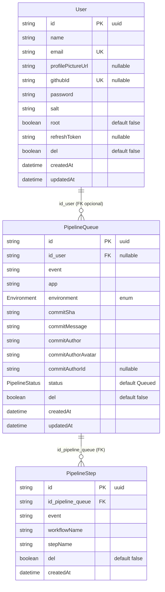

# CODEBASE.md — Pipeline Monitor

> **Mapa autoritativo.** Este arquivo é a única fonte para estrutura, módulos, símbolos, env vars, schema, e convenções resumidas.
>
> **Não use `grep`, `find`, ou `ls`** para descobrir nada listado aqui. Use ferramentas de busca **apenas** para lógica interna de uma função específica que o mapa não cobre.
>
> Se algo parecer desatualizado (arquivo novo ausente, símbolo renomeado), pare e avise o usuário antes de prosseguir. Atualizar este mapa é entregável obrigatório da Phase 4 (`fullstack-doc-writer`).

**Sumário rápido**

| § | Seção | Para quê |
|---|---|---|
| 1 | Estrutura de Diretórios | Onde fica cada arquivo |
| 2 | Grafo de Módulos (Backend) | Quem importa quem no NestJS |
| 3 | Schema Prisma | Models, enums, constraints |
| 4 | Fluxo de Request | Guards → controller → service → DB |
| 5 | Variáveis de Ambiente | Onde estão lidas, valores default |
| 6 | Scripts npm | Test, build, lint, prisma |
| 7 | Tipos Centrais (Frontend) | Interfaces compartilhadas |
| 8 | Índice Feature → Arquivos | Onde mexer para feature X |
| 9 | ERD Prisma | Relações entre models |
| 10 | Índice de Símbolos | Service/Controller/Store/Composable/DTO → caminho |
| 11 | Convenções Rápidas | NestJS / Vue / k8s / Swagger cheat-sheet |
| 12 | Padrões de Referência (Skeletons) | Esqueletos canônicos por tipo de artefato |

---

## Estrutura de Diretórios

```
monitor_deploy/
├── server/                          # NestJS 11 API
│   ├── src/
│   │   ├── app.module.ts            # Raiz; registra APP_GUARD=ApiKeyGuard global
│   │   ├── main.ts                  # Bootstrap NestJS; ValidationPipe global; Swagger em /docs
│   │   ├── auth/
│   │   │   ├── auth.controller.ts   # POST /auth/login, POST /auth/refresh
│   │   │   ├── auth.service.ts      # login(), refresh()
│   │   │   ├── auth.module.ts       # Exporta AuthService, JwtModule
│   │   │   ├── api-key.guard.ts     # Guard global; bypass se Bearer present; valida header apikey
│   │   │   ├── jwt-auth.guard.ts    # JwtAuthGuard (Passport JWT)
│   │   │   ├── jwt.strategy.ts      # Estratégia Passport; extrai user do JWT
│   │   │   ├── decorators/
│   │   │   │   └── skip-api-key.decorator.ts   # @SkipApiKey() — isenta rota do ApiKeyGuard
│   │   │   └── dto/
│   │   │       ├── login.dto.ts
│   │   │       ├── refresh.dto.ts
│   │   │       ├── auth-response.dto.ts         # AuthResponseDto, UserResponseInAuthDto
│   │   │       └── jwt-payload.dto.ts           # interface JwtPayload { sub, email, root }
│   │   ├── users/
│   │   │   ├── users.controller.ts  # POST, GET, GET/:id, PATCH/:id, DELETE/:id, POST/:id/regenerate-token
│   │   │   ├── users.service.ts     # CRUD + findByEmail + findByGithubId + regenerateToken
│   │   │   ├── users.module.ts      # Exporta UsersService
│   │   │   └── dto/
│   │   │       ├── create-user.dto.ts
│   │   │       ├── update-user.dto.ts           # PartialType(CreateUserDto)
│   │   │       ├── user-query.dto.ts            # page, limit, search, del
│   │   │       └── user-response.dto.ts         # Sem password/salt/refreshToken
│   │   ├── webhook/
│   │   │   ├── webhook.controller.ts  # POST /webhook — fire and forget via setImmediate
│   │   │   ├── webhook.service.ts     # handleEvent(dto) — switch por event type
│   │   │   ├── webhook.module.ts      # Importa PipelineQueueModule, PipelineStepsModule, GatewayModule, UsersModule
│   │   │   └── dto/
│   │   │       └── webhook-event.dto.ts
│   │   ├── pipeline-queue/
│   │   │   ├── pipeline-queue.controller.ts  # GET, GET/mine, GET/:id, PATCH/:id, DELETE/:id
│   │   │   ├── pipeline-queue.service.ts     # findAll, findMine, findByCommit, findById, create, update, softDelete
│   │   │   ├── pipeline-queue.module.ts      # Exporta PipelineQueueService
│   │   │   └── dto/
│   │   │       ├── create-pipeline-queue.dto.ts
│   │   │       ├── update-pipeline-queue.dto.ts
│   │   │       ├── pipeline-queue-query.dto.ts
│   │   │       └── pipeline-queue-response.dto.ts
│   │   ├── pipeline-steps/
│   │   │   ├── pipeline-steps.controller.ts  # GET (paginado ou all), GET/:id
│   │   │   ├── pipeline-steps.service.ts     # findAllByQueue, findById, create
│   │   │   ├── pipeline-steps.module.ts      # Exporta PipelineStepsService
│   │   │   └── dto/
│   │   │       ├── create-pipeline-step.dto.ts
│   │   │       ├── pipeline-step-response.dto.ts
│   │   │       └── pipeline-steps-query.dto.ts
│   │   ├── dashboard/
│   │   │   ├── dashboard.controller.ts  # GET /dashboard/kpis
│   │   │   ├── dashboard.service.ts     # getKpis(query) — queries diretas via PrismaService
│   │   │   ├── dashboard.module.ts
│   │   │   └── dto/
│   │   │       ├── kpis-query.dto.ts    # dateStart, dateEnd (ambos obrigatórios)
│   │   │       └── kpis-response.dto.ts # total, succeeded, failed, errorRate
│   │   ├── gateway/
│   │   │   ├── pipeline.gateway.ts   # @WebSocketGateway namespace=/pipeline; emitPipelineCreated/Updated
│   │   │   └── gateway.module.ts     # Exporta PipelineGateway
│   │   └── prisma/
│   │       ├── prisma.service.ts     # @Global; PrismaClient com @prisma/adapter-pg + pg.Pool
│   │       └── prisma.module.ts      # @Global; exporta PrismaService
│   ├── prisma/
│   │   ├── schema.prisma             # models: User, PipelineQueue, PipelineStep (sem url — Prisma 7)
│   │   └── migrations/               # Pasta de migrations gerenciada pelo Prisma
│   ├── prisma.config.ts              # Prisma 7 CLI config; carrega .env via dotenv para CLI local
│   ├── Dockerfile                    # Multi-stage: builder(node:20-alpine) → runner(node:20-alpine)
│   ├── .dockerignore
│   ├── .env                          # DATABASE_URL com localhost (CLI local); não commitar
│   └── package.json
│
├── frontend/                         # Vue 3 + Vite + Pinia + Vue Router 4
│   ├── src/
│   │   ├── main.ts                   # Bootstrap Vue; registra Pinia + Router
│   │   ├── App.vue                   # Root component
│   │   ├── types/index.ts            # Interfaces: User, PipelineQueue, KpiStats, PaginatedResponse
│   │   ├── router/index.ts           # Rotas: login, dashboard, profile, users; guards requiresAuth/requiresRoot
│   │   ├── stores/
│   │   │   ├── auth.store.ts         # login, logout, refresh, updateProfile; persiste em localStorage
│   │   │   ├── dashboard.store.ts    # pipelines, kpis, dateRange; handleSocketCreated/Updated
│   │   │   ├── users.store.ts        # fetchUsers, updateUser, deleteUser, regenerateToken
│   │   │   └── profile.store.ts      # fetchHistory (GET /pipeline-queue/mine)
│   │   ├── lib/
│   │   │   └── apiFetch.ts           # Wrapper fetch: auto-refresh JWT expirado; injeta Bearer; redireciona login se sessão expirar
│   │   ├── composables/
│   │   │   └── usePipelineSocket.ts  # socket.io-client; conecta /pipeline; expõe onCreated, onUpdated, disconnect
│   │   ├── views/
│   │   │   ├── LoginView.vue         # Layout split; chama authStore.login()
│   │   │   ├── DashboardView.vue     # Carrega pipelines + KPIs; conecta WS ao montar
│   │   │   ├── ProfileView.vue       # Edição de perfil + histórico de pipelines
│   │   │   └── UsersView.vue         # Root only; CRUD de usuários via usersStore
│   │   └── components/
│   │       ├── AppLayout.vue         # Wrapper com SideMenu (desktop) + BottomMenu (mobile); botão Sair (logout + redirect login) em ambos menus
│   │       ├── DateRangeFilter.vue   # Controla dateRange no dashboardStore
│   │       ├── RunningIndicator.vue  # Indicador piscante do pipeline em Running
│   │       ├── KpiCards.vue          # 4 cards KPI (Total, Succeeded, Failed, Taxa de Erro)
│   │       ├── PipelineTable.vue     # Tabela paginada; colunas: avatar→author→app→env→sha→msg→status
│   │       ├── AvatarCell.vue        # Imagem circular + fallback iniciais
│   │       ├── StatusBadge.vue       # Badge colorido por status
│   │       ├── EditUserModal.vue     # <Teleport to="body">; emits: saved(User), closed()
│   │       └── __tests__/
│   │           └── AppLayout.spec.ts # Vitest: testa botão Sair (logout + redirect) em SideMenu e BottomMenu
│   ├── e2e/                          # Playwright E2E tests
│   ├── public/
│   │   └── config.js.template        # Template nginx com ${API_URL}, ${WS_URL}; gerado em runtime
│   ├── nginx.conf                    # nginx: resolver 127.0.0.11; proxy /api/ → http://api:3000
│   ├── docker-entrypoint.sh          # envsubst de config.js.template → config.js
│   ├── Dockerfile                    # Multi-stage: builder(node:20-alpine) → runner(nginx:alpine)
│   └── .dockerignore
│
├── k8s/
│   ├── base/
│   │   ├── kustomization.yaml
│   │   ├── api-deployment.yaml       # Deployment: api; image: registry.../api:base; port 3000
│   │   ├── api-service.yaml          # Service: api; ClusterIP :3000
│   │   ├── vue-deployment.yaml       # Deployment: vue-app; image: registry.../vue-app:base; port 80
│   │   ├── vue-service.yaml          # Service: vue-app; ClusterIP :80
│   │   ├── postgres-deployment.yaml  # Deployment: postgres; postgres:16-alpine; PVC
│   │   ├── postgres-service.yaml     # Service: postgres; ClusterIP :5432
│   │   ├── postgres-pv.yaml          # PV: postgres-data-pv; hostPath 5Gi
│   │   ├── postgres-pvc.yaml         # PVC: postgres-data-pvc
│   │   ├── redis-deployment.yaml     # Deployment: redis; redis:7-alpine; PVC
│   │   ├── redis-service.yaml        # Service: redis; ClusterIP :6379
│   │   ├── redis-pv.yaml             # PV: redis-data-pv; hostPath 1Gi
│   │   ├── redis-pvc.yaml            # PVC: redis-data-pvc
│   │   ├── env-configmap.yaml        # ConfigMap: env-config (PORT=3000, NODE_ENV, REDIS_URL)
│   │   └── docker-registry-secret.yaml  # Secret: registry-secret (imagePullSecrets)
│   ├── overlays/
│   │   ├── development/              # Namespace: monitor-deploy-dev; tag: development
│   │   ├── staging/                  # Namespace: monitor-deploy-staging; tag: staging
│   │   └── production/              # Namespace: monitor-deploy-production; tag: SHA (40 chars)
│   └── validate/
│       ├── validate-base.sh
│       ├── validate-overlays.sh
│       └── smoke-test.sh
│
├── docs/
│   ├── specs/pipeline-monitor.md      # Spec Phase 1
│   ├── implementation/pipeline-monitor.md  # Doc Phase 4
│   └── CODEBASE.md                   # Este arquivo
│
├── docker-compose.yml                # Local dev: postgres(:5432) + redis(:6379) + api(:3000) + vue(:9065)
└── .env                              # DATABASE_URL localhost; JWT secrets; API_KEY — não commitar
```

---

## Grafo de Módulos (Backend)

```
AppModule
├── ConfigModule (global)
├── PrismaModule (global) → exports PrismaService
├── AuthModule → imports UsersModule; exports AuthService, JwtModule
├── UsersModule → exports UsersService
├── WebhookModule → imports PipelineQueueModule, PipelineStepsModule, GatewayModule, UsersModule
├── PipelineQueueModule → exports PipelineQueueService
├── PipelineStepsModule → exports PipelineStepsService
├── DashboardModule (usa PrismaService global direto)
├── GatewayModule → exports PipelineGateway
└── HealthModule (sem exports; rota pública via @SkipApiKey())
```

---

## Schema Prisma

**Models:** `User` (tabela `users`), `PipelineQueue` (tabela `pipeline_queue`), `PipelineStep` (tabela `pipeline_steps`)

**Enums:** `Environment { development, staging, production }`, `PipelineStatus { Queued, Running, Completed, Failed }`

**Chave composta única:** `pipeline_queue @@unique([commitSha, app, environment])` — usada pelo webhook handler para lookup.

---

## Fluxo de Request

```
HTTP Request
  → ApiKeyGuard (global APP_GUARD)
      bypass se Authorization: Bearer present
      bypass se @SkipApiKey() na rota/controller
      valida header apikey contra API_KEY env
  → JwtAuthGuard (onde @UseGuards(JwtAuthGuard) aplicado)
      valida JWT Bearer; injeta req.user = { id, email, root }
  → Controller (thin — apenas mapeamento HTTP)
  → Service (lógica de negócio — usa PrismaService diretamente)
  → PrismaService → PostgreSQL
```

---

## Variáveis de Ambiente

| Chave | Onde | Notas |
|---|---|---|
| `DATABASE_URL` | `.env` + compose `environment` | `.env` = localhost; compose sobrescreve para `postgres` (hostname Docker) |
| `JWT_ACCESS_SECRET` | `.env` | Fallback hardcoded em auth.module.ts |
| `JWT_REFRESH_SECRET` | `.env` | Fallback hardcoded em users.service.ts |
| `JWT_ACCESS_EXPIRES` | `.env` | Não lido — `15m` hardcoded em auth.service.ts |
| `API_KEY` | `.env` | Valor padrão: `bWludGluaG8=` |
| `PORT` | `.env` | Default NestJS 3000 |
| `REDIS_URL` | ConfigMap k8s | Não consumido pelo backend atualmente |
| `API_URL` | `window.config` (runtime) | URL base da API REST no frontend |
| `WS_URL` | `window.config` (runtime) | URL base WebSocket no frontend |

---

## Scripts npm

### Backend (`server/`)
| Script | Comando |
|---|---|
| `npm test` | Jest unit + integration |
| `npm run test:e2e` | Jest + Supertest e2e |
| `npm run lint` | ESLint |
| `npm run build` | `tsc` → `dist/` |
| `npx prisma generate` | Gera Prisma Client |
| `npx prisma migrate dev` | Nova migration (dev) |
| `npx prisma migrate deploy` | Aplica migrations (prod/Docker) |

### Frontend (`frontend/`)
| Script | Comando |
|---|---|
| `npm run test:unit` | Vitest |
| `npm run lint` | ESLint |
| `npm run build` | Vite build → `dist/` |
| `npx playwright test` | E2E Playwright |

---

## Tipos Centrais (Frontend)

```ts
// frontend/src/types/index.ts
interface User { id, name, email, profilePictureUrl, githubId, root, del, createdAt?, updatedAt? }
interface PipelineQueue { id, id_user?, event?, app, environment, commitSha, commitMessage, commitAuthor, commitAuthorAvatar, commitAuthorId?, status, del?, createdAt, updatedAt }
interface KpiStats { total, succeeded, failed, errorRate }
interface PaginatedResponse<T> { data: T[], total, page?, limit? }
// window.config: { API_URL: string, WS_URL: string, API_KEY?: string }
```

---

## 8. Índice Feature → Arquivos

Use este índice para responder "onde mexo para feature X" sem `grep`. Quando uma feature nova é entregue, **adicione uma entrada aqui na Phase 4**.

### pipeline-monitor
- **Spec:** `docs/specs/pipeline-monitor.md`
- **Doc:** `docs/implementation/pipeline-monitor.md`
- **Backend:** `server/src/webhook/`, `server/src/pipeline-queue/`, `server/src/pipeline-steps/`, `server/src/dashboard/`, `server/src/gateway/`
- **Frontend:** `frontend/src/views/DashboardView.vue`, `frontend/src/stores/dashboard.store.ts`, `frontend/src/composables/usePipelineSocket.ts`, `frontend/src/components/{PipelineTable,KpiCards,StatusBadge,RunningIndicator,DateRangeFilter,AvatarCell}.vue`
- **Infra:** `k8s/base/api-{deployment,service}.yaml`, `k8s/base/vue-{deployment,service}.yaml`, `k8s/base/postgres-*.yaml`, `k8s/base/redis-*.yaml`
- **Tests:** `server/src/**/__tests__/`, `server/test/*.e2e-spec.ts`, `frontend/e2e/*.spec.ts`

### logout-button
- **Spec:** `docs/specs/logout-button.md`
- **Doc:** `docs/implementation/logout-button.md`
- **Frontend:** `frontend/src/components/AppLayout.vue` (botão Sair em SideMenu + BottomMenu), `frontend/src/stores/auth.store.ts` (`logout()`)
- **Tests:** `frontend/src/components/__tests__/AppLayout.spec.ts`
- **Backend / Infra:** N/A (frontend-only)

### auth
- **Spec:** (parte de `pipeline-monitor.md` §7)
- **Backend:** `server/src/auth/` (controller, service, guards, JWT strategy, DTOs)
- **Frontend:** `frontend/src/views/LoginView.vue`, `frontend/src/stores/auth.store.ts`, `frontend/src/lib/apiFetch.ts` (refresh automático)
- **Endpoints:** `POST /auth/login`, `POST /auth/refresh`
- **Infra:** ConfigMap `env-config` consome `JWT_*` vars

### users
- **Backend:** `server/src/users/` (controller, service, DTOs)
- **Frontend:** `frontend/src/views/UsersView.vue`, `frontend/src/stores/users.store.ts`, `frontend/src/components/EditUserModal.vue`
- **Endpoints:** `POST/GET /users`, `GET/PATCH/DELETE /users/:id`, `POST /users/:id/regenerate-token`
- **Guard especial:** root-only (`requiresRoot` no router; backend checa `req.user.root`)

### dashboard
- **Backend:** `server/src/dashboard/` (`GET /dashboard/kpis`)
- **Frontend:** `frontend/src/views/DashboardView.vue`, `frontend/src/components/KpiCards.vue`, `frontend/src/stores/dashboard.store.ts`
- **Query obrigatória:** `dateStart`, `dateEnd`

### profile
- **Frontend:** `frontend/src/views/ProfileView.vue`, `frontend/src/stores/profile.store.ts`
- **Backend reuse:** `GET /pipeline-queue/mine`, `PATCH /users/:id` (próprio id)

### webhook
- **Backend:** `server/src/webhook/` (fire-and-forget via `setImmediate`)
- **Endpoint:** `POST /webhook` (sem JWT; protegido por `apikey` header — `ApiKeyGuard` global)

### health
- **Spec:** `docs/specs/health.md`
- **Doc:** `docs/implementation/health.md`
- **Backend:** `server/src/health/` (controller + module)
- **Infra:** `k8s/base/api-deployment.yaml` (`readinessProbe` aponta para `GET /health:3000`)
- **Tests:** `server/src/health/health.controller.spec.ts`, `server/test/health.e2e-spec.ts`
- **Frontend / Outros:** N/A

---

## 9. ERD Prisma

Derivado de `server/prisma/schema.prisma`. Atualizar quando schema mudar.



**Constraints chave:**
- `User.email` unique; `User.githubId` unique (nullable).
- `PipelineQueue @@unique([commitSha, app, environment])` — usada pelo webhook para upsert lógico.
- `PipelineQueue @@index([commitSha])` — lookup por commit.

**Enums:**
- `Environment`: `development | staging | production`
- `PipelineStatus`: `Queued | Running | Completed | Failed`

---

## 10. Índice de Símbolos

Exports públicos estáveis. **Sem números de linha** (volátil). Atualizar quando símbolo novo for adicionado/renomeado.

### Backend — Services
| Símbolo | Caminho |
|---|---|
| `AuthService` | `server/src/auth/auth.service.ts` |
| `UsersService` | `server/src/users/users.service.ts` |
| `WebhookService` | `server/src/webhook/webhook.service.ts` |
| `PipelineQueueService` | `server/src/pipeline-queue/pipeline-queue.service.ts` |
| `PipelineStepsService` | `server/src/pipeline-steps/pipeline-steps.service.ts` |
| `DashboardService` | `server/src/dashboard/dashboard.service.ts` |
| `PrismaService` | `server/src/prisma/prisma.service.ts` |

### Backend — Controllers
| Símbolo | Rota base | Caminho |
|---|---|---|
| `AuthController` | `/auth` | `server/src/auth/auth.controller.ts` |
| `UsersController` | `/users` | `server/src/users/users.controller.ts` |
| `WebhookController` | `/webhook` | `server/src/webhook/webhook.controller.ts` |
| `PipelineQueueController` | `/pipeline-queue` | `server/src/pipeline-queue/pipeline-queue.controller.ts` |
| `PipelineStepsController` | `/pipeline-steps` | `server/src/pipeline-steps/pipeline-steps.controller.ts` |
| `DashboardController` | `/dashboard` | `server/src/dashboard/dashboard.controller.ts` |
| `HealthController` | `/health` | `server/src/health/health.controller.ts` |

### Backend — Guards / Strategies / Decorators
| Símbolo | Caminho |
|---|---|
| `ApiKeyGuard` (global) | `server/src/auth/api-key.guard.ts` |
| `JwtAuthGuard` | `server/src/auth/jwt-auth.guard.ts` |
| `JwtStrategy` | `server/src/auth/jwt.strategy.ts` |
| `@SkipApiKey()` | `server/src/auth/decorators/skip-api-key.decorator.ts` |

### Backend — Gateway
| Símbolo | Namespace | Caminho |
|---|---|---|
| `PipelineGateway` | `/pipeline` | `server/src/gateway/pipeline.gateway.ts` |

### Backend — DTOs principais
| DTO | Caminho |
|---|---|
| `LoginDto`, `RefreshDto`, `AuthResponseDto`, `UserResponseInAuthDto`, `JwtPayload` | `server/src/auth/dto/` |
| `CreateUserDto`, `UpdateUserDto`, `UserQueryDto`, `UserResponseDto` | `server/src/users/dto/` |
| `WebhookEventDto` | `server/src/webhook/dto/` |
| `CreatePipelineQueueDto`, `UpdatePipelineQueueDto`, `PipelineQueueQueryDto`, `PipelineQueueResponseDto` | `server/src/pipeline-queue/dto/` |
| `CreatePipelineStepDto`, `PipelineStepsQueryDto`, `PipelineStepResponseDto` | `server/src/pipeline-steps/dto/` |
| `KpisQueryDto`, `KpisResponseDto` | `server/src/dashboard/dto/` |

### Frontend — Stores (Pinia)
| Símbolo | Caminho |
|---|---|
| `useAuthStore` | `frontend/src/stores/auth.store.ts` |
| `useDashboardStore` | `frontend/src/stores/dashboard.store.ts` |
| `useUsersStore` | `frontend/src/stores/users.store.ts` |
| `useProfileStore` | `frontend/src/stores/profile.store.ts` |

### Frontend — Composables
| Símbolo | Caminho |
|---|---|
| `usePipelineSocket` | `frontend/src/composables/usePipelineSocket.ts` |

### Frontend — Views (rotas)
| Componente | Rota nomeada | Caminho |
|---|---|---|
| `LoginView` | `login` | `frontend/src/views/LoginView.vue` |
| `DashboardView` | `dashboard` | `frontend/src/views/DashboardView.vue` |
| `ProfileView` | `profile` | `frontend/src/views/ProfileView.vue` |
| `UsersView` | `users` (root only) | `frontend/src/views/UsersView.vue` |

### Frontend — Components reutilizáveis
| Componente | Caminho |
|---|---|
| `AppLayout` | `frontend/src/components/AppLayout.vue` |
| `DateRangeFilter` | `frontend/src/components/DateRangeFilter.vue` |
| `RunningIndicator` | `frontend/src/components/RunningIndicator.vue` |
| `KpiCards` | `frontend/src/components/KpiCards.vue` |
| `PipelineTable` | `frontend/src/components/PipelineTable.vue` |
| `AvatarCell` | `frontend/src/components/AvatarCell.vue` |
| `StatusBadge` | `frontend/src/components/StatusBadge.vue` |
| `EditUserModal` | `frontend/src/components/EditUserModal.vue` |

### Frontend — Utilitários
| Símbolo | Caminho |
|---|---|
| `apiFetch` (wrapper fetch + auto-refresh JWT) | `frontend/src/lib/apiFetch.ts` |
| `window.config` (API_URL / WS_URL runtime) | `frontend/public/config.js.template` |

---

## 11. Convenções Rápidas

Cheat-sheet destilado do `.claude/CLAUDE.md`. Para detalhes ou casos não cobertos, ler `CLAUDE.md` completo.

### NestJS (backend)
- `ValidationPipe` global: `whitelist`, `forbidNonWhitelisted`, `transform: true`.
- Service depende de **interface + injection token** — nunca classe concreta.
- Controller fino: só HTTP mapping; lógica vai pro service.
- Nunca retornar entidade Prisma crua — sempre via `*ResponseDto`.
- Erros: `NotFoundException`, `ConflictException`, etc. — nunca `{ error: ... }`.
- Nunca `process.env` em código — usar `ConfigService`.
- Sem `forwardRef`. Sem `console.log` (usar `Logger`).
- ORM: Prisma. Cache: Redis (`@nestjs/cache-manager`).

### Vue 3 (frontend)
- Composition API + `<script setup>` sempre. Sem Options API.
- Estado compartilhado: **Pinia**. Nada de prop-drilling pra estado global.
- Vue Router 4: **rotas nomeadas** apenas. Sem `path: '/foo'` mágico.
- HTTP: composables ou `apiFetch` — sem `fetch()` direto em componente.
- Bootstrap 5 para layout/componentes. CSS custom só se inevitável.
- Naming: `PascalCase.vue`, `use*.ts`, `*.store.ts`.
- Todo elemento interativo: `data-test="..."` para testes. Nunca selecionar por classe CSS.

### k8s + Kustomize (infra)
- `k8s/base/` canônico; `k8s/overlays/<env>/` só patches.
- Namespace explícito por ambiente (`namespace.yaml` em cada overlay).
- Tags de imagem: SHA em produção, env-name nos demais. **Nunca `:latest`**.
- Validar antes de commit: `minikube kubectl -- kustomize <path> | minikube kubectl -- apply --dry-run=server -f -`. Nunca usar `kustomize` CLI direto.
- Prefixo numérico em `base/`: `0X` PVs, `1X` PVCs, `2X` ConfigMaps/Secrets, `3X` Deployments, `4X` Services.
- Toda container: requests + limits obrigatórios.
- Secrets fora do ConfigMap.
- Nomes em lowercase-kebab-case.

### Swagger / OpenAPI
- Todo texto Swagger em PT-BR (`summary`, `description`, exemplos).
- Todo campo DTO: `@ApiProperty()` ou `@ApiPropertyOptional()` com `description` + `example`.
- Todo método de controller: `@ApiOperation()` + `@ApiResponse()` por status possível.
- Rotas autenticadas: `@ApiBearerAuth('bearer')` no controller.
- Agrupar com `@ApiTags()` (nome em PT-BR).
- Swagger UI em `/docs`. Decorators no mesmo commit que `class-validator`.

### Language
- Docs (`docs/specs/`, `docs/implementation/`, `README.md`) e textos de UI: **PT-BR**.
- Labels Mermaid, mensagens de sequência: PT-BR onde natural.
- Identificadores de código, paths, comandos CLI, constantes técnicas: **inglês**.

### Workflow (resumo)
- Toda feature: **spec → tests (RED) → code (GREEN) → doc**. Sem pular fase.
- Phase 4 (`fullstack-doc-writer`) atualiza este arquivo (§8/§9/§10/§11/§12).
- Zero-assumption: ambiguidade → pergunta única antes de prosseguir. Nunca inventar requisito.

---

## 12. Padrões de Referência (Skeletons)

Esqueletos canônicos por tipo de artefato. **Use copy-paste daqui em vez de `Read` em arquivos `src/` existentes para inspiração.** Se sua necessidade não couber num destes skeletons, pare e avise o usuário antes de prosseguir.

### Backend — NestJS module

```ts
// server/src/<feature>/<feature>.module.ts
import { Module } from '@nestjs/common';
import { <Feature>Controller } from './<feature>.controller';
import { <Feature>Service } from './<feature>.service';

@Module({
  controllers: [<Feature>Controller],
  providers: [<Feature>Service],
  exports: [<Feature>Service],
})
export class <Feature>Module {}
```

### Backend — Controller (JWT-guarded + Swagger PT-BR)

```ts
// server/src/<feature>/<feature>.controller.ts
import { Body, Controller, Get, Param, Post, Query, UseGuards } from '@nestjs/common';
import { ApiBearerAuth, ApiOperation, ApiResponse, ApiTags } from '@nestjs/swagger';
import { JwtAuthGuard } from '../auth/jwt-auth.guard';
import { <Feature>Service } from './<feature>.service';
import { Create<Feature>Dto } from './dto/create-<feature>.dto';
import { <Feature>ResponseDto } from './dto/<feature>-response.dto';

@ApiTags('<Feature PT-BR>')
@ApiBearerAuth('bearer')
@Controller('<feature-kebab>')
@UseGuards(JwtAuthGuard)
export class <Feature>Controller {
  constructor(private readonly service: <Feature>Service) {}

  @Post()
  @ApiOperation({ summary: 'Cria <feature>', description: '...' })
  @ApiResponse({ status: 201, type: <Feature>ResponseDto })
  @ApiResponse({ status: 400, description: 'Payload inválido.' })
  @ApiResponse({ status: 401, description: 'Token JWT ausente ou inválido.' })
  create(@Body() dto: Create<Feature>Dto) {
    return this.service.create(dto);
  }
}
```

**Rota pública (sem JWT):** decorar a rota com `@SkipApiKey()` se também devesse pular `ApiKeyGuard`; caso contrário enviar header `apikey`. Padrão é exigir JWT (`@UseGuards(JwtAuthGuard)`).

### Backend — Service (Prisma + Logger + ResponseDto)

```ts
// server/src/<feature>/<feature>.service.ts
import { Injectable, Logger, NotFoundException } from '@nestjs/common';
import { PrismaService } from '../prisma/prisma.service';
import { Create<Feature>Dto } from './dto/create-<feature>.dto';
import { <Feature>ResponseDto } from './dto/<feature>-response.dto';

@Injectable()
export class <Feature>Service {
  private readonly logger = new Logger(<Feature>Service.name);

  constructor(private readonly prisma: PrismaService) {}

  async create(dto: Create<Feature>Dto): Promise<<Feature>ResponseDto> {
    const entity = await this.prisma.<model>.create({ data: dto });
    return this.toResponse(entity);
  }

  async findById(id: string): Promise<<Feature>ResponseDto> {
    const entity = await this.prisma.<model>.findUnique({ where: { id } });
    if (!entity) throw new NotFoundException(`<Feature> ${id} não encontrado.`);
    return this.toResponse(entity);
  }

  private toResponse(entity: any): <Feature>ResponseDto {
    return { id: entity.id /* … */ };
  }
}
```

### Backend — DTO (class-validator + Swagger)

```ts
// server/src/<feature>/dto/create-<feature>.dto.ts
import { IsNotEmpty, IsString, IsOptional, IsUUID } from 'class-validator';
import { ApiProperty, ApiPropertyOptional } from '@nestjs/swagger';

export class Create<Feature>Dto {
  @ApiProperty({ description: 'Nome do recurso', example: 'exemplo' })
  @IsString()
  @IsNotEmpty()
  name!: string;

  @ApiPropertyOptional({ description: 'Id do usuário relacionado', example: 'uuid-v4' })
  @IsOptional()
  @IsUUID()
  userId?: string;
}
```

```ts
// server/src/<feature>/dto/<feature>-response.dto.ts
import { ApiProperty } from '@nestjs/swagger';

export class <Feature>ResponseDto {
  @ApiProperty({ example: 'uuid-v4' })
  id!: string;
}
```

```ts
// server/src/<feature>/dto/update-<feature>.dto.ts
import { PartialType } from '@nestjs/swagger';
import { Create<Feature>Dto } from './create-<feature>.dto';
export class Update<Feature>Dto extends PartialType(Create<Feature>Dto) {}
```

### Backend — Rota pública / health (sem ApiKey, sem JWT)

```ts
// server/src/<feature>/<feature>.controller.ts
import { Controller, Get } from '@nestjs/common';
import { ApiOperation, ApiResponse, ApiTags } from '@nestjs/swagger';
import { SkipApiKey } from '../auth/decorators/skip-api-key.decorator';

@ApiTags('Health')
@Controller('health')
export class HealthController {
  @Get()
  @SkipApiKey()
  @ApiOperation({ summary: 'Healthcheck' })
  @ApiResponse({ status: 200, description: 'Serviço operacional.' })
  check() {
    return { status: 'ok' };
  }
}
```

### Frontend — Pinia store

```ts
// frontend/src/stores/<feature>.store.ts
import { defineStore } from 'pinia';
import { ref } from 'vue';
import { apiFetch } from '../lib/apiFetch';
import type { <Feature> } from '../types';

export const use<Feature>Store = defineStore('<feature>', () => {
  const items = ref<<Feature>[]>([]);
  const loading = ref(false);
  const error = ref<string | null>(null);

  async function fetchAll() {
    loading.value = true;
    error.value = null;
    try {
      const res = await apiFetch('/<feature-kebab>');
      items.value = await res.json();
    } catch (e: any) {
      error.value = e?.message ?? 'Erro';
    } finally {
      loading.value = false;
    }
  }

  return { items, loading, error, fetchAll };
});
```

### Frontend — Composable

```ts
// frontend/src/composables/use<Feature>.ts
import { onMounted, onBeforeUnmount, ref } from 'vue';

export function use<Feature>() {
  const state = ref<unknown>(null);

  onMounted(() => { /* setup */ });
  onBeforeUnmount(() => { /* teardown */ });

  return { state };
}
```

### Frontend — View (Vue 3 `<script setup>`)

```vue
<!-- frontend/src/views/<Feature>View.vue -->
<script setup lang="ts">
import { onMounted } from 'vue';
import { use<Feature>Store } from '../stores/<feature>.store';

const store = use<Feature>Store();
onMounted(() => store.fetchAll());
</script>

<template>
  <section class="container py-4" data-test="<feature>-view">
    <h1 class="h3 mb-3">Título</h1>
    <div v-if="store.loading" data-test="<feature>-loading">Carregando…</div>
    <div v-else-if="store.error" class="alert alert-danger" data-test="<feature>-error">
      {{ store.error }}
    </div>
    <ul v-else data-test="<feature>-list">
      <li v-for="item in store.items" :key="item.id">{{ item.name }}</li>
    </ul>
  </section>
</template>
```

### Frontend — Component reutilizável

```vue
<!-- frontend/src/components/<Name>.vue -->
<script setup lang="ts">
defineProps<{ label: string }>();
const emit = defineEmits<{ (e: 'clicked'): void }>();
</script>

<template>
  <button class="btn btn-primary" data-test="<name>-btn" @click="emit('clicked')">
    {{ label }}
  </button>
</template>
```

### Frontend — Rota (Vue Router 4, nomeada)

```ts
// frontend/src/router/index.ts (trecho)
{
  path: '/<feature-kebab>',
  name: '<feature>',
  component: () => import('../views/<Feature>View.vue'),
  meta: { requiresAuth: true /*, requiresRoot: true */ },
},
```

### k8s — Base Deployment + Service (NXX prefix)

```yaml
# k8s/base/3X-<name>-deployment.yaml
apiVersion: apps/v1
kind: Deployment
metadata:
  name: <name>
spec:
  replicas: 1
  selector:
    matchLabels: { app: <name> }
  template:
    metadata:
      labels: { app: <name> }
    spec:
      containers:
        - name: <name>
          image: registry.example.com/<name>:base
          ports: [{ containerPort: 3000 }]
          envFrom: [{ configMapRef: { name: env-config } }]
          resources:
            requests: { cpu: 50m, memory: 64Mi }
            limits:   { cpu: 250m, memory: 256Mi }
```

```yaml
# k8s/base/4X-<name>-service.yaml
apiVersion: v1
kind: Service
metadata:
  name: <name>
spec:
  type: ClusterIP
  selector: { app: <name> }
  ports: [{ port: 3000, targetPort: 3000 }]
```

### k8s — Overlay deployment patch

```yaml
# k8s/overlays/<env>/<name>-deployment-patch.yaml
apiVersion: apps/v1
kind: Deployment
metadata:
  name: <name>
spec:
  template:
    spec:
      containers:
        - name: <name>
          image: registry.example.com/<name>:<env-name-or-sha>
```

### Tests — backend unit (Jest + AC ref)

```ts
// server/src/<feature>/<feature>.service.spec.ts
import { Test } from '@nestjs/testing';
import { <Feature>Service } from './<feature>.service';
import { PrismaService } from '../prisma/prisma.service';

describe('<Feature>Service', () => {
  let service: <Feature>Service;
  const prisma = { <model>: { create: jest.fn(), findUnique: jest.fn() } } as any;

  beforeEach(async () => {
    const mod = await Test.createTestingModule({
      providers: [<Feature>Service, { provide: PrismaService, useValue: prisma }],
    }).compile();
    service = mod.get(<Feature>Service);
  });

  it('AC-1: cria <feature>', async () => {
    prisma.<model>.create.mockResolvedValue({ id: 'x' });
    expect(await service.create({ name: 'a' } as any)).toEqual({ id: 'x' });
  });
});
```

### Tests — frontend component (Vitest + data-test)

```ts
// frontend/src/components/__tests__/<Name>.spec.ts
import { mount } from '@vue/test-utils';
import <Name> from '../<Name>.vue';

describe('<Name>', () => {
  it('AC-1: emite clicked ao apertar botão', async () => {
    const w = mount(<Name>, { props: { label: 'ok' } });
    await w.find('[data-test="<name>-btn"]').trigger('click');
    expect(w.emitted('clicked')).toBeTruthy();
  });
});
```

---

## 13. Docs de Implementação (ground-truth por feature)

`docs/implementation/<feature>.md` é fonte de verdade definitiva para cada feature já implementada. Cobre API real, componentes reais, manifests reais, topologia de deploy, decisões e drift do spec.

**Apenas este mapa (`CODEBASE.md`) é injetado automaticamente.** Os docs de implementação **não** são pré-carregados — leia sob demanda, **um por vez**, apenas o relevante à tarefa atual:

1. Identifique no §8 qual feature sua tarefa toca.
2. Chame `Read` em `docs/implementation/<feature>.md` correspondente. Esse Read é **permitido e encorajado** — é doc, não src.
3. Use o conteúdo para entender comportamento real. **Nunca abra `src/` para isso.**

**Reads sempre permitidos:** `docs/specs/*.md`, `docs/implementation/*.md`, e arquivos que você está editando agora. **Reads proibidos para descoberta:** qualquer arquivo em `server/src/`, `frontend/src/`, `k8s/`, `prisma/` — use o mapa e os docs de implementação.

Docs atuais:
- `docs/implementation/pipeline-monitor.md`
- `docs/implementation/logout-button.md`
- `docs/implementation/health.md`

Adicionar novas entradas aqui na Phase 4.

