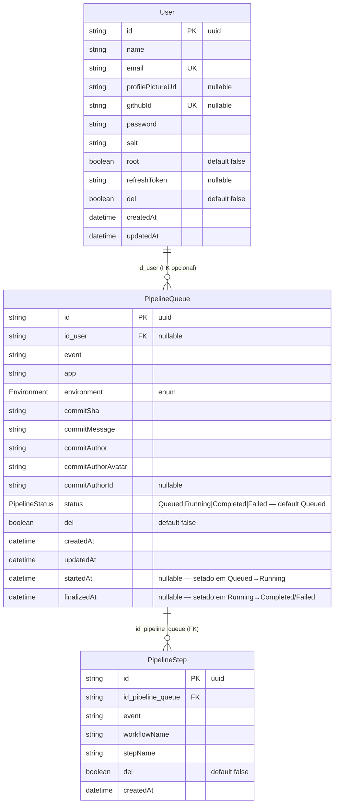

# CODEBASE.md — Pipeline Monitor

> **Mapa autoritativo.** Única fonte para estrutura, módulos, símbolos, env vars, schema, convenções.
>
> **Não use `grep`, `find`, ou `ls`** para descobrir nada listado aqui. Use ferramentas de busca **apenas** para lógica interna de função específica não coberta.
>
> Se algo parecer desatualizado (arquivo novo ausente, símbolo renomeado), pare e avise usuário antes de prosseguir. Atualizar este mapa é entregável obrigatório da Phase 4 (`fullstack-doc-writer`).

**Sumário rápido**

| § | Seção | Para quê |
|---|---|---|
| 1 | Estrutura de Diretórios | Onde fica cada arquivo |
| 2 | Grafo de Módulos (Backend) | Quem importa quem no NestJS |
| 3 | Schema Prisma | Models, enums, constraints |
| 4 | Fluxo de Request | Guards → controller → service → DB |
| 5 | Variáveis de Ambiente | Onde lidas, valores default |
| 6 | Scripts npm | Test, build, lint, prisma |
| 7 | Tipos Centrais (Frontend) | Interfaces compartilhadas |
| 8 | Índice Feature → Arquivos | Onde mexer para feature X |
| 9 | ERD Prisma | Relações entre models |
| 10 | Índice de Símbolos | Service/Controller/Store/Composable/DTO → caminho |
| 11 | Convenções Rápidas | NestJS / Vue / k8s / Swagger cheat-sheet |
| 12 | Padrões de Referência (Skeletons) | Esqueletos canônicos por tipo de artefato |

---

## Estrutura de Diretórios

```
monitor_deploy/
├── server/                          # NestJS 11 API
│   ├── src/
│   │   ├── app.module.ts            # Raiz; registra APP_GUARD=ApiKeyGuard global
│   │   ├── main.ts                  # Bootstrap NestJS; ValidationPipe global; Swagger em /docs
│   │   ├── auth/
│   │   │   ├── auth.controller.ts   # POST /auth/login, POST /auth/refresh
│   │   │   ├── auth.service.ts      # login(), refresh()
│   │   │   ├── auth.module.ts       # Exporta AuthService, JwtModule
│   │   │   ├── api-key.guard.ts     # Guard global; bypass se Bearer present; valida header apikey
│   │   │   ├── jwt-auth.guard.ts    # JwtAuthGuard (Passport JWT)
│   │   │   ├── jwt.strategy.ts      # Estratégia Passport; extrai user do JWT
│   │   │   ├── decorators/
│   │   │   │   └── skip-api-key.decorator.ts   # @SkipApiKey() — isenta rota do ApiKeyGuard
│   │   │   └── dto/
│   │   │       ├── login.dto.ts
│   │   │       ├── refresh.dto.ts
│   │   │       ├── auth-response.dto.ts         # AuthResponseDto, UserResponseInAuthDto
│   │   │       └── jwt-payload.dto.ts           # interface JwtPayload { sub, email, root }
│   │   ├── users/
│   │   │   ├── users.controller.ts  # POST, GET, GET/:id, PATCH/:id, DELETE/:id, POST/:id/regenerate-token
│   │   │   ├── users.service.ts     # CRUD + findByEmail + findByGithubId + regenerateToken
│   │   │   ├── users.module.ts      # Exporta UsersService
│   │   │   └── dto/
│   │   │       ├── create-user.dto.ts
│   │   │       ├── update-user.dto.ts           # PartialType(CreateUserDto)
│   │   │       ├── user-query.dto.ts            # page, limit, search, del
│   │   │       └── user-response.dto.ts         # Sem password/salt/refreshToken
│   │   ├── webhook/
│   │   │   ├── webhook.controller.ts  # POST /webhook — fire and forget via setImmediate
│   │   │   ├── webhook.service.ts     # handleEvent(dto) — switch por event type
│   │   │   ├── webhook.module.ts      # Importa PipelineQueueModule, PipelineStepsModule, GatewayModule, UsersModule
│   │   │   └── dto/
│   │   │       └── webhook-event.dto.ts
│   │   ├── pipeline-queue/
│   │   │   ├── pipeline-queue.controller.ts  # GET, GET/mine, GET/:id, PATCH/:id, DELETE/:id
│   │   │   ├── pipeline-queue.service.ts     # findAll, findMine, findByCommit, findById, create, update, softDelete
│   │   │   ├── pipeline-queue.module.ts      # Exporta PipelineQueueService
│   │   │   └── dto/
│   │   │       ├── create-pipeline-queue.dto.ts
│   │   │       ├── update-pipeline-queue.dto.ts
│   │   │       ├── pipeline-queue-query.dto.ts
│   │   │       ├── pipeline-queue-mine-query.dto.ts      # extends QueryDto; limit restrito a 10|100
│   │   │       ├── pipeline-queue-paginated-response.dto.ts  # data · total · page · limit
│   │   │       └── pipeline-queue-response.dto.ts
│   │   ├── pipeline-steps/
│   │   │   ├── pipeline-steps.controller.ts  # GET (paginado ou all), GET/:id
│   │   │   ├── pipeline-steps.service.ts     # findAllByQueue, findById, create
│   │   │   ├── pipeline-steps.module.ts      # Exporta PipelineStepsService
│   │   │   └── dto/
│   │   │       ├── create-pipeline-step.dto.ts
│   │   │       ├── pipeline-step-response.dto.ts
│   │   │       └── pipeline-steps-query.dto.ts
│   │   ├── dashboard/
│   │   │   ├── dashboard.controller.ts  # GET /dashboard/kpis
│   │   │   ├── dashboard.service.ts     # getKpis(query) — queries diretas via PrismaService
│   │   │   ├── dashboard.module.ts
│   │   │   └── dto/
│   │   │       ├── kpis-query.dto.ts    # dateStart, dateEnd (ambos obrigatórios)
│   │   │       └── kpis-response.dto.ts # total, succeeded, failed, errorRate
│   │   ├── gateway/
│   │   │   ├── pipeline.gateway.ts   # @WebSocketGateway namespace=/pipeline; emitPipelineCreated/Updated
│   │   │   └── gateway.module.ts     # Exporta PipelineGateway
│   │   ├── workflow-cleanup/
│   │   │   ├── workflow-cleanup.service.ts  # @Cron(EVERY_5_MINUTES); detecta Running expirados e duplicatas; marca Failed
│   │   │   └── workflow-cleanup.module.ts   # Leaf module; importa GatewayModule; sem exports
│   │   ├── scheduled-cleanup/
│   │   │   ├── scheduled-cleanup.service.ts  # @Cron(EVERY_DAY_AT_MIDNIGHT); hard delete PipelineQueue+PipelineStep > 30 dias
│   │   │   └── scheduled-cleanup.module.ts   # Leaf module; sem imports; sem exports
│   │   └── prisma/
│   │       ├── prisma.service.ts     # @Global; PrismaClient com @prisma/adapter-pg + pg.Pool
│   │       └── prisma.module.ts      # @Global; exporta PrismaService
│   ├── prisma/
│   │   ├── schema.prisma             # models: User, PipelineQueue, PipelineStep (sem url — Prisma 7)
│   │   └── migrations/               # Pasta de migrations gerenciada pelo Prisma
│   ├── prisma.config.ts              # Prisma 7 CLI config; carrega .env via dotenv para CLI local
│   ├── Dockerfile                    # Multi-stage: builder(node:20-alpine) → runner(node:20-alpine)
│   ├── .dockerignore
│   ├── .env                          # DATABASE_URL com localhost (CLI local); não commitar
│   └── package.json
│
├── frontend/                         # Vue 3 + Vite + Pinia + Vue Router 4
│   ├── src/
│   │   ├── main.ts                   # Bootstrap Vue; registra Pinia + Router
│   │   ├── App.vue                   # Root component
│   │   ├── types/index.ts            # Interfaces: User, PipelineQueue, KpiStats, PaginatedResponse
│   │   ├── router/index.ts           # Rotas: login, dashboard, profile, users; guards requiresAuth/requiresRoot
│   │   ├── stores/
│   │   │   ├── auth.store.ts         # login, logout, refresh, updateProfile; persiste em localStorage
│   │   │   ├── dashboard.store.ts    # pipelines, kpis, dateRange; handleSocketCreated/Updated
│   │   │   ├── users.store.ts        # fetchUsers, updateUser, deleteUser, regenerateToken
│   │   │   └── profile.store.ts      # fetchHistory (GET /pipeline-queue/mine)
│   │   ├── lib/
│   │   │   └── apiFetch.ts           # Wrapper fetch: auto-refresh JWT expirado; injeta Bearer; redireciona login se sessão expirar
│   │   ├── composables/
│   │   │   ├── usePipelineSocket.ts  # socket.io-client; conecta /pipeline; expõe onCreated, onUpdated, disconnect
│   │   │   └── useInfiniteScroll.ts  # IntersectionObserver rootMargin 300px; onMounted/onBeforeUnmount
│   │   ├── views/
│   │   │   ├── LoginView.vue         # Layout split; chama authStore.login()
│   │   │   ├── DashboardView.vue     # Carrega pipelines + KPIs; conecta WS ao montar
│   │   │   ├── ProfileView.vue       # Edição de perfil + histórico de pipelines
│   │   │   └── UsersView.vue         # Root only; CRUD de usuários via usersStore
│   │   └── components/
│   │       ├── AppLayout.vue         # Wrapper com SideMenu (desktop) + BottomMenu (mobile); botão Sair (logout + redirect login) em ambos menus
│   │       ├── DateRangeFilter.vue   # Controla dateRange no dashboardStore
│   │       ├── RunningIndicator.vue  # Indicador piscante do pipeline em Running
│   │       ├── KpiCards.vue          # 4 cards KPI (Total, Succeeded, Failed, Taxa de Erro)
│   │       ├── PipelineTable.vue     # Scroll infinito; props: pipelines·hasMore·loadingMore; emit: loadMore; sentinela IntersectionObserver
│   │       ├── AvatarCell.vue        # Imagem circular + fallback iniciais
│   │       ├── StatusBadge.vue       # Badge colorido por status
│   │       ├── PaginationControls.vue  # props: page·totalPages·limit·orderBy; emits: pageChange·limitChange·orderChange
│   │       ├── EditUserModal.vue     # <Teleport to="body">; emits: saved(User), closed()
│   │       └── __tests__/
│   │           └── AppLayout.spec.ts # Vitest: testa botão Sair (logout + redirect) em SideMenu e BottomMenu
│   ├── e2e/                          # Playwright E2E tests
│   ├── public/
│   │   └── config.js.template        # Template nginx com ${API_URL}, ${WS_URL}; gerado em runtime
│   ├── nginx.conf                    # nginx: resolver 127.0.0.11; proxy /api/ → http://api:3000
│   ├── docker-entrypoint.sh          # envsubst de config.js.template → config.js
│   ├── Dockerfile                    # Multi-stage: builder(node:20-alpine) → runner(nginx:alpine)
│   └── .dockerignore
│
├── k8s/
│   ├── base/
│   │   ├── kustomization.yaml
│   │   ├── api-deployment.yaml       # Deployment: api; image: registry.../api:base; port 3000
│   │   ├── api-service.yaml          # Service: api; ClusterIP :3000
│   │   ├── vue-deployment.yaml       # Deployment: vue-app; image: registry.../vue-app:base; port 80
│   │   ├── vue-service.yaml          # Service: vue-app; ClusterIP :80
│   │   ├── postgres-deployment.yaml  # Deployment: postgres; postgres:16-alpine; PVC
│   │   ├── postgres-service.yaml     # Service: postgres; ClusterIP :5432
│   │   ├── postgres-pv.yaml          # PV: postgres-data-pv; hostPath 5Gi
│   │   ├── postgres-pvc.yaml         # PVC: postgres-data-pvc
│   │   ├── redis-deployment.yaml     # Deployment: redis; redis:7-alpine; PVC
│   │   ├── redis-service.yaml        # Service: redis; ClusterIP :6379
│   │   ├── redis-pv.yaml             # PV: redis-data-pv; hostPath 1Gi
│   │   ├── redis-pvc.yaml            # PVC: redis-data-pvc
│   │   ├── env-configmap.yaml        # ConfigMap: env-config (PORT=3000, NODE_ENV, REDIS_URL)
│   │   └── docker-registry-secret.yaml  # Secret: registry-secret (imagePullSecrets)
│   ├── overlays/
│   │   ├── development/              # Namespace: monitor-deploy-dev; tag: development
│   │   ├── staging/                  # Namespace: monitor-deploy-staging; tag: staging
│   │   └── production/              # Namespace: monitor-deploy-production; tag: SHA (40 chars)
│   └── validate/
│       ├── validate-base.sh
│       ├── validate-overlays.sh
│       └── smoke-test.sh
│
├── docs/
│   ├── specs/pipeline-monitor.md      # Spec Phase 1
│   ├── implementation/pipeline-monitor.md  # Doc Phase 4
│   └── CODEBASE.md                   # Este arquivo
│
├── docker-compose.yml                # Local dev: postgres(:5432) + redis(:6379) + api(:3000) + vue(:9065)
└── .env                              # DATABASE_URL localhost; JWT secrets; API_KEY — não commitar
```

---

## Grafo de Módulos (Backend)

```
AppModule
├── ConfigModule (global)
├── PrismaModule (global) → exports PrismaService
├── AuthModule → imports UsersModule; exports AuthService, JwtModule
├── UsersModule → exports UsersService
├── WebhookModule → imports PipelineQueueModule, PipelineStepsModule, GatewayModule, UsersModule
├── PipelineQueueModule → exports PipelineQueueService
├── PipelineStepsModule → exports PipelineStepsService
├── DashboardModule (usa PrismaService global direto)
├── GatewayModule → exports PipelineGateway
├── HealthModule (sem exports; usa PrismaService global; rota pública via @SkipApiKey())
└── WorkflowCleanupModule → imports GatewayModule; sem exports (leaf module)
└── ScheduledCleanupModule → sem imports (PrismaModule global); sem exports (leaf module)
```

---

## Schema Prisma

**Models:** `User` (tabela `users`), `PipelineQueue` (tabela `pipeline_queue`), `PipelineStep` (tabela `pipeline_steps`)

**Enums:** `Environment { development, staging, production }`, `PipelineStatus { Queued, Running, Completed, Failed }`

**Chave composta única:** `pipeline_queue @@unique([commitSha, app, environment])` — usada pelo webhook handler para lookup.

**Campos de timestamp em `PipelineQueue`:** `startedAt DateTime?` (setado na transição Queued→Running, idempotente) e `finalizedAt DateTime?` (setado na transição Running→Completed/Failed via webhook ou WorkflowCleanupService). Ambos nullable, default `null`.

---

## Fluxo de Request

```
HTTP Request
  → ApiKeyGuard (global APP_GUARD)
      bypass se Authorization: Bearer present
      bypass se @SkipApiKey() na rota/controller
      valida header apikey contra API_KEY env
  → JwtAuthGuard (onde @UseGuards(JwtAuthGuard) aplicado)
      valida JWT Bearer; injeta req.user = { id, email, root }
  → Controller (thin — apenas mapeamento HTTP)
  → Service (lógica de negócio — usa PrismaService diretamente)
  → PrismaService → PostgreSQL
```

---

## Variáveis de Ambiente

| Chave | Onde | Notas |
|---|---|---|
| `DATABASE_URL` | `.env` + compose `environment` | `.env` = localhost; compose sobrescreve para `postgres` (hostname Docker) |
| `JWT_ACCESS_SECRET` | `.env` | Fallback hardcoded em auth.module.ts |
| `JWT_REFRESH_SECRET` | `.env` | Fallback hardcoded em users.service.ts |
| `JWT_ACCESS_EXPIRES` | `.env` | Não lido — `15m` hardcoded em auth.service.ts |
| `API_KEY` | `.env` | Valor padrão: `bWludGluaG8=` |
| `PORT` | `.env` | Default NestJS 3000 |
| `REDIS_URL` | ConfigMap k8s | Não consumido pelo backend atualmente |
| `API_URL` | `window.config` (runtime) | URL base da API REST no frontend |
| `WS_URL` | `window.config` (runtime) | URL base WebSocket no frontend |

---

## Scripts npm

### Backend (`server/`)
| Script | Comando |
|---|---|
| `npm test` | Jest unit + integration |
| `npm run test:e2e` | Jest + Supertest e2e |
| `npm run lint` | ESLint |
| `npm run build` | `tsc` → `dist/` |
| `npx prisma generate` | Gera Prisma Client |
| `npx prisma migrate dev` | Nova migration (dev) |
| `npx prisma migrate deploy` | Aplica migrations (prod/Docker) |

### Frontend (`frontend/`)
| Script | Comando |
|---|---|
| `npm run test:unit` | Vitest |
| `npm run lint` | ESLint |
| `npm run build` | Vite build → `dist/` |
| `npx playwright test` | E2E Playwright |

---

## Tipos Centrais (Frontend)

```ts
// frontend/src/types/index.ts
interface User { id, name, email, profilePictureUrl, githubId, root, del, createdAt?, updatedAt? }
interface PipelineQueue { id, id_user?, event?, app, environment, commitSha, commitMessage, commitAuthor, commitAuthorAvatar, commitAuthorId?, status, currentStep?: string | null, del?, createdAt, updatedAt, startedAt: string | null, finalizedAt: string | null }
interface KpiStats { total, succeeded, failed, errorRate }
interface PaginatedResponse<T> { data: T[], total, page?, limit? }
// window.config: { API_URL: string, WS_URL: string, API_KEY?: string }
```

---

## 8. Índice Feature → Arquivos

Use para "onde mexo para feature X" sem `grep`. Feature nova entregue → **adicione entrada aqui na Phase 4**.

### pipeline-monitor
- **Spec:** `docs/specs/pipeline-monitor.md`
- **Doc:** `docs/implementation/pipeline-monitor.md`
- **Backend:** `server/src/webhook/`, `server/src/pipeline-queue/`, `server/src/pipeline-steps/`, `server/src/dashboard/`, `server/src/gateway/`
  - `pipeline-queue-response.dto.ts` expõe `currentStep: string | null` (step em execução derivado do último step `running`/`pending`)
  - `pipeline-queue.service.ts` inclui `steps` em todas as queries Prisma para derivar `currentStep`
  - `webhook.service.ts` emite `pipeline.updated` após `await prisma.step.create()` para garantir payload atualizado
- **Frontend:** `frontend/src/views/DashboardView.vue`, `frontend/src/stores/dashboard.store.ts`, `frontend/src/composables/usePipelineSocket.ts`, `frontend/src/components/{PipelineTable,KpiCards,StatusBadge,RunningIndicator,DateRangeFilter,AvatarCell}.vue`
  - `PipelineTable.vue` exibe `currentStep` abaixo do nome do ambiente quando não-nulo
  - `frontend/src/types/index.ts` — `PipelineQueue` inclui `currentStep?: string | null`
- **Infra:** `k8s/base/api-{deployment,service}.yaml`, `k8s/base/vue-{deployment,service}.yaml`, `k8s/base/postgres-*.yaml`, `k8s/base/redis-*.yaml`
- **Tests:** `server/src/**/__tests__/`, `server/test/*.e2e-spec.ts`, `frontend/e2e/*.spec.ts`

### logout-button
- **Spec:** `docs/specs/logout-button.md`
- **Doc:** `docs/implementation/logout-button.md`
- **Frontend:** `frontend/src/components/AppLayout.vue` (botão Sair em SideMenu + BottomMenu), `frontend/src/stores/auth.store.ts` (`logout()`)
- **Tests:** `frontend/src/components/__tests__/AppLayout.spec.ts`
- **Backend / Infra:** N/A (frontend-only)

### auth
- **Spec:** (parte de `pipeline-monitor.md` §7)
- **Backend:** `server/src/auth/` (controller, service, guards, JWT strategy, DTOs)
- **Frontend:** `frontend/src/views/LoginView.vue`, `frontend/src/stores/auth.store.ts`, `frontend/src/lib/apiFetch.ts` (refresh automático)
- **Endpoints:** `POST /auth/login`, `POST /auth/refresh`
- **Infra:** ConfigMap `env-config` consome `JWT_*` vars

### users
- **Backend:** `server/src/users/` (controller, service, DTOs)
- **Frontend:** `frontend/src/views/UsersView.vue`, `frontend/src/stores/users.store.ts`, `frontend/src/components/EditUserModal.vue`
- **Endpoints:** `POST/GET /users`, `GET/PATCH/DELETE /users/:id`, `POST /users/:id/regenerate-token`
- **Guard especial:** root-only (`requiresRoot` no router; backend checa `req.user.root`)

### dashboard
- **Backend:** `server/src/dashboard/` (`GET /dashboard/kpis`)
- **Frontend:** `frontend/src/views/DashboardView.vue`, `frontend/src/components/KpiCards.vue`, `frontend/src/stores/dashboard.store.ts`
- **Query obrigatória:** `dateStart`, `dateEnd`

### dashboard-filters
- **Spec:** `docs/specs/dashboard-filters.md`
- **Doc:** `docs/implementation/dashboard-filters.md`
- **Backend:** `server/src/dashboard/dto/kpis-query.dto.ts` (campos `environment?`, `app?`, `status?`), `server/src/dashboard/dashboard.service.ts` (`extraFilters` spread no `baseWhere`)
- **Frontend:** `frontend/src/components/DashboardFilterBar.vue` (novo), `frontend/src/stores/dashboard.store.ts` (`filterApp`, `filterEnvironment`, `filterStatus`, `setFilters`, `clearFilters`, `hasActiveFilters`, `buildFilterParams`, `matchesFilters`)
- **Tests:** `server/src/dashboard/__tests__/dashboard.service.spec.ts`, `server/src/dashboard/__tests__/dashboard.controller.spec.ts`, `server/test/dashboard-filters.e2e-spec.ts`, `frontend/src/stores/__tests__/dashboard.store.filters.spec.ts`, `frontend/src/components/__tests__/DashboardFilterBar.spec.ts`, `frontend/e2e/dashboard-filters.spec.ts`
- **Infra:** N/A (sem alterações em k8s)

### profile
- **Frontend:** `frontend/src/views/ProfileView.vue`, `frontend/src/stores/profile.store.ts`, `frontend/src/components/PaginationControls.vue`
- **Backend reuse:** `GET /pipeline-queue/mine`, `PATCH /users/:id` (próprio id)

### webhook
- **Backend:** `server/src/webhook/` (fire-and-forget via `setImmediate`)
- **Endpoint:** `POST /webhook` (sem JWT; protegido por `apikey` header — `ApiKeyGuard` global)

### health
- **Spec:** `docs/specs/health.md`
- **Doc:** `docs/implementation/health.md`
- **Backend:** `server/src/health/` (controller + module)
- **Infra:** `k8s/base/api-deployment.yaml` (`readinessProbe` aponta para `GET /health:3000`)
- **Tests:** `server/src/health/health.controller.spec.ts`, `server/test/health.e2e-spec.ts`
- **Frontend / Outros:** N/A

### infinite-scroll-pagination
- **Spec:** `docs/specs/infinite-scroll-pagination.md`
- **Doc:** `docs/implementation/infinite-scroll-pagination.md`
- **Backend:** `server/src/pipeline-queue/pipeline-queue.controller.ts`, `server/src/pipeline-queue/pipeline-queue.service.ts`
  - DTOs novos: `pipeline-queue-mine-query.dto.ts` (limit restrito a 10|100), `pipeline-queue-paginated-response.dto.ts` (data · total · page · limit)
  - `PipelineQueueQueryDto` ganhou campos `page`, `limit`, `orderBy`, `status`, `app`, `environment`
  - `findAll` e `findMine` retornam `{ data, total, page, limit }` com skip/take Prisma
- **Frontend:**
  - `frontend/src/composables/useInfiniteScroll.ts` — IntersectionObserver `rootMargin: '0px 0px 300px 0px'`
  - `frontend/src/components/PipelineTable.vue` — scroll infinito; props `hasMore`, `loadingMore`; emit `loadMore`
  - `frontend/src/components/PaginationControls.vue` — controles prev/next/limit/order para perfil
  - `frontend/src/stores/dashboard.store.ts` — `fetchInitial`, `loadMore`, deduplicação por id
  - `frontend/src/stores/profile.store.ts` — `page`, `limit`, `total`, `orderBy`, `totalPages`, `changePage`, `changeLimit`, `changeOrder`
  - `frontend/src/views/DashboardView.vue` — watcher dateRange → fetchInitial
  - `frontend/src/views/ProfileView.vue` — integra PaginationControls
- **Infra:** N/A (sem alterações em k8s)
- **Schema:** sem migração

### dashboard-message-tooltip
- **Spec:** `docs/specs/dashboard-message-tooltip.md`
- **Doc:** `docs/implementation/dashboard-message-tooltip.md`
- **Frontend:** `frontend/src/components/PipelineTable.vue` — célula `commit-message` usa `<span class="d-inline-block text-truncate" style="max-width:220px" :title="commitMessage">` para truncar e exibir tooltip nativo
- **Tests:** `frontend/src/components/__tests__/PipelineTable.spec.ts` (AC-1, AC-2, AC-3)
- **Backend / Infra:** N/A (frontend-only)

### scheduled-cleanup
- **Spec:** `docs/specs/scheduled-cleanup.md`
- **Doc:** `docs/implementation/scheduled-cleanup.md`
- **Backend:** `server/src/scheduled-cleanup/scheduled-cleanup.service.ts`, `server/src/scheduled-cleanup/scheduled-cleanup.module.ts`
  - Cron `EVERY_DAY_AT_MIDNIGHT`; hard delete de `PipelineStep` e `PipelineQueue` com `createdAt < now - 30 dias`
  - Ordem obrigatória: steps antes de queues (FK constraint)
  - Sem endpoint HTTP; sem exports; leaf module
- **Frontend / Infra:** N/A
- **Schema:** sem migração

### workflow-timeout
- **Spec:** `docs/specs/workflow-timeout.md`
- **Doc:** `docs/implementation/workflow-timeout.md`
- **Backend:** `server/src/workflow-cleanup/workflow-cleanup.service.ts`, `server/src/workflow-cleanup/workflow-cleanup.module.ts`
  - Cron `EVERY_5_MINUTES`; detecta Running expirados (> 60 min) e duplicatas; marca `Failed` e emite `pipeline.updated`
  - Sem endpoint HTTP; sem exports; leaf module
- **Frontend:** `frontend/src/components/StatusBadge.vue` (sem entrada `Timeout`), `frontend/src/types/index.ts` (sem `'Timeout'` no union type de `PipelineQueue.status`)
- **Schema:** migration removeu `Timeout` do enum `PipelineStatus` (refactor 2026-05-26)
- **Infra:** N/A (nenhum manifesto k8s adicionado ou modificado)

### pipeline-queue-timestamps
- **Spec:** `docs/specs/pipeline-queue-timestamps.md`
- **Doc:** `docs/implementation/pipeline-queue-timestamps.md`
- **Backend:** `server/src/webhook/webhook.service.ts`, `server/src/workflow-cleanup/workflow-cleanup.service.ts`, `server/src/pipeline-queue/dto/pipeline-queue-response.dto.ts`
  - `WebhookService.handleStep()` seta `startedAt = now()` na transição Queued→Running (idempotente: só seta se `startedAt == null`)
  - `WebhookService.handleSucceeded()` e `handleError()` setam `finalizedAt = now()`
  - `WorkflowCleanupService.cleanupStaleWorkflows()` seta `finalizedAt = now()` com `WHERE finalizedAt IS NULL`
  - `PipelineQueueResponseDto` expõe `startedAt: Date | null` e `finalizedAt: Date | null`
- **Frontend:** `frontend/src/types/index.ts` (`PipelineQueue` inclui `startedAt`/`finalizedAt`), `frontend/src/components/PipelineTable.vue` (colunas Criado/Início/Fim), `frontend/src/views/ProfileView.vue` (histórico com mesmas colunas)
- **Tests:** `server/src/webhook/__tests__/webhook.timestamps.spec.ts`, `server/src/workflow-cleanup/__tests__/workflow-cleanup.timestamps.spec.ts`, `server/src/pipeline-queue/__tests__/pipeline-queue.timestamps.spec.ts`, `server/test/pipeline-queue-timestamps.e2e-spec.ts`, `frontend/src/components/__tests__/PipelineTable.timestamps.spec.ts`, `frontend/src/views/__tests__/ProfileView.timestamps.spec.ts`, `frontend/src/stores/__tests__/dashboard.store.timestamps.spec.ts`
- **Schema:** migration `20260605000000_add_timestamps_to_pipeline_queue` — adiciona `startedAt DateTime?` e `finalizedAt DateTime?` a `pipeline_queue`
- **Infra:** N/A

---

## 9. ERD Prisma

Derivado de `server/prisma/schema.prisma`. Atualizar quando schema mudar.



**Constraints chave:**
- `User.email` unique; `User.githubId` unique (nullable).
- `PipelineQueue @@unique([commitSha, app, environment])` — usada pelo webhook para upsert lógico.
- `PipelineQueue @@index([commitSha])` — lookup por commit.

**Enums:**
- `Environment`: `development | staging | production`
- `PipelineStatus`: `Queued | Running | Completed | Failed`

---

## 10. Índice de Símbolos

Exports públicos estáveis. **Sem números de linha** (volátil). Atualizar quando símbolo novo for adicionado/renomeado.

### Backend — Services
| Símbolo | Caminho |
|---|---|
| `AuthService` | `server/src/auth/auth.service.ts` |
| `UsersService` | `server/src/users/users.service.ts` |
| `WebhookService` | `server/src/webhook/webhook.service.ts` |
| `PipelineQueueService` | `server/src/pipeline-queue/pipeline-queue.service.ts` |
| `PipelineStepsService` | `server/src/pipeline-steps/pipeline-steps.service.ts` |
| `DashboardService` | `server/src/dashboard/dashboard.service.ts` |
| `PrismaService` | `server/src/prisma/prisma.service.ts` |
| `HealthService` | `server/src/health/health.service.ts` |
| `WorkflowCleanupService` | `server/src/workflow-cleanup/workflow-cleanup.service.ts` |
| `ScheduledCleanupService` | `server/src/scheduled-cleanup/scheduled-cleanup.service.ts` |

### Backend — Controllers
| Símbolo | Rota base | Caminho |
|---|---|---|
| `AuthController` | `/auth` | `server/src/auth/auth.controller.ts` |
| `UsersController` | `/users` | `server/src/users/users.controller.ts` |
| `WebhookController` | `/webhook` | `server/src/webhook/webhook.controller.ts` |
| `PipelineQueueController` | `/pipeline-queue` | `server/src/pipeline-queue/pipeline-queue.controller.ts` |
| `PipelineStepsController` | `/pipeline-steps` | `server/src/pipeline-steps/pipeline-steps.controller.ts` |
| `DashboardController` | `/dashboard` | `server/src/dashboard/dashboard.controller.ts` |
| `HealthController` | `/health` | `server/src/health/health.controller.ts` |

### Backend — Módulos (sem controller)
| Símbolo | Caminho |
|---|---|
| `WorkflowCleanupModule` | `server/src/workflow-cleanup/workflow-cleanup.module.ts` |
| `ScheduledCleanupModule` | `server/src/scheduled-cleanup/scheduled-cleanup.module.ts` |

### Backend — Guards / Strategies / Decorators
| Símbolo | Caminho |
|---|---|
| `ApiKeyGuard` (global) | `server/src/auth/api-key.guard.ts` |
| `JwtAuthGuard` | `server/src/auth/jwt-auth.guard.ts` |
| `JwtStrategy` | `server/src/auth/jwt.strategy.ts` |
| `@SkipApiKey()` | `server/src/auth/decorators/skip-api-key.decorator.ts` |

### Backend — Gateway
| Símbolo | Namespace | Caminho |
|---|---|---|
| `PipelineGateway` | `/pipeline` | `server/src/gateway/pipeline.gateway.ts` |

### Backend — DTOs principais
| DTO | Caminho |
|---|---|
| `LoginDto`, `RefreshDto`, `AuthResponseDto`, `UserResponseInAuthDto`, `JwtPayload` | `server/src/auth/dto/` |
| `CreateUserDto`, `UpdateUserDto`, `UserQueryDto`, `UserResponseDto` | `server/src/users/dto/` |
| `WebhookEventDto` | `server/src/webhook/dto/` |
| `CreatePipelineQueueDto`, `UpdatePipelineQueueDto`, `PipelineQueueQueryDto`, `PipelineQueueResponseDto` (inclui `currentStep: string \| null`), `PipelineQueueMineQueryDto`, `PipelineQueuePaginatedResponseDto` | `server/src/pipeline-queue/dto/` |
| `CreatePipelineStepDto`, `PipelineStepsQueryDto`, `PipelineStepResponseDto` | `server/src/pipeline-steps/dto/` |
| `KpisQueryDto`, `KpisResponseDto` | `server/src/dashboard/dto/` |

### Frontend — Stores (Pinia)
| Símbolo | Caminho |
|---|---|
| `useAuthStore` | `frontend/src/stores/auth.store.ts` |
| `useDashboardStore` | `frontend/src/stores/dashboard.store.ts` |
| `useUsersStore` | `frontend/src/stores/users.store.ts` |
| `useProfileStore` | `frontend/src/stores/profile.store.ts` |

### Frontend — Composables
| Símbolo | Caminho |
|---|---|
| `usePipelineSocket` | `frontend/src/composables/usePipelineSocket.ts` |
| `useInfiniteScroll` | `frontend/src/composables/useInfiniteScroll.ts` |

### Frontend — Views (rotas)
| Componente | Rota nomeada | Caminho |
|---|---|---|
| `LoginView` | `login` | `frontend/src/views/LoginView.vue` |
| `DashboardView` | `dashboard` | `frontend/src/views/DashboardView.vue` |
| `ProfileView` | `profile` | `frontend/src/views/ProfileView.vue` |
| `UsersView` | `users` (root only) | `frontend/src/views/UsersView.vue` |

### Frontend — Components reutilizáveis
| Componente | Caminho |
|---|---|
| `AppLayout` | `frontend/src/components/AppLayout.vue` |
| `DateRangeFilter` | `frontend/src/components/DateRangeFilter.vue` |
| `RunningIndicator` | `frontend/src/components/RunningIndicator.vue` |
| `KpiCards` | `frontend/src/components/KpiCards.vue` |
| `PipelineTable` | `frontend/src/components/PipelineTable.vue` |
| `AvatarCell` | `frontend/src/components/AvatarCell.vue` |
| `StatusBadge` | `frontend/src/components/StatusBadge.vue` |
| `PaginationControls` | `frontend/src/components/PaginationControls.vue` |
| `EditUserModal` | `frontend/src/components/EditUserModal.vue` |
| `DashboardFilterBar` | `frontend/src/components/DashboardFilterBar.vue` |

### Frontend — Utilitários
| Símbolo | Caminho |
|---|---|
| `apiFetch` (wrapper fetch + auto-refresh JWT) | `frontend/src/lib/apiFetch.ts` |
| `window.config` (API_URL / WS_URL runtime) | `frontend/public/config.js.template` |

---

## 11. Convenções Rápidas

Cheat-sheet destilado do `.claude/CLAUDE.md`. Para casos não cobertos, ler `CLAUDE.md` completo.

### NestJS (backend)
- `ValidationPipe` global: `whitelist`, `forbidNonWhitelisted`, `transform: true`.
- Service depende de **interface + injection token** — nunca classe concreta.
- Controller fino: só HTTP mapping; lógica vai pro service.
- Nunca retornar entidade Prisma crua — sempre via `*ResponseDto`.
- Erros: `NotFoundException`, `ConflictException`, etc. — nunca `{ error: ... }`.
- Nunca `process.env` em código — usar `ConfigService`.
- Sem `forwardRef`. Sem `console.log` (usar `Logger`).
- ORM: Prisma. Cache: Redis (`@nestjs/cache-manager`).

### Vue 3 (frontend)
- Composition API + `<script setup>` sempre. Sem Options API.
- Estado compartilhado: **Pinia**. Nada de prop-drilling pra estado global.
- Vue Router 4: **rotas nomeadas** apenas. Sem `path: '/foo'` mágico.
- HTTP: composables ou `apiFetch` — sem `fetch()` direto em componente.
- Bootstrap 5 para layout/componentes. CSS custom só se inevitável.
- Naming: `PascalCase.vue`, `use*.ts`, `*.store.ts`.
- Todo elemento interativo: `data-test="..."` para testes. Nunca selecionar por classe CSS.

### k8s + Kustomize (infra)
- `k8s/base/` canônico; `k8s/overlays/<env>/` só patches.
- Namespace explícito por ambiente (`namespace.yaml` em cada overlay).
- Tags de imagem: SHA em produção, env-name nos demais. **Nunca `:latest`**.
- Validar antes de commit: `minikube kubectl -- kustomize <path> | minikube kubectl -- apply --dry-run=server -f -`. Nunca usar `kustomize` CLI direto.
- Prefixo numérico em `base/`: `0X` PVs, `1X` PVCs, `2X` ConfigMaps/Secrets, `3X` Deployments, `4X` Services.
- Toda container: requests + limits obrigatórios.
- Secrets fora do ConfigMap.
- Nomes em lowercase-kebab-case.

### Swagger / OpenAPI
- Todo texto Swagger em PT-BR (`summary`, `description`, exemplos).
- Todo campo DTO: `@ApiProperty()` ou `@ApiPropertyOptional()` com `description` + `example`.
- Todo método de controller: `@ApiOperation()` + `@ApiResponse()` por status possível.
- Rotas autenticadas: `@ApiBearerAuth('bearer')` no controller.
- Agrupar com `@ApiTags()` (nome em PT-BR).
- Swagger UI em `/docs`. Decorators no mesmo commit que `class-validator`.

### Language
- Docs (`docs/specs/`, `docs/implementation/`, `README.md`) e textos de UI: **PT-BR**.
- Labels Mermaid, mensagens de sequência: PT-BR onde natural.
- Identificadores de código, paths, comandos CLI, constantes técnicas: **inglês**.

### Workflow (resumo)
- Toda feature: **spec → tests (RED) → code (GREEN) → doc**. Sem pular fase.
- Phase 4 (`fullstack-doc-writer`) atualiza este arquivo (§8/§9/§10/§11/§12).
- Zero-assumption: ambiguidade → pergunta única antes de prosseguir. Nunca inventar requisito.

---

## 12. Padrões de Referência (Skeletons)

Skeletons em `docs/CODEBASE-SKELETONS.md` (injetado separadamente pelo hook para skills de implementação e teste). Se esta seção aparecer sem conteúdo, você está em skill que não usa skeletons — use §10/§11 para localização de símbolos e convenções.


---

## 13. Docs de Implementação (ground-truth por feature)

`docs/implementation/<feature>.md` é fonte de verdade definitiva para cada feature implementada. Cobre API real, componentes reais, manifests reais, topologia de deploy, decisões e drift do spec.

**Apenas este mapa (`CODEBASE.md`) é injetado automaticamente.** Docs de implementação **não** são pré-carregados — leia sob demanda, **um por vez**, apenas o relevante à tarefa atual:

1. Identifique no §8 qual feature sua tarefa toca.
2. Chame `Read` em `docs/implementation/<feature>.md` correspondente. Esse Read é **permitido e encorajado** — é doc, não src.
3. Use para entender comportamento real. **Nunca abra `src/` para isso.**

**Reads sempre permitidos:** `docs/specs/*.md`, `docs/implementation/*.md`, e arquivos sendo editados agora. **Reads proibidos para descoberta:** qualquer arquivo em `server/src/`, `frontend/src/`, `k8s/`, `prisma/` — use o mapa e os docs de implementação.

Docs atuais:
- `docs/implementation/pipeline-monitor.md`
- `docs/implementation/logout-button.md`
- `docs/implementation/health.md`
- `docs/implementation/workflow-timeout.md`
- `docs/implementation/infinite-scroll-pagination.md`
- `docs/implementation/dashboard-message-tooltip.md`
- `docs/implementation/scheduled-cleanup.md`

Adicionar novas entradas aqui na Phase 4.

### Fix pipeline — artefatos paralelos

Quando pipeline de fix (`/fix`, `/refactor`, `/hotfix`) roda, dois diretórios extras armazenam ground-truth:

- `docs/fixes/<feature>-<slug>.md` — triage doc canônico (7 seções: sintoma, repro, root cause, scope, behavior delta, risco, plano de teste). Produzido pela skill `fix-triage` / subagent `fix-triage-agent`. **Reads permitidos** durante ciclo de fix (substitui descoberta ampla em src/).
- `docs/changelogs/<feature>.md` — histórico append-only de fixes/refactors/hotfixes por feature. Atualizado pela skill `fix-doc-update`. Cada entrada: data, branch, slug, sintoma, root cause, fix, arquivos, REG IDs.

Ambos seguem PT-BR e são gitignored em `.claude/state/*.txt` (state efêmero do pipeline) mas commitados em `docs/`.