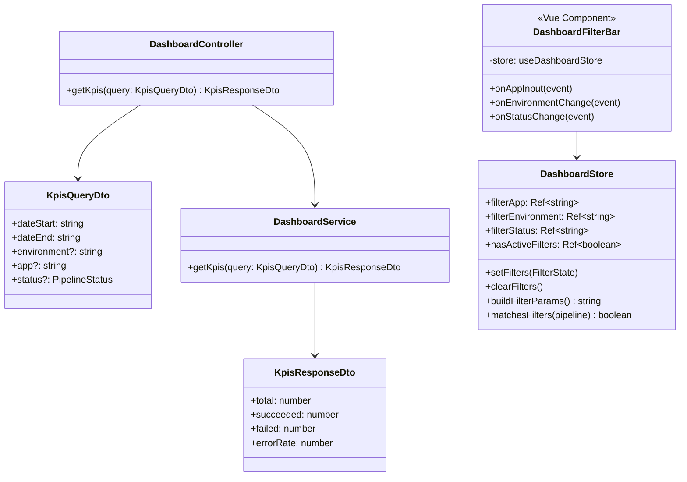
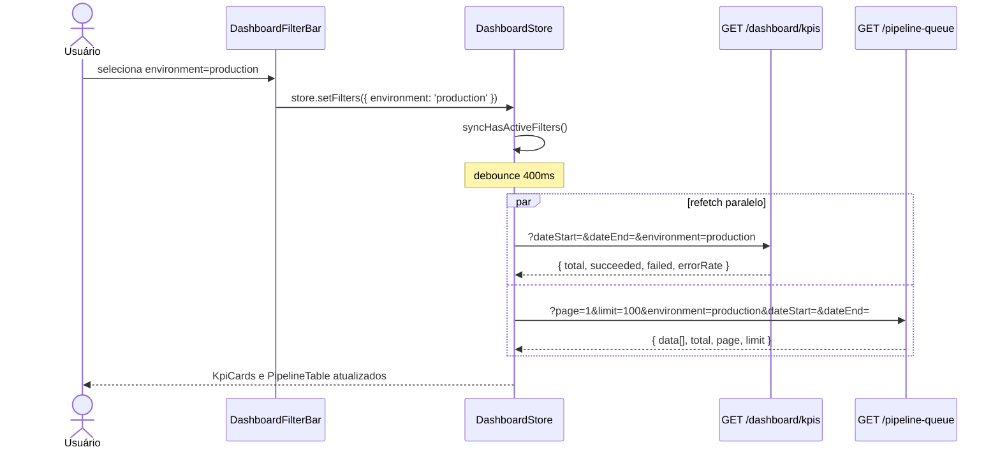
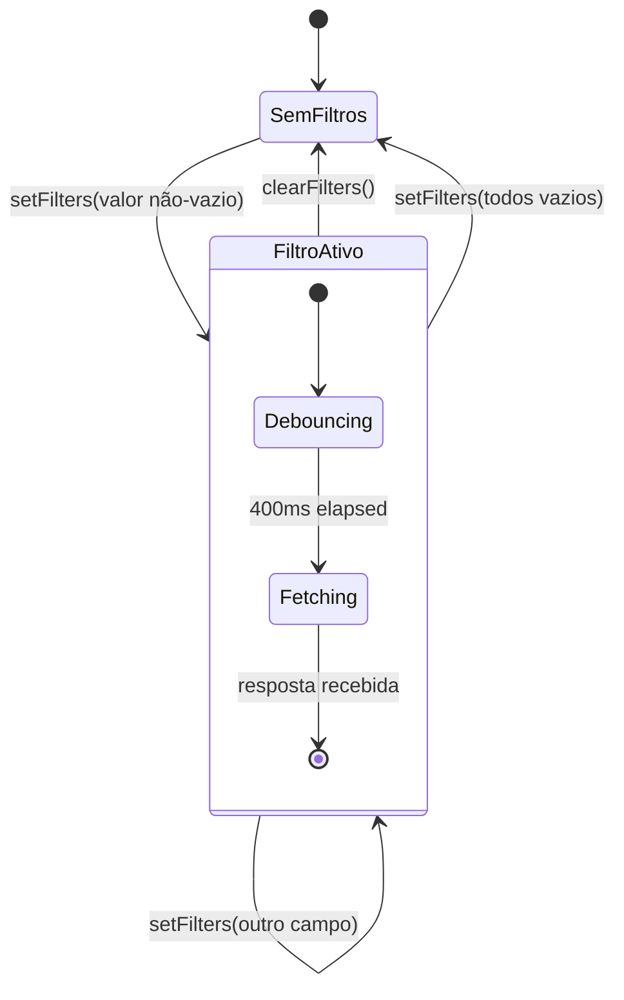
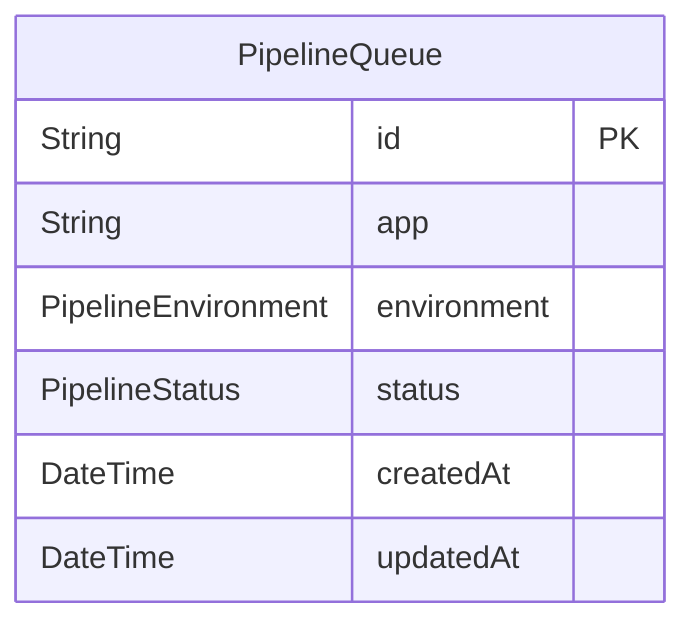

# Dashboard Filters

> **Status:** stable
> **Spec:** docs/specs/dashboard-filters.md
> **Backend:** server/src/dashboard/
> **Frontend:** frontend/src/components/DashboardFilterBar.vue · frontend/src/stores/dashboard.store.ts

---

## 1. Overview

Estende o dashboard existente com filtros por `app`, `environment` e `status`. Todos os filtros são opcionais e combinam entre si e com `dateStart`/`dateEnd` por AND lógico. KPI cards e lista de pipelines refletem o escopo filtrado simultaneamente. Eventos WebSocket (`pipeline.created` e `pipeline.updated`) respeitam os filtros ativos — pipelines fora do escopo não são pré-pendados e são removidos da lista ao serem atualizados para fora do escopo.

---

## 2. Public API (HTTP)

### Endpoint: `GET /dashboard/kpis`

| Campo | Valor |
|---|---|
| Método | GET |
| Caminho | `/dashboard/kpis` |
| Guard | `JwtAuthGuard` |
| Request DTO | `KpisQueryDto` |
| Response DTO | `KpisResponseDto` |

**Query params:**

| Param | Tipo | Obrigatório | Validação | Padrão |
|---|---|---|---|---|
| `dateStart` | string | sim | `@IsString @IsNotEmpty` | — |
| `dateEnd` | string | sim | `@IsString @IsNotEmpty` | — |
| `environment` | `development\|staging\|production` | não | `@IsIn([...])` | omitido |
| `app` | string | não | `@IsString` | omitido |
| `status` | `PipelineStatus` enum | não | `@IsIn(PipelineStatus[])` | omitido |

**Status codes:**

| Status | Condição |
|---|---|
| 200 | Sucesso |
| 400 | Param obrigatório ausente ou valor enum inválido (`ValidationPipe`) |
| 401 | Token JWT ausente ou inválido |

**Exemplo curl:**

```bash
curl -H "Authorization: Bearer $TOKEN" \
  "http://localhost:3000/dashboard/kpis?dateStart=2024-01-01T00:00:00Z&dateEnd=2024-12-31T23:59:59Z&environment=production&status=Failed"
```

**Resposta:**

```json
{ "total": 12, "succeeded": 0, "failed": 12, "errorRate": 100 }
```

---

## 2b. Frontend — Páginas e Componentes

| Componente | Arquivo | Descrição |
|---|---|---|
| `DashboardFilterBar` | `frontend/src/components/DashboardFilterBar.vue` | Barra de filtros — input app + selects environment/status + botão "Limpar filtros" |

`DashboardFilterBar` não usa props — lê e escreve diretamente no `useDashboardStore`. Sem emits declarados. O botão "Limpar filtros" é renderizado condicionalmente via `v-if="store.hasActiveFilters"`.

**data-test attributes:**

| Seletor | Elemento |
|---|---|
| `[data-test="filter-app"]` | `<input type="text">` |
| `[data-test="filter-environment"]` | `<select>` |
| `[data-test="filter-status"]` | `<select>` |
| `[data-test="clear-filters"]` | `<button>` |

---

## 3. Module Surface

`DashboardModule` inalterado — nenhuma importação nova. `DashboardFilterBar` é standalone (sem módulo Vue dedicado).

**Backend — import recipe:**

```typescript
import { DashboardModule } from './dashboard/dashboard.module';
// já registrado em AppModule
```

---

## 4. Arquitetura do Sistema

### 4.1 Diagrama de Classes



### 4.2 Diagrama de Sequência — Aplicar filtro



### 4.3 Máquina de Estados — Filtros



### 4.4 Topologia de Deploy

Sem alterações em k8s ou Dockerfile. A feature é puramente lógica (query params + store state).

---

## 5. Data Model

Nenhuma migração de schema. Campos existentes em `PipelineQueue` usados como filtros:



---

## 6. DTOs

### `KpisQueryDto` — campos novos

| Campo | Tipo | Decorator validação | Swagger |
|---|---|---|---|
| `environment` | `string?` | `@IsOptional @IsString @IsIn(['development','staging','production'])` | `@ApiPropertyOptional` PT-BR |
| `app` | `string?` | `@IsOptional @IsString` | `@ApiPropertyOptional` PT-BR |
| `status` | `PipelineStatus?` | `@IsOptional @IsIn(Object.values(PipelineStatus))` | `@ApiPropertyOptional` PT-BR |

Campos `dateStart` e `dateEnd` inalterados (obrigatórios, `@IsString @IsNotEmpty`).

### `KpisResponseDto` — inalterado

| Campo | Tipo |
|---|---|
| `total` | `number` |
| `succeeded` | `number` |
| `failed` | `number` |
| `errorRate` | `number` |

---

## 7. Configuração

Nenhuma variável de ambiente nova.

---

## 8. Dependências

| Dependência | Tipo | Uso |
|---|---|---|
| `PrismaService` | interna | `pipelineQueue.count` com `where` dinâmico |
| `JwtAuthGuard` | interna | autenticação do endpoint |
| `useDashboardStore` | interna (frontend) | estado de filtros + fetch |
| Bootstrap 5 | externa (frontend) | `form-control-sm`, `form-select-sm`, `btn-outline-secondary` |

---

## 9. Extension Points

| Ponto | Local | Observação |
|---|---|---|
| `buildFilterParams()` | `dashboard.store.ts:67` | Adicionar novo param de filtro aqui + nos `if` de `setFilters` |
| `matchesFilters()` | `dashboard.store.ts:78` | Adicionar regra de match para filtro novo |
| `KpisQueryDto` | `server/src/dashboard/dto/kpis-query.dto.ts` | Adicionar campo + `@IsOptional` + `@ApiPropertyOptional` |
| `DashboardService.getKpis` | `server/src/dashboard/dashboard.service.ts:21` | Adicionar campo no `extraFilters` |

---

## 10. Erros

| Exceção | Status HTTP | Condição |
|---|---|---|
| `ValidationPipe` 400 | 400 | `environment` fora de `['development','staging','production']` |
| `ValidationPipe` 400 | 400 | `status` fora dos valores de `PipelineStatus` |
| `ValidationPipe` 400 | 400 | `dateStart` ou `dateEnd` ausentes |
| `UnauthorizedException` | 401 | Token JWT inválido/ausente |

---

## 11. Notas Operacionais

- **Debounce:** `setFilters` usa `setTimeout 400ms` — timer resetado a cada chamada. `clearFilters` cancela timer pendente antes de disparar fetch imediato.
- **WebSocket AC-11/AC-12:** `filtersAreActive()` lê os refs diretos (não o `hasActiveFilters` patcheável por `createTestingPinia`), garantindo comportamento correto em prod.
- **Retrocompatibilidade:** omitir `environment`/`app`/`status` mantém comportamento idêntico ao anterior — `extraFilters` fica vazio.
- **KPI com status filter:** se `status=Failed`, `succeeded` conta `Failed AND Completed = 0`; `errorRate = 100`. Matematicamente correto, não é bug.
- **Performance:** índice Prisma existente em `app`, `environment`, `status` — latência adicional ≤ 50ms (NFR-1).

---

## 12. Drift da Spec

Nenhum drift — implementação alinhada com spec §13 (todos os ACs cobertos).

---

## 13. Changelog

| Data | Descrição |
|---|---|
| 2026-05-27 | Implementação inicial — KpisQueryDto + DashboardService filtros + DashboardFilterBar + store setFilters/clearFilters/hasActiveFilters/WS guards |
