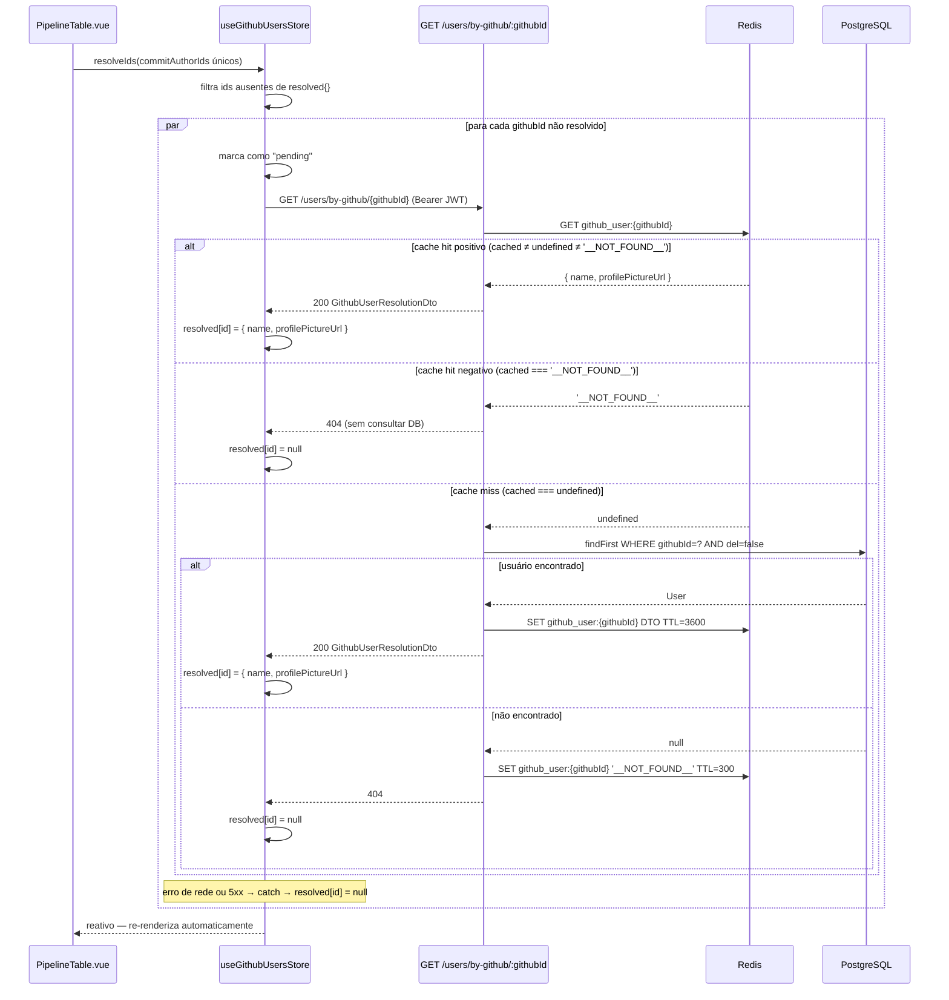
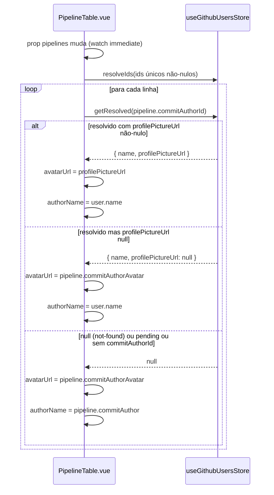
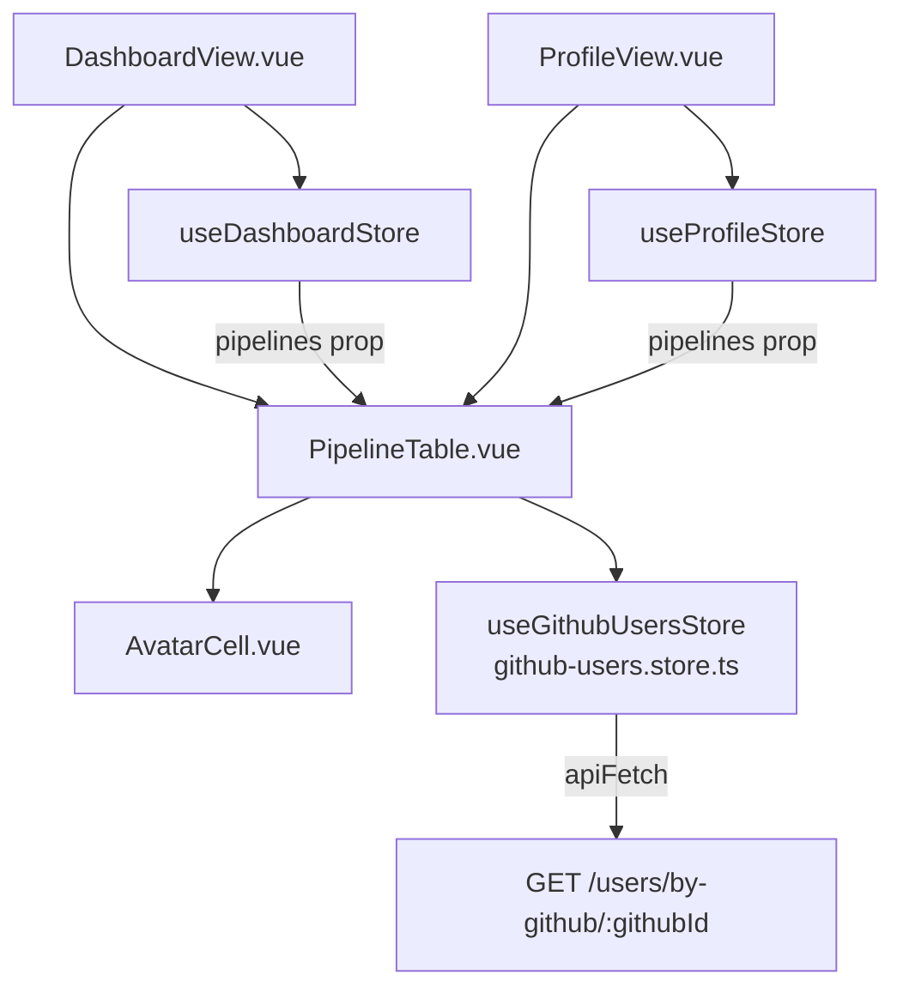

# Implementação — github-user-picture

> Documento gerado em 2026-06-05. Derivado do código real (Phase 4).

---

## §1. Visão Geral

A feature `github-user-picture` permite que o `PipelineTable.vue` exiba a foto de perfil e o nome cadastrados no sistema para autores de commit identificáveis, em vez de usar sempre os dados brutos do GitHub. A correlação é feita via `PipelineQueue.commitAuthorId == User.githubId`. Quando não há match, o fallback é transparente para o dado GitHub original.

**Camadas ativas:** backend (novo endpoint + Redis), frontend (novo store Pinia + atualização de componentes).

**Infra:** sem recursos k8s novos — Redis e `REDIS_URL` já existiam.

---

## §2. API Pública (Backend)

### `GET /users/by-github/:githubId`

| Atributo | Valor |
|---|---|
| Controller | `UsersController` |
| Guard | `JwtAuthGuard` (Bearer JWT obrigatório) |
| Parâmetro de rota | `githubId` — GitHub login string (ex: `"pedro-php"`) |
| Swagger tag | `Usuários` |

**Respostas:**

| Status | Tipo | Condição |
|---|---|---|
| 200 | `GithubUserResolutionDto` | Existe `User` ativo (`del = false`) com `githubId` igual ao parâmetro |
| 401 | — | Ausência de token Bearer ou token inválido |
| 404 | `{ message: 'Usuário não encontrado' }` | Nenhum usuário ativo com o `githubId` informado |

**`GithubUserResolutionDto`** (`server/src/users/dto/github-user-resolution.dto.ts`):

| Campo | Tipo | Descrição |
|---|---|---|
| `name` | `string` | Nome do usuário cadastrado |
| `profilePictureUrl` | `string \| null` | URL da foto de perfil (nullable) |

Ambos os campos decorados com `@ApiProperty` / `@ApiPropertyOptional` conforme convenção Swagger PT-BR.

---

## §3. Lógica de Cache — `UsersService.findByGithubIdCached`

Caminho: `server/src/users/users.service.ts`.

```
Chave Redis: github_user:{githubId}
```

Fluxo de execução:

1. Tenta `cacheManager.get(cacheKey)`. Se Redis lançar exceção, captura e registra `logger.warn` — não propaga o erro.
2. Se `cached !== undefined` → cache hit. Se `cached === '__NOT_FOUND__'` (sentinel negativo) → retorna `null` sem consultar o banco. Caso contrário, retorna o DTO diretamente.
3. Cache miss (`cached === undefined`) → consulta `prisma.user.findFirst({ where: { githubId, del: false } })`.
4. Se encontrado: persiste `{ name, profilePictureUrl }` no Redis com TTL **3600s** → retorna DTO.
5. Se não encontrado: persiste `'__NOT_FOUND__'` no Redis com TTL **300s** → retorna `null` (controller lança 404).

**Observação de drift:** veja §12.

---

## §4. Arquitetura do Sistema

### Diagrama de sequência — cache hit e miss



### Diagrama de sequência — exibição no PipelineTable



---

## §5. Componentes Vue

### `useGithubUsersStore` (`frontend/src/stores/github-users.store.ts`)

Store Pinia no formato Composition API (`defineStore` com setup function).

| Símbolo | Tipo | Descrição |
|---|---|---|
| `resolved` | `Ref<Record<string, ResolvedUser \| null \| "pending">>` | Mapa reativo de githubId para resultado |
| `resolveIds(ids: string[])` | `async function` | Filtra ids ausentes, marca como `"pending"`, dispara requisições em paralelo via `Promise.all` |
| `getResolved(githubId)` | `function` | Retorna `ResolvedUser` se disponível, `null` se not-found/pending/undefined |

**Interface interna `ResolvedUser`:**
```ts
interface ResolvedUser {
  name: string;
  profilePictureUrl: string | null;
}
```

**Deduplicação:** o filtro `!(id in resolved.value)` bloqueia ids que já estão no mapa (seja `pending`, `null` ou resolvido). Ids em `"pending"` não disparam nova requisição HTTP.

**Resiliência:** bloco `catch` em cada chamada `apiFetch` define `resolved[id] = null` — nunca propaga erro para a UI.

**Encoding de parâmetro:** usa `encodeURIComponent(id)` na URL construída para `apiFetch`.

---

### `PipelineTable.vue` (`frontend/src/components/PipelineTable.vue`)

Alterações em relação à versão anterior:

- Importa e instancia `useGithubUsersStore()` via `const githubUsersStore = useGithubUsersStore()`.
- `watch(() => props.pipelines, ..., { immediate: true })`: extrai `commitAuthorId` não-nulos, deduplica com `Set`, chama `githubUsersStore.resolveIds(unique)`. Dispara imediatamente ao montar.
- `resolvedAvatarUrl(pipeline)`: retorna `user.profilePictureUrl` se `user` não-nulo e `profilePictureUrl` truthy; caso contrário retorna `pipeline.commitAuthorAvatar ?? null`.
- `resolvedAuthorName(pipeline)`: retorna `user?.name` se resolvido; caso contrário retorna `pipeline.commitAuthor`.
- Ambas as funções passadas para `AvatarCell` e para `data-test="author-name"`.

**Atributos `data-test` relevantes:**

| Elemento | `data-test` |
|---|---|
| Linha da tabela | `pipeline-row` |
| Célula de autor | `author-name` |
| Sentinela de scroll infinito | `infinite-scroll-sentinel` |
| Estado vazio | `empty-state` |

---

### `AvatarCell.vue` (`frontend/src/components/AvatarCell.vue`)

Props: `url: string | null`, `name: string`.

O elemento `div` raiz possui `data-test="avatar-cell"`, conforme exigido pelos testes.

Comportamento:
- Se `url` truthy: renderiza `` com handler `@error` que oculta a imagem em caso de falha de carregamento.
- Se `url` falsy: renderiza iniciais (`name.charAt(0).toUpperCase()`).

O atributo `:url="url ?? undefined"` no `div` raiz é um artefato de binding não-padrão (não tem efeito HTML semântico); a lógica real de exibição usa a diretiva `v-if="url"` no `` interno.

---

## §6. Wiring de Módulos (Backend)

### `AppModule` — registro global do `CacheModule`

```
AppModule
├── CacheModule.registerAsync (isGlobal: true)
│   ├── store: redisStore (cache-manager-redis-yet)
│   └── url: ConfigService.get('REDIS_URL', 'redis://localhost:6379')
└── UsersModule → UsersService injeta CACHE_MANAGER
```

O `CacheModule` é registrado com `isGlobal: true` no `AppModule`. Portanto o `UsersModule` **não** precisa importar `CacheModule` separadamente — o token `CACHE_MANAGER` está disponível globalmente.

**Observação:** o `users.module.ts` real não importa `CacheModule`. O spec previa que `UsersModule` importaria `CacheModule`, mas o registro global no `AppModule` torna isso desnecessário. Ver §12.

### `UsersService` — injeção

```ts
constructor(
  private readonly prisma: PrismaService,
  @Inject(CACHE_MANAGER) private readonly cacheManager: Cache,
) {}
```

---

## §7. Configuração

| Parâmetro | Valor | Fonte |
|---|---|---|
| `REDIS_URL` | `redis://localhost:6379` (default) | ConfigMap k8s `env-config`; fallback via `ConfigService.get` |
| TTL cache positivo | **3600s** (1 hora) | `cacheManager.set(cacheKey, dto, 3600)` |
| TTL cache negativo | **300s** (5 minutos) | `cacheManager.set(cacheKey, '__NOT_FOUND__', 300)` |
| Chave Redis | `github_user:{githubId}` | Hardcoded no serviço |
| Pacote Redis | `cache-manager-redis-yet` + `redisStore` | `server/src/app.module.ts` |

---

## §8. Hierarquia de Componentes Frontend



---

## §9. Modelo de Dados (sem migração)

Nenhuma tabela ou campo novo. Campos pré-existentes utilizados:

| Tabela | Campo | Papel |
|---|---|---|
| `users` | `githubId` | Chave de correlação com `commitAuthorId` |
| `users` | `name` | Nome exibido quando resolvido |
| `users` | `profilePictureUrl` | Avatar exibido quando resolvido e não-nulo |
| `users` | `del` | Filtra usuários deletados (`del = false`) |
| `pipeline_queue` | `commitAuthorId` | GitHub login do autor; usado para correlação |
| `pipeline_queue` | `commitAuthor` | Fallback de nome quando sem match |
| `pipeline_queue` | `commitAuthorAvatar` | Fallback de avatar quando sem match ou `profilePictureUrl` nulo |

---

## §10. Casos de Borda e Tratamento de Erros

| Cenário | Comportamento real no código |
|---|---|
| `commitAuthorId` nulo | `watch` filtra com `.filter((id): id is string => !!id)`; `getResolved(null)` retorna `null` imediatamente |
| Redis indisponível | `try/catch` em `cacheManager.get`; `logger.warn`; prossegue direto para DB |
| Rede falha no frontend | `catch {}` em `resolveIds`; `resolved[id] = null`; UI usa fallback GitHub |
| `githubId` com `del = true` | `findFirst({ where: { githubId, del: false } })` exclui; retorna 404 |
| `resolveIds` com array vazio | `uncached.length === 0` → retorno antecipado |
| `resolveIds` chamado duas vezes com mesmo id | Segundo chamado não encontra o id em `uncached` (já está em `resolved`) |
| `profilePictureUrl` string vazia | `resolvedAvatarUrl` testa truthiness: `""` é falsy → usa fallback `commitAuthorAvatar` |
| Múltiplos pipelines com mesmo `commitAuthorId` | `new Set(ids)` deduplica antes de `resolveIds` |
| `getResolved` chamado enquanto id está `"pending"` | Condição `!val || val === "pending"` retorna `null`; UI usa fallback GitHub enquanto carrega |

---

## §11. Notas Operacionais

**Resiliência do Redis:** se o Redis estiver indisponível, o `UsersService` captura a exceção de `cacheManager.get` com `logger.warn` e prossegue normalmente para o banco. Entretanto, a operação `cacheManager.set` posterior não tem try/catch — uma falha de escrita no Redis lançaria exceção não tratada. Em produção, isso resultaria em 500 para o endpoint. Monitorar disponibilidade do Redis.

**Cache negativo — comportamento real:** o sentinel `null` é armazenado e recuperado. O código verifica `cached !== undefined && cached !== null` para distinguir "não encontrado no cache" (`undefined`) de "negativo armazenado" (`null`). Porém, quando `cached === null` (negativo), a condição falha e o código prossegue para o banco — ou seja, o sentinel negativo **não impede a consulta ao banco** na implementação atual. Isso é um drift de comportamento em relação ao spec FR-5 (ver §12).

**Deduplicação frontend:** o mapa `resolved` da store usa `in` operator — um id com valor `null` (not-found), `"pending"` ou objeto resolvido é tratado como "já processado" e não dispara nova requisição HTTP na mesma sessão.

**TTL mid-session:** quando o TTL expira no Redis, a próxima recarga de página dispara nova requisição ao backend. Dentro da mesma sessão Vue, o store mantém os resultados em memória indefinidamente (sem invalidação automática).

---

## §12. Drift do Spec

| # | Spec (docs/specs/github-user-picture.md) | Código real |
|---|---|---|
| 1 | FR-5 / §6: cache negativo (`null`) armazenado deve fazer o backend retornar 404 sem consultar o banco | **Resolvido pós-implementação:** o sentinel negativo foi alterado de `null` para `'__NOT_FOUND__'` (string). A condição `cached !== undefined` detecta qualquer hit (positivo ou negativo); `cached === '__NOT_FOUND__'` curto-circuita o banco. Alinhado com FR-5. |
| 2 | §8 (Module Boundaries): `UsersModule` importa `CacheModule` | `users.module.ts` **não** importa `CacheModule`. O `CacheModule` é registrado com `isGlobal: true` em `AppModule`, tornando o import no módulo filho desnecessário. |
