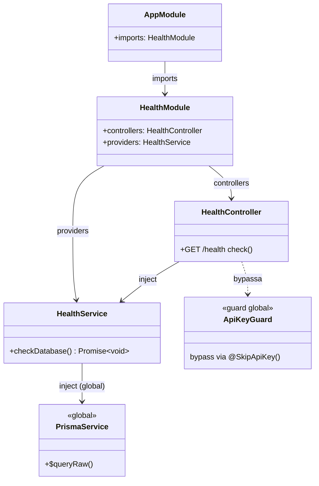
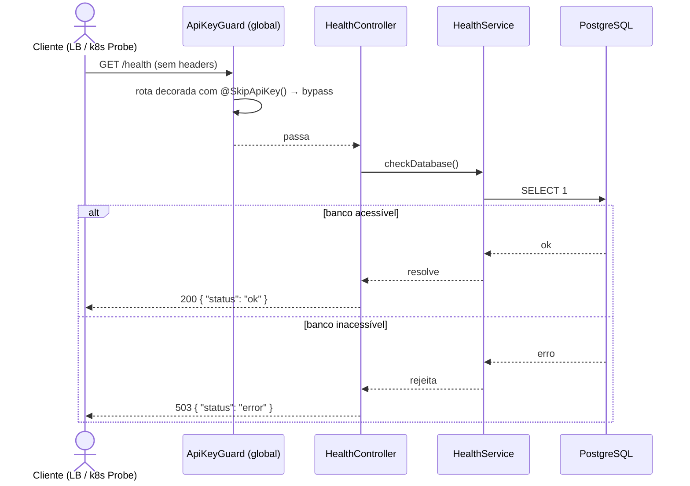
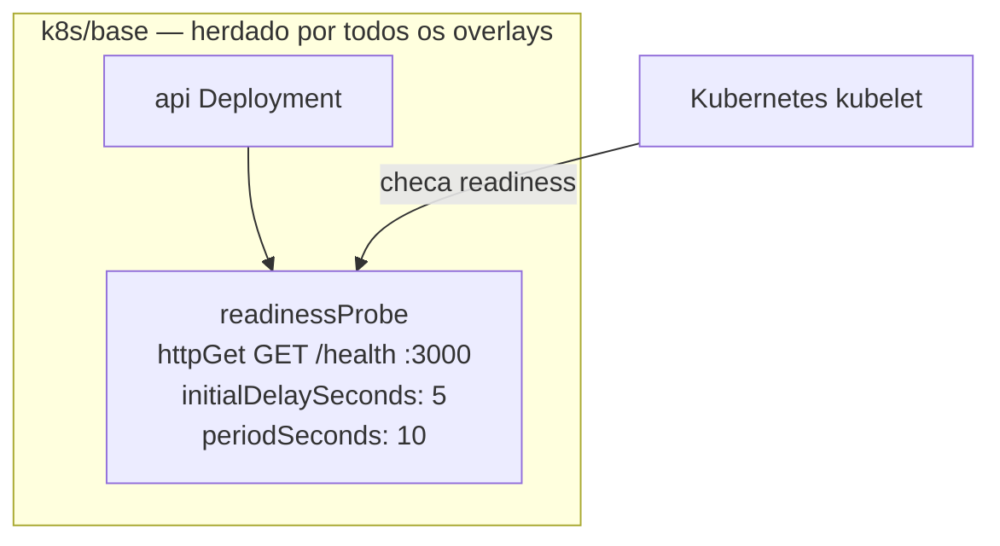

# Health Route

> **Status:** stable
> **Spec:** [docs/specs/health.md](../specs/health.md)
> **Backend module:** `server/src/health/`
> **Frontend module:** N/A
> **Infra:** `k8s/base/api-deployment.yaml`

## Tabela de Conteúdo

- [1. Visão Geral](#1-visão-geral)
- [2. API HTTP](#2-api-http)
- [2b. Frontend](#2b-frontend)
- [3. Superfície do Módulo](#3-superfície-do-módulo)
- [4. Arquitetura do Sistema](#4-arquitetura-do-sistema)
- [5. Modelo de Dados](#5-modelo-de-dados)
- [6. DTOs](#6-dtos)
- [7. Configuração](#7-configuração)
- [8. Dependências](#8-dependências)
- [9. Pontos de Extensão](#9-pontos-de-extensão)
- [10. Erros](#10-erros)
- [11. Notas Operacionais](#11-notas-operacionais)
- [12. Drift do Spec](#12-drift-do-spec)
- [13. Changelog](#13-changelog)

---

## 1. Visão Geral

`HealthModule` expõe `GET /health`, único endpoint totalmente público do sistema — sem `ApiKeyGuard` (via `@SkipApiKey()`) e sem `JwtAuthGuard`. Executa um `SELECT 1` real contra o PostgreSQL via `PrismaService`. Retorna `{ "status": "ok" }` HTTP 200 quando o banco está acessível; retorna `{ "status": "error" }` HTTP 503 quando o banco está inacessível. É consumido pelo `readinessProbe` do Deployment `api` no k8s — pod removido do load balancer caso o banco esteja fora.

---

## 2. API HTTP

| Método | Caminho | Auth | Descrição |
|---|---|---|---|
| GET | `/health` | Nenhuma | Verifica conectividade com o PostgreSQL |

### GET /health

**Request**
```http
GET /health
```

**Responses**
- `200 OK` — `{ "status": "ok" }` — banco acessível
- `503 Service Unavailable` — `{ "status": "error" }` — banco inacessível

**Exemplo (sucesso)**
```bash
curl http://localhost:3000/health
# {"status":"ok"}
```

**Exemplo (banco fora)**
```bash
curl -i http://localhost:3000/health
# HTTP/1.1 503 Service Unavailable
# {"status":"error"}
```

---

## 2b. Frontend

N/A — feature backend-only.

---

## 3. Superfície do Módulo

`HealthModule` não exporta nada. É módulo folha — registra controller e service.

```ts
// Para registrar (já feito em AppModule):
import { HealthModule } from './health/health.module';

@Module({
  imports: [HealthModule],
})
export class AppModule {}
```

**Exports:** nenhum.
**Providers:** `HealthService` (interno).
**Peer modules obrigatórios:** `PrismaModule` (global — não precisa importar explicitamente).

---

## 4. Arquitetura do Sistema

### 4.1 Diagrama de Classes



### 4.2 Diagrama de Sequência



### 4.3 Máquina de Estados

N/A — sem entidade com ciclo de vida.

### 4.4 Topologia de Deploy



`readinessProbe` definido em `k8s/base/api-deployment.yaml`, herdado por `development`, `staging` e `production` sem patches de overlay. Com a checagem real do Postgres, o pod é removido do LB se o banco ficar inacessível.

---

## 5. Modelo de Dados

Nenhuma entidade persistida. `HealthService.checkDatabase()` executa `SELECT 1` — sem leitura nem escrita de dados de negócio.

---

## 6. DTOs

### Resposta

Objeto literal retornado diretamente pelo controller (sem DTO class formal):

| Campo | Tipo | Valor |
|---|---|---|
| `status` | `string` | `"ok"` (banco acessível) ou `"error"` (banco inacessível) |

---

## 7. Configuração

Nenhuma variável de ambiente consumida por este módulo. `PrismaService` lê `DATABASE_URL` injetado globalmente.

---

## 8. Dependências

| Dependência | Tipo | Papel |
|---|---|---|
| `PrismaService` | Serviço global (`server/src/prisma/prisma.service.ts`) | Executa `SELECT 1` para verificar conectividade com PostgreSQL |
| `@SkipApiKey()` | Decorator interno (`server/src/auth/decorators/skip-api-key.decorator.ts`) | Isenta a rota do `ApiKeyGuard` global |
| `@nestjs/swagger` | Biblioteca | `@ApiTags`, `@ApiOperation`, `@ApiResponse` |

---

## 9. Pontos de Extensão

`HealthService.checkDatabase()` é swappável via mock em testes unitários (injeção por construtor). Para adicionar checagens extras (Redis, serviço externo), adicionar métodos ao `HealthService` e chamá-los em `HealthController.check()`.

---

## 10. Erros

| Exceção | Status | Lançada por | Quando |
|---|---|---|---|
| `HttpException({ status: 'error' }, 503)` | 503 | `HealthController.check()` | `HealthService.checkDatabase()` rejeita (Postgres inacessível, timeout, erro de conexão) |

---

## 11. Notas Operacionais

**Latência:** um round-trip `SELECT 1` ao Postgres. Espera-se < 10ms em condições normais.

**readinessProbe k8s:**
- `initialDelaySeconds: 5` — aguarda NestJS bootstrapar antes da primeira checagem.
- `periodSeconds: 10` — k8s verifica a cada 10s. Pod removido do load balancer após 3 falhas consecutivas (~30s).
- 503 = banco inacessível → pod sai do LB automaticamente.
- Sem `livenessProbe` — fora do escopo desta iteração.

**Comandos de validação:**
```bash
# Unit
cd server && npx jest health --no-coverage --forceExit

# E2E (requer Postgres via docker-compose)
cd server && npx jest --config ./test/jest-e2e.json health --forceExit

# Manual
curl http://localhost:3000/health

# Infra (requer minikube)
bash k8s/validate/validate-base.sh
```

---

## 12. Drift do Spec

- **Spec original** (`docs/specs/health.md`): checagem em memória, sem I/O.
- **Implementação atual**: executa `SELECT 1` real contra Postgres; retorna 503 quando banco inacessível. Drift intencional — requisito evoluiu após spec inicial.

---

## 13. Changelog

- **2026-05-20** — Implementação inicial. `GET /health` → `{ "status": "ok" }`, totalmente público via `@SkipApiKey()`. `readinessProbe` adicionado em `k8s/base/api-deployment.yaml`. Testes unit + e2e GREEN.
- **2026-05-21** — Refatoração: adicionado `HealthService` com `SELECT 1` real via `PrismaService`. Retorna HTTP 503 `{ "status": "error" }` quando Postgres inacessível. Testes unit atualizados (AC-1 DB ok, AC-2 DB falha). E2E inalterado (Postgres disponível em CI).
