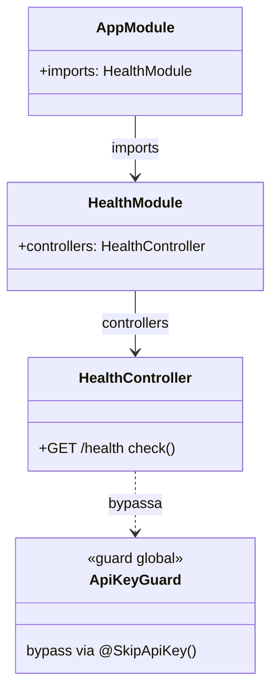
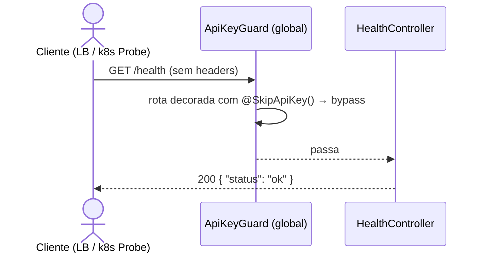
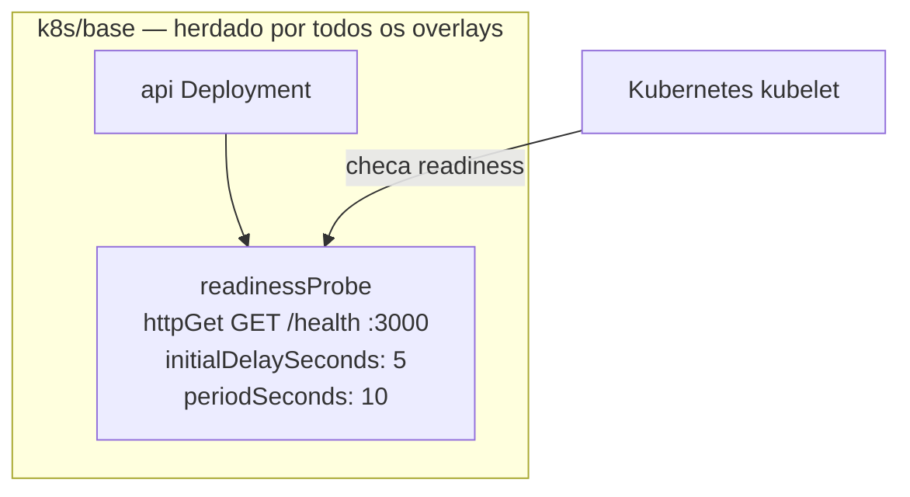

# Health Route

> **Status:** stable
> **Spec:** [docs/specs/health.md](../specs/health.md)
> **Backend module:** `server/src/health/`
> **Frontend module:** N/A
> **Infra:** `k8s/base/api-deployment.yaml`

## Tabela de Conteúdo

- [1. Visão Geral](#1-visão-geral)
- [2. API HTTP](#2-api-http)
- [2b. Frontend](#2b-frontend)
- [3. Superfície do Módulo](#3-superfície-do-módulo)
- [4. Arquitetura do Sistema](#4-arquitetura-do-sistema)
- [5. Modelo de Dados](#5-modelo-de-dados)
- [6. DTOs](#6-dtos)
- [7. Configuração](#7-configuração)
- [8. Dependências](#8-dependências)
- [9. Pontos de Extensão](#9-pontos-de-extensão)
- [10. Erros](#10-erros)
- [11. Notas Operacionais](#11-notas-operacionais)
- [12. Drift do Spec](#12-drift-do-spec)
- [13. Changelog](#13-changelog)

---

## 1. Visão Geral

`HealthModule` expõe `GET /health`, único endpoint totalmente público do sistema — sem `ApiKeyGuard` (via `@SkipApiKey()`) e sem `JwtAuthGuard`. Retorna `{ "status": "ok" }` com HTTP 200 quando o processo NestJS está vivo e aceitando conexões. É consumido pelo `readinessProbe` do Deployment `api` no k8s, garantindo que o Kubernetes só direcione tráfego ao pod após ele estar pronto para receber requisições.

---

## 2. API HTTP

| Método | Caminho | Auth | Descrição |
|---|---|---|---|
| GET | `/health` | Nenhuma | Retorna status operacional do serviço |

### GET /health

Resposta em memória — sem I/O de banco ou cache.

**Request**
```http
GET /health
```

**Responses**
- `200 OK` — `{ "status": "ok" }`

**Exemplo**
```bash
curl http://localhost:3000/health
# {"status":"ok"}
```

---

## 2b. Frontend

N/A — feature backend-only.

---

## 3. Superfície do Módulo

`HealthModule` não exporta nada. É módulo folha — registra apenas o controller.

```ts
// Para registrar (já feito em AppModule):
import { HealthModule } from './health/health.module';

@Module({
  imports: [HealthModule],
})
export class AppModule {}
```

**Exports:** nenhum.
**Providers:** nenhum.
**Peer modules obrigatórios:** nenhum.

---

## 4. Arquitetura do Sistema

### 4.1 Diagrama de Classes



### 4.2 Diagrama de Sequência



### 4.3 Máquina de Estados

N/A — sem entidade com ciclo de vida.

### 4.4 Topologia de Deploy



`readinessProbe` definido em `k8s/base/api-deployment.yaml`, herdado por `development`, `staging` e `production` sem patches de overlay.

---

## 5. Modelo de Dados

N/A — nenhuma entidade persistida.

---

## 6. DTOs

### Resposta

Objeto literal retornado diretamente pelo controller (sem DTO class formal — resposta constante e sem campos variáveis):

| Campo | Tipo | Valor |
|---|---|---|
| `status` | `string` | `"ok"` (sempre) |

---

## 7. Configuração

Nenhuma variável de ambiente consumida por este módulo.

---

## 8. Dependências

| Dependência | Tipo | Papel |
|---|---|---|
| `@SkipApiKey()` | Decorator interno (`server/src/auth/decorators/skip-api-key.decorator.ts`) | Isenta a rota do `ApiKeyGuard` global registrado em `AppModule` |
| `@nestjs/swagger` | Biblioteca | `@ApiTags`, `@ApiOperation`, `@ApiResponse` |

---

## 9. Pontos de Extensão

Nenhum. Módulo folha sem interfaces swappáveis ou eventos emitidos.

---

## 10. Erros

| Exceção | Status | Lançada por | Quando |
|---|---|---|---|
| — | — | — | Nenhum erro esperado — resposta sempre 200 enquanto processo estiver vivo |

---

## 11. Notas Operacionais

**Latência:** resposta em memória, sem I/O. Espera-se < 5ms em condições normais.

**readinessProbe k8s:**
- `initialDelaySeconds: 5` — dá tempo ao NestJS para bootstrapar antes da primeira checagem.
- `periodSeconds: 10` — k8s verifica a cada 10s. Pod removido do load balancer após falha consecutiva (padrão: 3 falhas = 30s de downtime antes de remoção).
- Sem `livenessProbe` — fora do escopo desta iteração.

**Comandos de validação:**
```bash
# Unit
cd server && npx jest health --no-coverage --forceExit

# E2E
cd server && npx jest --config ./test/jest-e2e.json health --forceExit

# Manual
curl http://localhost:3000/health

# Infra (requer minikube)
bash k8s/validate/validate-base.sh
```

---

## 12. Drift do Spec

Nenhum — implementação alinhada com `docs/specs/health.md`.

---

## 13. Changelog

- **2026-05-20** — Implementação inicial. `GET /health` → `{ "status": "ok" }`, totalmente público via `@SkipApiKey()`. `readinessProbe` adicionado em `k8s/base/api-deployment.yaml`. Testes unit + e2e GREEN.
