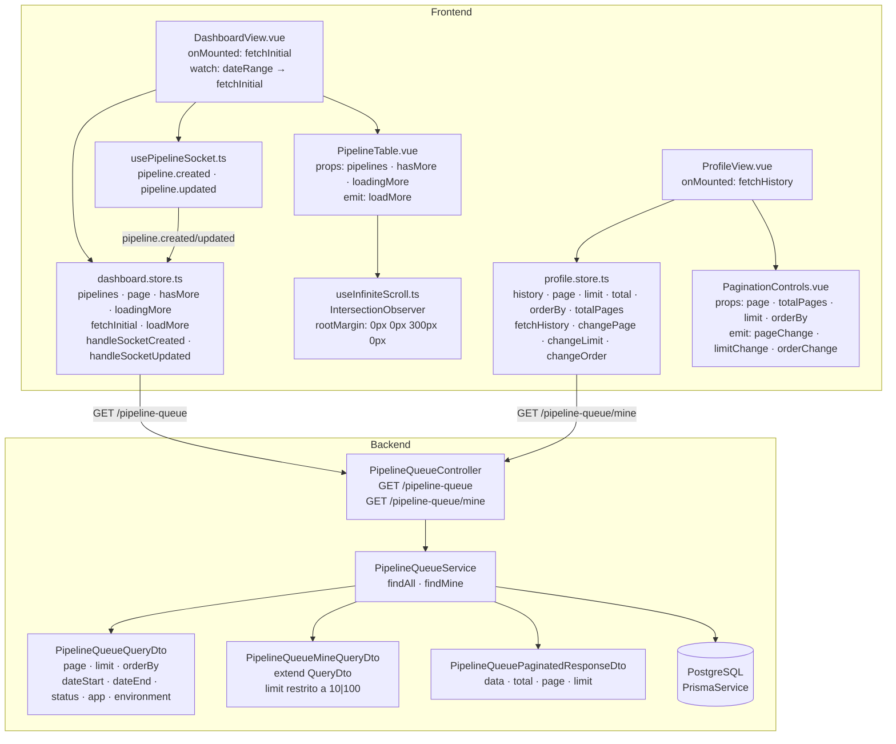
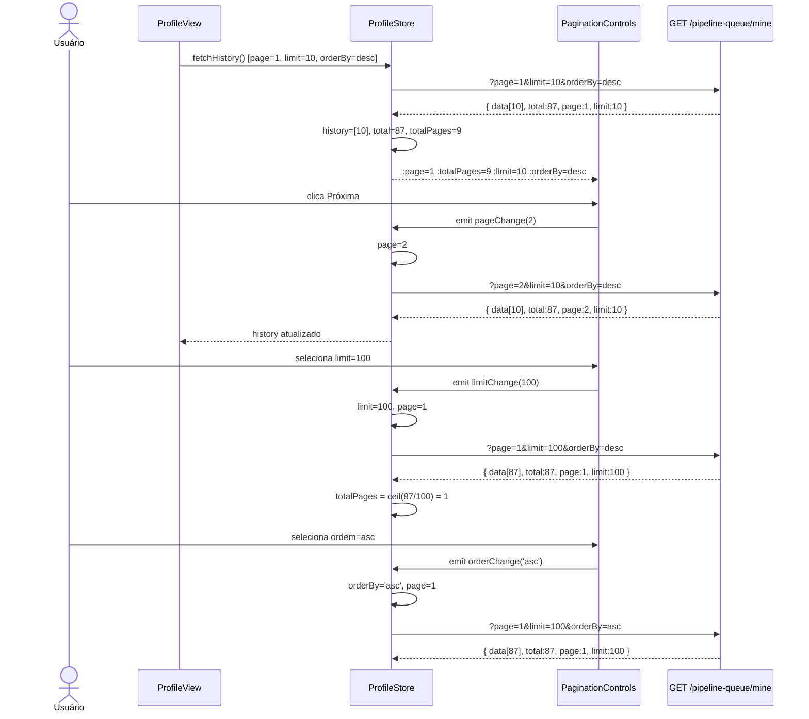

# Implementação — Infinite Scroll e Paginação

> **Ground-truth derivado do código em 2026-05-22.**
> Spec original: `docs/specs/infinite-scroll-pagination.md`

---

## 1. Arquitetura

A feature adiciona paginação server-side a dois endpoints existentes (`GET /pipeline-queue` e `GET /pipeline-queue/mine`) e introduz dois mecanismos de navegação distintos no frontend:

- **Dashboard** (`DashboardView`): scroll infinito com `IntersectionObserver`, lotes de 100 itens, WebSocket intacto.
- **Perfil** (`ProfileView`): paginação tradicional com controles explícitos (anterior/próximo, seletor de limite 10|100, seletor de ordem).

Nenhuma migração de schema foi necessária — apenas adição de parâmetros de query (`page`, `limit`, `orderBy`) nas queries Prisma existentes em `PipelineQueueService`.



---

## 2. API Real

### GET /pipeline-queue

- **Auth:** `JwtAuthGuard` (Bearer JWT) + `ApiKeyGuard` global (bypassado por Bearer)
- **DTO de query:** `PipelineQueueQueryDto`
- **Parâmetros aceitos:**

| Parâmetro | Tipo | Default | Validação |
|---|---|---|---|
| `page` | `number` | `1` | `@IsInt() @Min(1)` — omitido no DTO se ausente, service usa `?? 1` |
| `limit` | `number` | `100` | `@IsInt() @Min(1)` |
| `orderBy` | `'asc' \| 'desc'` | `'desc'` | `@IsIn(['asc', 'desc'])` |
| `dateStart` | `string` (ISO) | — | `@IsString()` opcional |
| `dateEnd` | `string` (ISO) | — | `@IsString()` opcional |
| `status` | `string` | — | `@IsIn(['Queued','Running','Completed','Failed'])` opcional |
| `app` | `string` | — | `@IsString()` opcional |
| `environment` | `string` | — | `@IsIn(['development','staging','production'])` opcional |

- **Resposta 200 (`PipelineQueuePaginatedResponseDto`):**

```json
{
  "data": [ /* PipelineQueueResponseDto[] */ ],
  "total": 342,
  "page": 1,
  "limit": 100
}
```

- **Resposta 400:** parâmetro de query inválido (ValidationPipe global).
- **Resposta 401:** token ausente ou inválido.

### GET /pipeline-queue/mine

- **Auth:** idem `GET /pipeline-queue`
- **DTO de query:** `PipelineQueueMineQueryDto` (extends `PipelineQueueQueryDto`)
- **Diferença do DTO base:** campo `limit` redeclarado com `@IsIn([10, 100])` — somente os valores `10` ou `100` são aceitos; outros retornam `400`.
- **Default de `limit`:** `10` (aplicado no service via `query.limit ?? 10`).
- **Filtro de usuário no service:** busca por `id_user = userId` **OU** `commitAuthorId = githubId` **OU** `commitAuthor = githubId`, além de `del: false`. O `githubId` é carregado via `prisma.user.findUnique` pelo `userId` do JWT.
- **Resposta:** idêntica ao `GET /pipeline-queue` (mesmo `PipelineQueuePaginatedResponseDto`).

### Implementação no service (`PipelineQueueService`)

`findAll` e `findMine` constroem `skip = (page - 1) * limit` e retornam um objeto literal `{ data, total, page, limit }` — **não** instância de `PipelineQueuePaginatedResponseDto`. O campo `data` é mapeado via `plainToInstance(PipelineQueueResponseDto, ...)` com `excludeExtraneousValues: true`.

---

## 3. Componentes Vue

### `useInfiniteScroll.ts`

Composable puro. Registra um único `IntersectionObserver` via `onMounted` e desconecta via `onBeforeUnmount`.

```
useInfiniteScroll(target: Ref<HTMLElement | null>, onReached: () => void): void
```

- `rootMargin: '0px 0px 300px 0px'` — dispara quando a sentinela está 300 px abaixo da viewport, evitando salto perceptível.
- Só cria o `observer.observe(target.value)` se `target.value` não for nulo no momento do mount.
- Sem retorno de valor (void) — toda lógica de guarda (`hasMore`, `loadingMore`) fica no chamador.

### `PipelineTable.vue`

Props:

| Prop | Tipo | Obrigatório |
|---|---|---|
| `pipelines` | `PipelineQueue[]` | sim |
| `hasMore` | `boolean` | não (optional) |
| `loadingMore` | `boolean` | não (optional) |

Emits: `loadMore` (sem payload), `sort-change(field, order)`, `page-change(page)` (os dois últimos herdados de versão anterior — não usados pelo `DashboardView` atual).

Internamente cria `const sentinel = ref<HTMLElement | null>(null)` e chama `useInfiniteScroll(sentinel, callback)`. O callback emite `loadMore` apenas se `props.hasMore && !props.loadingMore`.

A sentinela (`<div ref="sentinel" data-test="infinite-scroll-sentinel" style="height: 1px">`) fica após o `</table>`, **abaixo** do indicador de loading (`data-test="loading-more"`). Não está antes do último item — está no fim absoluto do container.

> **Drift AC-7/FR-3 — ver §12.**

Estado vazio exibe `<td data-test="empty-state">Nenhum deploy encontrado neste período.</td>` com `colspan="8"`.

### `PaginationControls.vue`

Props:

| Prop | Tipo |
|---|---|
| `page` | `number` |
| `totalPages` | `number` |
| `limit` | `10 \| 100` |
| `orderBy` | `'desc' \| 'asc'` |

Emits: `pageChange(n: number)`, `limitChange(n: 10 | 100)`, `orderChange(o: 'desc' | 'asc')`.

Atributos `data-test`:
- `pagination-prev` — botão Anterior; `:disabled="page === 1"`
- `pagination-next` — botão Próxima; `:disabled="page === totalPages"`
- `pagination-page-info` — `<span>` "Página X de Y"
- `pagination-limit-select` — `<select>` com options `10` e `100`
- `pagination-order-select` — `<select>` com options `desc` ("Mais recentes") e `asc` ("Mais antigas")

A lógica de boundary (prev/next desabilitados nas extremidades) é feita diretamente no template via `:disabled`.

### `dashboard.store.ts`

Estado de paginação adicionado:

| Campo | Tipo | Valor inicial |
|---|---|---|
| `page` | `Ref<number>` | `1` |
| `hasMore` | `Ref<boolean>` | `true` |
| `loadingMore` | `Ref<boolean>` | `false` |

Métodos novos:

**`fetchInitial()`** — reinicia lista (sem alterar `loading` — usa `apiFetch` diretamente sem setar `loading.value`):
1. Constrói URL `?page=1&limit=100&orderBy=desc` com filtros de data opcionais.
2. Seta `pipelines.value = data`, `page.value = 1`, `hasMore.value = total > data.length`.
3. Lança exceção em falha (sem captura interna — tratamento na view ou watcher).

**`loadMore()`** — guarda duplo (`!hasMore.value || loadingMore.value → return`):
1. `loadingMore.value = true`.
2. Busca `page + 1` com mesmos filtros.
3. Deduplica: `existingIds = new Set(pipelines.value.map(p => p.id))`; filtra `newData`.
4. Apenda deduplicados; atualiza `page.value = nextPage`; `hasMore.value = total > pipelines.value.length`.
5. `loadingMore.value = false` no `finally`.

**`handleSocketCreated(pipeline)`** — async; ignora se `id` já existe; insere no índice 0 via spread; re-busca KPIs (`fetchKpis`) com tratamento silencioso de erros.

**`handleSocketUpdated(pipeline)`** — sync; `splice(idx, 1, { ...existing, ...pipeline })` in-place.

O método legado `fetchPipelines(start, end)` permanece e é chamado pelo `setDateRange` (compatibilidade com uso anterior). `DashboardView` chama ambos `fetchPipelines` e `fetchInitial` no `onMounted`.

### `profile.store.ts`

Estado:

| Campo | Tipo | Valor inicial |
|---|---|---|
| `page` | `Ref<number>` | `1` |
| `limit` | `Ref<10 \| 100>` | `10` |
| `total` | `Ref<number>` | `0` |
| `orderBy` | `Ref<'desc' \| 'asc'>` | `'desc'` |
| `totalPages` | `Computed<number>` | `Math.ceil(total / limit)` |

Métodos:

- `fetchHistory()` — GET `/pipeline-queue/mine?page=X&limit=X&orderBy=X`; seta `history.value` e `total.value`; `loading`/`error` padrão.
- `changePage(n)` — seta `page.value = n`, chama `fetchHistory()`.
- `changeLimit(n)` — seta `limit.value = n`, reinicia `page.value = 1`, chama `fetchHistory()`.
- `changeOrder(o)` — seta `orderBy.value = o`, reinicia `page.value = 1`, chama `fetchHistory()`.

### `DashboardView.vue`

`onMounted` chama na sequência:
1. `dashboardStore.$patch({ dateStart, dateEnd, dateRange })` — seta range dos últimos 7 dias.
2. `dashboardStore.fetchPipelines(dateStart, dateEnd)` — busca legada (seta `loading`).
3. `dashboardStore.fetchKpis(dateStart, dateEnd)`.
4. `dashboardStore.fetchInitial()` — busca paginada.
5. Conecta WebSocket e registra handlers `onCreated`/`onUpdated`.

`watch` em `dashboardStore.dateRange` (deep) chama `fetchInitial()` ao alterar o filtro de data — atende FR-9/AC-15.

Template: passa `pipelines`, `hasMore`, `loadingMore` para `PipelineTable` e captura emit `load-more` → `dashboardStore.loadMore()`.

### `ProfileView.vue`

`onMounted` chama `profileStore.fetchHistory()` — sem parâmetros, usa estado interno do store.

`PaginationControls` recebe props do store diretamente e wira emits para `profileStore.changePage`, `profileStore.changeLimit`, `profileStore.changeOrder`.

---

## 4. Sequências Mermaid

### Scroll Infinito — Dashboard

```mermaid
sequenceDiagram
    actor Usuário
    participant DashboardView
    participant DashboardStore
    participant PipelineTable
    participant useInfiniteScroll
    participant API as GET /pipeline-queue
    participant WS as PipelineGateway

    DashboardView->>DashboardStore: fetchInitial()
    DashboardStore->>API: ?page=1&limit=100&orderBy=desc
    API-->>DashboardStore: { data[100], total:342, page:1, limit:100 }
    DashboardStore->>DashboardStore: pipelines=[100], page=1, hasMore=true
    DashboardStore-->>DashboardView: estado atualizado
    DashboardView->>PipelineTable: :pipelines :hasMore :loadingMore
    PipelineTable->>useInfiniteScroll: observar sentinela (rootMargin 300px)

    Note over Usuário,useInfiniteScroll: Usuário rola — sentinela entra na zona 300px
    useInfiniteScroll->>PipelineTable: callback disparado
    PipelineTable->>DashboardStore: emit loadMore (hasMore=true, loadingMore=false)
    DashboardStore->>DashboardStore: loadingMore=true
    DashboardStore->>API: ?page=2&limit=100&orderBy=desc
    API-->>DashboardStore: { data[100], total:342, page:2, limit:100 }
    DashboardStore->>DashboardStore: dedup por id, append, page=2
    DashboardStore->>DashboardStore: hasMore = 342 > 200 → true, loadingMore=false

    Note over WS,DashboardStore: Evento WS concorrente
    WS-->>DashboardStore: pipeline.created(p)
    DashboardStore->>DashboardStore: id existe? não → prepend; fetchKpis()
    WS-->>DashboardStore: pipeline.updated(p)
    DashboardStore->>DashboardStore: findIndex → splice in-place
```

### Paginação — Perfil



### Fluxo de Deduplicação (scroll infinito)

```mermaid
flowchart TD
    Start([loadMore disparado]) --> G1{hasMore = true?}
    G1 -->|Não| Stop([retorna — noop])
    G1 -->|Sim| G2{loadingMore = true?}
    G2 -->|Sim| Stop
    G2 -->|Não| SetLoading[loadingMore = true]
    SetLoading --> Fetch[GET /pipeline-queue?page=page+1&limit=100]
    Fetch --> Parse[extrair data e total do JSON]
    Parse --> Dedup[existingIds = Set de ids atuais\ndeduped = newData.filter não existentes]
    Dedup --> Append[pipelines = [...pipelines, ...deduped]]
    Append --> Meta[page++\nhasMore = total > pipelines.length]
    Meta --> ClearLoading[loadingMore = false via finally]
    ClearLoading --> Done([fim])
```

---

## 5. Manifests K8s

Nenhuma alteração — feature é puramente código (backend + frontend). Os manifests existentes em `k8s/base/` e overlays permanecem inalterados.

---

## 6. Tratamento de Erros

| Cenário | Comportamento real |
|---|---|
| `loadMore` com falha HTTP | `loadingMore.value = false` via `finally`; exceção propagada (sem captura interna no store) |
| `fetchInitial` com falha HTTP | exceção propagada; `DashboardView` não captura explicitamente — erro silencioso |
| Lista vazia | `total=0` → `hasMore = 0 > 0 = false`; `PipelineTable` exibe `data-test="empty-state"` |
| Último lote parcial | `hasMore = total > pipelines.length` calculado após dedup — correto mesmo com lote menor que `limit` |
| WS duplicata | `handleSocketCreated` ignora se `pipelines.value.some(p => p.id === pipeline.id)` |
| Perfil: `limit` inválido (ex.: 50) | `PipelineQueueMineQueryDto` retorna 400 via ValidationPipe |
| Perfil: `page` fora do range | sem tratamento de clamp no store/view — botões desabilitados no componente previnem |

---

## 7. Regressões Conhecidas / Observações

- `DashboardView.onMounted` chama `fetchPipelines` (legado) E `fetchInitial` em sequência. Isso resulta em **duas chamadas à API** no mount: a primeira seta `pipelines.value` com o formato antigo (pode incluir todos os itens sem paginação se o endpoint retornar `data` sem wrapper); a segunda sobrescreve com o lote paginado. Não há bug visível, mas há requisição redundante.
- `fetchInitial` não seta `loading.value = true` — o spinner do dashboard depende de `fetchPipelines` para exibição durante o carregamento inicial.

---

## 8. §12 — Drift do Spec

**AC-7 / FR-3 (sentinela posicionada antes do último grupo):** O spec descreve a sentinela posicionada "antes do último item visível" para garantir carregamento com antecedência sem salto. Na implementação, a sentinela `<div ref="sentinel">` está posicionada após o fechamento da `</table>`, **no fim absoluto do container**, não antes do penúltimo grupo de linhas. O `rootMargin: '0px 0px 300px 0px'` compensa parcialmente — o observer dispara quando a sentinela está 300 px abaixo da viewport, o que efetivamente antecipa o disparo. O comportamento funcional está correto (sem salto perceptível), mas a posição da sentinela difere do descrito no spec e no §15 da spec.
