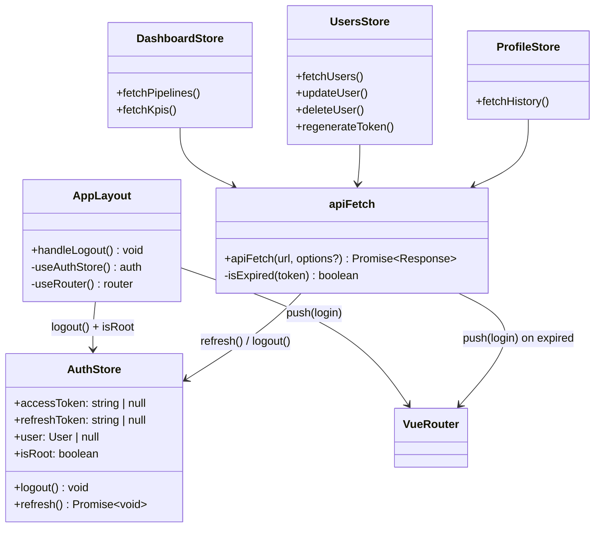
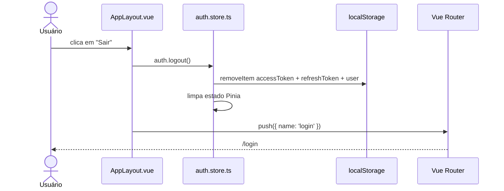
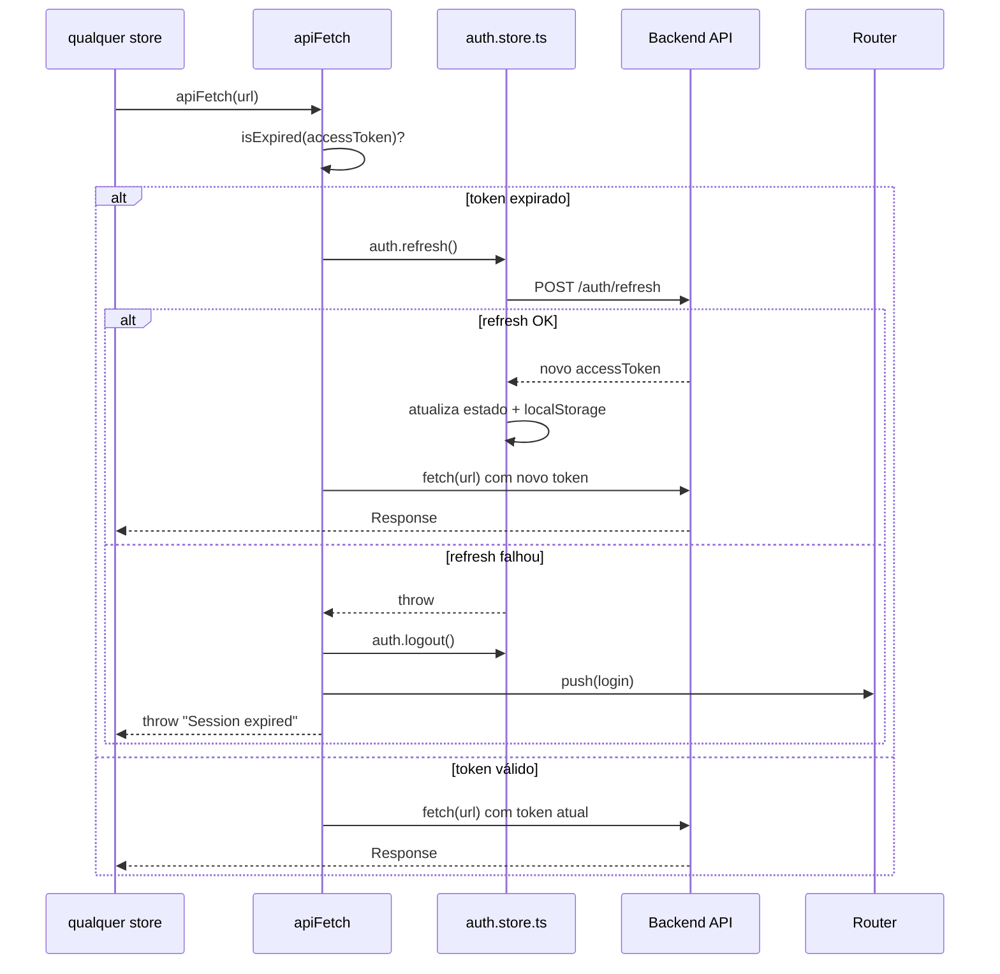

# Botão de Logout

> **Status:** stable
> **Spec:** [docs/specs/logout-button.md](../specs/logout-button.md)
> **Frontend module:** `frontend/src/components/AppLayout.vue`, `frontend/src/lib/apiFetch.ts`

## Índice

- [1. Visão Geral](#1-visão-geral)
- [2b. Páginas e Componentes Frontend](#2b-páginas-e-componentes-frontend)
- [3. Superfície do Módulo](#3-superfície-do-módulo)
- [4. Arquitetura do Sistema](#4-arquitetura-do-sistema)
- [5. Modelo de Dados](#5-modelo-de-dados)
- [6. DTOs](#6-dtos)
- [7. Configuração](#7-configuração)
- [8. Dependências](#8-dependências)
- [9. Pontos de Extensão](#9-pontos-de-extensão)
- [10. Erros](#10-erros)
- [11. Notas Operacionais](#11-notas-operacionais)
- [12. Desvios do Spec](#12-desvios-do-spec)
- [13. Changelog](#13-changelog)

---

## 1. Visão Geral

Feature exclusivamente frontend. Expõe um botão "Sair" vermelho em `AppLayout.vue` — presente no menu lateral (desktop) e no menu inferior (mobile) — acessível a qualquer usuário autenticado. Ao clicar, `auth.logout()` limpa `accessToken`, `refreshToken` e `user` do estado Pinia e do `localStorage`, e o router redireciona para `/login`.

Junto com o botão, esta entrega inclui `apiFetch` — utilitário centralizado de `fetch` com verificação proativa de expiração do JWT antes de cada requisição. Quando o `accessToken` está expirado (ou expira em menos de 10 segundos), `apiFetch` chama `auth.refresh()` silenciosamente antes de enviar a requisição. Se o refresh falhar, executa logout automático e redireciona para `/login`. Todos os stores de dados (`dashboard`, `users`, `profile`) foram migrados para usar `apiFetch`.

---

## 2. Public API (HTTP)

None — feature é client-side. Nenhum endpoint novo criado ou modificado.

---

## 2b. Páginas e Componentes Frontend

| Rota | Named route | Componente | Auth | Descrição |
|---|---|---|---|---|
| `/login` | `login` | `LoginView.vue` | não | Destino após logout (rota existente) |

### AppLayout.vue

Layout wrapper usado por todas as rotas protegidas (`dashboard`, `profile`, `users`). Não é usado em `/login`.

**Props:** nenhuma.

**Slots:** `default` — conteúdo da página.

**Emits:** nenhum.

**Stores consumidas:** `useAuthStore()` — lê `isRoot` (para condicionar link Usuários), chama `logout()` no clique de Sair.

**Composables usados:** `useRouter()` — navega para `{ name: 'login' }` após logout.

**Elementos adicionados:**

| Elemento | Localização | Classes | `data-test` |
|---|---|---|---|
| `<button>Sair</button>` | Side menu (desktop) | `btn btn-danger btn-sm mt-auto` | `logout-button` |
| `<button>Sair</button>` | Bottom menu (mobile) | `text-danger bg-transparent border-0` | `logout-button` |

`mt-auto` no side menu empurra o botão para o rodapé do flex container vertical.

### apiFetch (frontend/src/lib/apiFetch.ts)

Utilitário (não composable) exportando `apiFetch(url, options?)`. Substitui chamadas manuais de `fetch` com token nos stores de dados.

**Assinatura:**
```ts
apiFetch(url: string, options?: RequestInit): Promise<Response>
```

**Comportamento:**
1. Lê `auth.accessToken` do store Pinia.
2. Se token presente e `exp * 1000 < Date.now() + 10_000` (expira em menos de 10 s) → chama `auth.refresh()`.
3. Se refresh falhar → `auth.logout()` + `router.push({ name: 'login' })` + throw `"Session expired"`.
4. Injeta `Authorization: Bearer <token>` no header e executa `fetch`.

**Stores que usam `apiFetch`:**

| Store | Funções migradas |
|---|---|
| `dashboard.store.ts` | `fetchPipelines`, `fetchKpis` |
| `users.store.ts` | `fetchUsers`, `updateUser`, `deleteUser`, `regenerateToken` |
| `profile.store.ts` | `fetchHistory` |

`auth.store.ts` não usa `apiFetch` (evitar dependência circular — o store de auth é a fonte de tokens).

---

## 3. Superfície do Módulo

Não há módulo NestJS envolvido. No frontend:

```ts
// Importar utilitário de fetch com auto-refresh
import { apiFetch } from '../lib/apiFetch';

// Uso — idêntico ao fetch nativo, sem passar token manualmente
const res = await apiFetch(`${window.config.API_URL}/algum-recurso`);
```

---

## 4. Arquitetura do Sistema

### 4.1 Estrutura de Componentes



### 4.2 Fluxo de Logout



### 4.3 Fluxo de Auto-Refresh (apiFetch)



### 4.4 Topologia de Deploy

Nenhuma alteração em recursos Kubernetes. Topologia inalterada — ver [docs/implementation/pipeline-monitor.md](pipeline-monitor.md) para topologia completa.

---

## 5. Modelo de Dados

Nenhuma alteração de schema. Feature é puramente client-side.

---

## 6. DTOs

Nenhum DTO novo. `auth.logout()` não faz chamada HTTP.

---

## 7. Configuração

Nenhuma variável de ambiente nova. `apiFetch` lê `window.config.API_URL` (já existente) via chamadas delegadas aos stores.

---

## 8. Dependências

| Dependência | Tipo | Papel nesta feature |
|---|---|---|
| `vue-router` (`useRouter`) | existente | Redirect para `/login` após logout |
| `pinia` (`useAuthStore`) | existente | Estado de auth + métodos `logout()` / `refresh()` |
| `atob` (Web API nativa) | nativa | Decode do payload JWT para checar `exp` |

---

## 9. Pontos de Extensão

Nenhum evento emitido, nenhuma interface swappável introduzida.

Para adicionar lógica pré-logout (ex.: limpar outros stores), basta chamar os stores necessários em `handleLogout()` dentro de `AppLayout.vue` antes de `auth.logout()`.

---

## 10. Erros

| Origem | Condição | Comportamento |
|---|---|---|
| `apiFetch` | `auth.refresh()` lança exceção (token inválido no servidor) | `auth.logout()` + `router.push(login)` + throw `"Session expired"` |
| `apiFetch` | `isExpired` lança ao fazer `atob` (token malformado) | trata como expirado → tenta refresh |
| `auth.logout()` | — | síncrono, não lança exceções |

---

## 11. Notas Operacionais

**Buffer de expiração:** `apiFetch` considera o token expirado se `exp * 1000 < Date.now() + 10_000`. Janela de 10 s evita requisições rejeitadas por clock skew entre cliente e servidor.

**`auth.store.ts` não usa `apiFetch`:** dependência circular intencional evitada. O store de auth usa `fetch` direto para `POST /auth/login` e `POST /auth/refresh`.

**Validação dos testes:**
```bash
cd frontend && npx vitest run src/components/__tests__/AppLayout.spec.ts
# Esperado: 16 passed
```

---

## 12. Desvios do Spec

- **Spec AC-3** especificou `btn-danger` para o bottom menu. **Implementação** usa `text-danger bg-transparent border-0` no bottom menu para manter consistência visual com os demais links (texto sem fundo), reservando o estilo `btn btn-danger` para o side menu onde há mais espaço. Comportamento funcional idêntico.
- **`apiFetch`** não estava no spec do logout button (spec cobria apenas o botão UI). Foi implementado junto como correção de bug de auth state quebrado — feature relacionada, entregue no mesmo ciclo.

---

## 13. Changelog

- **2026-05-14** — Implementação inicial. Botão "Sair" adicionado ao side menu (`btn btn-danger btn-sm mt-auto`) e bottom menu (`text-danger`) de `AppLayout.vue`. `handleLogout()` chama `auth.logout()` + `router.push({ name: 'login' })`. Criado `frontend/src/lib/apiFetch.ts` com verificação proativa de expiração JWT e auto-refresh. Stores `dashboard`, `users` e `profile` migrados para `apiFetch`. 16 testes em `AppLayout.spec.ts` (AC-1 a AC-6).
