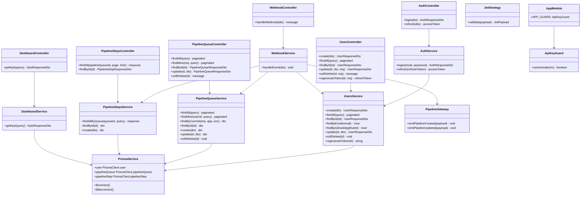
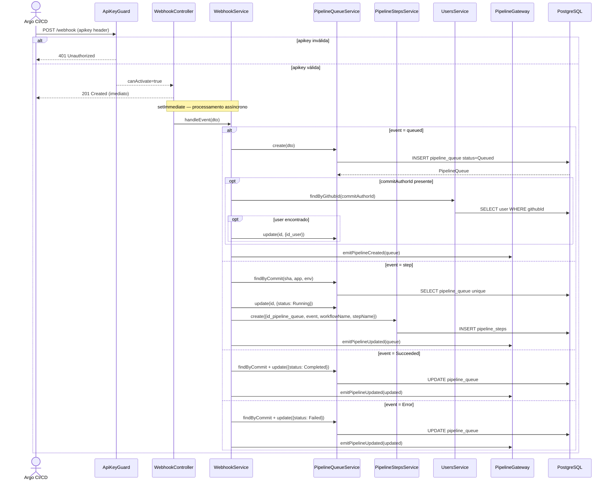
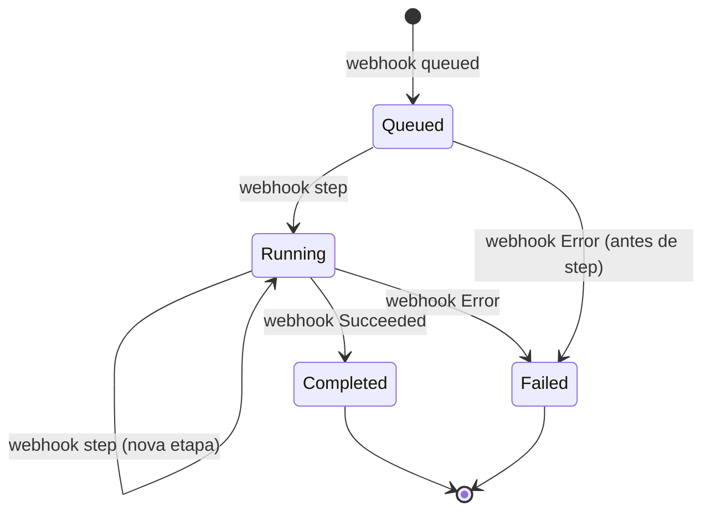
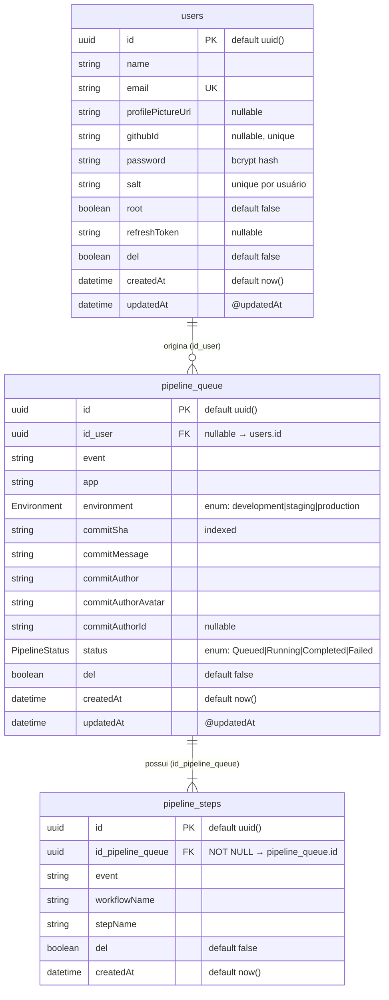

# Pipeline Monitor

> **Status:** stable
> **Spec:** [docs/specs/pipeline-monitor.md](../specs/pipeline-monitor.md)
> **Backend:** `server/src/`
> **Frontend:** `frontend/src/`
> **Infra:** `k8s/`

## Índice

- [1. Visão Geral](#1-visão-geral)
- [2. API HTTP Pública](#2-api-http-pública)
- [2b. Páginas e Componentes Frontend](#2b-páginas-e-componentes-frontend)
- [3. Superfície dos Módulos](#3-superfície-dos-módulos)
- [4. Arquitetura do Sistema](#4-arquitetura-do-sistema)
- [5. Modelo de Dados](#5-modelo-de-dados)
- [6. DTOs](#6-dtos)
- [7. Configuração](#7-configuração)
- [8. Dependências](#8-dependências)
- [9. Pontos de Extensão](#9-pontos-de-extensão)
- [10. Erros](#10-erros)
- [11. Notas Operacionais](#11-notas-operacionais)
- [12. Desvios da Spec](#12-desvios-da-spec)
- [13. Changelog](#13-changelog)

---

## 1. Visão Geral

O Pipeline Monitor é uma aplicação full-stack de monitoramento em tempo real de pipelines de deploy. O Argo CI/CD envia webhooks para `POST /webhook`; o backend (NestJS 11 + Prisma 7 + PostgreSQL) persiste os eventos em `pipeline_queue` e `pipeline_steps`, e o `PipelineGateway` (Socket.IO) propaga atualizações para todos os clientes conectados. O frontend (Vue 3 + Pinia) exibe um dashboard reativo que combina dados REST iniciais com eventos WebSocket ao vivo. A autenticação usa API Key global (header `apikey`) com bypass automático para rotas que apresentem `Authorization: Bearer`, e JWT Bearer nos endpoints protegidos.

---

## 2. API HTTP Pública

### Resumo dos Endpoints

| Método | Path | Auth | Descrição |
|---|---|---|---|
| POST | `/auth/login` | Nenhuma | Login → access + refresh token |
| POST | `/auth/refresh` | Nenhuma (body) | Renova access token |
| POST | `/users` | API Key | Criar usuário |
| GET | `/users` | API Key | Listar usuários (paginado) |
| GET | `/users/:id` | API Key | Buscar usuário por ID |
| PATCH | `/users/:id` | JWT Bearer | Atualizar usuário |
| DELETE | `/users/:id` | JWT Bearer (root) | Soft-delete de usuário |
| POST | `/users/:id/regenerate-token` | JWT Bearer (root) | Regenerar refresh token |
| POST | `/webhook` | API Key (`apikey` header) | Receber evento Argo |
| GET | `/pipeline-queue` | JWT Bearer | Listar pipelines (paginado + filtros) |
| GET | `/pipeline-queue/mine` | JWT Bearer | Pipelines do usuário autenticado |
| GET | `/pipeline-queue/:id` | JWT Bearer | Buscar pipeline por ID |
| PATCH | `/pipeline-queue/:id` | JWT Bearer | Atualizar pipeline |
| DELETE | `/pipeline-queue/:id` | JWT Bearer | Soft-delete de pipeline |
| GET | `/pipeline-steps` | JWT Bearer | Listar etapas de um pipeline |
| GET | `/pipeline-steps/:id` | JWT Bearer | Buscar etapa por ID |
| GET | `/dashboard/kpis` | JWT Bearer | KPIs do período |

Swagger disponível em `/docs`.

---

### POST /auth/login

Autentica com email e senha. Retorna access token (15 min) e refresh token (sem expiração — invalidado apenas por regeneração explícita).

**Request**
```http
POST /auth/login
Content-Type: application/json

{
  "email": "pedro@example.com",
  "password": "senha12345"
}
```

**Respostas**
- `200 OK` — `AuthResponseDto` (`{ accessToken, refreshToken, user: UserResponseInAuthDto }`)
- `401 Unauthorized` — credenciais inválidas ou usuário com `del=true`

**Exemplo**
```bash
curl -X POST http://localhost:3000/auth/login \
  -H "Content-Type: application/json" \
  -d '{"email":"pedro@example.com","password":"senha12345"}'
```

---

### POST /auth/refresh

Emite novo access token a partir de refresh token válido. Validação: token presente no banco para o usuário (`user.refreshToken === dto.refreshToken`).

**Request**
```http
POST /auth/refresh
Content-Type: application/json

{ "refreshToken": "eyJhbGciOiJIUzI1NiJ9..." }
```

**Respostas**
- `200 OK` — `{ accessToken: string }`
- `401 Unauthorized` — token inválido ou não encontrado no banco

---

### POST /users

Cria usuário. Senha hasheada com bcrypt + salt único. Não requer JWT — apenas API Key (permite bootstrap do primeiro usuário).

**Request**
```http
POST /users
apikey: bWludGluaG8=
Content-Type: application/json

{
  "name": "Pedro Miranda",
  "email": "pedro@example.com",
  "password": "senha12345",
  "root": false
}
```

**Respostas**
- `201 Created` — `UserResponseDto`
- `400 Bad Request` — validação (senha < 8 chars, email inválido)
- `409 Conflict` — email já cadastrado

---

### GET /users

**Query params:** `page` (default 1), `limit` (default 10), `search` (busca em name/email/githubId, case-insensitive), `del` (`all` | `true` | `false`, default `false`).

**Resposta:** `{ data: UserResponseDto[], total, page, limit }`

---

### PATCH /users/:id

Requer JWT. Não-root só pode editar a si mesmo (verificado no controller via `req.user.id !== id`). Senha, se fornecida, é re-hasheada com novo salt.

**Respostas**
- `200 OK` — `UserResponseDto`
- `403 Forbidden` — não-root tentando editar outro
- `404 Not Found`
- `409 Conflict` — email já usado por outro usuário

---

### DELETE /users/:id

Requer JWT + root. Realiza soft-delete (`del = true`).

**Respostas:** `200 OK` | `403` | `404`

---

### POST /users/:id/regenerate-token

Requer JWT + root. Gera novo JWT sem expiração via `jsonwebtoken.sign` (usando `JWT_REFRESH_SECRET`) e persiste em `user.refreshToken`.

**Resposta:** `{ refreshToken: string }`

---

### POST /webhook

Fire-and-forget. Guard valida API Key de forma **síncrona**; se válida, retorna `201` imediatamente e dispara `webhookService.handleEvent(dto)` via `setImmediate`. Erros de processamento são logados via `Logger`, nunca propagados.

**Headers:** `apikey: <valor do API_KEY>`

**Body (WebhookEventDto):**

| Campo | Tipo | Obrigatório | Descrição |
|---|---|---|---|
| `event` | `queued\|step\|Succeeded\|Error` | sim | Tipo do evento |
| `app` | string | sim | Nome da aplicação |
| `environment` | `development\|staging\|production` | sim | Ambiente |
| `commitSha` | string | sim | SHA-1 do commit |
| `commitMessage` | string | sim | Mensagem do commit |
| `commitAuthor` | string | sim | Nome do autor |
| `commitAuthorAvatar` | string | sim | URL do avatar |
| `commitAuthorId` | string? | não | GitHub ID do autor |
| `workflowName` | string? | não | Nome do workflow Argo |
| `stepName` | string? | não | Nome da etapa atual |

**Respostas:** `201 Created` | `401 Unauthorized` | `400 Bad Request` (evento desconhecido ou campo inválido)

**Exemplo**
```bash
curl -X POST http://localhost:3000/webhook \
  -H "apikey: bWludGluaG8=" \
  -H "Content-Type: application/json" \
  -d '{"event":"queued","app":"whiz-server","environment":"development","commitSha":"abc123","commitMessage":"feat: add X","commitAuthor":"Pedro","commitAuthorAvatar":"https://github.com/pedro.png"}'
```

---

### GET /pipeline-queue

**Query params:** `page`, `limit`, `dateStart` (ISO), `dateEnd` (ISO), `status` (`Queued|Running|Completed|Failed`), `app`, `environment`, `orderBy` (`createdAt|status`), `order` (`asc|desc`).

Ordem padrão: `createdAt desc`.

**Resposta:** `{ data: PipelineQueueResponseDto[], total, page, limit }`

---

### GET /pipeline-queue/mine

Retorna os pipelines do usuário autenticado. Suporta `page`, `limit`, `dateStart`, `dateEnd`.

**Lógica de filtro (comportamento real pós-fix 2026-05-21):** o método `findMine` faz primeiro um lookup de `User.githubId` pelo `userId` do JWT. Em seguida aplica `WHERE id_user = $userId OR commitAuthorId = $githubId`, cobrindo tanto registros vinculados diretamente (`id_user` preenchido) quanto registros criados por webhook (onde `id_user = null` e a autoria é rastreada apenas via `commitAuthorId`). Se o usuário não tiver `githubId` cadastrado, filtra apenas por `id_user` (comportamento anterior).

---

### GET /pipeline-steps

**Query params:** `pipelineQueueId` (obrigatório). `page` e `limit` opcionais — se omitidos, retorna **todos** os registros sem paginação. Ordenado por `createdAt asc`.

**Resposta (sem paginação):** `{ data: PipelineStepResponseDto[], total }`
**Resposta (com paginação):** `{ data, total, page, limit }`

---

### GET /dashboard/kpis

**Query params:** `dateStart` e `dateEnd` (ISO, ambos obrigatórios).

**Resposta:** `{ total: number, succeeded: number, failed: number, errorRate: number }`

`errorRate` = `(failed / total) * 100`, arredondado a 2 casas decimais. Retorna `0` quando `total = 0`.

---

### WebSocket — namespace `/pipeline`

| Evento | Sentido | Payload | Quando |
|---|---|---|---|
| `pipeline.created` | servidor → cliente | `PipelineQueueResponseDto` | webhook `queued` processado |
| `pipeline.updated` | servidor → cliente | `PipelineQueueResponseDto` | webhook `step`, `Succeeded` ou `Error` processado |

Conexão: `io("ws://host/pipeline", { auth: { token: accessToken } })`

---

## 2b. Páginas e Componentes Frontend

### Rotas Vue Router

| Path | Named Route | Componente | Auth | Root only |
|---|---|---|---|---|
| `/login` | `login` | `LoginView.vue` | Não | Não |
| `/` | `dashboard` | `DashboardView.vue` | Sim | Não |
| `/profile` | `profile` | `ProfileView.vue` | Sim | Não |
| `/users` | `users` | `UsersView.vue` | Sim | Sim |

Guard em `router.beforeEach`: sem token → redirect `login`; rota `requiresRoot` sem `user.root` → redirect `dashboard`.

---

### DashboardView.vue

Carrega pipelines e KPIs ao montar (últimos 7 dias como padrão). Conecta WebSocket via `usePipelineSocket` e registra callbacks em `dashboardStore`. Desconecta no `onUnmounted`.

**Stores consumidas:** `useDashboardStore`, `useAuthStore`
**Componentes filhos:** `AppLayout`, `DateRangeFilter`, `RunningIndicator`, `KpiCards`, `PipelineTable`

---

### LoginView.vue

Layout dividido: imagem decorativa (esquerda, ocultada em `< md`) + formulário (direita). Chama `authStore.login()` e redireciona para `dashboard` em sucesso.

**Store consumida:** `useAuthStore`

---

### ProfileView.vue

Exibe e permite edição de `name`, `email`, `profilePictureUrl`, `githubId` via `authStore.updateProfile()`. Abaixo exibe histórico de pipelines do usuário via `useProfileStore.fetchHistory()` (chama `GET /pipeline-queue/mine`).

**Stores consumidas:** `useAuthStore`, `useProfileStore`

---

### UsersView.vue

Acessível apenas para root (guard de rota). Busca, filtro por `del`, paginação via `useUsersStore`. Ações por usuário: editar (abre `EditUserModal`), regenerar token, soft-delete.

**Store consumida:** `useUsersStore`
**Componentes filhos:** `AppLayout`, `EditUserModal`

---

### Componentes Compartilhados

| Componente | Props | Emits | Função |
|---|---|---|---|
| `AppLayout.vue` | — | — | Wrapper com `SideMenu` (desktop) e `BottomMenu` (mobile); slot default para conteúdo da página |
| `DateRangeFilter.vue` | — | — | Controla `dateStart`/`dateEnd` no `dashboardStore` via `setDateRange` |
| `RunningIndicator.vue` | `running: PipelineQueue \| null` | — | Indicador piscante com app + stepName; oculto quando `running === null` |
| `KpiCards.vue` | `stats: KpiStats` | — | 4 cards: Total, Succeeded, Failed, Taxa de Erro |
| `PipelineTable.vue` | `pipelines: PipelineQueue[]` | — | Tabela paginada; colunas: avatar → author → app → env → SHA → message → status |
| `AvatarCell.vue` | `url: string \| null`, `name: string` | — | Imagem circular; fallback = iniciais do `name` |
| `StatusBadge.vue` | `status: string` | — | Badge colorido por status |
| `EditUserModal.vue` | `user: User`, `visible: boolean` | `saved(User)`, `closed()` | Modal de edição via `<Teleport to="body">` + backdrop |

---

### Stores Pinia

| Store | Estado | Ações principais |
|---|---|---|
| `auth.store.ts` | `accessToken`, `refreshToken`, `user`, `isAuthenticated`, `isRoot` | `login()`, `logout()`, `refresh()`, `updateProfile()` |
| `dashboard.store.ts` | `pipelines`, `kpis`, `loading`, `error`, `dateStart`, `dateEnd`, `runningPipeline` (computed) | `fetchPipelines()`, `fetchKpis()`, `setDateRange()`, `handleSocketCreated()`, `handleSocketUpdated()` |
| `users.store.ts` | `users`, `total`, `page`, `limit`, `loading`, `error` | `fetchUsers()`, `updateUser()`, `deleteUser()`, `regenerateToken()` |
| `profile.store.ts` | `history`, `loading`, `error` | `fetchHistory()` |

---

### Composable `usePipelineSocket`

```ts
const { onCreated, onUpdated, disconnect } = usePipelineSocket(accessToken)
```

Conecta ao namespace `window.config.WS_URL + "/pipeline"` com `auth: { token }` via `socket.io-client`. Expõe callbacks por evento. Sem reconexão automática implementada.

---

## 3. Superfície dos Módulos

### AppModule

Módulo raiz. Registra `ApiKeyGuard` como `APP_GUARD` global via `provide: APP_GUARD`. Importa todos os módulos de feature.

```ts
import { AppModule } from './app.module';
```

### PrismaModule

`@Global()` — `PrismaService` disponível em qualquer módulo sem importação explícita.

### AuthModule

Exporta `AuthService` e `JwtModule` (para módulos que precisem de `JwtService`).

### UsersModule

Exporta `UsersService`. Consumido por `AuthModule` e `WebhookModule`.

### PipelineQueueModule

Exporta `PipelineQueueService`. Consumido por `WebhookModule` e `DashboardModule`.

### PipelineStepsModule

Exporta `PipelineStepsService`. Consumido por `WebhookModule`.

### GatewayModule

Exporta `PipelineGateway`. Consumido por `WebhookModule`.

### DashboardModule

Usa `PrismaService` diretamente (disponível via `PrismaModule` global). Não exporta nada.

### WebhookModule

Importa: `PipelineQueueModule`, `PipelineStepsModule`, `GatewayModule`, `UsersModule`. Não exporta nada.

---

## 4. Arquitetura do Sistema

### 4.1 Diagrama de Classes



### 4.2 Diagrama de Sequência — Fluxo de Webhook



### 4.3 Máquina de Estados — pipeline_queue.status



### 4.4 Topologia de Deploy

```mermaid
graph TD
    subgraph "docker-compose (desenvolvimento local)"
        DC_VUE["vue-app\n(nginx:alpine, :9065)"]
        DC_API["api\n(node:20-alpine, :3000)"]
        DC_PG["postgres\n(postgres:16-alpine, :5432)"]
        DC_REDIS["redis\n(redis:7-alpine, :6379)"]
        DC_VUE --> DC_API
        DC_API --> DC_PG
        DC_API --> DC_REDIS
    end

    subgraph "k8s/base"
        direction TB
        API_D["Deployment: api\n(registry.../api:tag)"]
        API_S["Service: api\n(ClusterIP :3000)"]
        VUE_D["Deployment: vue-app\n(registry.../vue-app:tag)"]
        VUE_S["Service: vue-app\n(ClusterIP :80)"]
        PG_D["Deployment: postgres\n(postgres:16-alpine)"]
        PG_S["Service: postgres\n(ClusterIP :5432)"]
        PG_PV["PV: postgres-data-pv\n(hostPath 5Gi)"]
        PG_PVC["PVC: postgres-data-pvc"]
        REDIS_D["Deployment: redis\n(redis:7-alpine)"]
        REDIS_S["Service: redis\n(ClusterIP :6379)"]
        REDIS_PV["PV: redis-data-pv\n(hostPath 1Gi)"]
        REDIS_PVC["PVC: redis-data-pvc"]
        ENV_CM["ConfigMap: env-config\n(PORT, NODE_ENV, REDIS_URL)"]
        REG_SEC["Secret: registry-secret\n(docker-registry)"]

        API_D --> API_S
        VUE_D --> VUE_S
        PG_D --> PG_S
        PG_D --> PG_PVC
        PG_PVC --> PG_PV
        REDIS_D --> REDIS_S
        REDIS_D --> REDIS_PVC
        REDIS_PVC --> REDIS_PV
        API_D --> ENV_CM
        API_D --> REG_SEC
        VUE_D --> REG_SEC
    end

    subgraph "overlay: development — namespace: monitor-deploy-dev"
        DEV_NS["Namespace: monitor-deploy-dev"]
        DEV_TAG["image tag: development\nNODE_ENV: development"]
    end

    subgraph "overlay: staging — namespace: monitor-deploy-staging"
        STG_NS["Namespace: monitor-deploy-staging"]
        STG_TAG["image tag: staging\nNODE_ENV: staging"]
    end

    subgraph "overlay: production — namespace: monitor-deploy-production"
        PROD_NS["Namespace: monitor-deploy-production"]
        PROD_TAG["image tag: SHA (40 chars)\nNODE_ENV: production"]
    end
```



**Diferenças entre overlays:**

| Recurso | development | staging | production |
|---|---|---|---|
| Namespace | `monitor-deploy-dev` | `monitor-deploy-staging` | `monitor-deploy-production` |
| Image tag API | `development` | `staging` | SHA commit (40 chars) |
| Image tag Vue | `development` | `staging` | SHA commit (40 chars) |
| `NODE_ENV` | `development` | `staging` | `production` |
| Réplicas API | 1 | 1 | 1 |
| Réplicas Vue | 1 | 1 | 1 |

---

## 5. Modelo de Dados



**Índices e constraints:**
- `pipeline_queue`: `@@unique([commitSha, app, environment])` — usado no lookup de webhook por `findUnique`
- `pipeline_queue`: `@@index([commitSha])` — busca O(log n)
- `users.email`: `@unique`
- `users.githubId`: `@unique`

---

## 6. DTOs

### LoginDto
| Campo | Tipo | Validators |
|---|---|---|
| `email` | string | `@IsEmail()` |
| `password` | string | `@IsString()`, `@MinLength(1)` |

### RefreshDto
| Campo | Tipo | Validators |
|---|---|---|
| `refreshToken` | string | `@IsString()` |

### AuthResponseDto
| Campo | Tipo | Notas |
|---|---|---|
| `accessToken` | string | JWT 15 min |
| `refreshToken` | string | JWT sem expiração |
| `user` | UserResponseInAuthDto | campos expostos via `@Expose()` |

### CreateUserDto
| Campo | Tipo | Validators |
|---|---|---|
| `name` | string | `@IsString()` |
| `email` | string | `@IsEmail()` |
| `password` | string | `@IsString()`, `@MinLength(8)` |
| `profilePictureUrl?` | string | `@IsOptional()`, `@IsUrl()` |
| `githubId?` | string | `@IsOptional()`, `@IsString()` |
| `root?` | boolean | `@IsOptional()`, `@IsBoolean()` |

### UpdateUserDto

`PartialType(CreateUserDto)` — todos os campos do `CreateUserDto` opcionais.

### UserResponseDto / UserResponseInAuthDto
| Campo | Tipo | Notas |
|---|---|---|
| `id` | string | uuid |
| `name` | string | |
| `email` | string | |
| `root` | boolean | |
| `del` | boolean | |
| `githubId` | string \| null | |
| `profilePictureUrl` | string \| null | |
| `createdAt` | Date | |
| `updatedAt` | Date | |

Nunca expõe `password`, `salt`, `refreshToken` (não decorados com `@Expose()`).

### UserQueryDto
| Campo | Tipo | Validators |
|---|---|---|
| `page?` | string | `@IsNumberString()` |
| `limit?` | string | `@IsNumberString()` |
| `search?` | string | `@IsString()` |
| `del?` | string | `@IsIn(['all','true','false'])` |

### WebhookEventDto
| Campo | Tipo | Validators |
|---|---|---|
| `event` | string | `@IsIn(['queued','step','Succeeded','Error'])` |
| `app` | string | `@IsString()` |
| `environment` | string | `@IsIn(['development','staging','production'])` |
| `commitSha` | string | `@IsString()` |
| `commitMessage` | string | `@IsString()` |
| `commitAuthor` | string | `@IsString()` |
| `commitAuthorAvatar` | string | `@IsString()` |
| `commitAuthorId?` | string \| null | `@IsOptional()`, `@IsString()` |
| `workflowName?` | string \| null | `@IsOptional()`, `@IsString()` |
| `stepName?` | string \| null | `@IsOptional()`, `@IsString()` |

### PipelineQueueQueryDto
| Campo | Tipo | Validators |
|---|---|---|
| `page?` | string | `@IsNumberString()` |
| `limit?` | string | `@IsNumberString()` |
| `dateStart?` | string | `@IsString()` (ISO 8601) |
| `dateEnd?` | string | `@IsString()` (ISO 8601) |
| `status?` | string | `@IsIn(['Queued','Running','Completed','Failed'])` |
| `app?` | string | `@IsString()` |
| `environment?` | string | `@IsIn(['development','staging','production'])` |
| `orderBy?` | string | `@IsIn(['createdAt','status'])` |
| `order?` | string | `@IsIn(['asc','desc'])` |

### UpdatePipelineQueueDto
| Campo | Tipo | Validators |
|---|---|---|
| `status?` | string | `@IsIn(['Queued','Running','Completed','Failed'])` |
| `del?` | boolean | `@IsBoolean()` |
| `id_user?` | string \| null | `@IsString()` |

### PipelineQueueResponseDto
| Campo | Tipo |
|---|---|
| `id` | string |
| `id_user` | string \| null |
| `event` | string |
| `app` | string |
| `environment` | string |
| `commitSha` | string |
| `commitMessage` | string |
| `commitAuthor` | string |
| `commitAuthorAvatar` | string |
| `commitAuthorId` | string \| null |
| `status` | `Queued\|Running\|Completed\|Failed` |
| `del` | boolean |
| `createdAt` | Date |
| `updatedAt` | Date |

### CreatePipelineStepDto
| Campo | Tipo | Validators |
|---|---|---|
| `id_pipeline_queue` | string | `@IsString()` |
| `event` | string | `@IsString()` |
| `workflowName` | string | `@IsString()` |
| `stepName` | string | `@IsString()` |

### PipelineStepResponseDto
| Campo | Tipo |
|---|---|
| `id` | string |
| `id_pipeline_queue` | string |
| `event` | string |
| `workflowName` | string |
| `stepName` | string |
| `del` | boolean |
| `createdAt` | Date |

### KpisQueryDto
| Campo | Tipo | Validators |
|---|---|---|
| `dateStart` | string | `@IsString()`, `@IsNotEmpty()` |
| `dateEnd` | string | `@IsString()`, `@IsNotEmpty()` |

### KpisResponseDto
| Campo | Tipo | Notas |
|---|---|---|
| `total` | number | Total de pipelines no período |
| `succeeded` | number | Status `Completed` |
| `failed` | number | Status `Failed` |
| `errorRate` | number | `(failed/total)*100`, 2 casas decimais |

---

## 7. Configuração

### Backend (lido via `ConfigService`)

| Chave | Tipo | Default | Obrigatório | Consequência se ausente |
|---|---|---|---|---|
| `DATABASE_URL` | string | — | sim | `PrismaService` falha ao conectar na inicialização |
| `JWT_ACCESS_SECRET` | string | `'access-super-secret-key-change-in-prod'` | recomendado | App sobe mas tokens são inseguros |
| `JWT_REFRESH_SECRET` | string | `'refresh-super-secret-key-change-in-prod'` | recomendado | `regenerateToken` usa o fallback |
| `JWT_ACCESS_EXPIRES` | string | — | não | Valor `15m` hardcoded no `AuthService.login()` |
| `API_KEY` | string | — | sim | Webhook não pode ser autenticado |
| `PORT` | number | `3000` | não | Porta padrão NestJS |
| `REDIS_URL` | string | — | não (futuro) | ConfigMap k8s define, não consumido atualmente |

### Frontend (`window.config` — injetado em runtime via `config.js.template`)

| Chave | Tipo | Consumido por |
|---|---|---|
| `API_URL` | string | Todos os stores e composables |
| `WS_URL` | string | `usePipelineSocket.ts` |
| `API_KEY` | string? | `auth.store.ts` (header de login) |

### Docker Compose (variáveis do container `api`)

`env_file: [.env]` carrega variáveis base; `environment.DATABASE_URL` sobrescreve com hostname `postgres` (hostname Docker) em vez de `localhost` do `.env` local.

---

## 8. Dependências

### Backend

| Pacote | Versão | Função |
|---|---|---|
| `@nestjs/core`, `@nestjs/common` | ^11 | Framework base |
| `@nestjs/jwt`, `@nestjs/passport`, `passport-jwt` | — | Auth JWT |
| `@nestjs/swagger` | — | Documentação OpenAPI |
| `@nestjs/websockets`, `socket.io` | — | Gateway WebSocket |
| `@prisma/client` | ^7 | ORM |
| `@prisma/adapter-pg` | ^7.8 | Adapter Prisma 7 para PostgreSQL |
| `pg` | ^8.13 | Pool de conexão PostgreSQL |
| `bcrypt` | — | Hash de senha |
| `jsonwebtoken` | — | `jwt.sign` em `regenerateToken` (import default estático) |
| `class-validator`, `class-transformer` | — | Validação de DTOs e serialização |
| `dotenv` | — | `prisma.config.ts` carrega `.env` para CLI local |

### Frontend

| Pacote | Função |
|---|---|
| `vue` ^3 | Framework UI |
| `pinia` | State management |
| `vue-router` ^4 | Roteamento |
| `socket.io-client` | Conexão WebSocket |
| `bootstrap` ^5 | Layout e componentes CSS |

### Infra

- `postgres:16-alpine` — banco de dados
- `redis:7-alpine` — configurado no compose, `REDIS_URL` no ConfigMap k8s (não consumido atualmente pelo backend NestJS)
- `nginx:alpine` — serve o bundle Vue e faz proxy `/api/` → `http://api:3000`
- `node:20-alpine` — imagem base de build e runtime da API

---

## 9. Pontos de Extensão

### Eventos emitidos pelo `PipelineGateway`

| Evento | Payload | Quando |
|---|---|---|
| `pipeline.created` | `PipelineQueueResponseDto` | webhook `queued` processado com sucesso |
| `pipeline.updated` | `PipelineQueueResponseDto` | webhook `step`, `Succeeded` ou `Error` processado |

Clientes Socket.IO conectados em `/pipeline` recebem todos os eventos (broadcast). Para filtrar por ambiente ou app, adicionar lógica de room no gateway.

### `@SkipApiKey()` decorator

Rotas que aplicam `@SkipApiKey()` ficam isentas do `ApiKeyGuard` global. Atualmente usado em `AuthController` (toda a classe) e `WebhookController` (toda a classe — usa seu próprio guard de API Key inline).

### Swap de lógica de hash/JWT

`UsersService.create` e `update` usam `bcrypt` diretamente. `regenerateToken` usa `jsonwebtoken` com import estático default. Para trocar algoritmos, substituir nesses dois pontos.

---

## 10. Erros

| Exceção | Status | Lançado por | Quando |
|---|---|---|---|
| `UnauthorizedException` | 401 | `ApiKeyGuard` | Header `apikey` ausente ou inválido (sem Bearer) |
| `UnauthorizedException` | 401 | `JwtAuthGuard` | JWT ausente, expirado ou inválido |
| `UnauthorizedException` | 401 | `AuthService.login` | Email não encontrado, `del=true`, ou senha errada |
| `UnauthorizedException` | 401 | `AuthService.refresh` | Refresh token inválido ou não bate com banco |
| `BadRequestException` | 400 | `ValidationPipe` | DTO falha na validação (campo faltando, tipo errado) |
| `BadRequestException` | 400 | `PipelineStepsController.findAll` | `pipelineQueueId` ausente no query |
| `ForbiddenException` | 403 | `UsersController.update` | Não-root tentando editar outro usuário |
| `ForbiddenException` | 403 | `UsersController.softDelete` | Não-root tentando deletar |
| `ForbiddenException` | 403 | `UsersController.regenerateToken` | Não-root tentando regenerar token |
| `NotFoundException` | 404 | `UsersService.findById` | Usuário não encontrado |
| `NotFoundException` | 404 | `UsersService.update` | Usuário não encontrado |
| `NotFoundException` | 404 | `UsersService.softDelete` | Usuário não encontrado |
| `NotFoundException` | 404 | `UsersService.regenerateToken` | Usuário não encontrado |
| `NotFoundException` | 404 | `PipelineQueueService.findById` | Pipeline não encontrado |
| `NotFoundException` | 404 | `PipelineQueueService.update` | Pipeline não encontrado |
| `NotFoundException` | 404 | `PipelineQueueService.softDelete` | Pipeline não encontrado |
| `NotFoundException` | 404 | `PipelineStepsService.findById` | Etapa não encontrada |
| `ConflictException` | 409 | `UsersService.create` | Email já cadastrado |
| `ConflictException` | 409 | `UsersService.update` | Email já em uso por outro usuário |

---

## 11. Notas Operacionais

### Fire and Forget

`POST /webhook` responde em < 50ms P95. O processamento real (`WebhookService.handleEvent`) roda em `setImmediate` — erros de banco nunca chegam ao Argo. Monitorar logs `level=error context=WebhookController` e `context=WebhookService` para falhas silenciosas.

### Migrações

O container `api` executa `prisma migrate deploy` automaticamente antes de subir o servidor:

```dockerfile
CMD ["sh", "-c", "node_modules/.bin/prisma migrate deploy && node dist/src/main"]
```

`prisma.config.ts` (arquivo TS fonte, não compilado) é copiado para o runner para que o CLI Prisma 7 o execute via jiti.

### Prisma 7 — Adapter Pattern

`PrismaService` usa `@prisma/adapter-pg` + `pg.Pool` para conexão em runtime. O `schema.prisma` não contém `url` (proibido pelo Prisma 7 quando `prisma.config.ts` existe). A URL é lida de `process.env.DATABASE_URL` diretamente no construtor do `PrismaService`.

### nginx — Proxy Dinâmico

`frontend/nginx.conf` usa `resolver 127.0.0.11` (DNS interno Docker) e `set $api_upstream http://api:3000` para resolver o upstream de forma lazy — evita falha de startup quando a API ainda não está disponível.

### WebSocket — CORS

`PipelineGateway` configurado com `cors: { origin: '*' }`. Em produção, restringir ao domínio real.

### Auth no WebSocket

A implementação atual **não valida JWT no handshake** do Socket.IO. O token é enviado no `auth: { token }` mas o `PipelineGateway` não tem interceptor de autenticação. Todos os clientes que consigam conectar no namespace recebem todos os eventos.

### Reconexão WebSocket

`usePipelineSocket` não implementa reconexão automática. Se a conexão cair, o dashboard não recebe novos eventos até reload. A spec previa banner de "Conexão perdida" com reconexão — não implementado.

### Comandos de Validação

```bash
# Backend
cd server && npx prisma generate
cd server && npm test
cd server && npm run test:e2e
cd server && npm run lint && npm run build

# Frontend
cd frontend && npm run test:unit
cd frontend && npx playwright test
cd frontend && npm run lint && npm run build

# Infra (dry-run)
minikube kubectl -- kustomize k8s/base | minikube kubectl -- apply --dry-run=server -f -
minikube kubectl -- kustomize k8s/overlays/development | minikube kubectl -- apply --dry-run=server -f -
minikube kubectl -- kustomize k8s/overlays/staging | minikube kubectl -- apply --dry-run=server -f -
minikube kubectl -- kustomize k8s/overlays/production | minikube kubectl -- apply --dry-run=server -f -

# Docker local
docker compose up --build
```

---

## 12. Desvios da Spec

- **Repository pattern (spec seção 8):** A spec definiu interfaces `IUsersRepository`, `IPipelineQueueRepository`, `IPipelineStepsRepository` com injection tokens. A implementação usa `PrismaService` diretamente nas services — sem interfaces de repositório, sem tokens customizados. Módulos exportam a service concreta.

- **DashboardModule (spec seção 8):** A spec mostrava `DashboardModule` importando `PipelineQueueModule`. A implementação usa `PrismaService` diretamente (disponível via `@Global()` `PrismaModule`) — sem importar `PipelineQueueModule`.

- **WebSocket auth (spec NFR-5):** A spec exigia "autenticação via token JWT no handshake". A implementação conecta e recebe eventos sem validação de JWT no gateway — o token é passado mas não verificado server-side.

- **Reconexão WebSocket (spec seção 12):** A spec especificava banner "Conexão perdida" com 3 tentativas e backoff. Não implementado — `usePipelineSocket` não tem lógica de reconexão.

- **`POST /users` auth (spec seção 7):** A spec dizia "API Key + Bearer JWT". A implementação permite `POST /users` com API Key apenas (sem JWT) para permitir bootstrap do primeiro usuário.

- **`PATCH`/`DELETE /pipeline-queue/:id` (spec seção 7):** A spec não documentava esses endpoints. A implementação os inclui para operações administrativas.

- **docker-compose porta Vue (spec seção 16):** A spec dizia porta `5173`. A implementação usa porta `9065` para evitar conflito com outros serviços locais.

- **`REDIS_URL` no backend:** O ConfigMap k8s define `REDIS_URL` mas nenhum módulo NestJS o consome atualmente. Redis está disponível para uso futuro (cache via `@nestjs/cache-manager`).

---

## 13. Changelog

- **2026-05-14** — Implementação inicial completa. Backend: módulos auth, users, webhook, pipeline-queue, pipeline-steps, dashboard, gateway. Frontend: views Login, Dashboard, Profile, Users; stores auth, dashboard, users, profile; composable usePipelineSocket. Infra: k8s base + overlays dev/staging/prod; Dockerfiles multi-stage API e Vue; docker-compose local. Testes backend (92 testes) e frontend (65 testes) verdes. Prisma 7 com adapter-pg. Migrações automáticas no startup Docker.

- **2026-05-21** — Fix `findMine` (branch: simple-fix, slug: historico-deploys): `GET /pipeline-queue/mine` retornava `[]` para usuários cujos registros de pipeline foram criados via webhook (onde `id_user = null`). `findMine` em `pipeline-queue.service.ts` foi corrigido para resolver `User.githubId` e aplicar filtro `OR [{ id_user }, { commitAuthorId: githubId }]`. Descrição de `GET /pipeline-queue/mine` neste doc atualizada para refletir comportamento real. Testes REG-1..5 verdes; 98/98 suite do servidor. Ver triage: `docs/fixes/profile-historico-deploys.md`.
