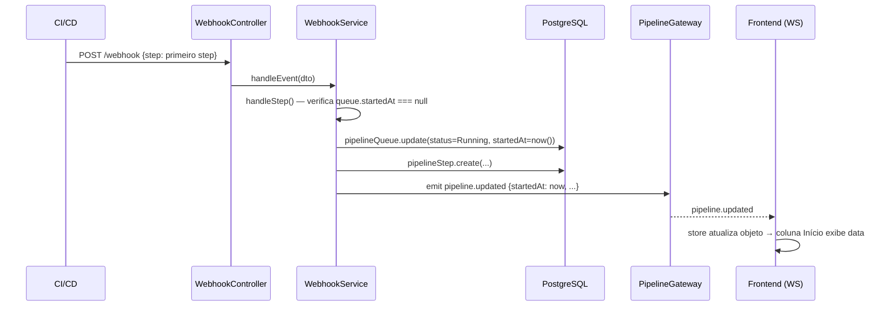
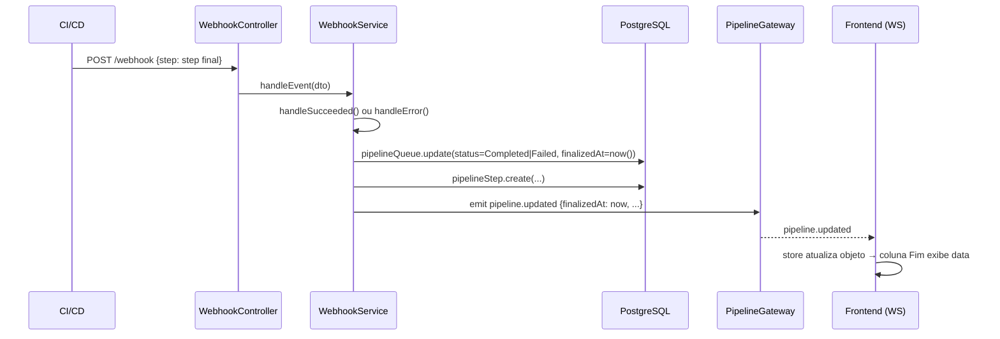
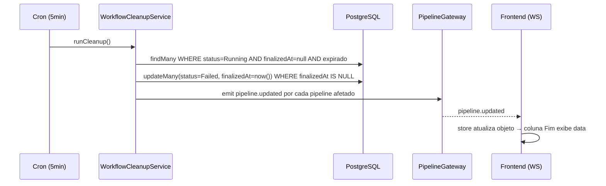
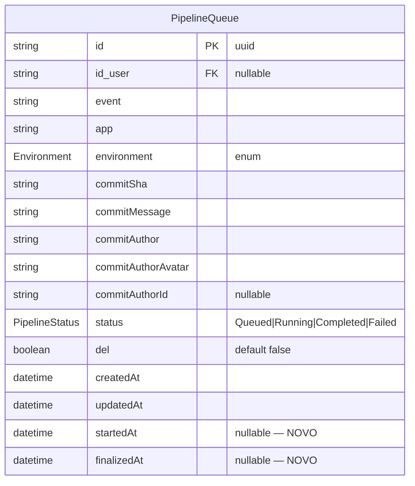
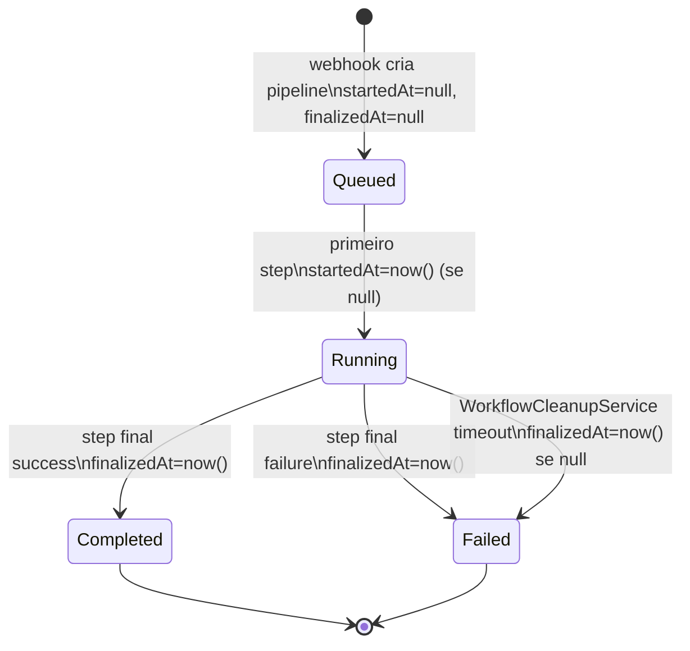
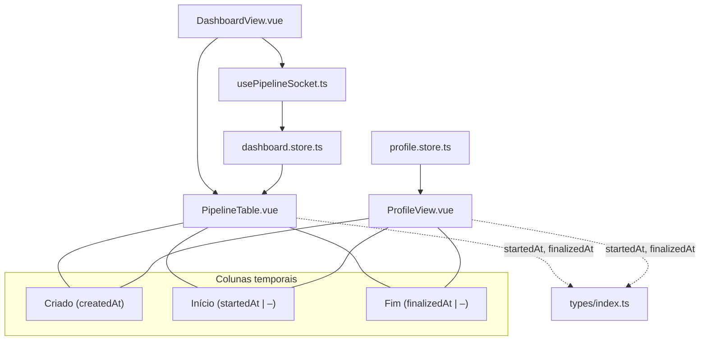

# pipeline-queue-timestamps — Documentação de Implementação

> Ground-truth derivado do código real (Phase 4 — 2026-06-05).

---

## §1 Visão Geral

Esta feature é **cross-cutting**: não introduz módulo novo. Adiciona os campos `startedAt` e `finalizedAt` à tabela `pipeline_queue` já existente, permitindo medir tempo de espera na fila e duração de execução de cada pipeline.

Módulos tocados:

| Camada | Arquivo(s) modificado(s) |
|---|---|
| Schema | `server/prisma/schema.prisma` + migration |
| DTO Backend | `server/src/pipeline-queue/dto/pipeline-queue-response.dto.ts` |
| Lógica Backend | `server/src/webhook/webhook.service.ts` |
| Cron Backend | `server/src/workflow-cleanup/workflow-cleanup.service.ts` |
| Tipo Frontend | `frontend/src/types/index.ts` |
| Componente Vue | `frontend/src/components/PipelineTable.vue` |
| View Vue | `frontend/src/views/ProfileView.vue` |

Nenhum endpoint HTTP novo foi criado. Nenhum manifesto k8s foi alterado.

---

## §2 API Pública (Backend)

### Endpoints afetados

Todos os endpoints que retornam `PipelineQueueResponseDto` passam a incluir os dois novos campos:

| Endpoint | Mudança |
|---|---|
| `GET /pipeline-queue` | resposta inclui `startedAt`, `finalizedAt` por item |
| `GET /pipeline-queue/:id` | resposta inclui `startedAt`, `finalizedAt` |
| `GET /pipeline-queue/mine` | resposta paginada inclui `startedAt`, `finalizedAt` por item |
| `PATCH /pipeline-queue/:id` | resposta inclui `startedAt`, `finalizedAt` |

Nenhum endpoint novo.

### Campos adicionados a `PipelineQueueResponseDto`

| Campo | Tipo | Nullable | Decorador Swagger | Exemplo |
|---|---|---|---|---|
| `startedAt` | `Date \| null` | sim | `@ApiPropertyOptional` | `"2024-01-01T00:00:00.000Z"` |
| `finalizedAt` | `Date \| null` | sim | `@ApiPropertyOptional` | `"2024-01-01T00:01:00.000Z"` |

Ambos têm `@Expose()` do class-transformer. A serialização segue o mesmo pipeline já existente para `createdAt`.

---

## §2b Frontend

### Interface `PipelineQueue` (`frontend/src/types/index.ts`)

```ts
startedAt: string | null;
finalizedAt: string | null;
```

Adicionados ao final da interface existente. Consistentes com `createdAt: string` (formato ISO-8601 string vindo da API).

### `PipelineTable.vue`

Colunas do `<thead>`:

| Label | `data-test` (header) | Campo | Fallback null |
|---|---|---|---|
| Criado | — | `createdAt` | N/A (sempre presente) |
| Início | `col-header-started-at` | `startedAt` | `–` |
| Fim | `col-header-finalized-at` | `finalizedAt` | `–` |

Células do `<tbody>`:

| `data-test` (célula) | Valor |
|---|---|
| `created-at` | `toLocaleString('pt-BR')` |
| `started-at` | `toLocaleString('pt-BR')` ou `–` |
| `finalized-at` | `toLocaleString('pt-BR')` ou `–` |

O `colspan` da linha de estado vazio foi atualizado de 9 para 10.

### `ProfileView.vue` — tabela de histórico

A tabela de histórico (`data-test="history-table"`) usa template inline (sem reutilizar `PipelineTable.vue`) e implementa as mesmas três colunas:

| `data-test` header | Label | `data-test` célula | Formatação |
|---|---|---|---|
| — | Criado | `created-at` | `toLocaleString('pt-BR', { dateStyle:'short', timeStyle:'short' })` |
| `col-header-started-at` | Início | `started-at` | idem ou `–` |
| `col-header-finalized-at` | Fim | `finalized-at` | idem ou `–` |

`colspan` da linha vazia (`data-test="history-empty"`): 8 colunas.

A view usa `profileStore.history` (array `PipelineQueue[]`). Os campos chegam via `GET /pipeline-queue/mine` que já retorna `startedAt`/`finalizedAt`.

---

## §3 Modelo de Dados

### Migration

Nome: `add_timestamps_to_pipeline_queue`

Adiciona duas colunas nullable sem default forçado — registros existentes ficam com `NULL` (backward-compatible).

### Schema Prisma (`model PipelineQueue`)

```prisma
startedAt   DateTime?
finalizedAt DateTime?
```

| Campo | Tipo Prisma | Nullable | Default | Índice |
|---|---|---|---|---|
| `startedAt` | `DateTime` | sim | `null` | não |
| `finalizedAt` | `DateTime` | sim | `null` | não |

---

## §4 Arquitetura do Sistema

### Sequência 1 — Primeiro step recebido (Queued → Running)



### Sequência 2 — Step final recebido (Running → Completed/Failed)



### Sequência 3 — Timeout via cron (WorkflowCleanupService)



---

## §5 ERD (campos novos)



---

## §6 Máquina de Estados com Timestamps



---

## §7 Comportamento de Idempotência

### `WebhookService.handleStep()` — `startedAt`

```
if (queue.startedAt === null) {
  payload.startedAt = new Date()
}
```

Garante que retentativas de webhook não sobrescrevam o timestamp original de início.

### `WorkflowCleanupService` — `finalizedAt`

O `findMany` de pipelines expirados inclui `finalizedAt: null` no `WHERE`. O `update` inclui `finalizedAt: new Date()` junto ao `status: PipelineStatus.Failed`. Garante que pipelines já finalizados via webhook não tenham `finalizedAt` sobrescrito pelo cron.

---

## §8 Hierarquia de Componentes Frontend



---

## §9 Atualização Reativa via WebSocket

O evento `pipeline.updated` emitido por `PipelineGateway` carrega o objeto `PipelineQueue` atualizado. `dashboard.store.ts` já trata `handleSocketUpdated` substituindo o item pelo `id` no array `pipelines`. Como `startedAt` e `finalizedAt` fazem parte do DTO serializado, os campos atualizam automaticamente nas tabelas sem reload de página.

`ProfileView.vue` não conecta WebSocket diretamente (histórico paginado). A coluna Início/Fim reflete o estado no momento do carregamento da página.

---

## §10 Notas Operacionais

- **Migration em produção:** `prisma migrate deploy` roda no startup do container (processo existente). Não requer downtime — `ALTER TABLE ADD COLUMN` com nullable é operação online no PostgreSQL 16.
- **Registros históricos:** `startedAt` e `finalizedAt` serão `NULL` para todos os pipelines criados antes da migration. Frontend exibe `–` nesses casos — comportamento correto por design.
- **Sem N+1:** Os campos são colunas escalares no modelo `PipelineQueue`. Nenhuma relação extra foi adicionada; os campos chegam no mesmo `prisma.pipelineQueue.findMany/findUnique` já existente.
- **Consistência de formatação:** Todas as células de data usam `toLocaleString('pt-BR', { dateStyle: 'short', timeStyle: 'short' })`, alinhado ao padrão existente de `createdAt` nas views.

---

## §11 Testes

### Backend
| Arquivo | Coberturas |
|---|---|
| `server/src/webhook/__tests__/webhook.service.spec.ts` | AC-2, AC-3, AC-4, AC-5 |
| `server/src/workflow-cleanup/__tests__/workflow-cleanup.service.spec.ts` | AC-6, AC-7 |
| `server/test/pipeline-queue-timestamps.e2e-spec.ts` | AC-1, AC-8, AC-9 |

### Frontend
| Arquivo | Coberturas |
|---|---|
| `frontend/src/components/__tests__/PipelineTable.spec.ts` | AC-10, AC-11, AC-12, AC-13, AC-14 |
| `frontend/src/views/__tests__/ProfileView.spec.ts` | AC-15 |
| `frontend/e2e/pipeline-queue-timestamps.spec.ts` | AC-16, AC-17, AC-18 |

---

## §12 Drift do Spec

**Nenhum drift relevante.** A implementação atende todos os ACs do spec. Observação menor: o spec (FR-4/AC-7) menciona que `WorkflowCleanupService` "só seta `finalizedAt` se ainda é `null`" — na implementação, isso é garantido pelo filtro `finalizedAt: null` no `findMany` (não por um check no `update`), o que é semanticamente equivalente e igualmente idempotente.
