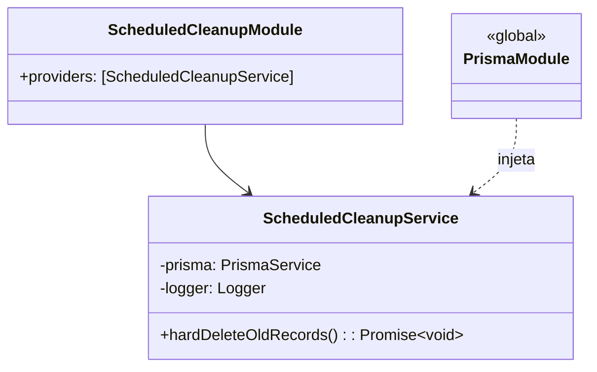
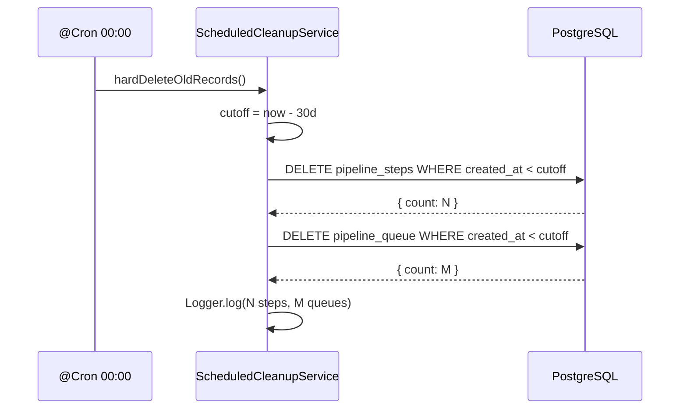

# Scheduled Cleanup

> **Status:** stable
> **Spec:** docs/specs/scheduled-cleanup.md
> **Backend:** server/src/scheduled-cleanup/

## 1. Overview

Executa hard delete diário (00:00) de todos os registros de `PipelineQueue` e `PipelineStep` com `createdAt` anterior a 30 dias. Previne crescimento ilimitado do banco de dados. Sem endpoint HTTP, sem frontend, sem alteração de schema.

## 2. Public API (HTTP)

None — módulo sem controller.

## 2b. Frontend pages & components

None — backend-only.

## 3. Module surface

```typescript
// Importar em AppModule:
import { ScheduledCleanupModule } from './scheduled-cleanup/scheduled-cleanup.module';

@Module({
  imports: [
    // ...
    ScheduledCleanupModule,
  ],
})
```

| Campo | Valor |
|---|---|
| providers | `ScheduledCleanupService` |
| imports | `[]` (usa `PrismaModule` global) |
| exports | `[]` (leaf module) |

Pré-requisito: `ScheduleModule.forRoot()` registrado no `AppModule` (já presente).

## 4. System architecture





## 5. Data model

Sem alterações de schema. Modelos consumidos:

```mermaid
erDiagram
    PipelineQueue ||--o{ PipelineStep : "id_pipeline_queue"
    PipelineQueue { string id PK; datetime createdAt }
    PipelineStep  { string id PK; string id_pipeline_queue FK; datetime createdAt }
```

## 6. DTOs

None — sem endpoints HTTP.

## 7. Configuration

| Chave | Tipo | Default | Obrigatório | Ausente |
|---|---|---|---|---|
| — | — | — | — | Sem variáveis de ambiente adicionais |

Período de retenção hardcoded: `30 * 24 * 60 * 60 * 1000` ms.

## 8. Dependencies

| Dep | Tipo | Motivo |
|---|---|---|
| `PrismaService` | interna (global) | acesso a `pipelineStep` e `pipelineQueue` |
| `@nestjs/schedule` | externa | `@Cron` decorator + `ScheduleModule` |
| `@nestjs/common` | externa | `Injectable`, `Logger` |

## 9. Extension points

None — sem interfaces swappáveis, sem eventos emitidos.

## 10. Errors

| Exceção | Trigger | Comportamento |
|---|---|---|
| Qualquer erro Prisma | DB indisponível ou FK violation | Capturado no `try/catch`; `Logger.error` chamado; Promise resolve sem propagar |

Ordem de deleção garante integridade FK: `PipelineStep` antes de `PipelineQueue`.

## 11. Operational notes

- **Idempotência:** re-executar não causa erro — registros já deletados simplesmente não existem.
- **Janela de 30 dias:** critério `lt` (estrito), registros com exatamente 30 dias não são deletados.
- **Falha parcial:** steps deletados não são revertidos se queues falharem. Na próxima execução, queues sem steps orphan serão deletadas normalmente.
- **Observabilidade:** checar logs com `[ScheduledCleanupService]` para counts diários.
- **Performance:** `deleteMany` em tabelas grandes pode ser lento; sem batching por ora.

## 12. Spec drift

Nenhum drift — implementação alinhada com spec.

## 13. Changelog

| Data | Tipo | Descrição |
|---|---|---|
| 2026-05-22 | feat | Implementação inicial — hard delete diário de PipelineQueue + PipelineStep > 30 dias |
