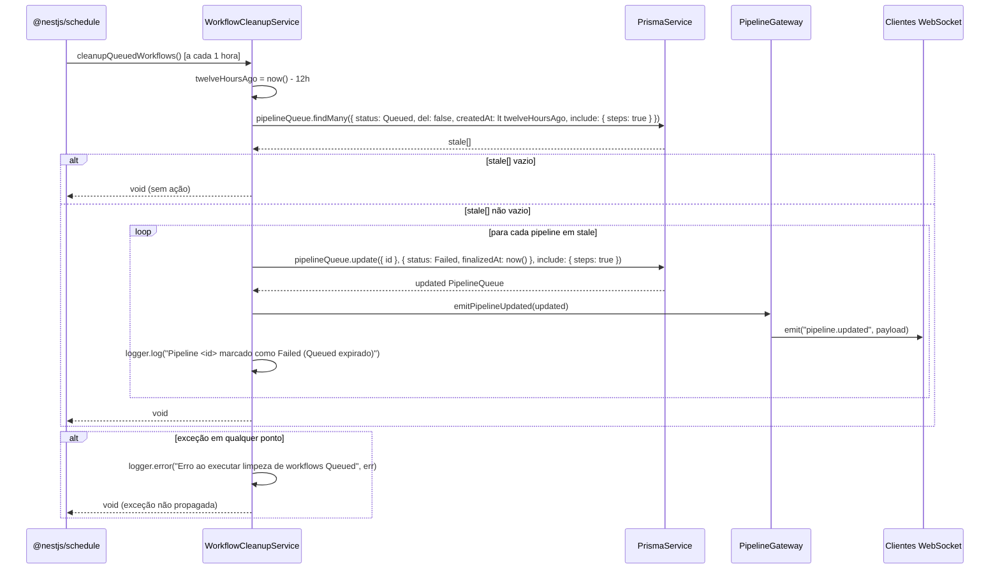
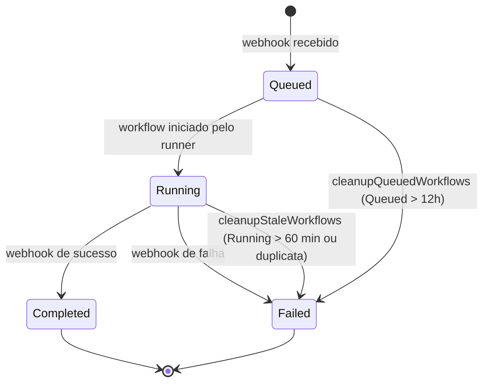
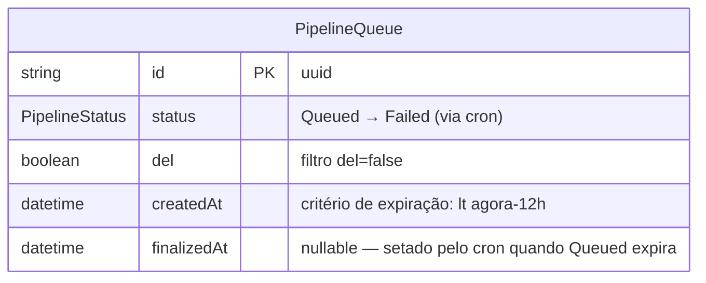

# Implementação: workflow-queued-timeout

## §1 Visão Geral

A feature `workflow-queued-timeout` estende o `WorkflowCleanupService` existente com um segundo cron job — `cleanupQueuedWorkflows()` — dedicado a pipelines presos no estado `Queued`. O serviço já possuía `cleanupStaleWorkflows()` para tratar pipelines `Running` expirados (threshold: 60 min, cron: `EVERY_5_MINUTES`). O novo método cobre o caso em que o runner de CI falha silenciosamente antes mesmo de iniciar a execução, deixando entradas `Queued` indefinidamente no dashboard.

**Comportamento:** a cada hora, o cron consulta `PipelineQueue` com `status = Queued`, `del = false` e `createdAt < agora - 12h`. Cada registro encontrado é atualizado para `status = Failed`, `finalizedAt = now()`, e o evento `pipeline.updated` é emitido via WebSocket para atualização em tempo real do dashboard. Erros são capturados e logados sem propagação.

**Nenhum módulo novo foi criado.** O método foi adicionado diretamente ao `WorkflowCleanupService` e o `WorkflowCleanupModule` permaneceu inalterado.

---

## §2 API HTTP

Nenhum endpoint HTTP exposto. Feature backend-only sem surface HTTP.

---

## §2b Frontend

Nenhuma alteração em componentes Vue, stores Pinia ou composables. O status `Failed` já era renderizado corretamente pelo `StatusBadge.vue` existente.

---

## §3 Superfície do Módulo

`WorkflowCleanupModule` não foi alterado:

```
WorkflowCleanupModule
  imports: [GatewayModule]         ← já presente antes desta feature
  providers: [WorkflowCleanupService]
  exports: (nenhum — leaf module)
```

`WorkflowCleanupService` passou a expor dois métodos cron:
- `cleanupStaleWorkflows()` — `@Cron(EVERY_5_MINUTES)` — Running expirado/duplicata
- `cleanupQueuedWorkflows()` — `@Cron(EVERY_HOUR)` — Queued expirado > 12h _(novo)_

---

## §4 Arquitetura

### Diagrama de Sequência — `cleanupQueuedWorkflows()`



### Máquina de Estados — `PipelineStatus`



A transição `Queued → Failed` via cron é terminal — nenhuma saída de `Failed`. Somente `cleanupQueuedWorkflows()` pode realizar esta transição específica.

### Fluxo de Decisão do Cron

```mermaid
flowchart TD
    A[Cron dispara a cada 1h] --> B{findMany: status=Queued, del=false, createdAt lt agora-12h}
    B -->|lista vazia| C[Retorna void — sem log, sem emit]
    B -->|lista não vazia| D[Para cada pipeline na lista]
    D --> E[update: status=Failed, finalizedAt=now]
    E --> F[emitPipelineUpdated]
    F --> G[logger.log Pipeline id marcado como Failed Queued expirado]
    G -->|próximo item| D
    D -->|lista esgotada| H[Retorna void]
    B -->|exceção| I[logger.error]
    I --> J[Retorna void — sem propagação]
    E -->|exceção| I
    F -->|exceção| I
```



---

## §5 Modelo de Dados

Nenhuma alteração de schema. Os campos consumidos e escritos já existiam em `PipelineQueue`:

| Campo | Tipo | Uso |
|---|---|---|
| `status` | `PipelineStatus` enum | Filtrado em `Queued`; atualizado para `Failed` |
| `del` | `Boolean` | Filtrado em `false` — registros deletados são ignorados |
| `createdAt` | `DateTime` | Critério de expiração: `lt agora - 12h` |
| `finalizedAt` | `DateTime?` | Nullable; setado para `now()` na transição Queued→Failed |



---

## §6 DTOs

Nenhum DTO novo. O payload emitido pelo `emitPipelineUpdated` é o objeto Prisma `PipelineQueue` com `include: { steps: true }`, idêntico ao utilizado por `cleanupStaleWorkflows()`.

---

## §7 Configuração

Nenhuma variável de ambiente nova. Todos os valores são hardcoded no serviço:

| Parâmetro | Valor | Localização |
|---|---|---|
| Intervalo do cron | `CronExpression.EVERY_HOUR` = `'0 0-23/1 * * *'` | Decorator `@Cron` em `cleanupQueuedWorkflows()` |
| Threshold de expiração | `12 * 60 * 60 * 1000` ms (12 horas) | `const twelveHoursAgo = new Date(Date.now() - 12 * 60 * 60 * 1000)` |

---

## §8 Dependências

| Dependência | Tipo | Como usada |
|---|---|---|
| `PrismaService` | `@Global()` provider | `findMany` (busca Queued expirados) + `update` (marca Failed + finalizedAt) |
| `PipelineGateway` | Exportado por `GatewayModule` | `emitPipelineUpdated(updated)` — emite `pipeline.updated` no namespace `/pipeline` |
| `@nestjs/schedule` | Pacote npm | Decorator `@Cron(CronExpression.EVERY_HOUR)` — agendamento do job |

`@nestjs/schedule` é registrado globalmente em `AppModule` via `ScheduleModule.forRoot()` — nenhuma importação adicional necessária em `WorkflowCleanupModule`.

---

## §9 Pontos de Extensão

Nenhum. A feature foi projetada como extensão simples ao serviço existente. Threshold e intervalo de cron são hardcoded intencionalmente (§4 do spec: `NFR-4`).

---

## §10 Tratamento de Erros

O bloco `try/catch` envolve todo o método:

```
try {
  findMany → loop → update → emit → log
} catch (err) {
  logger.error('Erro ao executar limpeza de workflows Queued', err)
  // retorna void — sem propagação
}
```

- Falha em `findMany`: capturada → logada → cron retorna void → próxima execução agendada normalmente.
- Falha em `update` ou `emit` para um pipeline individual: capturada pelo `try/catch` externo → interrompe o loop restante → logada → retorna void.
- O DB pode estar correto (update ok) enquanto o emit falha — o dashboard atualiza na próxima recarga ou próxima execução do cron.

---

## §11 Notas Operacionais

### Idempotência

Pipelines já marcados `Failed` pelo cron em uma execução anterior são excluídos automaticamente pelo filtro `status: PipelineStatus.Queued`. Não há risco de double-processing.

Pipelines com `del = true` também são excluídos pelo filtro `del: false`.

### Observabilidade

- **Por pipeline processado:** `logger.log('Pipeline ${id} marcado como Failed (Queued expirado)')` — rastreável em logs do pod `api`.
- **Em caso de erro:** `logger.error('Erro ao executar limpeza de workflows Queued', err)` — inclui stack trace via segundo argumento.
- O prefixo do logger é `WorkflowCleanupService` (nome da classe via `new Logger(WorkflowCleanupService.name)`).

### Concorrência

`@nestjs/schedule` não executa instâncias concorrentes do mesmo job por padrão. Se uma execução demorar mais que 1 hora, a próxima não se sobrepõe — sem race condition.

### Volume e performance

A query `findMany` com `createdAt: { lt: twelveHoursAgo }` opera em índice temporal. Em condições normais (runners saudáveis), a lista retornada será vazia e o loop não executa. O impacto operacional é mínimo.

---

## §12 Drift do Spec

O spec (`docs/specs/workflow-queued-timeout.md`) menciona `CronExpression.EVERY_HOUR` sem especificar o valor expandido. Conforme verificado no código real, `CronExpression.EVERY_HOUR` do pacote `@nestjs/schedule` compila para `'0 0-23/1 * * *'` — não `'0 * * * *'`. Funcionalmente ambos disparam nos minutos `:00` de cada hora, porém a expressão real usa a notação de range `0-23/1` em vez do caractere curinga `*`. Sem impacto de comportamento.

---

## §13 Changelog

| Data | Autor | Tipo | Descrição |
|---|---|---|---|
| 2026-06-08 | pedro-php | feat | Implementação inicial: `cleanupQueuedWorkflows()` — cron `EVERY_HOUR`; Queued > 12h → Failed + `finalizedAt` + `pipeline.updated` emitido |
