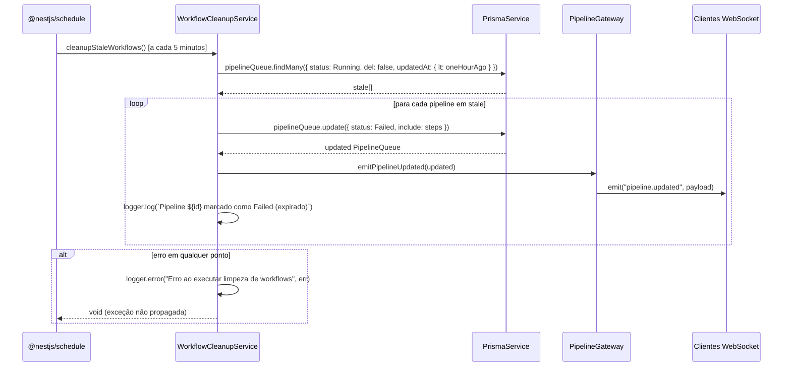
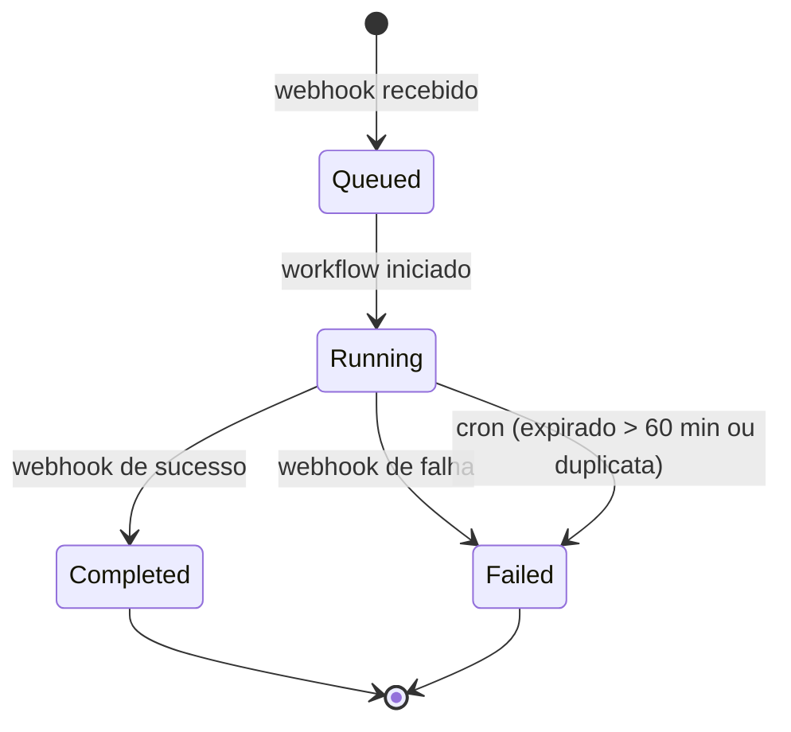
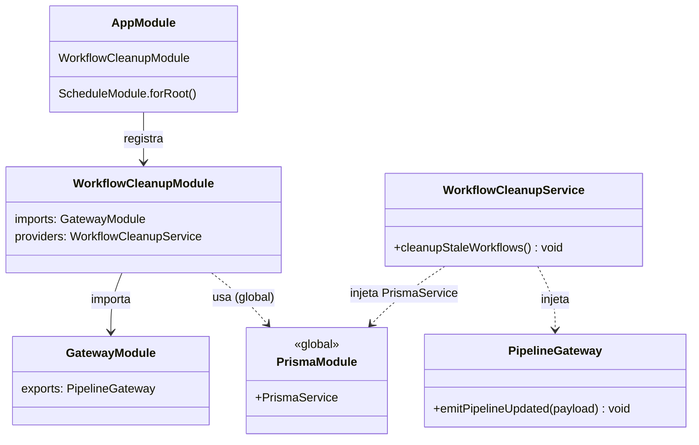

# Workflow Timeout — Documentação de Implementação

> **Ground-truth derivado do código real (Phase 4 — 2026-05-22).**
> Spec original: [`docs/specs/workflow-timeout.md`](../specs/workflow-timeout.md)

---

## §1. Overview

A feature **Workflow Timeout** resolve o problema de pipelines "zumbis": entradas com `status = Running` que ficaram presas indefinidamente por falha em webhooks ou instabilidade de infraestrutura. Sem este mecanismo o dashboard exibia pipelines ativos falsos e bloqueava novos deployments válidos.

A solução é um **cron job interno** — sem endpoints HTTP — executado a cada **5 minutos** dentro do container `api` existente (via `@nestjs/schedule`). O job aplica uma regra única:

**Expiração por tempo:** pipeline com `status = Running` cujo `updatedAt` é anterior a `agora - 60 minutos` → marcado `Failed`. O filtro é feito diretamente na query ao banco (`updatedAt: { lt: oneHourAgo }`), sem processamento em memória.

Após cada marcação, o evento `pipeline.updated` é emitido via WebSocket para que o dashboard seja atualizado em tempo real sem recarga de página.

Nenhum recurso Kubernetes foi adicionado ou modificado; o cron roda inteiramente dentro do container `api` já existente.

---

## §2. API Pública

**Nenhum endpoint HTTP exposto.** O serviço opera exclusivamente via cron job interno.

### WebSocket — evento emitido

| Namespace | Evento | Payload | Emitido quando |
|---|---|---|---|
| `/pipeline` | `pipeline.updated` | `PipelineQueue` com `steps[]` incluídos | A cada pipeline marcado como `Failed` (expirado) pelo cron |

O payload é o objeto Prisma `PipelineQueue` com `include: { steps: true }`, transmitido diretamente via `PipelineGateway.emitPipelineUpdated()`.

---

## §2b. Alterações Frontend

Nenhuma rota Vue Router nova foi criada. As alterações são cirúrgicas em dois arquivos existentes:

### `frontend/src/components/StatusBadge.vue`

O status `Failed` já existe no `styleMap` e cobre pipelines expirados. A entrada `Timeout` foi removida.

### `frontend/src/types/index.ts`

O tipo union do campo `status` em `PipelineQueue` não inclui `'Timeout'`:

```ts
status: "Queued" | "Running" | "Completed" | "Failed";
```

---

## §3. Superfície do Módulo

`WorkflowCleanupModule` é um **leaf module** — não exporta nada. Importa apenas `GatewayModule` para acessar `PipelineGateway`; `PrismaService` é injetado automaticamente via `PrismaModule` global.

```ts
@Module({
  imports: [GatewayModule],
  providers: [WorkflowCleanupService],
})
export class WorkflowCleanupModule {}
```

O módulo é registrado em `AppModule` ao lado de `ScheduleModule.forRoot()`:

```ts
// server/src/app.module.ts (trecho)
imports: [
  ScheduleModule.forRoot(),
  // ...
  WorkflowCleanupModule,
]
```

`ScheduleModule.forRoot()` ativa o scheduler global da aplicação; qualquer `@Cron()` declarado em qualquer provider da aplicação passa a ser gerenciado por ele.

---

## §4. Arquitetura

### Diagrama de sequência — execução do cron job



### Fluxo de decisão interno

`cleanupStaleWorkflows()` é intencionalmente simples:

1. Buscar pipelines `Running` com `del: false` e `updatedAt < agora - 60min` em uma única query ao banco.
2. Para cada resultado, executar `update({ status: Failed })` + emitir `pipeline.updated`.
3. Qualquer erro é capturado no bloco `try/catch` externo — logado, não propagado.

---

## §5. Modelo de Dados

### Enum `PipelineStatus`

```prisma
enum PipelineStatus {
  Queued
  Running
  Completed
  Failed
}
```

`Timeout` foi removido do enum (refactor 2026-05-26). Pipelines expirados e duplicatas são agora marcados como `Failed`.

### Alterações no schema

| Artefato | Antes (original) | Atual |
|---|---|---|
| `PipelineStatus` | `Queued \| Running \| Completed \| Failed \| Timeout` | `Timeout` removido — apenas `Queued \| Running \| Completed \| Failed` |
| Novos models | — | nenhum |
| Novas colunas | — | nenhuma |

### Transições de estado



`Failed` por expiração é **terminal** — nenhuma transição sai dele. Somente o cron job pode realizar a transição `Running → Failed` por expiração.

---

## §6. Componentes

### Backend

| Artefato | Caminho | Responsabilidade |
|---|---|---|
| `WorkflowCleanupService` | `server/src/workflow-cleanup/workflow-cleanup.service.ts` | Cron `@Cron(EVERY_5_MINUTES)`; lógica de detecção e marcação |
| `WorkflowCleanupModule` | `server/src/workflow-cleanup/workflow-cleanup.module.ts` | Módulo NestJS; importa `GatewayModule`; registra `WorkflowCleanupService` |

### Frontend

| Artefato | Caminho | Alteração |
|---|---|---|
| `StatusBadge.vue` | `frontend/src/components/StatusBadge.vue` | Entrada `Timeout` adicionada ao `styleMap` |
| `types/index.ts` | `frontend/src/types/index.ts` | `'Timeout'` adicionado ao union type do campo `status` em `PipelineQueue` |

### Infra

Nenhum manifesto Kubernetes foi adicionado ou modificado. O cron roda dentro do container `api` existente.

---

## §7. Configuração

Nenhuma variável de ambiente nova foi adicionada.

| Parâmetro | Tipo | Valor | Onde |
|---|---|---|---|
| Intervalo do cron | constante | `EVERY_5_MINUTES` | `workflow-cleanup.service.ts` — `CronExpression.EVERY_5_MINUTES` |
| Threshold de expiração | constante | `60 * 60 * 1000` ms (60 min) | `workflow-cleanup.service.ts` — calculado inline como `new Date(Date.now() - 60 * 60 * 1000)` |

Ambos os parâmetros são **hardcoded** por decisão de projeto (spec NFR-4). Alterar o threshold exige edição do código-fonte e redeploy.

---

## §8. Dependências entre Módulos



`WorkflowCleanupModule` não exporta nada (leaf module). `PrismaService` está disponível sem import explícito pois `PrismaModule` é `@Global`.

---

## §9. Testes

### Critérios de aceitação cobertos

| AC | Camada | Descrição |
|---|---|---|
| AC-1 | Backend | Pipeline Running com `updatedAt` > 60 min → marcado Failed + evento emitido |
| AC-2 | Backend | Pipeline Running com `updatedAt` < 60 min → permanece Running |
| AC-3 | Backend | 2 pipelines Running: A (mais antigo) marcado Failed, B (mais novo) permanece |
| AC-4 | Backend | 3 pipelines Running: A e B marcados Failed, C permanece |
| AC-5 | Backend | Erro do Prisma → capturado, logado, aplicação não derruba |
| AC-6 | Frontend | `StatusBadge` renderiza `bg-danger` para status `'Failed'` (inclui expirados) |
| AC-7 | Frontend | TypeScript compila sem erro com union type sem `'Timeout'` |

### Localização dos testes

```
server/src/workflow-cleanup/__tests__/workflow-cleanup.service.spec.ts
server/test/workflow-cleanup.e2e-spec.ts
frontend/src/components/__tests__/StatusBadge.spec.ts
```

---

## §10. Tratamento de Erros

O bloco `try/catch` em `cleanupStaleWorkflows()` envolve toda a lógica do cron:

- **Qualquer exceção** (falha no Prisma, falha no emit WebSocket, etc.) é capturada no `catch`.
- O erro é registrado via `this.logger.error('Erro ao executar limpeza de workflows', err)`.
- A exceção **não é propagada** — o método retorna `void` normalmente.
- O scheduler programa a próxima invocação normalmente; não há backoff ou retry explícito.
- Efeito colateral de falha parcial: se o `update` Prisma persistiu mas o `emit` falhou, o banco está correto e o dashboard atualiza na próxima recarga ou próxima emissão.

---

## §11. Notas Operacionais

### Migration de banco de dados

O refactor `refactor-remove-timeout` gerou uma migration Prisma para remover o valor `Timeout` do enum `PipelineStatus` no PostgreSQL. Qualquer pipeline previamente marcado como `Timeout` deve ser migrado para `Failed` antes de aplicar esta migration.

**Ordem obrigatória no deploy:**

1. Migrar dados (se houver registros `Timeout`) **antes** de aplicar a migration de schema.
2. Aplicar a migration:
   ```bash
   npx prisma migrate deploy
   ```
3. Subir o container `api` com a nova imagem.

### Observabilidade

Logs produzidos pelo serviço:
- **INFO:** `Pipeline <id> marcado como Failed (expirado)` — para cada pipeline processado.
- **ERROR:** `Erro ao executar limpeza de workflows` + stack trace — em caso de falha.

Ambos saem pelo `Logger` padrão do NestJS (`WorkflowCleanupService` como contexto), capturados pelos coletores de log do container `api`.

---

## §12. Drift do Spec

| Item | Spec | Implementação real |
|---|---|---|
| Intervalo do cron | `@Cron(EVERY_MINUTE)` mencionado no §3 (Glossário) | `@Cron(CronExpression.EVERY_5_MINUTES)` — alinhado com FR-1/NFR-1 que explicitam "a cada 5 minutos". O Glossário continha erro; o código segue os requisitos funcionais. |
| Propagação de erros | AC-5 exige captura sem derrubar app | Implementado: `try/catch` único envolve todo o método; erro logado via `Logger.error`, não relançado. Alinhado. |
| Payload do emit | Spec menciona `PipelineQueueResponseDto` | Código usa o objeto Prisma diretamente com `include: { steps: true }`, sem conversão para DTO. `PipelineGateway.emitPipelineUpdated` aceita `any`. Comportamento funcional é equivalente pois `dashboard.store.ts` consome o objeto via WS e trata os campos diretamente. |

---

## §13. Changelog

| Data | Autor | Descrição |
|---|---|---|
| 2026-05-22 | pedro-php | Implementação inicial: `WorkflowCleanupService` com cron `EVERY_5_MINUTES`; enum `PipelineStatus.Timeout`; `StatusBadge.vue` atualizado; `types/index.ts` atualizado. |
| 2026-05-26 | pedro-php | Refactor `refactor-remove-timeout`: `PipelineStatus.Timeout` removido do schema Prisma e da migration. `WorkflowCleanupService` passa a marcar pipelines expirados/duplicatas como `Failed`. Frontend: entrada `Timeout` removida de `StatusBadge.vue` e do union type em `types/index.ts`. KPIs do dashboard passam a contabilizar pipelines expirados em `failed` e `errorRate`. |
