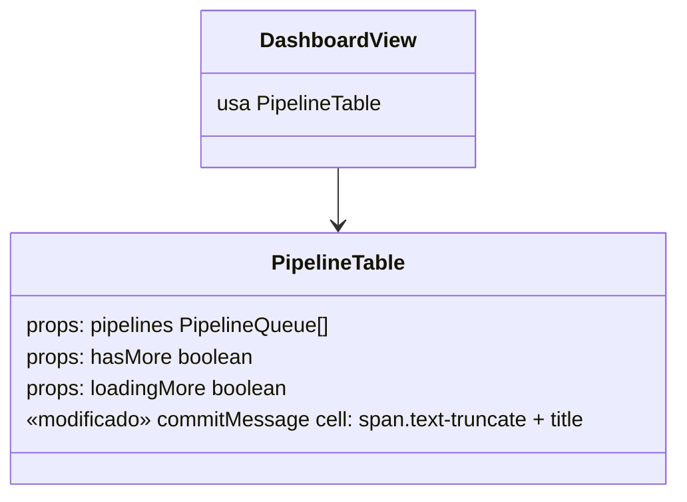
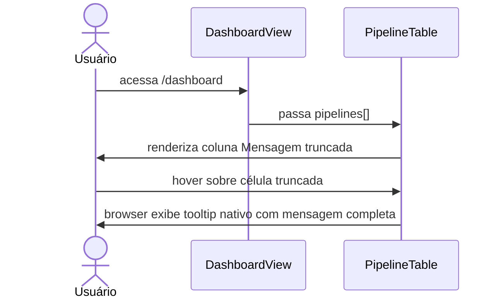
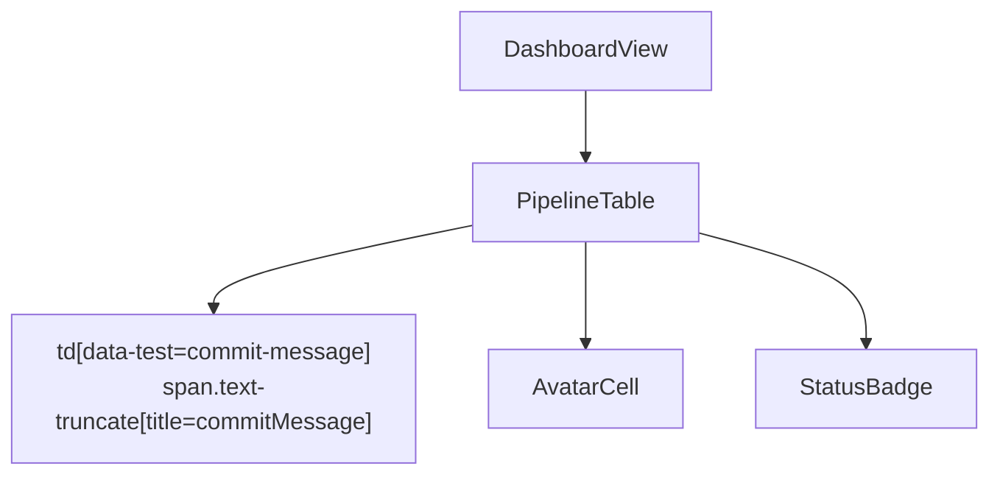

# Dashboard Message Tooltip

## 1. Context

A coluna "Mensagem" na tabela de pipelines do dashboard exibe o `commitMessage` completo sem truncamento. Mensagens longas transbordam a célula e poluem o layout. O objetivo é truncar visualmente o texto e exibir a mensagem completa via tooltip nativo ao passar o cursor, sem dependências novas.

**Usuários:** todos os usuários autenticados que acessam o dashboard.

---

## 2. Scope

**In scope:**
- Truncar `commitMessage` na coluna "Mensagem" da `PipelineTable` com `text-truncate` do Bootstrap 5.
- Exibir mensagem completa via atributo `title` nativo (tooltip do browser) ao hover.
- Largura máxima configurada para manter layout estável.

**Out of scope:**
- Tooltip customizado com componente JS/CSS próprio.
- Alterações em backend, schema Prisma, endpoints HTTP.
- Tooltip em outras colunas além de "Mensagem".
- Mudanças na `ProfileView` (histórico do usuário).

---

## 3. Glossary

| Termo | Definição |
|---|---|
| `commitMessage` | Campo `commitMessage` de `PipelineQueue`; mensagem do commit Git |
| tooltip nativo | Tooltip do navegador via atributo HTML `title` — sem JS adicional |
| `text-truncate` | Classe Bootstrap 5: `overflow: hidden; text-overflow: ellipsis; white-space: nowrap` |

---

## 4. Functional requirements

- **FR-1:** A célula `[data-test="commit-message"]` da `PipelineTable` exibe o `commitMessage` truncado com reticências quando excede 220px de largura.
- **FR-2:** O elemento de texto dentro de `[data-test="commit-message"]` possui atributo `title` com o valor completo de `commitMessage`.
- **FR-3:** Mensagens curtas (≤ largura máxima) são exibidas sem truncamento e sem reticências.

---

## 5. Non-functional requirements

- **NFR-1:** Zero impacto em performance — nenhuma nova dependência JS; sem watchers ou computed adicionais.
- **NFR-2:** Comportamento consistente em todos os browsers modernos (Chrome, Firefox, Safari, Edge).
- **NFR-3:** Nenhum CSS customizado — usar somente classes Bootstrap 5 existentes.

---

## 6. Data model

N/A — nenhuma alteração de schema. Campo `commitMessage: string` já existente em `PipelineQueue` (`frontend/src/types/index.ts`).

---

## 7. API contract

N/A — nenhum endpoint HTTP novo ou modificado.

| Named route | Path | Component | Auth |
|---|---|---|---|
| `dashboard` | `/dashboard` | `DashboardView.vue` | sim (existente) |

---

## 8. Module boundaries

---

## 9. Flows

---

## 10. State machines

N/A — nenhum campo de status envolvido.

---

## 11. Business rules

N/A — sem lógica de negócio; comportamento puramente visual.

---

## 12. Edge cases & error handling

- `commitMessage` vazio ou `undefined`: `title` fica vazio; célula mostra string vazia sem erro.
- Mensagem exatamente igual à largura máxima: sem truncamento, sem reticências.
- Mensagem com quebras de linha: o `white-space: nowrap` do `text-truncate` colapsa; tooltip nativo preserva quebras no browser.

---

## 13. Acceptance criteria

- **AC-1** `[frontend]`: Dado que `PipelineTable` recebe uma pipeline com `commitMessage` longo (> 220px), quando o componente renderiza, então o elemento `span` dentro de `[data-test="commit-message"]` possui classe `text-truncate` e `max-width: 220px`.
- **AC-2** `[frontend]`: Dado que `PipelineTable` recebe uma pipeline com `commitMessage = "fix: corrige bug crítico no deploy"`, quando o componente renderiza, então o atributo `title` do `span` dentro de `[data-test="commit-message"]` é igual a `"fix: corrige bug crítico no deploy"`.
- **AC-3** `[frontend]`: Dado que `PipelineTable` recebe uma pipeline com `commitMessage` vazio `""`, quando o componente renderiza, então o atributo `title` do `span` dentro de `[data-test="commit-message"]` é `""` e nenhum erro é lançado.

---

## 14. Open questions

N/A.

---

## 15. Frontend component hierarchy

---

## 16. Infra topology

N/A — nenhuma alteração em k8s.
