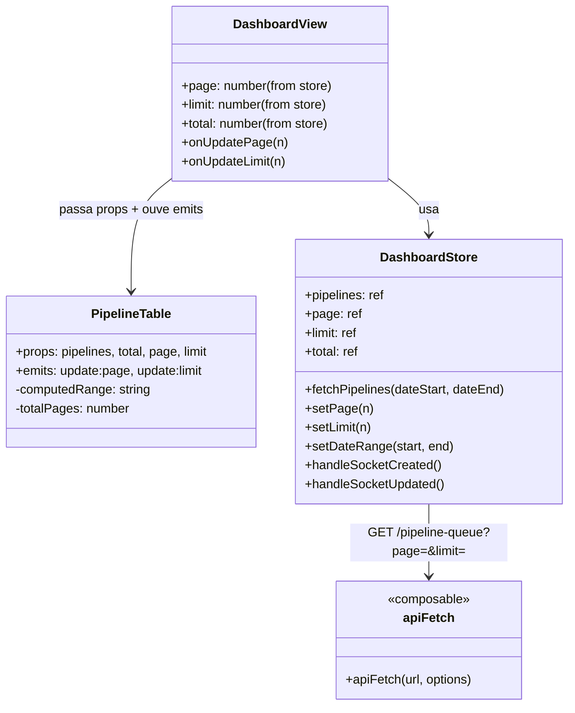
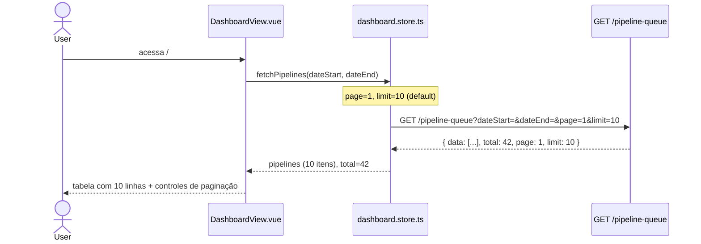
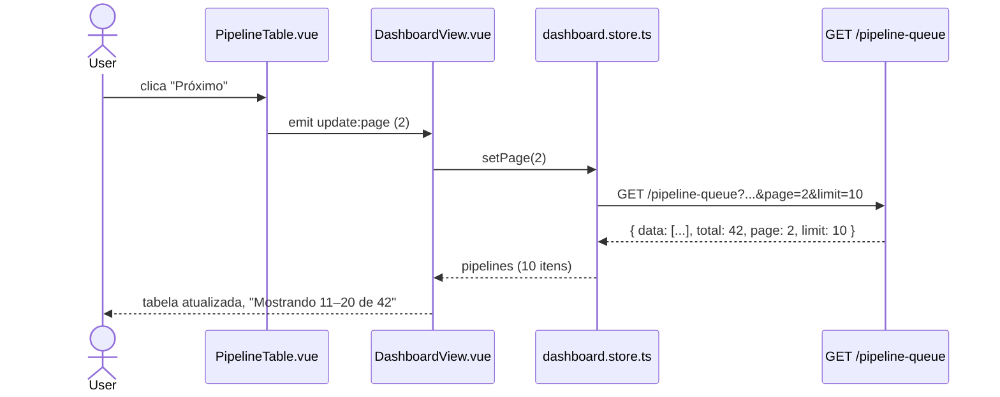
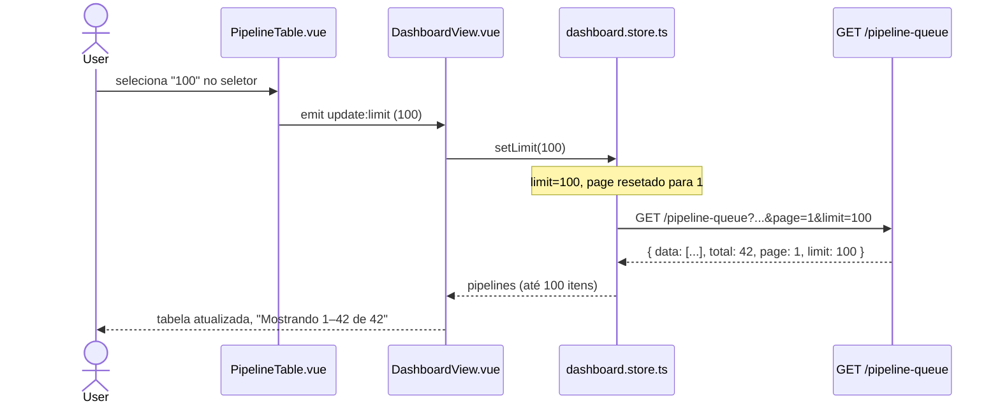
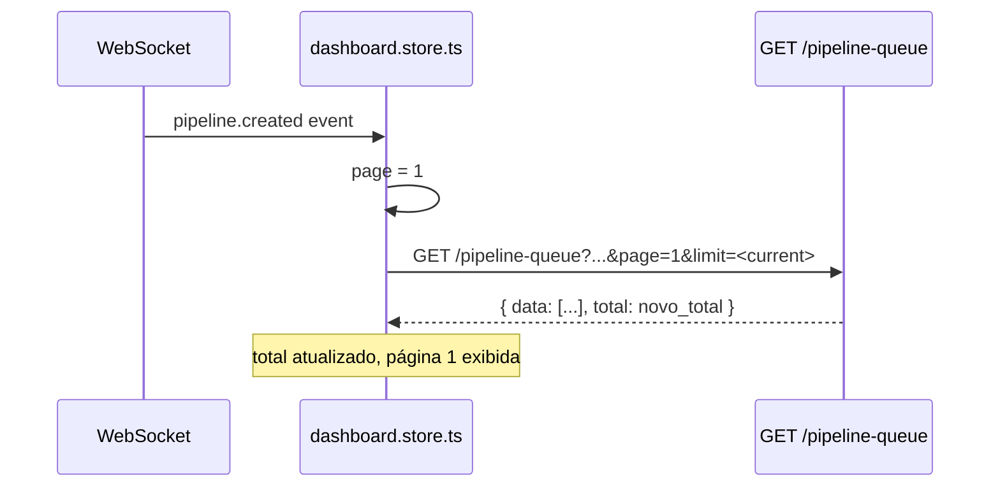
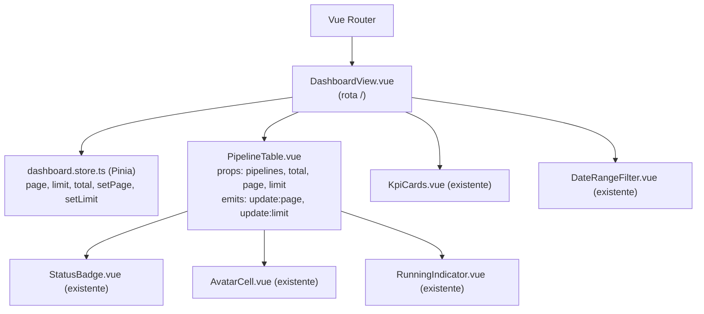

# Dashboard Pagination

## 1. Context

O dashboard exibe a tabela de pipelines (`PipelineTable.vue`) buscando **todos** os registros do intervalo de datas sem limitar quantidade. O backend (`GET /pipeline-queue`) já suporta paginação completa (`page`, `limit`, `skip/take`, retorna `{ data, total, page, limit }`), mas o frontend ignora esses campos: envia sem `page`/`limit` e atribui o array diretamente ao store. Com volumes altos de deploys a tabela cresce sem controle. Esta feature conecta a paginação existente no backend ao frontend, adicionando controles de página e seletor de itens por página (10 ou 100).

## 2. Scope

- **In scope**:
  - Enviar `page` e `limit` na requisição `GET /pipeline-queue` a partir do store
  - Armazenar `page`, `limit` e `total` no `dashboard.store.ts`
  - Ações `setPage(n)` e `setLimit(n)` no store
  - Controles de paginação em `PipelineTable.vue`: navegação anterior/próxima, indicador de posição ("Mostrando X–Y de Z"), seletor de itens por página (10 ou 100)
  - Reset para página 1 ao alterar filtro de data ou itens por página
  - Ajuste do handler `handleSocketCreated`: refetch da página 1 em vez de prepend (mantém contagem correta)

- **Out of scope**:
  - Paginação na tela de Perfil (`GET /pipeline-queue/mine`)
  - Novos filtros ou ordenação
  - Alterações no backend (endpoints, DTOs, Prisma)
  - Paginação de KPIs
  - Opção de itens por página além de 10 e 100

## 3. Glossary

- **page**: número da página atual (1-indexed)
- **limit**: quantidade de itens por página (10 ou 100)
- **total**: total de registros matching os filtros ativos, retornado pelo backend
- **totalPages**: `Math.ceil(total / limit)` — número de páginas disponíveis
- **PaginatedResponse**: shape `{ data: PipelineQueue[], total: number, page: number, limit: number }` retornado por `GET /pipeline-queue`

## 4. Functional requirements

- **FR-1**: O store `dashboard.store.ts` deve manter estado reativo de `page` (número, default `1`), `limit` (número, default `10`) e `total` (número, default `0`).
- **FR-2**: `fetchPipelines(dateStart, dateEnd)` deve incluir `page` e `limit` como query params na requisição `GET /pipeline-queue`.
- **FR-3**: Após a resposta, `pipelines` deve ser atribuído com `res.data` e `total` com `res.total`.
- **FR-4**: A ação `setPage(n: number)` deve atualizar `page` para `n` e chamar `fetchPipelines` com as datas atuais.
- **FR-5**: A ação `setLimit(n: number)` deve atualizar `limit` para `n`, resetar `page` para `1` e chamar `fetchPipelines` com as datas atuais.
- **FR-6**: Ao alterar o filtro de datas (`setDateRange`), `page` deve ser resetado para `1` antes do fetch.
- **FR-7**: `handleSocketCreated` deve chamar `fetchPipelines` na página 1 (em vez de fazer prepend manual), garantindo contagem e ordem corretas.
- **FR-8**: `PipelineTable.vue` deve aceitar as props `total: number`, `page: number`, `limit: number` e emitir `update:page` e `update:limit`.
- **FR-9**: O componente deve exibir, no rodapé da tabela, o texto "Mostrando X–Y de Z" onde X = `(page-1)*limit + 1`, Y = `min(page*limit, total)`, Z = `total`. Quando `total = 0`, exibir "Mostrando 0 de 0".
- **FR-10**: O componente deve exibir botões "Anterior" e "Próximo". "Anterior" fica desabilitado na página 1; "Próximo" fica desabilitado na última página (`page >= totalPages`).
- **FR-11**: O componente deve exibir um `<select>` com opções `10` e `100`. O valor selecionado reflete `limit`. Ao mudar, emite `update:limit` com o valor numérico.
- **FR-12**: `DashboardView.vue` deve passar `dashboardStore.page`, `dashboardStore.limit` e `dashboardStore.total` para `PipelineTable` e tratar `@update:page` chamando `dashboardStore.setPage` e `@update:limit` chamando `dashboardStore.setLimit`.

## 5. Non-functional requirements

- **NFR-1**: Nenhuma chamada de rede extra além do `fetchPipelines` já existente — paginação reutiliza o mesmo endpoint e composable `apiFetch`.
- **NFR-2**: Controles de paginação visualmente consistentes com Bootstrap 5 (`btn btn-outline-secondary btn-sm`, `form-select form-select-sm`).
- **NFR-3**: Não introduzir dependências novas no frontend.

## 6. Data model

Nenhuma alteração de schema. O `PaginatedResponse` já existe no backend. No frontend, os novos campos do store:

| Campo | Tipo | Default | Descrição |
|---|---|---|---|
| `page` | `number` | `1` | Página atual |
| `limit` | `number` | `10` | Itens por página |
| `total` | `number` | `0` | Total de registros retornados pelo backend |

## 7. API contract

### Backend — sem alterações

`GET /pipeline-queue` já aceita e retorna:

**Query params utilizados**:
- `page` (number, default `1`)
- `limit` (number, default `10`)
- `dateStart` (ISO string)
- `dateEnd` (ISO string)

**Response shape** (`PaginatedResponse`):
```json
{
  "data": [ /* PipelineQueue[] */ ],
  "total": 42,
  "page": 1,
  "limit": 10
}
```

### Frontend — rotas Vue Router

Nenhuma rota nova. Feature modifica componentes/store da rota existente:

| Named route | Path | Componente | Auth | Descrição |
|---|---|---|---|---|
| `dashboard` (existente) | `/` | `DashboardView.vue` | sim | Tabela de pipelines com paginação |

## 8. Module boundaries



## 9. Flows

### Carregamento inicial do dashboard



### Navegação de página



### Troca de itens por página



### Novo pipeline via WebSocket



## 10. State machines

N/A — nenhuma nova entidade com ciclo de vida. `page` e `limit` são scalars reativos sem estado de transição.

## 11. Business rules / decision logic

```mermaid
flowchart TD
    A([Usuário interage com paginação]) --> B{Tipo de ação}
    B -->|Clica Anterior| C{page > 1?}
    C -->|Sim| D[setPage(page - 1)]
    C -->|Não| E[Botão desabilitado — sem ação]
    B -->|Clica Próximo| F{page < totalPages?}
    F -->|Sim| G[setPage(page + 1)]
    F -->|Não| H[Botão desabilitado — sem ação]
    B -->|Muda seletor| I[setLimit(novoValor) → page=1]
    B -->|Muda filtro data| J[page=1 → fetchPipelines]
    D --> K[fetchPipelines com nova page]
    G --> K
    I --> K
    J --> K
```

## 12. Edge cases & error handling

- **total = 0**: "Mostrando 0 de 0", botões Anterior e Próximo desabilitados, `totalPages = 0` (ou 1 por floor).
- **total <= limit**: apenas uma página — Anterior e Próximo ambos desabilitados.
- **page > totalPages após mudança de filtro**: `setDateRange` reseta `page = 1` antes do fetch.
- **Y > total no range text**: `Y = min(page * limit, total)` — garante que não exiba número maior que total.
- **WebSocket created enquanto não está na página 1**: refetch sempre na página 1, o usuário vê o item novo. Não tenta fazer merge manual.
- **WebSocket updated**: continua atualizando in-place o item na página atual (sem mudança de comportamento).
- **Erro de fetch**: comportamento atual do store mantido (erro propagado, `pipelines` não alterado).

## 13. Acceptance criteria

- **AC-1** `[frontend]`: Dado que `dashboard.store.ts` é inicializado, quando nenhuma ação é tomada, então `page = 1`, `limit = 10` e `total = 0`.
- **AC-2** `[frontend]`: Dado que `fetchPipelines` é chamado, quando a resposta da API retorna `{ data, total, page, limit }`, então `pipelines.value = data` e `total.value = res.total`.
- **AC-3** `[frontend]`: Dado que `fetchPipelines` é chamado com `page=2` e `limit=10`, quando a requisição é feita, então a URL inclui `page=2&limit=10`.
- **AC-4** `[frontend]`: Dado `page=2`, quando `setPage(3)` é chamado, então `page.value = 3` e `fetchPipelines` é invocado.
- **AC-5** `[frontend]`: Dado `limit=10` e `page=3`, quando `setLimit(100)` é chamado, então `limit.value = 100`, `page.value = 1` e `fetchPipelines` é invocado.
- **AC-6** `[frontend]`: Dado `page=2`, quando `setDateRange` é chamado, então `page` é resetado para `1` antes do fetch.
- **AC-7** `[frontend]`: Dado um evento `pipeline.created` no WebSocket, quando `handleSocketCreated` é chamado, então `page` é setado para `1` e `fetchPipelines` é invocado (sem prepend manual).
- **AC-8** `[frontend]`: Dado `PipelineTable` com `total=42`, `page=2`, `limit=10`, quando renderizado, então o texto de range exibe "Mostrando 11–20 de 42".
- **AC-9** `[frontend]`: Dado `PipelineTable` com `total=0`, `page=1`, `limit=10`, quando renderizado, então o texto exibe "Mostrando 0 de 0" e ambos os botões estão desabilitados.
- **AC-10** `[frontend]`: Dado `PipelineTable` com `page=1`, quando renderizado, então o botão "Anterior" possui atributo `disabled`.
- **AC-11** `[frontend]`: Dado `PipelineTable` com `total=42`, `page=5`, `limit=10` (última página), quando renderizado, então o botão "Próximo" possui atributo `disabled`.
- **AC-12** `[frontend]`: Dado `PipelineTable` com `page=2`, quando o usuário clica "Anterior", então o componente emite `update:page` com valor `1`.
- **AC-13** `[frontend]`: Dado `PipelineTable` com `page=1`, `total=42`, `limit=10`, quando o usuário clica "Próximo", então o componente emite `update:page` com valor `2`.
- **AC-14** `[frontend]`: Dado `PipelineTable` com `limit=10`, quando o usuário seleciona `100` no seletor, então o componente emite `update:limit` com valor numérico `100`.
- **AC-15** `[frontend]`: Dado `DashboardView` montado, quando `setPage` é chamado via `@update:page`, então `dashboardStore.setPage` é invocado com o valor correto.
- **AC-16** `[frontend]`: Dado `DashboardView` montado, quando `setLimit` é chamado via `@update:limit`, então `dashboardStore.setLimit` é invocado com o valor correto.

## 14. Open questions

Nenhuma.

## 15. Frontend component hierarchy



**Props e emits do `PipelineTable`**:
- `pipelines: PipelineQueue[]` — linhas da tabela
- `total: number` — total de registros (para cálculo de range e totalPages)
- `page: number` — página atual
- `limit: number` — itens por página (reflete seletor)
- `emit('update:page', n: number)` — usuário clicou Anterior/Próximo
- `emit('update:limit', n: number)` — usuário trocou seletor

**Ações do store disparadas por `DashboardView`**:
- `fetchPipelines(dateStart, dateEnd)` — no `onMounted` e ao mudar data
- `setPage(n)` — ao receber `update:page`
- `setLimit(n)` — ao receber `update:limit`

**Estados que a view deve tratar**:
- Carregando: estado existente mantido
- Vazio (`total = 0`): texto de range mostra "Mostrando 0 de 0", botões desabilitados
- Erro de fetch: comportamento atual mantido

## 16. Infra topology

N/A — feature frontend-only, sem alterações em k8s ou variáveis de ambiente.
