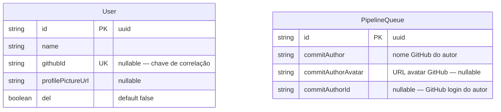
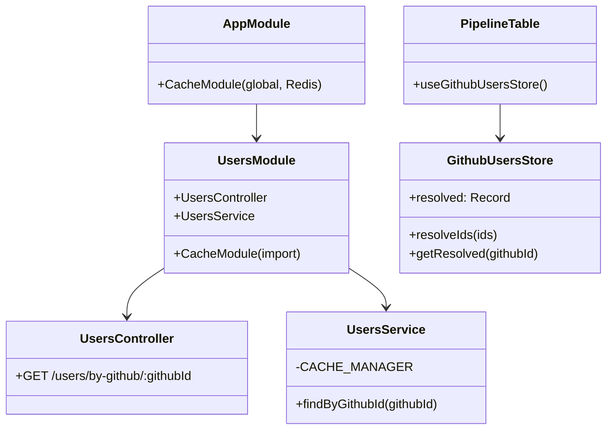
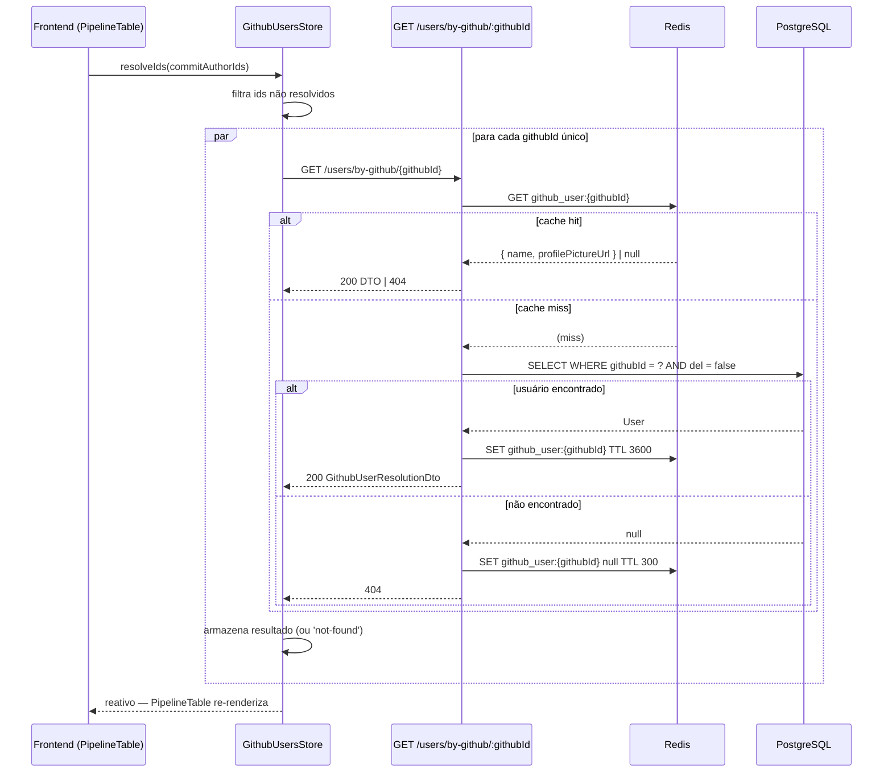
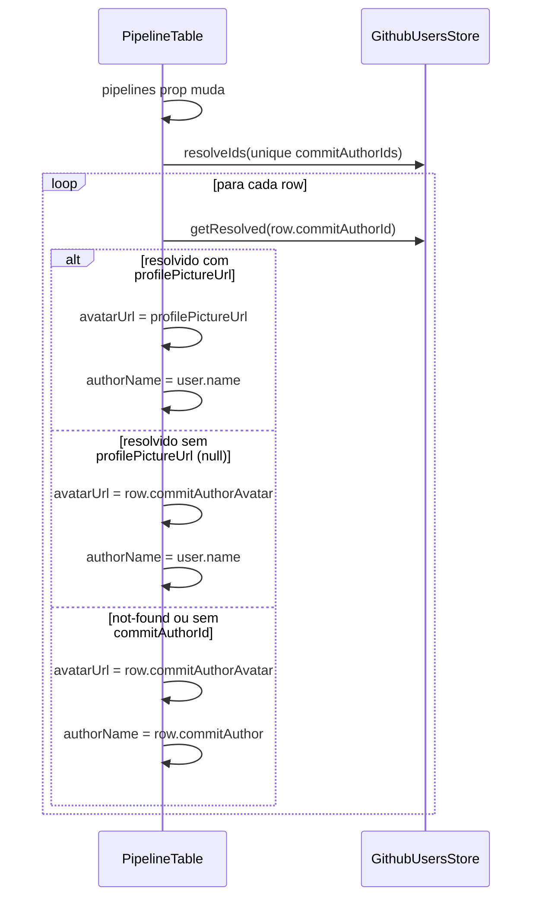
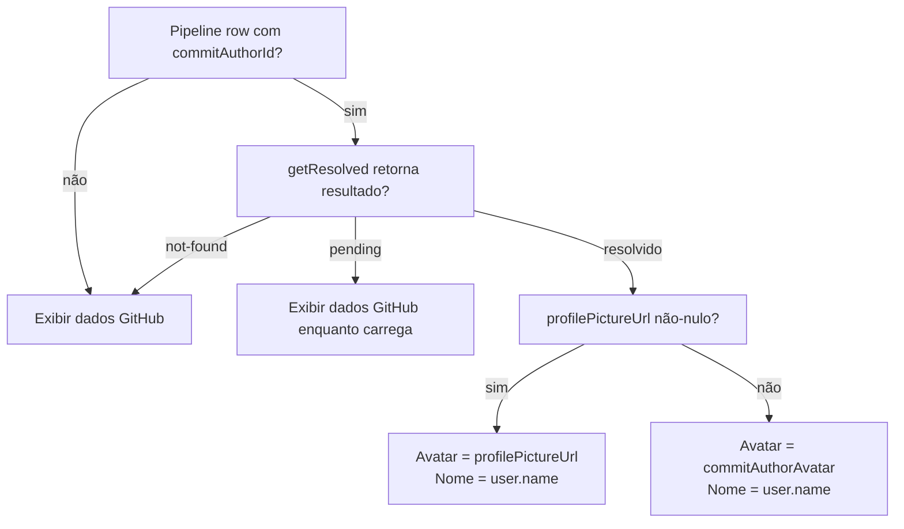
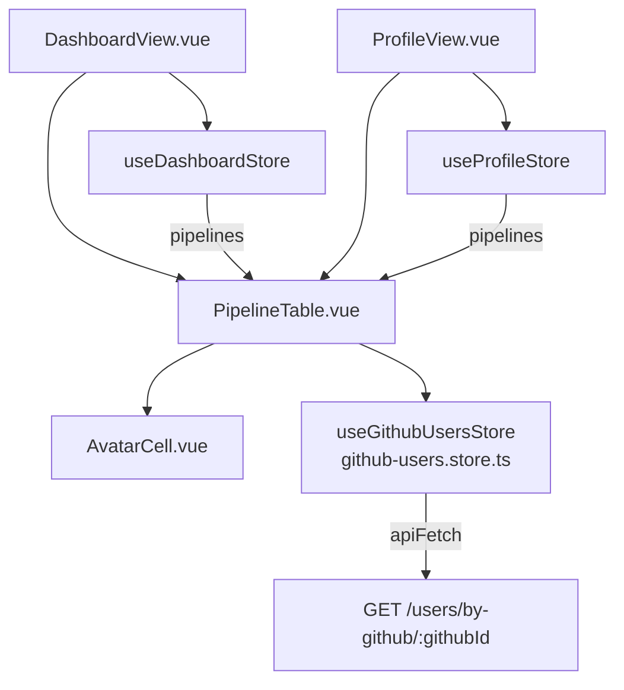

# GitHub User Picture

## 1. Context

O dashboard e o histórico de perfil exibem pipelines com avatar e nome do autor do commit vindos diretamente do payload do webhook GitHub (`commitAuthorAvatar`, `commitAuthor`). Quando o autor do commit é um usuário registrado no sistema (identificado por `User.githubId == PipelineQueue.commitAuthorId`), o ideal é exibir a foto de perfil e o nome do usuário cadastrado — que podem diferir do avatar/nome público do GitHub. Usuários sem match continuam exibindo dados do GitHub normalmente.

## 2. Scope

**In scope:**
- Novo endpoint `GET /users/by-github/:githubId` com cache Redis
- Wiring do Redis (`@nestjs/cache-manager`) no backend
- Store Pinia `useGithubUsersStore` para resolução e cache client-side
- `PipelineTable.vue` exibe `profilePictureUrl` e `name` resolvidos quando disponíveis
- Fallback para `commitAuthorAvatar` / `commitAuthor` quando sem match ou `profilePictureUrl == null`
- Aplicado no Dashboard e na view de Perfil (ambos usam `PipelineTable`)

**Out of scope:**
- Alteração de schema Prisma (campos já existem)
- Novos manifestos k8s (Redis e `REDIS_URL` já presentes)
- Edição de `profilePictureUrl` pelo usuário (feature separada)
- Cache invalidation automático ao atualizar usuário

## 3. Glossary

| Termo | Definição |
|---|---|
| `commitAuthorId` | GitHub login (string) do autor do commit, enviado pelo webhook |
| `githubId` | Campo `User.githubId` — armazena o mesmo login GitHub para correlacionar com `commitAuthorId` |
| Resolução | Processo de mapear `commitAuthorId` → dados de usuário (`name`, `profilePictureUrl`) |
| Cache negativo | Entrada Redis indicando que `githubId` não tem usuário cadastrado (evita queries repetidas ao DB) |

## 4. Functional Requirements

- **FR-1:** `GET /users/by-github/:githubId` retorna 200 com `GithubUserResolutionDto { name, profilePictureUrl }` quando existe `User` com `githubId == :githubId` e `del == false`.
- **FR-2:** `GET /users/by-github/:githubId` retorna 404 quando nenhum usuário ativo possui `githubId == :githubId`.
- **FR-3:** O backend verifica Redis antes de consultar o banco. Em cache miss, persiste resultado no Redis e retorna.
- **FR-4:** Resultados positivos ficam em cache Redis por 1 hora (TTL 3600s); resultados negativos (404) por 5 minutos (TTL 300s).
- **FR-5:** Cache negativo é representado como entrada Redis com valor `null` (ou sentinel), TTL 300s; o backend retorna 404 sem consultar o banco.
- **FR-6:** `useGithubUsersStore` resolve e armazena localmente `commitAuthorId → { name, profilePictureUrl }` para pipelines carregados.
- **FR-7:** `PipelineTable.vue` exibe `profilePictureUrl` do usuário registrado como avatar quando resolvido e não-nulo; caso contrário usa `commitAuthorAvatar`.
- **FR-8:** `PipelineTable.vue` exibe `name` do usuário registrado como nome do autor quando resolvido; caso contrário usa `commitAuthor`.
- **FR-9:** Pipelines sem `commitAuthorId` (campo nulo) não disparam resolução e exibem dados GitHub normalmente.
- **FR-10:** A resolução ocorre em ambas as views que utilizam `PipelineTable`: Dashboard e Perfil.

## 5. Non-Functional Requirements

- **NFR-1:** `GET /users/by-github/:githubId` com cache Redis warm deve responder em ≤ 30ms P95.
- **NFR-2:** Endpoint protegido por `JwtAuthGuard` — requer Bearer JWT válido.
- **NFR-3:** Resoluções frontend são paralelas (não sequenciais) para o conjunto de `commitAuthorId`s únicos de uma página.
- **NFR-4:** O store frontend deduplica: `commitAuthorId` já resolvido (positivo, negativo ou pending) não dispara nova requisição HTTP.
- **NFR-5:** Falha na requisição de resolução (erro de rede, 5xx) é silenciosa — fallback para dados GitHub sem quebrar a UI.

## 6. Data Model

Sem novas tabelas. Campos existentes utilizados:



**Chave de correlação:** `PipelineQueue.commitAuthorId == User.githubId` (ambos string, GitHub login).

**Cache Redis:**
| Chave | Valor | TTL |
|---|---|---|
| `github_user:{githubId}` | `{ name: string, profilePictureUrl: string \| null }` (JSON) | 3600s |
| `github_user:{githubId}` (negativo) | `null` (JSON) | 300s |

## 7. API Contract

### HTTP Endpoint

```
### GET /users/by-github/:githubId
- **Auth**: Bearer JWT (JwtAuthGuard)
- **Param**: githubId — GitHub login string (ex: "pedro-php")
- **Respostas**:
  - 200 GithubUserResolutionDto — usuário encontrado
  - 401 — sem token ou token inválido
  - 404 — nenhum User ativo com githubId correspondente
```

**GithubUserResolutionDto:**
| Campo | Tipo | Exemplo |
|---|---|---|
| `name` | `string` | `"Pedro Miranda"` |
| `profilePictureUrl` | `string \| null` | `"https://cdn.../photo.jpg"` |

### Vue Router — nenhuma rota nova

| Named route | Path | Componente | Auth |
|---|---|---|---|
| `dashboard` | `/dashboard` | `DashboardView.vue` | sim (existente) |
| `profile` | `/profile` | `ProfileView.vue` | sim (existente) |

## 8. Module Boundaries



## 9. Flows

### Resolução com cache Redis



### Exibição no PipelineTable



## 10. State Machines

N/A — nenhum campo de status novo.

## 11. Business Rules



## 12. Edge Cases & Error Handling

- `commitAuthorId` nulo: nenhuma requisição disparada; exibir dados GitHub.
- Rede falha ao chamar `/users/by-github/:githubId`: capturar erro silenciosamente, marcar como `'not-found'` no store, exibir dados GitHub.
- Redis indisponível: `CACHE_MANAGER.get` lança exceção → capturar e prosseguir direto para DB.
- Usuário com `githubId` configurado mas `del == true`: tratado como não encontrado (404).
- Múltiplos pipelines com mesmo `commitAuthorId`: store deduplica, uma única requisição HTTP.
- `resolveIds` chamado com array vazio: no-op.
- TTL expirado no Redis mid-session: na próxima recarga de página, nova requisição ao backend.
- `profilePictureUrl` é string vazia: tratar como nulo → fallback para `commitAuthorAvatar`.

## 13. Acceptance Criteria

- **AC-1** `[backend]`: Dado usuário autenticado, quando `GET /users/by-github/pedro-php` e existe `User` com `githubId='pedro-php'` e `del=false`, então resposta 200 com `{ name, profilePictureUrl }`.
- **AC-2** `[backend]`: Dado usuário autenticado, quando `GET /users/by-github/unknown-id` e nenhum user ativo possui esse githubId, então resposta 404.
- **AC-3** `[backend]`: Dado request a `/users/by-github/:githubId` sem Authorization header, então resposta 401.
- **AC-4** `[backend]`: Dado cache miss, quando `/users/by-github/:githubId` retorna 200, então Redis contém chave `github_user:{githubId}` com TTL ≤ 3600s.
- **AC-5** `[backend]`: Dado cache miss e githubId não encontrado no DB, quando retorna 404, então Redis contém chave `github_user:{githubId}` com valor null e TTL ≤ 300s.
- **AC-6** `[backend]`: Dado chave `github_user:{githubId}` presente no Redis (cache hit), quando chamado `/users/by-github/:githubId`, então DB não é consultado.
- **AC-7** `[frontend]`: Dado `useGithubUsersStore`, quando `resolveIds(['pedro-php'])` chamado e resposta 200 recebida, então `getResolved('pedro-php')` retorna `{ name, profilePictureUrl }`.
- **AC-8** `[frontend]`: Dado `useGithubUsersStore`, quando `resolveIds(['unknown'])` chamado e resposta 404 recebida, então `getResolved('unknown')` retorna null.
- **AC-9** `[frontend]`: Dado `resolveIds` chamado duas vezes com mesmo githubId, então apenas uma requisição HTTP disparada.
- **AC-10** `[frontend]`: Dado pipeline com `commitAuthorId='pedro-php'` e usuário resolvido com `profilePictureUrl` não-nulo, quando `PipelineTable` renderiza, então `AvatarCell` recebe `url=profilePictureUrl`.
- **AC-11** `[frontend]`: Dado pipeline com `commitAuthorId='pedro-php'` e usuário resolvido com `profilePictureUrl=null`, quando `PipelineTable` renderiza, então `AvatarCell` recebe `url=commitAuthorAvatar`.
- **AC-12** `[frontend]`: Dado pipeline sem `commitAuthorId` (null), quando `PipelineTable` renderiza, então `AvatarCell` recebe `url=commitAuthorAvatar`.
- **AC-13** `[frontend]`: Dado pipeline com usuário resolvido, quando `PipelineTable` renderiza, então nome exibido é `user.name` (não `commitAuthor`).
- **AC-14** `[frontend]`: Dado pipeline sem match de usuário, quando `PipelineTable` renderiza, então nome exibido é `commitAuthor`.
- **AC-15** `[frontend]`: Dado falha de rede ao resolver githubId, quando `PipelineTable` renderiza, então exibe dados GitHub sem erro visível.

## 14. Open Questions

N/A — todos os pontos foram esclarecidos antes da spec.

## 15. Frontend Component Hierarchy



## 16. Infra Topology

N/A — Redis e `REDIS_URL` já presentes nos manifestos k8s. Nenhum recurso novo.
