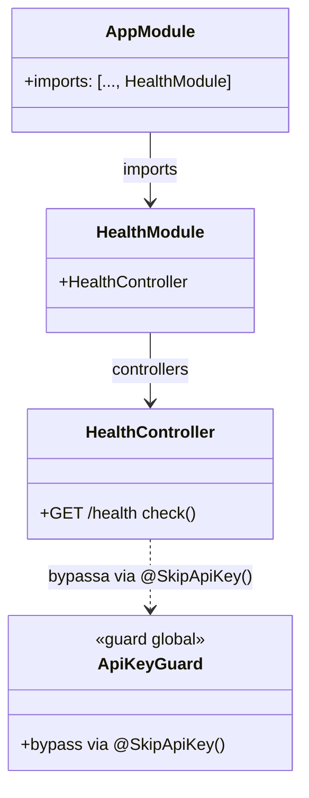
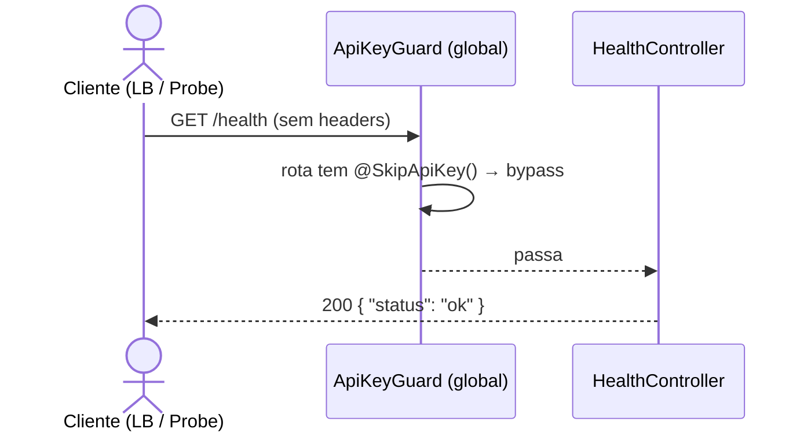
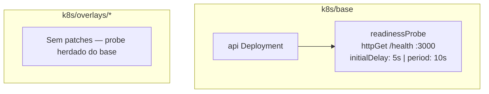

# Health Route

## 1. Contexto

O backend NestJS não expõe nenhum endpoint público de verificação de disponibilidade. Load balancers, liveness/readiness probes do Kubernetes e ferramentas de monitoramento externas precisam de um endpoint que responda `200 OK` sem exigir autenticação, para confirmar que o processo está vivo e aceitando requisições.

## 2. Escopo

- **In scope**: endpoint `GET /health` público, sem qualquer guard, retornando `{ status: 'ok' }` com HTTP 200; `readinessProbe` no `k8s/base/api-deployment.yaml` apontando para essa rota.
- **Out of scope**: `livenessProbe` (separado, fora do escopo desta iteração); verificação de conectividade com banco de dados, Redis ou outros serviços dependentes; métricas de sistema (CPU, memória); integração com biblioteca `@nestjs/terminus`.

## 3. Glossário

| Termo | Definição |
|---|---|
| Health check | Requisição periódica feita por infraestrutura para verificar se um serviço está operacional. |
| Liveness probe | Verificação do Kubernetes para determinar se o container deve ser reiniciado. |
| `@SkipApiKey()` | Decorator existente que isenta uma rota do `ApiKeyGuard` global registrado em `AppModule`. |

## 4. Requisitos Funcionais

- **FR-1**: `GET /health` retorna HTTP 200 com corpo `{ "status": "ok" }` sem necessitar de nenhum header de autenticação (`apikey` ou `Authorization: Bearer`).

## 5. Requisitos Não-Funcionais

- **NFR-1**: A rota deve responder em menos de 50ms (sem I/O — resposta em memória).
- **NFR-2**: A rota não deve ser registrada no Swagger por trás de `@ApiBearerAuth` — deve ser acessível sem token no `/docs`.

## 6. Modelo de Dados

N/A — nenhuma entidade persiste dados. A resposta é construída em memória pelo controller.

## 7. Contrato de API

### GET /health

- **Auth**: nenhuma — rota totalmente pública.
- **Request body**: nenhum.
- **Query params**: nenhum.
- **Responses**:
  - `200 OK` — `{ "status": "ok" }`

**Rotas Vue Router introduzidas**: N/A (feature backend-only).

## 8. Limites de Módulo

## 9. Fluxo

## 10. Máquinas de Estado

N/A — nenhuma entidade com ciclo de vida.

## 11. Regras de Negócio / Lógica de Decisão

N/A — resposta constante, sem bifurcações.

## 12. Casos de Borda e Tratamento de Erros

| Caso | Comportamento esperado |
|---|---|
| Requisição sem header `apikey` | 200 OK — `@SkipApiKey()` isenta do guard global |
| Requisição sem `Authorization: Bearer` | 200 OK — nenhum `@UseGuards(JwtAuthGuard)` na rota |
| Método POST/PUT/DELETE em `/health` | 404 ou 405 — NestJS não registra esses métodos |

## 13. Critérios de Aceitação

- **AC-1** `[backend]`: Dado o serviço em execução, quando `GET /health` é chamado sem nenhum header, então a resposta é `200 OK` com corpo `{ "status": "ok" }`.
- **AC-2** `[backend]`: Dado o serviço em execução com `ApiKeyGuard` global ativo, quando `GET /health` é chamado sem o header `apikey`, então a resposta é `200` (não `401` nem `403`).
- **AC-3** `[infra]`: Dado `kustomize build k8s/base`, o Deployment `api` contém `readinessProbe` com `httpGet.path: /health`, `httpGet.port: 3000`, `initialDelaySeconds: 5`, `periodSeconds: 10`.

## 14. Questões em Aberto

Nenhuma.

## 15. Hierarquia de Componentes Frontend

N/A — feature backend-only.

## 16. Topologia de Infraestrutura

Mudança: adição de `readinessProbe` no container `api` dentro de `k8s/base/api-deployment.yaml`.

**Diferenças por overlay**: nenhuma — `readinessProbe` definido em `base`, herdado por todos os overlays sem patch.

**Novos env vars / ConfigMap keys**: nenhum.

**Notas de migração**: nenhuma — adição não-breaking; pods existentes são reiniciados no próximo rollout para aplicar o probe.
