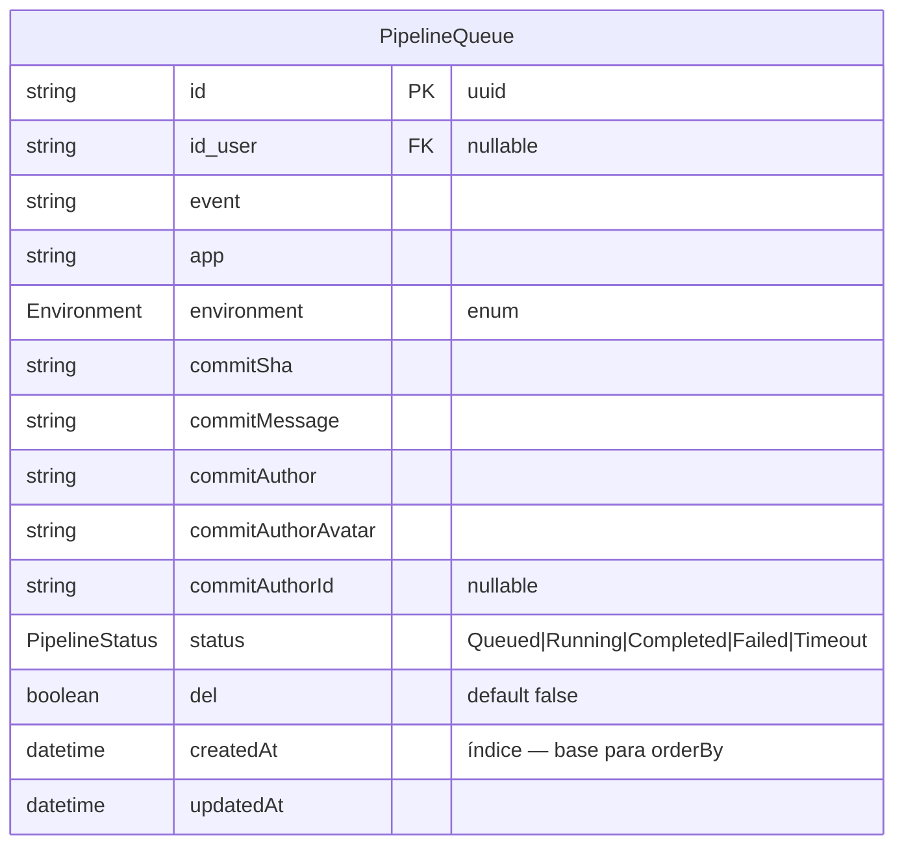
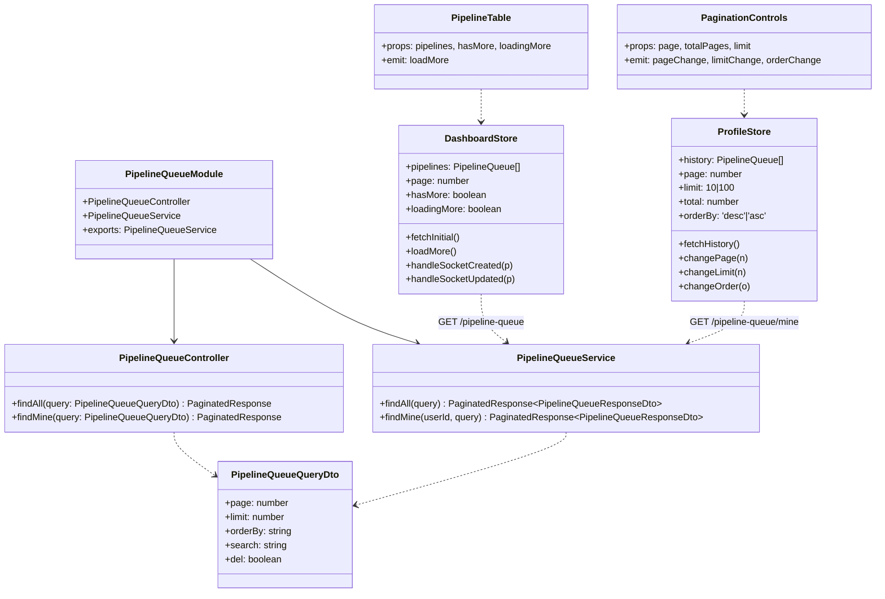
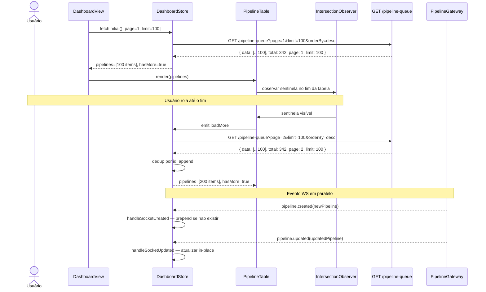
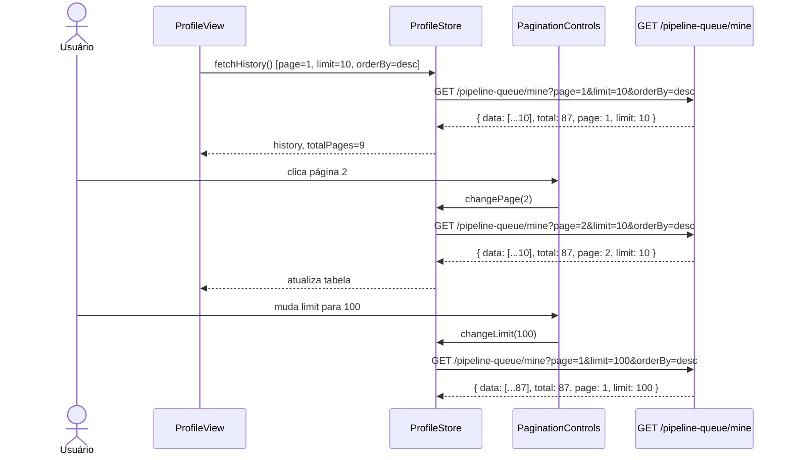
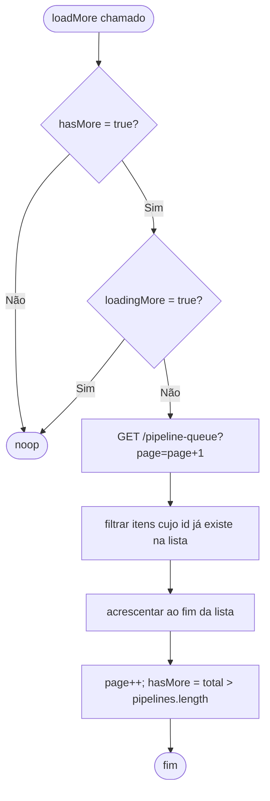
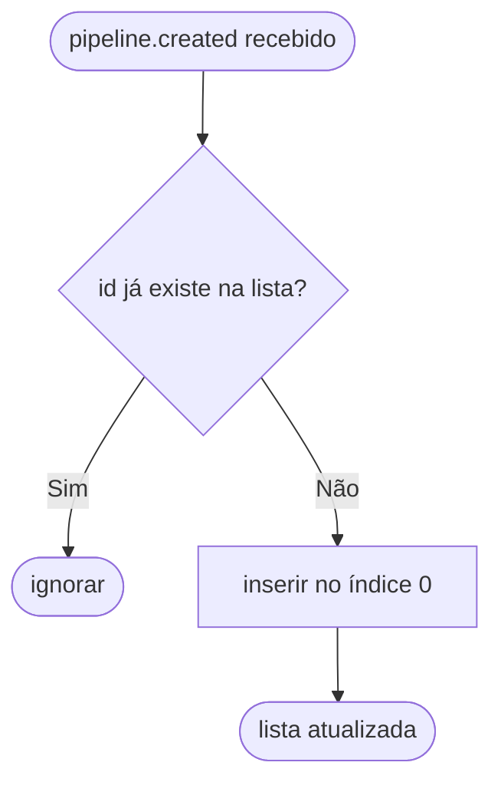
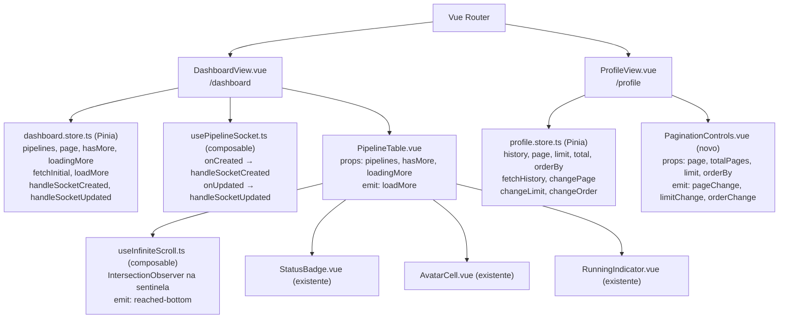

# Infinite Scroll e Paginação

## 1. Contexto

O dashboard exibe uma tabela de deploys que atualmente carrega todos os registros de uma vez, sem controle de volume. Isso degrada performance conforme o histórico cresce. A tela de perfil (`ProfileView`) também carrega todo o histórico sem controle. Esta feature introduz scroll infinito no dashboard (100 por lote, WebSocket intacto) e paginação server-side na tela de perfil (10 ou 100 por página, desc por padrão).

---

## 2. Escopo

**In scope:**
- Backend: `GET /pipeline-queue` suporta paginação server-side (`page`, `limit`, `orderBy`)
- Backend: `GET /pipeline-queue/mine` suporta paginação server-side (`page`, `limit`, `orderBy`)
- Frontend dashboard: scroll infinito na `PipelineTable`, carregando 100 itens por vez
- Frontend perfil: controles de paginação com opções 10 ou 100 por página, ordem desc padrão
- WebSocket: `pipeline.created` e `pipeline.updated` continuam funcionando no dashboard com scroll infinito

**Out of scope:**
- Cursor-based pagination (usa offset-based com deduplicação por ID)
- Paginação infinita na tela de perfil
- Filtros adicionais no dashboard além dos já existentes (dateRange)
- Paginação na tela de usuários (UsersView)

---

## 3. Glossário

| Termo | Definição |
|---|---|
| **Scroll infinito** | Técnica de carregamento progressivo: ao detectar que o usuário chegou ao fim da lista, busca a próxima página e acrescenta ao final |
| **Lote** | Um conjunto de registros retornados por uma única chamada paginada (`limit`) |
| **hasMore** | Flag booleana que indica se existem mais itens a carregar (total > itens carregados) |
| **Deduplicação por ID** | Ao acrescentar um lote, filtrar itens cujo `id` já existe na lista local (evita duplicatas causadas por WS + offset drift) |
| **orderBy** | Direção de ordenação por `createdAt`: `desc` (mais recente primeiro) ou `asc` |

---

## 4. Requisitos Funcionais

- **FR-1:** `GET /pipeline-queue` aceita query params `page` (int ≥ 1, default 1), `limit` (int, default 100), `orderBy` (`'desc'` | `'asc'`, default `'desc'`). Retorna `PaginatedResponse<PipelineQueueResponseDto>` com campos `data`, `total`, `page`, `limit`.
- **FR-2:** `GET /pipeline-queue/mine` aceita os mesmos query params de FR-1, com `limit` restrito a `10` ou `100` (default `10`), `orderBy` default `'desc'`. Retorna `PaginatedResponse<PipelineQueueResponseDto>`.
- **FR-3:** O dashboard carrega os primeiros 100 deploys ao montar. O próximo lote é carregado quando o usuário se aproxima do fim da tabela (sentinela posicionada antes do último item visível, não no fim absoluto), garantindo experiência contínua sem salto perceptível. Quando não há mais itens, o carregamento para.
- **FR-4:** Itens recebidos via WebSocket (`pipeline.created`) são inseridos no topo da lista do dashboard sem reiniciar a paginação.
- **FR-5:** Itens atualizados via WebSocket (`pipeline.updated`) são atualizados in-place na lista do dashboard.
- **FR-6:** A tela de perfil exibe controles de paginação: seletor de limite (10 ou 100), botões anterior/próximo, indicador de página atual e total de páginas.
- **FR-7:** Na tela de perfil, alterar o limite reinicia para página 1 e rebusca.
- **FR-8:** A ordenação da tela de perfil é `desc` por padrão; o usuário pode alterar para `asc`.
- **FR-9:** Quando filtros do dashboard mudam (dateRange), a lista é reiniciada e o scroll infinito recomeça da página 1.
- **FR-10:** Deduplicação por `id` é aplicada ao acrescentar cada lote no scroll infinito.

---

## 5. Requisitos Não-Funcionais

- **NFR-1:** O endpoint `GET /pipeline-queue` deve responder em ≤ 300ms para lotes de 100 itens com índice em `createdAt`.
- **NFR-2:** A detecção usa `IntersectionObserver` com `rootMargin: '0px 0px 300px 0px'` — dispara ~300px antes da sentinela entrar na viewport, carregando o lote com antecedência suficiente para evitar salto. Sem polling periódico.
- **NFR-3:** O WebSocket não deve ser desconectado ou reconectado durante o carregamento de novos lotes.
- **NFR-4:** Não há migration de schema — apenas adição/ajuste de parâmetros de query nas queries Prisma existentes.

---

## 6. Modelo de Dados

Sem mudanças de schema. A ordenação e paginação são aplicadas via queries Prisma em `PipelineQueueService`.



---

## 7. Contrato de API

### GET /pipeline-queue
- **Auth:** Bearer JWT (`JwtAuthGuard`)
- **Query params** (`PipelineQueueQueryDto` — ajustado):
  - `page?: number` — mínimo 1, default 1
  - `limit?: number` — mínimo 1, default 100
  - `orderBy?: 'desc' | 'asc'` — default `'desc'`
  - (campos existentes mantidos: `search`, `del`)
- **Resposta:**
  - `200 OK` — `PaginatedResponse<PipelineQueueResponseDto>`
    ```json
    {
      "data": [...],
      "total": 342,
      "page": 1,
      "limit": 100
    }
    ```
  - `400 Bad Request` — query param inválido
  - `401 Unauthorized` — token ausente/inválido

### GET /pipeline-queue/mine
- **Auth:** Bearer JWT (`JwtAuthGuard`)
- **Query params** (`PipelineQueueQueryDto` — mesmo DTO, validação aplicada no service):
  - `page?: number` — mínimo 1, default 1
  - `limit?: 10 | 100` — default 10
  - `orderBy?: 'desc' | 'asc'` — default `'desc'`
- **Resposta:**
  - `200 OK` — `PaginatedResponse<PipelineQueueResponseDto>`
  - `401 Unauthorized` — token ausente/inválido

### Rotas Vue Router (sem novas rotas — modificações em rotas existentes)

| Named route | Path | Componente | Auth |
|---|---|---|---|
| `dashboard` | `/dashboard` | `DashboardView.vue` | sim |
| `profile` | `/profile` | `ProfileView.vue` | sim |

---

## 8. Limites de Módulo



---

## 9. Fluxos

### Scroll Infinito — Dashboard



### Paginação — Perfil



---

## 10. Máquinas de Estado

N/A — nenhuma entidade muda de status nesta feature.

---

## 11. Regras de Negócio





---

## 12. Casos de Borda e Tratamento de Erros

- **Lista vazia:** `total=0` → `hasMore=false`; tabela exibe estado vazio (mensagem "Nenhum deploy encontrado").
- **Último lote parcial:** lote com menos itens que `limit` → `hasMore = total > pipelines.length` (calculado após dedup).
- **WS duplicata:** item recebido via WS que já está na lista (offset drift) → ignorado pelo handler `handleSocketCreated`.
- **Falha ao carregar lote:** `loadingMore=false`, exibir toast/alerta de erro; usuário pode rolar para tentar novamente.
- **Mudança de filtro (dateRange) durante scroll:** `fetchInitial()` reinicia `pipelines=[]`, `page=1`, `hasMore=true`.
- **Perfil: page fora do range:** se `page > totalPages`, fixar em `totalPages`; se `page < 1`, fixar em 1.
- **Perfil: limit inválido:** somente `10` ou `100` aceitos; valores fora disso retornam 400 no backend.

---

## 13. Critérios de Aceitação

- **AC-1** `[backend]`: Dado um usuário autenticado, quando faz `GET /pipeline-queue?page=1&limit=100&orderBy=desc`, então recebe `200` com `PaginatedResponse` cujo `data` tem no máximo 100 itens ordenados por `createdAt` desc e `total` reflete o total de registros.
- **AC-2** `[backend]`: Dado `total > 100`, quando faz `GET /pipeline-queue?page=2&limit=100`, então `data` contém o segundo lote sem sobreposição com o primeiro.
- **AC-3** `[backend]`: Dado um usuário autenticado, quando faz `GET /pipeline-queue/mine?page=1&limit=10`, então recebe `200` com no máximo 10 itens do próprio usuário, ordenados desc.
- **AC-4** `[backend]`: Dado `GET /pipeline-queue/mine?limit=100&page=2&orderBy=asc`, então `data` é ordenado por `createdAt` asc e contém o segundo lote.
- **AC-5** `[backend]`: Dado `GET /pipeline-queue/mine?limit=50` (valor não permitido), então retorna `400 Bad Request`.
- **AC-6** `[frontend]`: Dado que o dashboard monta, então `DashboardStore.fetchInitial()` é chamado com `page=1&limit=100`, e a `PipelineTable` exibe os itens recebidos.
- **AC-7** `[frontend]`: Dado `hasMore=true`, quando o `IntersectionObserver` (com `rootMargin` de 300px) detecta a sentinela antes do fim da lista, então `DashboardStore.loadMore()` é chamado e o próximo lote é acrescentado sem substituir itens existentes e antes de o usuário atingir o fim visível.
- **AC-8** `[frontend]`: Dado scroll infinito ativo, quando `pipeline.created` chega via WS, então o novo item aparece no topo da lista sem reiniciar a paginação e sem duplicar se já existir.
- **AC-9** `[frontend]`: Dado `pipeline.updated` via WS, então o item correspondente é atualizado in-place na lista do dashboard.
- **AC-10** `[frontend]`: Dado que todos os itens foram carregados (`total <= pipelines.length`), então `hasMore=false` e nenhum novo `loadMore` é disparado.
- **AC-11** `[frontend]`: Dado que a tela de perfil monta, então `ProfileStore.fetchHistory()` é chamado com `page=1&limit=10&orderBy=desc` e a tabela exibe os resultados.
- **AC-12** `[frontend]`: Dado que o usuário clica na página 2 nos controles de paginação, então `ProfileStore.changePage(2)` é chamado, a API é consultada, e a tabela atualiza.
- **AC-13** `[frontend]`: Dado que o usuário muda o limite para 100, então `ProfileStore.changeLimit(100)` é chamado, `page` volta a 1, e a API é re-consultada.
- **AC-14** `[frontend]`: Dado `total=87` e `limit=10`, então os controles de paginação exibem 9 páginas e os botões anterior/próximo são desabilitados corretamente nas extremidades.
- **AC-15** `[frontend]`: Dado que o usuário altera `dateRange` no dashboard, então `pipelines` é reiniciado e `fetchInitial()` é chamado novamente do zero.

---

## 14. Questões Abertas

Nenhuma.

---

## 15. Hierarquia de Componentes Frontend



**Props e emits relevantes:**

`PipelineTable.vue`:
- Props: `pipelines: PipelineQueue[]`, `hasMore: boolean`, `loadingMore: boolean`
- Emits: `loadMore` (quando sentinela fica visível)

`PaginationControls.vue` (novo componente):
- Props: `page: number`, `totalPages: number`, `limit: 10 | 100`, `orderBy: 'desc' | 'asc'`
- Emits: `pageChange(n: number)`, `limitChange(n: 10 | 100)`, `orderChange(o: 'desc' | 'asc')`
- `data-test`: `pagination-prev`, `pagination-next`, `pagination-limit-select`, `pagination-order-select`, `pagination-page-info`

`useInfiniteScroll.ts` (novo composable):
- Parâmetro: `target: Ref<HTMLElement | null>`, callback `onReached: () => void`
- Usa `IntersectionObserver` com `rootMargin: '0px 0px 300px 0px'` — dispara quando sentinela está 300px abaixo da viewport
- Sentinela posicionada após o penúltimo grupo de linhas da tabela (não no fim absoluto)
- Desconecta em `onBeforeUnmount`

**Estados de erro:**
- `DashboardView`: loading spinner enquanto `fetchInitial`, skeleton/alert em erro, toast em falha de `loadMore`
- `ProfileView`: loading spinner enquanto `fetchHistory`, alert em erro

---

## 16. Topologia de Infra

N/A — nenhuma mudança em manifestos k8s. Feature é puramente backend (código) + frontend (código).
