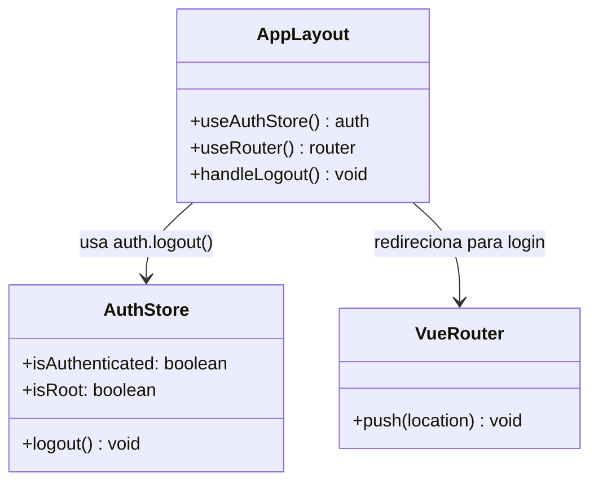
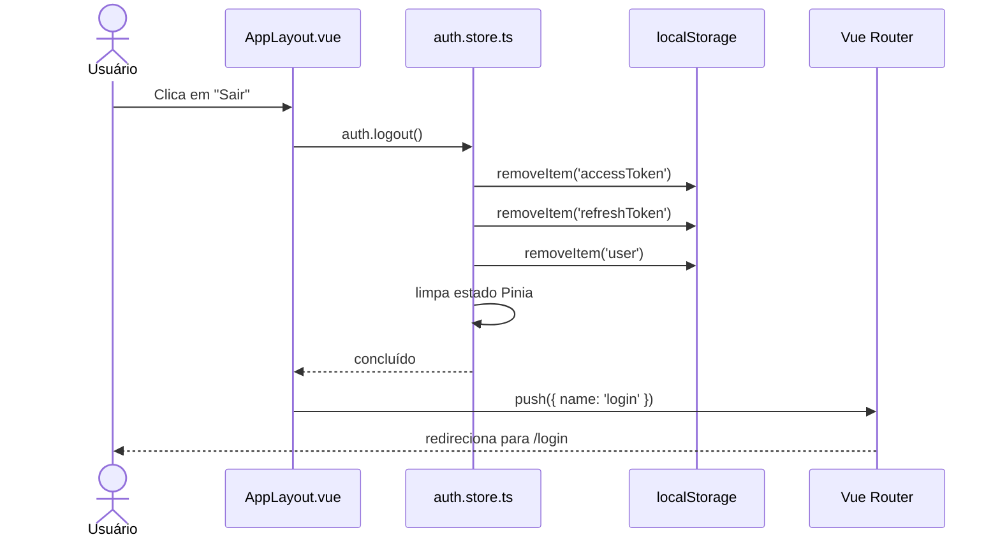
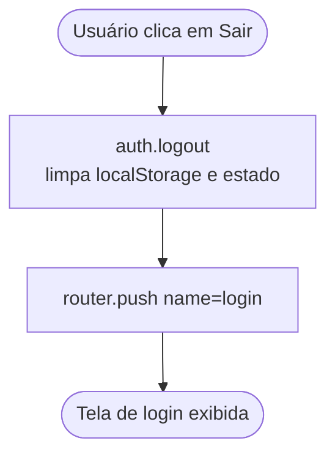
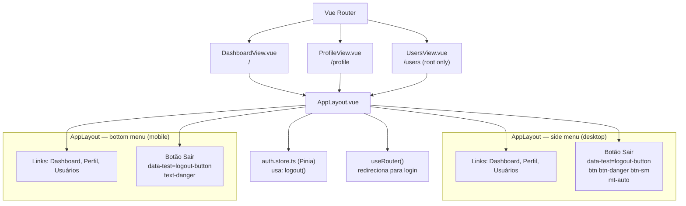

# Botão de Logout no Menu

## 1. Contexto

A aplicação Pipeline Monitor não expõe nenhuma forma de o usuário encerrar sua sessão pela interface. Para sair, o usuário precisaria limpar o `localStorage` manualmente ou aguardar a expiração do `accessToken` (15 min). O `auth.store.ts` já implementa `logout()` — que apaga `accessToken`, `refreshToken` e `user` do estado Pinia e do `localStorage` — mas esse método nunca é chamado pela UI. Esta feature adiciona um botão vermelho "Sair" ao menu lateral (desktop) e ao menu inferior (mobile) dentro de `AppLayout.vue`, tornando o logout acessível a qualquer usuário autenticado.

---

## 2. Escopo

**Incluso:**
- Botão "Sair" no menu lateral (desktop) — `data-test="logout-button"`, estilo `btn btn-danger btn-sm`
- Botão "Sair" no menu inferior (mobile) — `data-test="logout-button"`, estilo `text-danger`
- Ao clicar: chama `auth.logout()` e redireciona para a rota nomeada `login`
- Visível para todos os usuários autenticados (sem distinção root/não-root)

**Fora do escopo:**
- Endpoint de logout no backend (logout permanece client-side)
- Invalidação do `refreshToken` no servidor ao clicar em "Sair"
- Confirmação modal antes de logout
- Auto-logout por inatividade ou expiração de token
- Qualquer alteração em rotas, guards ou outras views além de `AppLayout.vue`

---

## 3. Glossário

| Termo | Definição |
|---|---|
| `logout()` | Método do `auth.store.ts` que apaga `accessToken`, `refreshToken` e `user` do estado Pinia e do `localStorage` |
| Side menu | Menu lateral fixo exibido em telas `md` e maiores (Bootstrap breakpoint) |
| Bottom menu | Barra de navegação fixa na parte inferior, exibida apenas em telas menores que `md` |
| `mt-auto` | Classe Bootstrap que empurra um elemento para a parte inferior de um flex container — usada para posicionar o botão de logout no rodapé do side menu |

---

## 4. Requisitos Funcionais

**FR-1:** O `AppLayout.vue` deve renderizar um botão com `data-test="logout-button"` no menu lateral (desktop), posicionado após os links de navegação existentes e empurrado para o rodapé do menu com `mt-auto`.

**FR-2:** O `AppLayout.vue` deve renderizar um botão com `data-test="logout-button"` no menu inferior (mobile), posicionado após os links de navegação existentes.

**FR-3:** Ao clicar no botão "Sair" (em qualquer menu), o store `auth.logout()` deve ser invocado e o router deve navegar para `{ name: 'login' }`.

**FR-4:** O botão "Sair" no side menu deve ter as classes Bootstrap `btn btn-danger btn-sm` para visual vermelho.

**FR-5:** O botão "Sair" no bottom menu deve ter a classe `text-danger` para manter consistência visual com os demais links do menu inferior.

**FR-6:** O botão "Sair" deve aparecer para todos os usuários autenticados, independente de `auth.isRoot`.

---

## 5. Requisitos Não-Funcionais

**NFR-1:** Nenhuma chamada HTTP é feita ao clicar em "Sair" — o logout é puramente client-side (limpeza de `localStorage` + estado Pinia).

**NFR-2:** O botão deve ter o atributo `data-test="logout-button"` em ambas as instâncias (side e bottom menu) para facilitar testes automatizados.

**NFR-3:** Nenhuma dependência nova é introduzida — reutiliza `useAuthStore` (já importado em `AppLayout.vue`) e `useRouter` (já disponível via `vue-router`).

---

## 6. Modelo de Dados

N/A — nenhuma entidade nova. Nenhuma alteração no schema do banco de dados.

---

## 7. Contrato de API

### Endpoints Backend

N/A — nenhum endpoint novo ou modificado.

### Rotas Frontend (Vue Router)

Nenhuma rota nova. A rota `login` já existe:

| Named route | Path | Component | Auth required | Descrição |
|---|---|---|---|---|
| `login` | `/login` | `LoginView.vue` | Não | Destino após logout |

`AppLayout.vue` é usado pelas rotas `dashboard`, `profile` e `users` (todas protegidas). `LoginView` não usa `AppLayout`, portanto o botão de logout não aparece na tela de login.

---

## 8. Limites de Módulos

---

## 9. Fluxos

### Fluxo de Logout

---

## 10. Máquinas de Estado

N/A — nenhuma entidade com status progressivo é introduzida.

---

## 11. Regras de Negócio / Lógica de Decisão

---

## 12. Casos de Borda e Tratamento de Erros

- **`auth.logout()` é síncrono e não lança exceções** — nenhum tratamento de erro necessário.
- **Duplo clique no botão:** `router.push` com destino idêntico ao atual é no-op no Vue Router — sem efeito colateral.
- **Usuário já deslogado tentando clicar:** improvável pois `AppLayout` só aparece em rotas protegidas; guard de rota já redireciona para `/login` antes de renderizar.
- **`LoginView` não usa `AppLayout`:** botão de logout nunca aparece na tela de login.

---

## 13. Critérios de Aceitação

**AC-1** `[frontend]`: Dado que `AppLayout` está montado (usuário autenticado), quando o componente é renderizado, então existe exatamente um elemento com `data-test="logout-button"` no side menu e um no bottom menu.

**AC-2** `[frontend]`: Dado que o usuário visualiza o side menu, quando o botão "Sair" é renderizado, então ele possui as classes Bootstrap `btn`, `btn-danger` e `btn-sm`.

**AC-3** `[frontend]`: Dado que o usuário visualiza o bottom menu, quando o botão "Sair" é renderizado, então ele possui a classe `text-danger`.

**AC-4** `[frontend]`: Dado que o usuário está autenticado e visualiza o menu, quando clica no botão `data-test="logout-button"`, então `auth.logout()` é chamado exatamente uma vez.

**AC-5** `[frontend]`: Dado que o usuário clicou em "Sair", quando `auth.logout()` completa, então `router.push` é chamado com `{ name: 'login' }`.

**AC-6** `[frontend]`: Dado usuário root ou não-root, quando `AppLayout` é renderizado, então o botão "Sair" aparece independentemente do valor de `auth.isRoot`.

---

## 14. Questões Abertas

Nenhuma. Todos os requisitos foram clarificados antes da escrita desta spec.

---

## 15. Hierarquia de Componentes Frontend

**Contrato do componente modificado:**

- **`AppLayout.vue`**
  - Não recebe props
  - Não emite eventos
  - Adiciona: `handleLogout()` — chama `auth.logout()` + `router.push({ name: 'login' })`
  - Reutiliza: `useAuthStore()` (já importado), adiciona `useRouter()`

**Estados de erro:** N/A — `logout()` é síncrono e não falha.

---

## 16. Topologia de Infra

N/A — nenhum recurso Kubernetes adicionado, alterado ou removido. Nenhuma variável de ambiente nova. Nenhuma alteração nos Dockerfiles ou manifests Kustomize.
