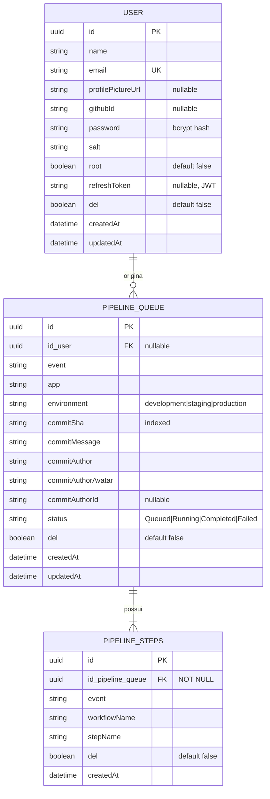
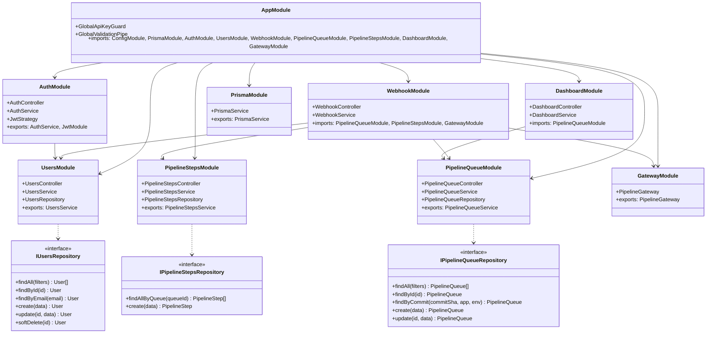
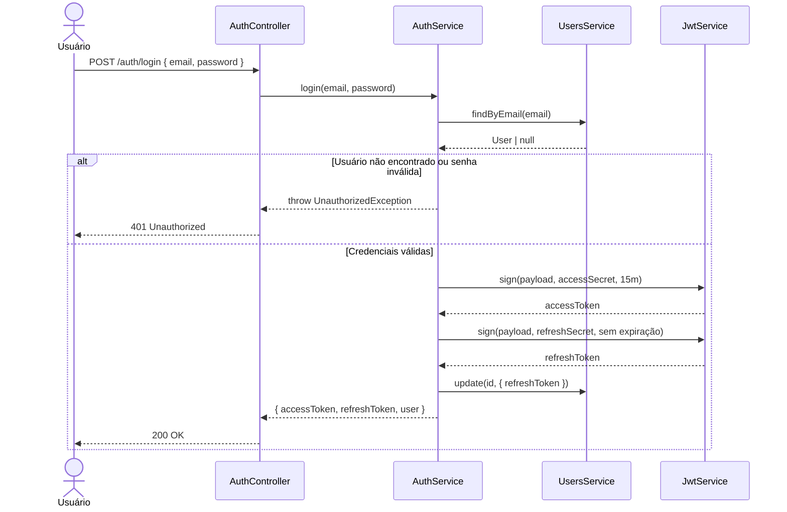
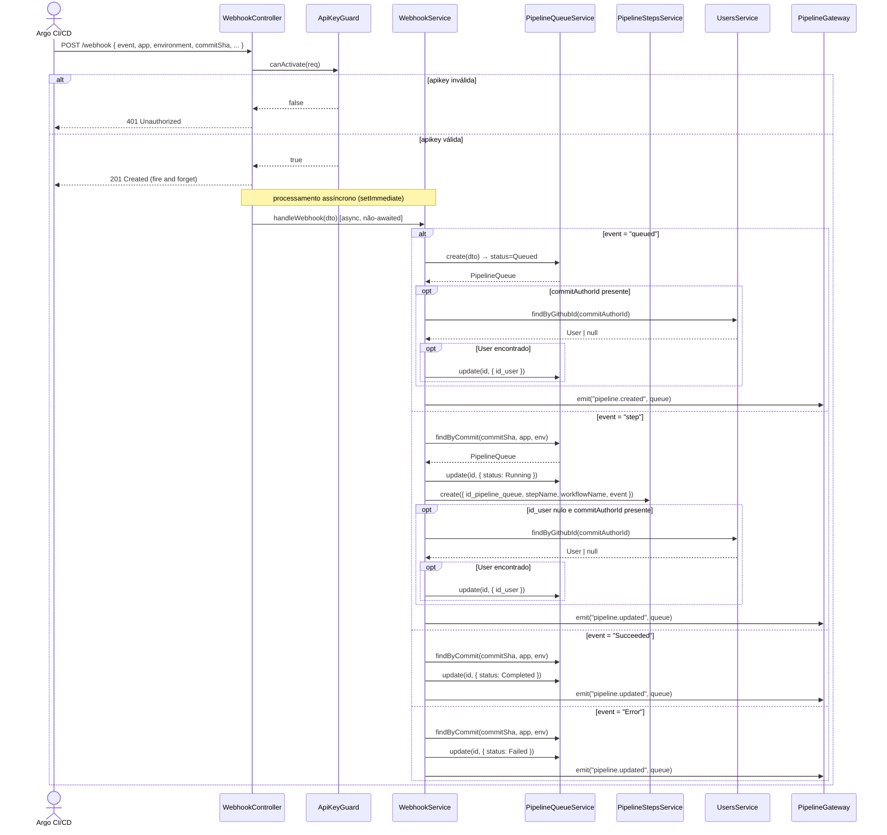
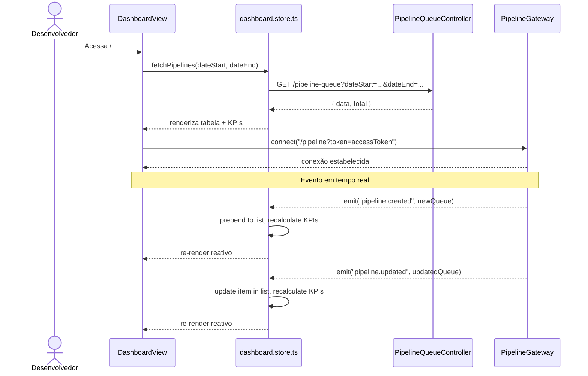
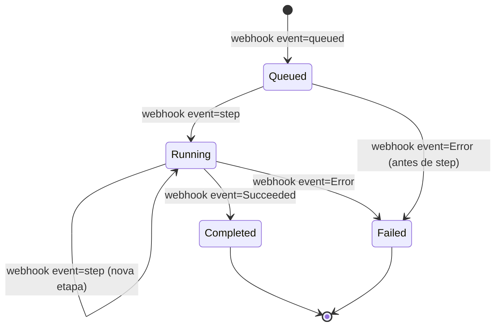
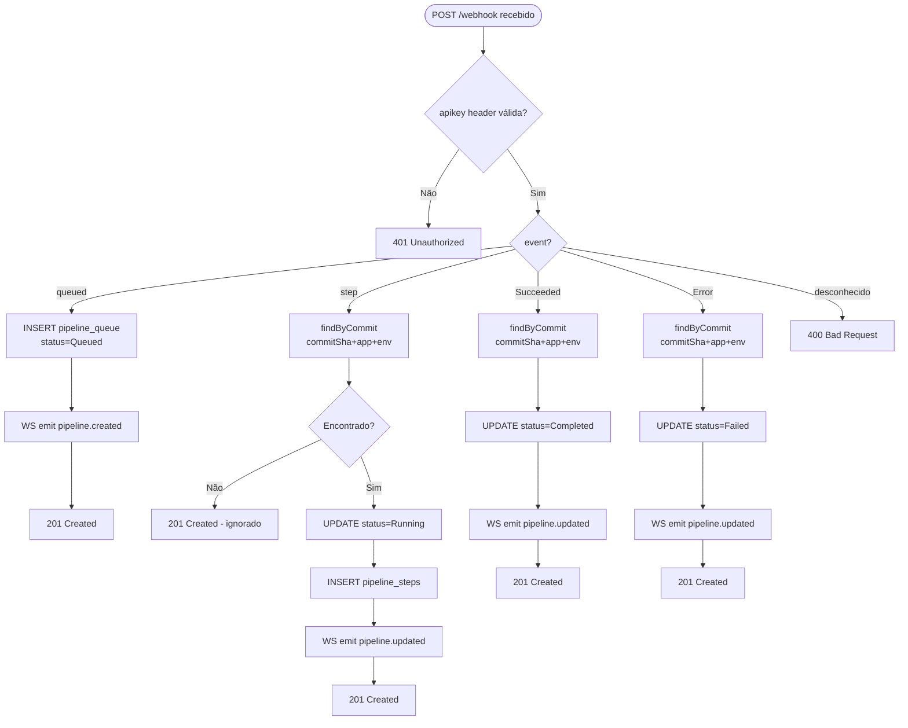
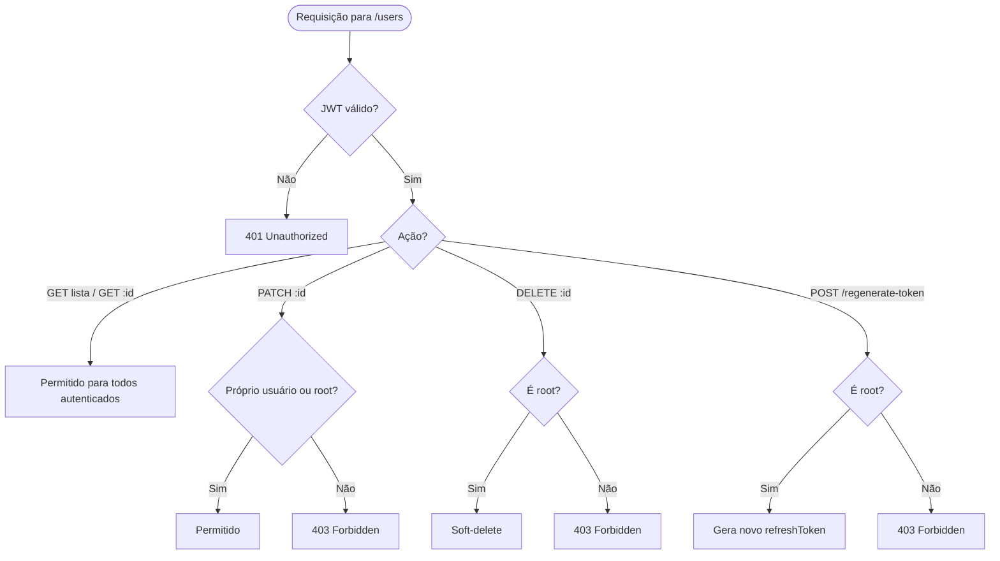
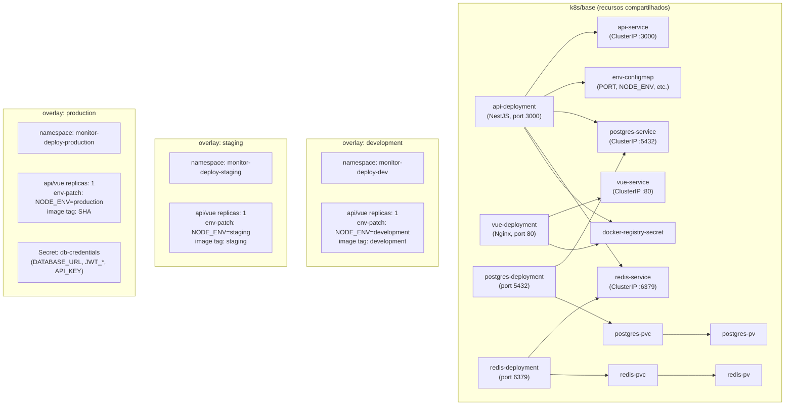

# Pipeline Monitor

## 1. Contexto

O **Pipeline Monitor** é uma aplicação full-stack de monitoramento em tempo real de pipelines de deploy gerados pelo Argo. A plataforma recebe webhooks enviados pelo sistema de CI/CD a cada evento do pipeline (enfileiramento, etapas de execução, conclusão e falha), armazena o histórico completo em banco de dados relacional e expõe uma interface web reativa que exibe o estado atual e histórico de todos os deploys. Usuários autenticados visualizam o dashboard ao vivo via WebSocket, enquanto a equipe de engenharia acompanha métricas de sucesso/falha, identifica gargalos e consulta histórico por autor, ambiente e aplicação.

---

## 2. Escopo

**Incluso:**
- Recepção e persistência de webhooks do Argo (queued, step, Succeeded, Error)
- CRUD completo de usuários com controle de acesso por papel (root / não-root)
- Autenticação via JWT (access token + refresh token)
- Proteção global por API Key para rotas internas
- Dashboard em tempo real via WebSocket com filtros de data
- Histórico de pipelines paginado por usuário (perfil) e global (dashboard)
- Módulos independentes: users, auth, pipeline-queue, pipeline-steps, webhook, dashboard, gateway
- Dockerfiles multi-stage para API e frontend
- Manifests Kubernetes com Kustomize (base + overlays dev/staging/prod)
- docker-compose para desenvolvimento local

**Fora do escopo:**
- Cancelamento ou re-trigger de pipelines a partir da interface
- Notificações por e-mail ou Slack
- Autorização granular por projeto/aplicação (além de root vs. não-root)
- Autenticação OAuth/GitHub (apenas login por e-mail + senha)
- Multi-tenancy / isolamento por organização
- Relatórios exportáveis (CSV, PDF)

---

## 3. Glossário

| Termo | Definição |
|---|---|
| **pipeline_queue** | Registro de um deploy enfileirado; representa um commit sendo processado |
| **pipeline_steps** | Registro de cada etapa de execução de um pipeline (clone, build, migrate, deploy) |
| **event** | Tipo de evento recebido pelo webhook: `queued`, `step`, `Succeeded`, `Error` |
| **commitSha** | Hash SHA-1 do commit Git associado ao deploy |
| **workflowName** | Identificador único do workflow Argo (ex: `whiz-server-ci-cd-dev-j8klp`) |
| **stepName** | Nome da etapa atual do workflow (ex: `clone`, `build`, `migrate`, `deploy`) |
| **root** | Papel de super-usuário com acesso a ações administrativas (CRUD de outros usuários) |
| **del** | Flag de exclusão lógica (soft delete); `true` = registro inativo |
| **API Key** | Chave de autenticação usada para proteger o endpoint de webhook |
| **Access Token** | JWT de curta duração (15 min) usado nas requisições autenticadas |
| **Refresh Token** | JWT sem expiração usado para renovar o access token; invalidado apenas por regeneração explícita |
| **config.template** | Arquivo de template nginx (`config.js.template`) com placeholders `${VAR}` substituídos por `envsubst` na inicialização do container; expõe variáveis de ambiente ao frontend em runtime |
| **fire and forget** | Padrão onde a resposta HTTP é enviada imediatamente e o processamento ocorre de forma assíncrona |

---

## 4. Requisitos Funcionais

### Backend

**FR-1:** `POST /webhook` com header `apikey: bWludGluaG8=` e body de evento `queued` deve retornar `201 Created` imediatamente (fire and forget) e, de forma assíncrona, inserir um registro em `pipeline_queue` com `status = Queued`. Se `commitAuthorId` estiver presente no payload, buscar usuário por `githubId = commitAuthorId`; se encontrado, preencher `id_user` com o `id` do usuário.

**FR-2:** `POST /webhook` com evento `step` deve retornar `201 Created` imediatamente (fire and forget) e, de forma assíncrona, atualizar o `status` do registro correspondente em `pipeline_queue` para `Running` (match por `commitSha + app + environment`), inserir um registro em `pipeline_steps` com o `stepName` e `workflowName` recebidos, e — se o registro de pipeline ainda não tiver `id_user` e o payload contiver `commitAuthorId` — buscar usuário por `githubId` e preencher `id_user`.

**FR-3:** `POST /webhook` com evento `Succeeded` deve retornar `201 Created` imediatamente e, de forma assíncrona, atualizar o `status` do registro correspondente em `pipeline_queue` para `Completed`.

**FR-4:** `POST /webhook` com evento `Error` deve retornar `201 Created` imediatamente e, de forma assíncrona, atualizar o `status` do registro correspondente em `pipeline_queue` para `Failed`.

**FR-5:** `POST /webhook` com header `apikey` ausente ou inválido deve retornar `401 Unauthorized` **de forma síncrona** (guard é executado antes do fire and forget).

**FR-6:** `POST /auth/login` com `email` e `password` válidos deve retornar `accessToken` (15 min) e `refreshToken` (sem expiração — invalidado apenas por regeneração explícita via `POST /users/:id/regenerate-token` ou novo login).

**FR-7:** `POST /auth/refresh` com `refreshToken` válido deve retornar novo `accessToken`.

**FR-8:** `POST /users` deve criar usuário com password hasheado + salt; retornar `UserResponseDto` sem expor `password`, `salt` ou `refreshToken`.

**FR-9:** `GET /users` deve retornar lista paginada de usuários com filtros por `name`, `email`, `githubId` (busca textual) e por `del` (all / false / true).

**FR-10:** `PATCH /users/:id` deve permitir atualização de `name`, `email`, `password`, `githubId`, `profilePictureUrl`; senha rehasheada se fornecida.

**FR-11:** `DELETE /users/:id` deve realizar soft-delete (`del = true`).

**FR-12:** `POST /users/:id/regenerate-token` deve gerar novo `refreshToken` para o usuário alvo.

**FR-13:** `GET /pipeline-queue` deve retornar lista paginada de registros com filtros de `dateStart`, `dateEnd`, `status`, `app`, `environment`.

**FR-14:** `GET /pipeline-queue/mine` deve retornar registros de pipeline associados ao usuário autenticado (`id_user`).

**FR-15:** `GET /pipeline-steps?pipelineQueueId=:id` deve retornar todas as etapas de um pipeline.

**FR-16:** O gateway WebSocket deve emitir evento `pipeline.created` ao receber webhook `queued` e `pipeline.updated` ao receber `step`, `Succeeded` ou `Error`.

**FR-17:** Todas as rotas exceto `POST /webhook` e `POST /auth/login` devem ser protegidas globalmente pelo API Key guard; rotas de `pipeline-queue`, `pipeline-steps` e gateway WebSocket requerem adicionalmente JWT Bearer.

### Frontend

**FR-18:** A página `/login` deve apresentar layout dividido ao meio: lado esquerdo com imagem decorativa, lado direito com formulário (email + senha). Em telas pequenas (breakpoint Bootstrap `md`), a imagem é ocultada e apenas o formulário é exibido centralizado.

**FR-19:** O dashboard `/` deve exibir filtro de data e indicador do workflow em execução (app + step atual, piscando levemente) no topo. Em desktop o filtro fica à esquerda e o indicador à direita; em telas menores empilham verticalmente. O indicador não aparece quando nenhum pipeline está em `Running`.

**FR-20:** O dashboard deve exibir 4 cards KPI: Total, Succeeded, Failed, Taxa de Erro — valores obtidos de `GET /dashboard/kpis?dateStart=&dateEnd=` (calculados no backend). Em telas muito pequenas os cards podem empilhar em 2×2 ou 1×4.

**FR-21:** O dashboard deve exibir tabela paginada e ordenável de `pipeline_queue` com colunas na ordem: avatar (círculo, coluna mais estreita), commitAuthor, app, environment, commitSha, commitMessage, status. Ordem padrão: Running primeiro, depois Queued, depois demais. Em mobile colunas secundárias podem ser ocultadas para caber na tela.

**FR-22:** O dashboard deve reagir a eventos WebSocket (`pipeline.created`, `pipeline.updated`) atualizando tabela e KPIs sem recarregar a página.

**FR-23:** A página `/profile` deve exibir e permitir edição de `name`, `email`, `profilePictureUrl`, `githubId` do usuário autenticado, e abaixo uma tabela paginada do histórico de pipelines do usuário.

**FR-24:** A página `/users` deve ser acessível apenas por usuários `root`; o item do menu deve estar oculto para não-root.

**FR-25:** A página `/users` deve exibir tabela paginada com `name`, `email`, profilePicture (círculo), `githubId`; busca textual; filtro por `del`; coluna de ações `[...]` (visível apenas para root) com opções: editar (modal), regenerar refreshToken, excluir (soft-delete).

**FR-26:** O menu lateral (desktop) ou inferior (mobile) deve conter links para Dashboard, Profile e (somente root) Users.

**FR-27:** O frontend deve ler a URL da API e do WebSocket a partir de `window.config` (populado pelo `config.js` gerado em runtime via `config.js.template`); nenhuma URL de backend hardcoded no bundle.

---

## 5. Requisitos Não-Funcionais

**NFR-1:** Password armazenado como hash bcrypt (salt rounds ≥ 10); `salt` único por usuário gerado via `bcrypt.genSalt()` e salvo separadamente no banco — nunca reutilizado entre usuários.

**NFR-2:** Variáveis sensíveis (`DATABASE_URL`, `JWT_ACCESS_SECRET`, `JWT_REFRESH_SECRET`, `API_KEY`) lidas exclusivamente via `ConfigService`; nunca em `process.env` em código de negócio.

**NFR-3:** `commitSha` indexado em `pipeline_queue` para lookup O(log n) no webhook handler.

**NFR-4:** `POST /webhook` deve responder `201 Created` em ≤ 50ms P95 (fire and forget — guard valida API Key, controller dispara processamento assíncrono via `setImmediate` / Promise não-awaited e retorna imediatamente; erros de DB são logados via `Logger` mas não propagados ao caller).

**NFR-5:** Gateway WebSocket deve suportar múltiplas conexões simultâneas; autenticação via token JWT no handshake.

**NFR-6:** Imagens Docker multi-stage; imagem final baseada em `node:alpine` (API) e `nginx:alpine` (frontend) — sem dependências de build na imagem final.

**NFR-7:** Todos os containers k8s devem ter `resources.requests` e `resources.limits` definidos.

**NFR-8:** Nenhuma senha ou secret em `ConfigMap` — usar `Secret` do k8s para `DATABASE_URL`, `JWT_*` e `API_KEY`.

**NFR-9:** Documentação Swagger disponível em `/docs` com todas as rotas documentadas em PT-BR.

**NFR-10:** Variáveis de ambiente do frontend injetadas em runtime via `config.js.template` (arquivo nginx template com placeholders `${VITE_API_URL}`, `${VITE_WS_URL}` etc.); `envsubst` substitui os valores na inicialização do container e gera `/usr/share/nginx/html/config.js`, carregado como `<script>` no `index.html`. Nenhuma variável de build-time exposta na imagem.

---

## 6. Modelo de Dados



---

## 7. Contrato de API

### Autenticação

#### POST /auth/login
- **Auth:** Nenhuma
- **Request body:**
  - `email: string`
  - `password: string`
- **Responses:**
  - `200 OK` — `{ accessToken: string, refreshToken: string, user: UserResponseDto }`
  - `401 Unauthorized` — credenciais inválidas

#### POST /auth/refresh
- **Auth:** Nenhuma (body carrega refreshToken)
- **Request body:**
  - `refreshToken: string`
- **Responses:**
  - `200 OK` — `{ accessToken: string }`
  - `401 Unauthorized` — token não encontrado no banco ou não corresponde ao usuário (sem expiração por tempo)

---

### Usuários

#### POST /users
- **Auth:** API Key (header `x-api-key`) + Bearer JWT
- **Request body** (`CreateUserDto`):
  - `name: string`
  - `email: string` (formato e-mail)
  - `password: string` (mín. 8 chars)
  - `profilePictureUrl?: string` (URL)
  - `githubId?: string`
  - `root?: boolean` (default false)
- **Responses:**
  - `201 Created` — `UserResponseDto`
  - `400 Bad Request` — validação
  - `409 Conflict` — email já cadastrado

#### GET /users
- **Auth:** Bearer JWT
- **Query params:** `page`, `limit`, `search` (name/email/githubId), `del` (all / true / false, default false)
- **Responses:**
  - `200 OK` — `{ data: UserResponseDto[], total: number, page: number, limit: number }`

#### GET /users/:id
- **Auth:** Bearer JWT
- **Responses:**
  - `200 OK` — `UserResponseDto`
  - `404 Not Found`

#### PATCH /users/:id
- **Auth:** Bearer JWT (apenas root pode editar outros; usuário pode editar a si mesmo)
- **Request body** (`UpdateUserDto`): campos opcionais — `name`, `email`, `password`, `githubId`, `profilePictureUrl`
- **Responses:**
  - `200 OK` — `UserResponseDto`
  - `403 Forbidden` — não-root tentando editar outro usuário
  - `404 Not Found`
  - `409 Conflict` — email duplicado

#### DELETE /users/:id
- **Auth:** Bearer JWT (apenas root)
- **Responses:**
  - `200 OK` — `{ message: string }`
  - `403 Forbidden`
  - `404 Not Found`

#### POST /users/:id/regenerate-token
- **Auth:** Bearer JWT (apenas root)
- **Responses:**
  - `200 OK` — `{ refreshToken: string }`
  - `403 Forbidden`
  - `404 Not Found`

---

### Webhook

#### POST /webhook
- **Auth:** Header `apikey: <valor base64>` comparado diretamente com `API_KEY` do `.env`
- **Request body** (union dos eventos):
  ```
  {
    event: "queued" | "step" | "Succeeded" | "Error"
    app: string
    environment: "development" | "staging" | "production"
    commitSha: string
    commitMessage: string
    commitAuthor: string
    commitAuthorAvatar: string
    commitAuthorId?: string
    workflowName?: string   // presente em step, Succeeded, Error
    stepName?: string       // presente em step
  }
  ```
- **Responses:**
  - `201 Created` — `{ message: string }`
  - `401 Unauthorized` — apikey inválida ou ausente
  - `400 Bad Request` — evento desconhecido ou campos obrigatórios ausentes

---

### Pipeline Queue

#### GET /pipeline-queue
- **Auth:** Bearer JWT
- **Query params:** `page`, `limit`, `dateStart` (ISO), `dateEnd` (ISO), `status`, `app`, `environment`, `orderBy` (`createdAt|status`), `order` (`asc|desc`)
- **Responses:**
  - `200 OK` — `{ data: PipelineQueueResponseDto[], total: number, page: number, limit: number }`

#### GET /pipeline-queue/mine
- **Auth:** Bearer JWT
- **Query params:** `page`, `limit`, `dateStart`, `dateEnd`
- **Responses:**
  - `200 OK` — `{ data: PipelineQueueResponseDto[], total: number, page: number, limit: number }`

#### GET /pipeline-queue/:id
- **Auth:** Bearer JWT
- **Responses:**
  - `200 OK` — `PipelineQueueResponseDto`
  - `404 Not Found`

#### PATCH /pipeline-queue/:id
- **Auth:** Bearer JWT
- **Request body** (`UpdatePipelineQueueDto`): campos opcionais — `status`, `del`
- **Responses:**
  - `200 OK` — `PipelineQueueResponseDto`
  - `404 Not Found`

#### DELETE /pipeline-queue/:id
- **Auth:** Bearer JWT
- **Responses:**
  - `200 OK`
  - `404 Not Found`

---

### Pipeline Steps

#### GET /pipeline-steps
- **Auth:** Bearer JWT
- **Query params:** `pipelineQueueId` (obrigatório), `page?`, `limit?`
- **Comportamento:** quando `page` e `limit` são omitidos, retorna **todos** os registros sem paginação (`data: PipelineStepResponseDto[], total: number`). Quando fornecidos, pagina normalmente.
- **Responses:**
  - `200 OK` — `{ data: PipelineStepResponseDto[], total: number, page?: number, limit?: number }`

#### GET /pipeline-steps/:id
- **Auth:** Bearer JWT
- **Responses:**
  - `200 OK` — `PipelineStepResponseDto`
  - `404 Not Found`

#### PATCH /pipeline-steps/:id
- **Auth:** Bearer JWT
- **Request body** (`UpdatePipelineStepDto`): campos opcionais — `del`
- **Responses:**
  - `200 OK` — `PipelineStepResponseDto`
  - `404 Not Found`

#### DELETE /pipeline-steps/:id
- **Auth:** Bearer JWT
- **Responses:**
  - `200 OK`
  - `404 Not Found`

---

### WebSocket Gateway

- **Namespace:** `/pipeline`
- **Auth:** JWT via query param `token` ou header `Authorization` no handshake
- **Eventos emitidos pelo servidor:**
  - `pipeline.created` — payload: `PipelineQueueResponseDto` (ao receber webhook `queued`)
  - `pipeline.updated` — payload: `PipelineQueueResponseDto` (ao receber webhook `step`, `Succeeded`, `Error`)

---

### Dashboard

#### GET /dashboard/kpis
- **Auth:** Bearer JWT
- **Query params:** `dateStart` (ISO, obrigatório), `dateEnd` (ISO, obrigatório)
- **Responses:**
  - `200 OK` — `{ total: number, succeeded: number, failed: number, errorRate: number }` (errorRate em %, 0–100, arredondado 2 casas)
  - `400 Bad Request` — dateStart ou dateEnd ausentes

---

### Rotas Frontend (Vue Router)

| Named Route | Path | Component | Auth | Root Only |
|---|---|---|---|---|
| `login` | `/login` | `LoginView.vue` | Não | Não |
| `dashboard` | `/` | `DashboardView.vue` | Sim | Não |
| `profile` | `/profile` | `ProfileView.vue` | Sim | Não |
| `users` | `/users` | `UsersView.vue` | Sim | Sim |

---

## 8. Limites de Módulos



---

## 9. Fluxos

### Fluxo de Login



### Fluxo de Webhook



### Fluxo do Dashboard em Tempo Real



---

## 10. Máquinas de Estado

### Status de pipeline_queue



---

## 11. Regras de Negócio / Lógica de Decisão

### Processamento de Webhook



### Controle de Acesso em /users



---

## 12. Casos de Borda e Tratamento de Erros

- **Webhook duplicado (mesmo commitSha + status já Completed/Failed):** aceitar e re-processar silenciosamente (idempotente); não lançar erro, retornar 201.
- **Webhook `step` sem registro correspondente no pipeline_queue:** ignorar (não criar órfão em pipeline_steps), retornar 201.
- **Refresh token expirado ou revogado:** retornar 401; cliente deve redirecionar para `/login`.
- **Usuário com `del=true` tentando login:** retornar 401 (tratar como credenciais inválidas — não expor motivo).
- **`commitAuthorId` ausente no payload:** tratar como `null`; nunca retornar erro de validação.
- **`environment` fora do enum:** retornar 400 Bad Request com mensagem de validação.
- **Dashboard com WebSocket desconectado:** exibir banner de aviso "Conexão perdida" e tentar reconectar automaticamente (3 tentativas com backoff).
- **Filtro de data sem dados no período:** tabela exibe estado vazio "Nenhum deploy encontrado neste período", KPI cards mostram zero.
- **Imagem de avatar com URL inválida/404:** exibir iniciais do `commitAuthor` como fallback.
- **PATCH /users/:id com email já existente em outro usuário:** retornar 409 Conflict.
- **Usuário não-root acessando `/users`:** redirecionar para `/` (guard de rota no Vue Router).

---

## 13. Critérios de Aceitação

**AC-1** `[backend]`: Dado um webhook com `event=queued` e `apikey` válida, quando `POST /webhook` é chamado, então um registro é inserido em `pipeline_queue` com `status=Queued` e o gateway emite `pipeline.created`.

**AC-2** `[backend]`: Dado um webhook com `event=step` e pipeline existente para o mesmo `commitSha+app+environment`, quando `POST /webhook` é chamado, então `pipeline_queue.status` muda para `Running` e um registro é criado em `pipeline_steps`.

**AC-3** `[backend]`: Dado um webhook com `event=Succeeded`, quando `POST /webhook` é chamado, então `pipeline_queue.status` muda para `Completed` e o gateway emite `pipeline.updated`.

**AC-4** `[backend]`: Dado um webhook com `event=Error`, quando `POST /webhook` é chamado, então `pipeline_queue.status` muda para `Failed` e o gateway emite `pipeline.updated`.

**AC-5** `[backend]`: Dado um webhook sem header `apikey` ou com valor incorreto, quando `POST /webhook` é chamado, então a resposta é `401 Unauthorized` e nenhum registro é criado.

**AC-6** `[backend]`: Dado `email` e `password` válidos, quando `POST /auth/login` é chamado, então a resposta é `200 OK` com `accessToken` e `refreshToken`.

**AC-7** `[backend]`: Dado `refreshToken` válido, quando `POST /auth/refresh` é chamado, então um novo `accessToken` é retornado.

**AC-8** `[backend]`: Dado `CreateUserDto` válido, quando `POST /users` é chamado, então o usuário é criado com password hasheado e `UserResponseDto` é retornado sem expor `password`, `salt` ou `refreshToken`.

**AC-9** `[backend]`: Dado query `?search=pedro&del=false`, quando `GET /users` é chamado, então apenas usuários não-deletados cujo `name`, `email` ou `githubId` contém "pedro" são retornados.

**AC-10** `[backend]`: Dado usuário não-root tentando `DELETE /users/:id` de outro usuário, quando a requisição é feita, então a resposta é `403 Forbidden`.

**AC-11** `[backend]`: Dado query `?dateStart=X&dateEnd=Y`, quando `GET /pipeline-queue` é chamado, então apenas registros com `createdAt` no intervalo são retornados.

**AC-12** `[frontend]`: Dado que o usuário não está autenticado, quando acessa qualquer rota protegida, então é redirecionado para `/login`.

**AC-13** `[frontend]`: Dado que o usuário está em `/login`, quando submete email e senha corretos, então é redirecionado para `/`.

**AC-14** `[frontend]`: Dado que o dashboard está aberto, quando um evento `pipeline.created` chega via WebSocket, então a tabela é atualizada sem reload e os KPIs recalculados.

**AC-15** `[frontend]`: Dado que o dashboard está aberto, quando um evento `pipeline.updated` chega via WebSocket, então o registro correspondente na tabela é atualizado com o novo status.

**AC-16** `[frontend]`: Dado que o dashboard exibe o indicador de workflow em execução, quando nenhum pipeline está em `status=Running`, então o indicador não é exibido.

**AC-17** `[frontend]`: Dado usuário não-root, quando o menu lateral é renderizado, então o item "Usuários" não aparece.

**AC-18** `[frontend]`: Dado usuário não-root tentando acessar `/users` diretamente, quando a rota é carregada, então é redirecionado para `/`.

**AC-19** `[frontend]`: Dado usuário root na página `/users`, quando clica em `[...]` de um usuário e seleciona "Editar", então um modal com os campos editáveis é exibido.

**AC-20** `[frontend]`: Dado usuário na página `/profile`, quando atualiza o nome e salva, então o novo nome é refletido na interface sem recarregar.

**AC-21** `[infra]`: Dado `kustomize build k8s/base | minikube kubectl -- apply --dry-run=client -f -`, quando executado, então não há erros de validação e todos os recursos têm `resources.requests` e `resources.limits` definidos.

**AC-22** `[infra]`: Dado `kustomize build k8s/overlays/production | minikube kubectl -- apply --dry-run=server -f -`, quando executado, então o namespace `monitor-deploy-production` é criado com imagens usando SHA tag e `replicas: 1`.

**AC-23** `[infra]`: Dado `docker build -f server/Dockerfile .`, quando executado, então a imagem final é baseada em `node:alpine` sem dependências de build.

**AC-24** `[infra]`: Dado `docker-compose up`, quando executado, então os serviços `api`, `vue`, `postgres` e `redis` sobem e a API responde em `localhost:3000/health`.

---

## 14. Questões Abertas

Nenhuma questão aberta. Todos os requisitos foram clarificados antes da escrita desta spec.

---

## 15. Hierarquia de Componentes Frontend

```mermaid
graph TD
    Router["Vue Router"] --> LoginView["LoginView.vue\n/login"]
    Router --> DashboardView["DashboardView.vue\n/"]
    Router --> ProfileView["ProfileView.vue\n/profile"]
    Router --> UsersView["UsersView.vue\n/users (root only)"]

    subgraph Layout
        AppLayout["AppLayout.vue"]
        SideMenu["SideMenu.vue"]
        BottomMenu["BottomMenu.vue (mobile)"]
        AppLayout --> SideMenu
        AppLayout --> BottomMenu
    end

    DashboardView --> AppLayout
    ProfileView --> AppLayout
    UsersView --> AppLayout

    DashboardView --> DashboardStore["dashboard.store.ts (Pinia)"]
    DashboardView --> DateRangeFilter["DateRangeFilter.vue"]
    DashboardView --> RunningIndicator["RunningIndicator.vue\n(blinking, app+step)"]
    DashboardView --> KpiCards["KpiCards.vue\n(Total, Succeeded, Failed, Error Rate)"]
    DashboardView --> PipelineTable["PipelineTable.vue"]
    DashboardView --> usePipelineSocket["usePipelineSocket.ts (composable)"]

    PipelineTable --> AvatarCell["AvatarCell.vue\n(circle img + fallback iniciais)"]
    PipelineTable --> StatusBadge["StatusBadge.vue (shared)"]
    PipelineTable --> Pagination["Pagination.vue (shared)"]

    ProfileView --> AuthStore["auth.store.ts (Pinia)"]
    ProfileView --> ProfileForm["ProfileForm.vue"]
    ProfileView --> UserPipelineHistory["UserPipelineHistory.vue\n(tabela paginada)"]

    UsersView --> UsersStore["users.store.ts (Pinia)"]
    UsersView --> UserSearchFilter["UserSearchFilter.vue"]
    UsersView --> UsersTable["UsersTable.vue"]
    UsersView --> EditUserModal["EditUserModal.vue"]

    UsersTable --> AvatarCell
    UsersTable --> UserActionsMenu["UserActionsMenu.vue\n([...] root only)"]
    UsersTable --> Pagination

    LoginView --> AuthStore
```



**Contratos de componentes relevantes:**

- **`PipelineTable`**: recebe `pipelines: PipelineQueueResponseDto[]`, emite `sort-change(field, order)`, `page-change(page)`.
- **`RunningIndicator`**: recebe `running: PipelineQueueResponseDto | null`; não exibido quando `null`.
- **`KpiCards`**: recebe `stats: { total, succeeded, failed, errorRate }` — calculado no store.
- **`EditUserModal`**: recebe `user: UserResponseDto`, emite `saved(updatedUser)`, `closed()`.
- **`UserActionsMenu`**: recebe `userId: string`, emite `edit`, `regenerate-token`, `delete`.
- **`AvatarCell`**: recebe `url: string | null`, `name: string`; exibe imagem circular ou iniciais como fallback.
- **`usePipelineSocket`**: conecta ao namespace `/pipeline` com JWT; expõe `onCreated(cb)`, `onUpdated(cb)`, `disconnect()`.

**Estados de erro que as views devem tratar:**
- Loading (skeleton ou spinner Bootstrap)
- Empty state (mensagem descritiva + CTA quando aplicável)
- API error (toast ou alert Bootstrap com mensagem)
- WebSocket desconectado (banner persistente com botão "Reconectar")

---

## 16. Topologia de Infra



**Diferenças entre overlays:**

| Recurso | development | staging | production |
|---|---|---|---|
| Réplicas API | 1 | 1 | 1 |
| Réplicas Vue | 1 | 1 | 1 |
| Image tag | `development` | `staging` | SHA do commit |
| Secrets | ConfigMap | ConfigMap | k8s Secret |

**Novas variáveis de ambiente (ConfigMap):**

| Chave | Descrição |
|---|---|
| `PORT` | Porta da API NestJS (3000) |
| `NODE_ENV` | Ambiente de execução |
| `DATABASE_URL` | Connection string Postgres |
| `JWT_ACCESS_SECRET` | Secret para assinar access tokens |
| `JWT_REFRESH_SECRET` | Secret para assinar refresh tokens |
| `JWT_ACCESS_EXPIRES` | Expiração do access token (15m) |
| `JWT_REFRESH_EXPIRES` | Expiração do refresh token (7d) |
| `API_KEY` | Chave de autenticação do webhook (base64) |

**Notas de migração:**
- PVs criados manualmente no cluster antes do primeiro deploy (hostPath para dev/staging, StorageClass para prod).
- Namespace criado pelo overlay `namespace.yaml` — não existe no base.
- `docker-registry-secret` criado uma vez por namespace via `kubectl create secret docker-registry`.

**Dockerfiles:**
- `server/Dockerfile`: stage `builder` (node:20-alpine + npm ci + prisma generate + nest build), stage `runner` (node:20-alpine, apenas `dist/` e `node_modules --production`).
- `frontend/Dockerfile`: stage `builder` (node:20-alpine + npm ci + vite build), stage `runner` (nginx:alpine + `dist/` copiado para `/usr/share/nginx/html`).
- `docker-compose.yml`: serviços `api` (porta 3000), `vue` (porta 5173), `postgres` (porta 5432), `redis` (porta 6379) com volumes nomeados e health checks.
