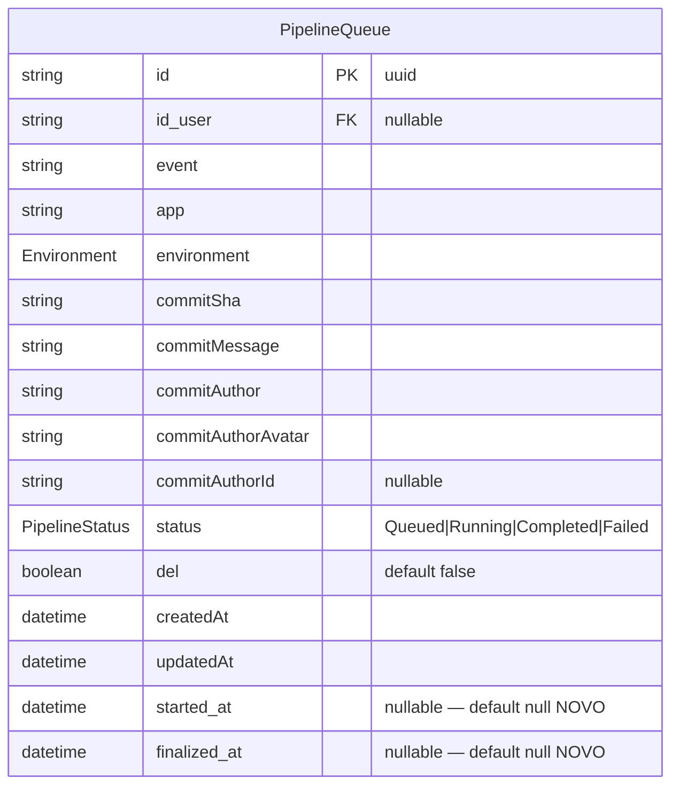
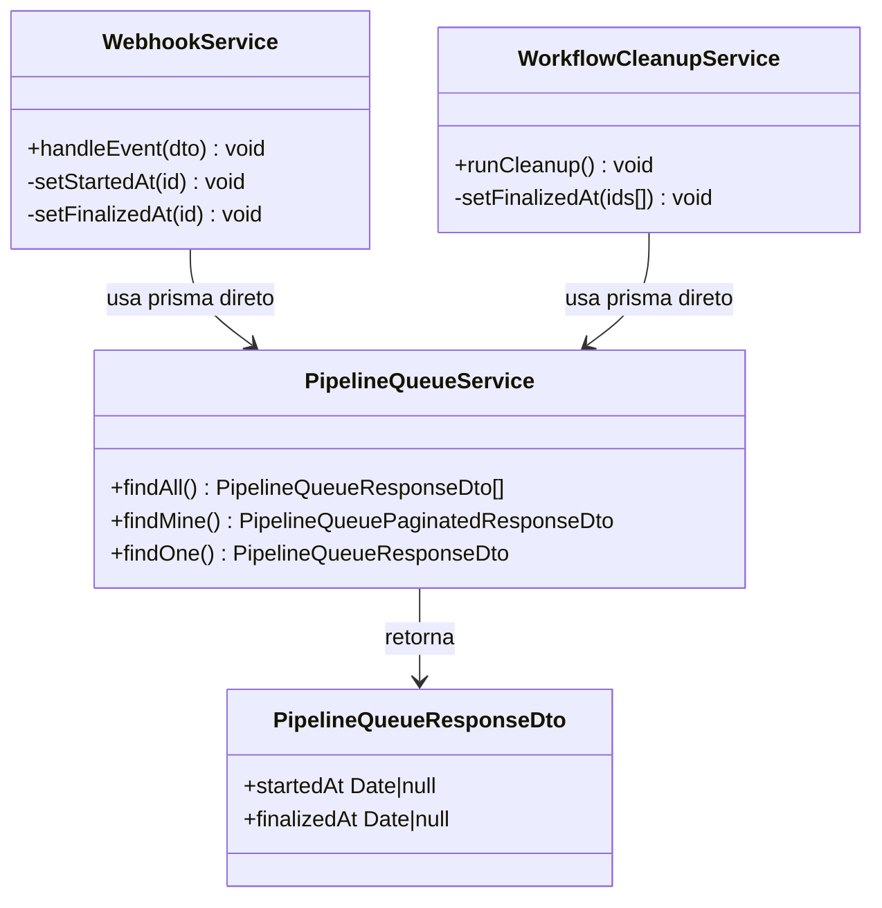
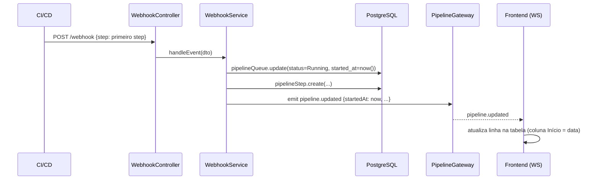
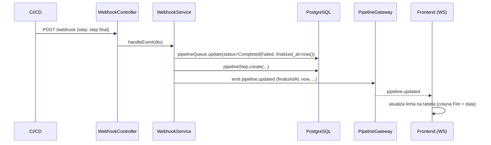
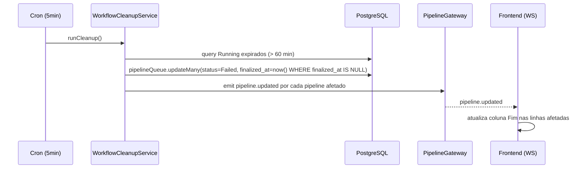
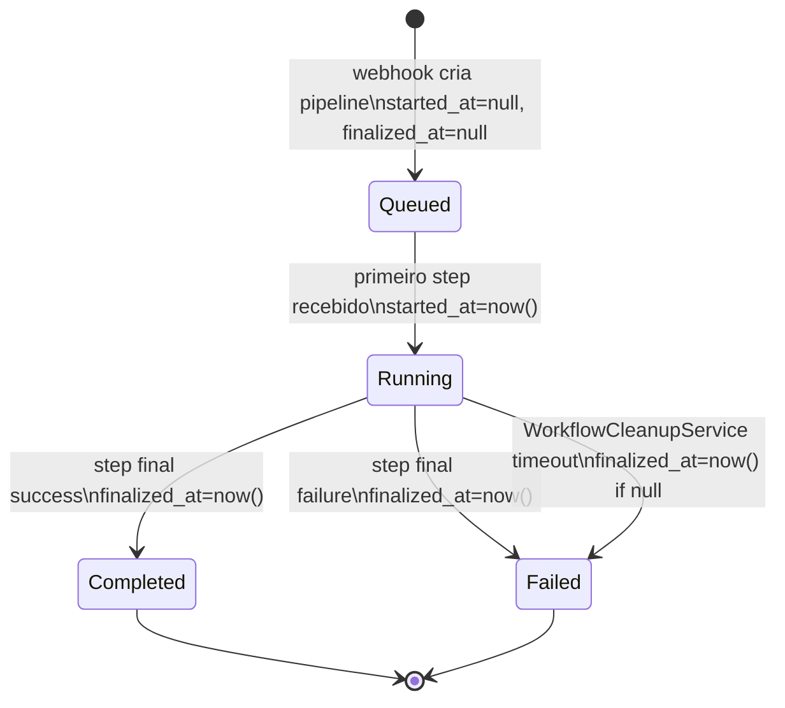
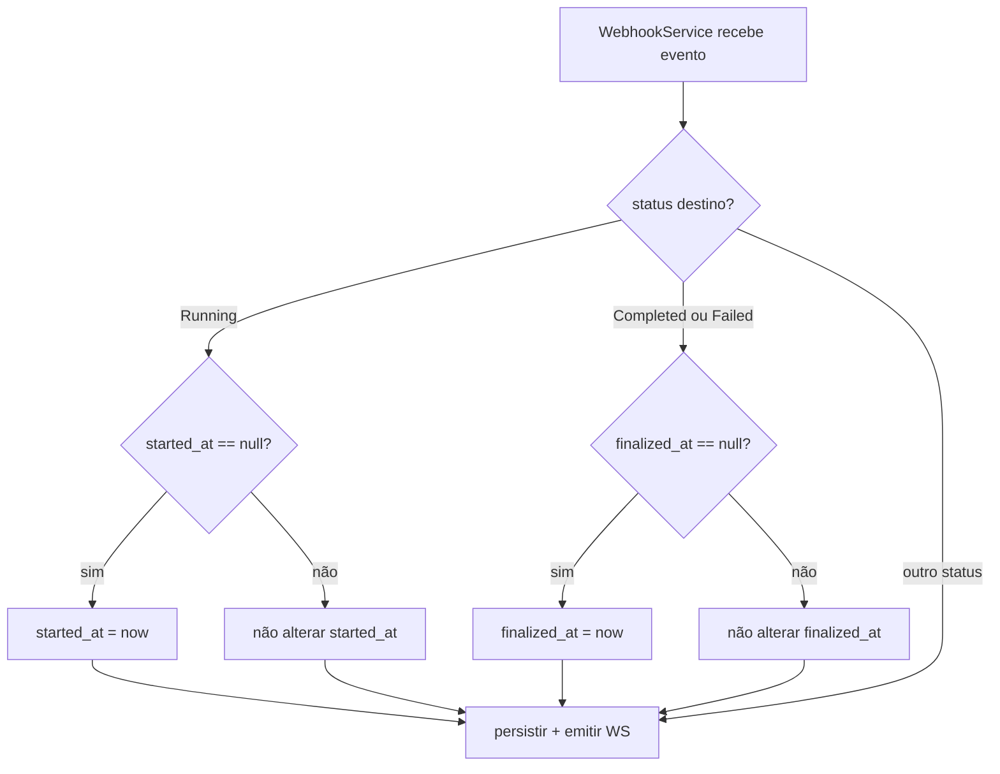
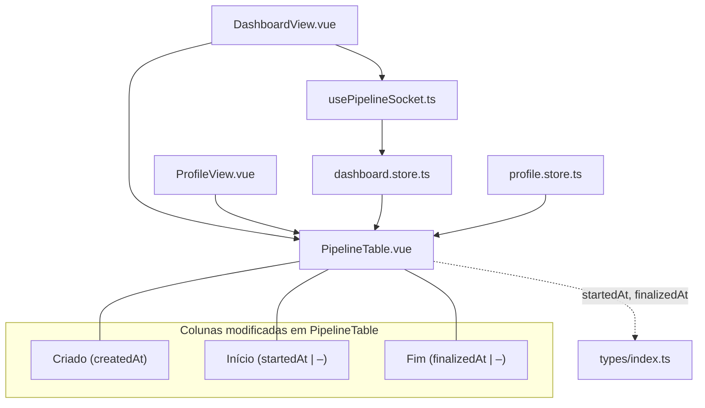

# Pipeline Queue Timestamps

## 1. Contexto

`pipeline_queue` registra ciclo de vida de cada pipeline. Atualmente expõe apenas `createdAt` (momento do enqueue). Não há como saber quando execução efetivamente começou (`started_at`) ou terminou (`finalized_at`). Esses dados são essenciais para medir tempo de espera na fila, duração da execução e detectar gargalos. Dashboard e Perfil precisam exibir as três marcações temporais: **Criado** (enqueue), **Início** (primeiro step fora da fila) e **Fim** (conclusão ou falha).

---

## 2. Escopo

**In scope:**
- Adicionar colunas `started_at` e `finalized_at` (nullable) ao schema `pipeline_queue` via migration Prisma.
- Backend: setar `started_at` quando `WebhookService` transiciona pipeline de `Queued → Running`.
- Backend: setar `finalized_at` quando pipeline transiciona para `Completed` ou `Failed` (via webhook ou `WorkflowCleanupService`).
- `PipelineQueueResponseDto` expõe `startedAt: Date | null` e `finalizedAt: Date | null`.
- Frontend: tipo `PipelineQueue` adiciona `startedAt` e `finalizedAt`.
- Frontend: `PipelineTable.vue` renomeia coluna de data existente para **Criado**; adiciona colunas **Início** e **Fim** (exibe `–` se null).
- Frontend: `ProfileView.vue` (tabela de histórico) exibe as mesmas três colunas.
- Frontend: WebSocket `pipeline.updated` atualiza `startedAt`/`finalizedAt` reativamente nas tabelas.

**Out of scope:**
- Alterações em `KpiCards` ou lógica de KPIs.
- `ScheduledCleanupService` (faz hard delete de registros antigos — não seta `finalized_at`).
- Novos endpoints HTTP (campos chegam pelos já existentes).
- Alterações em manifests k8s.

---

## 3. Glossário

| Termo | Definição |
|---|---|
| `started_at` | Timestamp em que o primeiro step não-queue foi recebido pelo backend (pipeline transiciona para `Running`). |
| `finalized_at` | Timestamp em que o pipeline atingiu estado terminal (`Completed` ou `Failed`), seja via webhook ou cronjob de timeout. |
| `Criado` | Label de UI para `createdAt` (momento do enqueue). |
| `Início` | Label de UI para `started_at`. |
| `Fim` | Label de UI para `finalized_at`. |

---

## 4. Requisitos Funcionais

- **FR-1:** Schema `pipeline_queue` adiciona `started_at DateTime?` e `finalized_at DateTime?`, ambos `@default(null)`.
- **FR-2:** `WebhookService` seta `started_at = now()` ao atualizar `PipelineQueue.status` para `Running` (transição `Queued → Running`). Só seta se `started_at` ainda é `null`.
- **FR-3:** `WebhookService` seta `finalized_at = now()` ao atualizar `PipelineQueue.status` para `Completed` ou `Failed`.
- **FR-4:** `WorkflowCleanupService` seta `finalized_at = now()` ao marcar pipelines expirados como `Failed` (cron de timeout). Só seta se `finalized_at` ainda é `null`.
- **FR-5:** `PipelineQueueResponseDto` expõe `startedAt: Date | null` e `finalizedAt: Date | null` com decorators Swagger PT-BR.
- **FR-6:** Tipo frontend `PipelineQueue` (`frontend/src/types/index.ts`) adiciona `startedAt: string | null` e `finalizedAt: string | null`.
- **FR-7:** `PipelineTable.vue` exibe três colunas temporais: **Criado** (`createdAt`), **Início** (`startedAt` ou `–`), **Fim** (`finalizedAt` ou `–`).
- **FR-8:** Tabela de histórico em `ProfileView.vue` exibe as mesmas três colunas (**Criado**, **Início**, **Fim**).
- **FR-9:** Quando `pipeline.updated` chega via WebSocket, as colunas **Início** e **Fim** atualizam reativamente sem recarregar a página.

---

## 5. Requisitos Não-Funcionais

- **NFR-1:** Migration backward-compatible — campos nullable sem default forçado; registros existentes ficam com `NULL`.
- **NFR-2:** `started_at` setado em único `prisma.pipelineQueue.update` idempotente (check `started_at == null`).
- **NFR-3:** Sem N+1: campos incluídos no `select`/`include` já existente de `PipelineQueueService`.
- **NFR-4:** Formatação de data no frontend consistente com padrão existente de `createdAt`.

---

## 6. Modelo de Dados



| Campo | Tipo Prisma | Nullable | Default | Índice |
|---|---|---|---|---|
| `started_at` | `DateTime` | sim | `null` | não |
| `finalized_at` | `DateTime` | sim | `null` | não |

**Migration:** `npx prisma migrate dev --name add_timestamps_to_pipeline_queue`

---

## 7. Contrato de API

### Campos novos em `PipelineQueueResponseDto`

```ts
startedAt: Date | null   // mapeado de started_at
finalizedAt: Date | null // mapeado de finalized_at
```

Todos os endpoints existentes que retornam `PipelineQueueResponseDto` passam a incluir os novos campos:

| Endpoint | Mudança |
|---|---|
| `GET /pipeline-queue` | inclui `startedAt`, `finalizedAt` |
| `GET /pipeline-queue/:id` | inclui `startedAt`, `finalizedAt` |
| `GET /pipeline-queue/mine` | inclui `startedAt`, `finalizedAt` |
| `PATCH /pipeline-queue/:id` | resposta inclui `startedAt`, `finalizedAt` |

**Nenhum endpoint novo.** Nenhuma rota Vue nova.

---

## 8. Limites de Módulo



---

## 9. Fluxos

### Fluxo 1 — Primeiro step recebido (Queued → Running)



### Fluxo 2 — Step final recebido (Running → Completed/Failed)



### Fluxo 3 — Timeout (WorkflowCleanupService)



---

## 10. Máquinas de Estado



---

## 11. Regras de Negócio



---

## 12. Edge Cases e Tratamento de Erros

- **Pipeline já com `started_at` setado:** Se webhook enviar Running novamente (retry), `started_at` não é sobrescrito (check `started_at == null`).
- **Pipeline já com `finalized_at` setado:** WorkflowCleanupService usa `WHERE finalized_at IS NULL` para não sobrescrever valor já definido via webhook.
- **Registros históricos:** `started_at` e `finalized_at` serão `null` para pipelines anteriores à migration. Frontend exibe `–` para null.
- **Webhook recebe Completed sem passar por Running:** `started_at` permanece null; `finalized_at` é setado normalmente.
- **Pipeline deletado (soft delete `del=true`):** `ScheduledCleanupService` faz hard delete após 30 dias — não seta `finalized_at` (out of scope).

---

## 13. Critérios de Aceitação

- **AC-1** `[backend]`: Dado schema migrado, quando inspecionar `pipeline_queue` no banco, então colunas `started_at` e `finalized_at` existem como `TIMESTAMP? DEFAULT NULL`.

- **AC-2** `[backend]`: Dado pipeline em status `Queued` com `started_at = null`, quando `WebhookService` processar evento que transiciona para `Running`, então `started_at` é setado para `now()` e persiste no banco.

- **AC-3** `[backend]`: Dado pipeline em status `Running`, quando `WebhookService` processar evento que transiciona para `Completed`, então `finalized_at` é setado para `now()`.

- **AC-4** `[backend]`: Dado pipeline em status `Running`, quando `WebhookService` processar evento que transiciona para `Failed`, então `finalized_at` é setado para `now()`.

- **AC-5** `[backend]`: Dado pipeline com `started_at` já setado, quando webhook processar segundo evento `Running` (retry), então `started_at` não é sobrescrito.

- **AC-6** `[backend]`: Dado pipeline `Running` expirado com `finalized_at = null`, quando `WorkflowCleanupService` rodar, então `finalized_at` é setado para o momento da execução do cron.

- **AC-7** `[backend]`: Dado pipeline com `finalized_at` já setado, quando `WorkflowCleanupService` tentar setar novamente, então `finalized_at` não é sobrescrito.

- **AC-8** `[backend]`: Dado `GET /pipeline-queue`, quando autenticado, então resposta inclui `startedAt` e `finalizedAt` por item.

- **AC-9** `[backend]`: Dado `GET /pipeline-queue/mine`, quando autenticado, então paginação inclui `startedAt` e `finalizedAt` por item.

- **AC-10** `[frontend]`: Dado tipo `PipelineQueue` em `frontend/src/types/index.ts`, então inclui campos `startedAt: string | null` e `finalizedAt: string | null`.

- **AC-11** `[frontend]`: Dado `PipelineTable.vue` renderizado com pipeline, quando `startedAt` é não-null, então coluna **Início** exibe data formatada.

- **AC-12** `[frontend]`: Dado `PipelineTable.vue` renderizado com pipeline, quando `startedAt` é null, então coluna **Início** exibe `–`.

- **AC-13** `[frontend]`: Dado `PipelineTable.vue` renderizado com pipeline, quando `finalizedAt` é null, então coluna **Fim** exibe `–`.

- **AC-14** `[frontend]`: Dado `PipelineTable.vue`, então coluna de data existente usa label **Criado** (referente a `createdAt`).

- **AC-15** `[frontend]`: Dado `ProfileView.vue` com histórico de pipelines, então tabela exibe colunas **Criado**, **Início**, **Fim** com mesmas regras de exibição.

- **AC-16** `[frontend]`: Dado pipeline em `Running` no dashboard, quando `pipeline.updated` chegar via WebSocket com `startedAt` preenchido, então coluna **Início** atualiza sem recarregar página.

- **AC-17** `[frontend]`: Dado pipeline em `Running` no dashboard, quando `pipeline.updated` chegar via WebSocket com `finalizedAt` preenchido, então coluna **Fim** atualiza sem recarregar página.

- **AC-18** `[e2e]`: Dado webhook enviando step que transiciona para Running, quando usuário observar dashboard no browser, então coluna **Início** exibe data em tempo real.

---

## 14. Questões Abertas

Nenhuma.

---

## 15. Hierarquia de Componentes Frontend



---

## 16. Topologia de Infra

N/A — sem alterações em manifests k8s. Migration aplicada via `prisma migrate deploy` no startup do container (processo existente).
