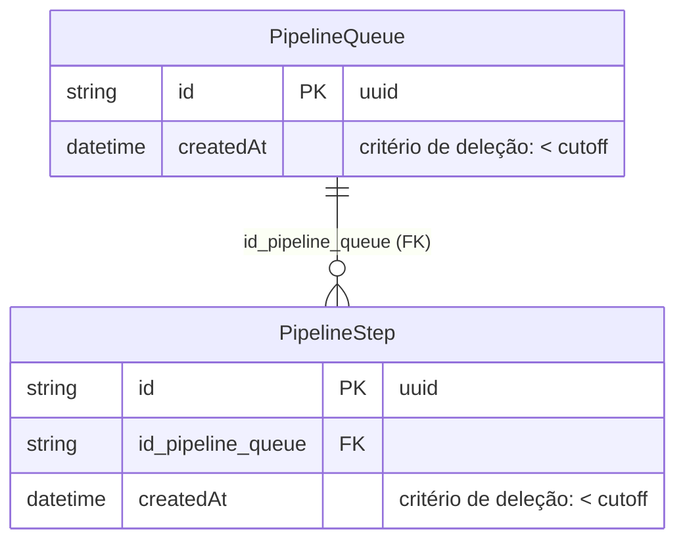
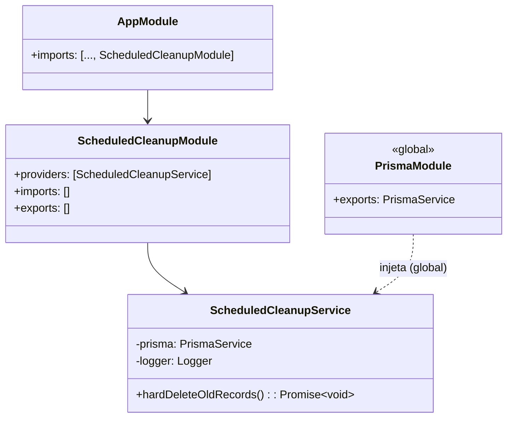
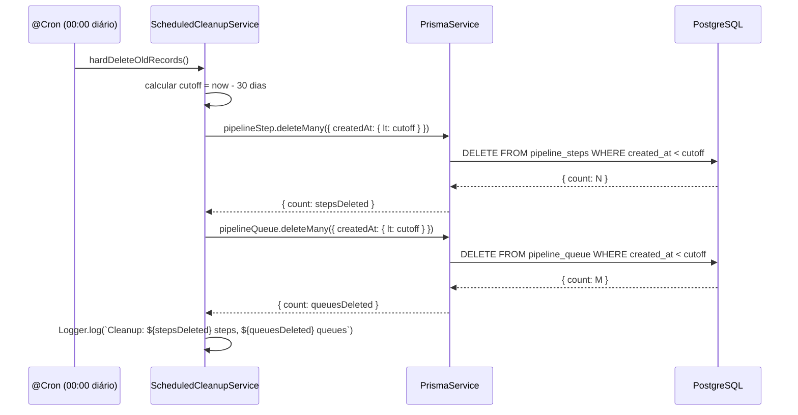
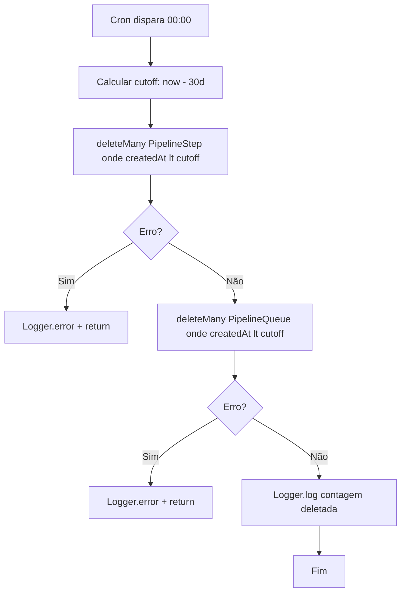

# Scheduled Cleanup

## 1. Context

O banco de dados acumula registros de pipelines indefinidamente. Sem limpeza periódica, o volume cresce sem limite, degradando performance de queries e aumentando custo de storage. Esta feature implementa um módulo NestJS dedicado com cron diário que realiza **hard delete** (DELETE SQL permanente) de todos os registros de `PipelineQueue` e `PipelineStep` com mais de 30 dias de idade, independente do flag `del`.

Usuários afetados: operadores de infraestrutura. Execução silenciosa (sem UI).

---

## 2. Scope

**In scope:**
- Hard delete de `PipelineStep` com `createdAt < agora - 30 dias`
- Hard delete de `PipelineQueue` com `createdAt < agora - 30 dias`
- Execução diária às 00:00 via `@Cron`
- Log do total de registros deletados por tabela
- Novo módulo `ScheduledCleanupModule` (leaf module, sem exports)
- Registro do módulo em `AppModule`

**Out of scope:**
- Deleção de registros da tabela `users`
- Filtragem por flag `del` (deletar tudo, `del: true` ou `false`)
- Período de retenção configurável (hardcoded 30 dias)
- Endpoint HTTP para trigger manual
- Frontend
- Alterações de schema Prisma
- Alterações em manifests k8s

---

## 3. Glossário

| Termo | Definição |
|---|---|
| Hard delete | DELETE SQL permanente — sem recuperação |
| Cutoff date | `new Date(Date.now() - 30 * 24 * 60 * 60 * 1000)` |
| Soft delete | Padrão existente: `del = true` (não confundir com hard delete) |
| FK constraint | `PipelineStep.id_pipeline_queue → PipelineQueue.id` — steps devem ser deletados antes das queues |

---

## 4. Requisitos Funcionais

- **FR-1:** O serviço `ScheduledCleanupService` executa `hardDeleteOldRecords()` diariamente às 00:00 via `@Cron(CronExpression.EVERY_DAY_AT_MIDNIGHT)`.
- **FR-2:** `hardDeleteOldRecords()` calcula o cutoff como `now - 30 dias` no momento da execução.
- **FR-3:** Todos os registros de `PipelineStep` com `createdAt < cutoff` são permanentemente deletados via `prisma.pipelineStep.deleteMany`.
- **FR-4:** Todos os registros de `PipelineQueue` com `createdAt < cutoff` são permanentemente deletados via `prisma.pipelineQueue.deleteMany`.
- **FR-5:** A deleção de `PipelineStep` ocorre **antes** da deleção de `PipelineQueue` para respeitar a FK constraint.
- **FR-6:** O serviço registra via `Logger` o total de steps e queues deletados ao final de cada execução.
- **FR-7:** Erros durante a execução são capturados, logados via `Logger.error`, e não interrompem o processo NestJS.

---

## 5. Requisitos Não-Funcionais

- **NFR-1:** O módulo não deve introduzir nenhum endpoint HTTP.
- **NFR-2:** Falha na execução do cron não deve derrubar a aplicação (tratamento de erro obrigatório).
- **NFR-3:** O módulo não deve exportar nenhum provider (leaf module).
- **NFR-4:** `PrismaService` injetado diretamente (padrão existente — `PrismaModule` é `@Global`).

---

## 6. Modelo de Dados

Sem alterações de schema. Modelos existentes utilizados:

**Critério de deleção:** `createdAt < now - 30 dias`. Sem filtro adicional por `del`.

---

## 7. Contrato de API

N/A — sem endpoints HTTP, sem rotas Vue Router.

---

## 8. Fronteiras de Módulo

---

## 9. Fluxos

---

## 10. Máquinas de Estado

N/A — nenhum campo de status envolvido.

---

## 11. Regras de Negócio

> **Regra crítica:** Steps ANTES de Queues. Inversão viola FK `pipeline_steps.id_pipeline_queue → pipeline_queue.id` e causa erro Prisma.

---

## 12. Edge Cases e Tratamento de Erros

- **Nenhum registro elegível:** `deleteMany` retorna `{ count: 0 }` — log normal, sem erro.
- **Banco indisponível:** Prisma lança exceção → capturada no try/catch → `Logger.error` → próxima execução tentará novamente.
- **Deleção parcial (steps ok, queues falham):** Steps deletados não são revertidos (sem transação global). Na próxima execução, queues sem steps serão deletadas normalmente.
- **Aplicação reiniciada durante execução:** Cron retoma no próximo ciclo de 00:00.
- **Registros com exatamente 30 dias:** `lt` (menos que) — não deletados. Apenas registros com mais de 30 dias são removidos.

---

## 13. Critérios de Aceitação

- **AC-1** `[backend]`: Dado `ScheduledCleanupService` instanciado com `PrismaService` mockado, quando `hardDeleteOldRecords()` é chamado, então `prisma.pipelineStep.deleteMany` é invocado com `where: { createdAt: { lt: <data 30 dias atrás> } }`.

- **AC-2** `[backend]`: Dado `ScheduledCleanupService` instanciado com `PrismaService` mockado, quando `hardDeleteOldRecords()` é chamado, então `prisma.pipelineStep.deleteMany` é invocado **antes** de `prisma.pipelineQueue.deleteMany`.

- **AC-3** `[backend]`: Dado `ScheduledCleanupService` instanciado com `PrismaService` mockado, quando `hardDeleteOldRecords()` é chamado, então `prisma.pipelineQueue.deleteMany` é invocado com `where: { createdAt: { lt: <data 30 dias atrás> } }`.

- **AC-4** `[backend]`: Dado `hardDeleteOldRecords()` executado com sucesso retornando `{ count: 5 }` para steps e `{ count: 3 }` para queues, então `Logger.log` é chamado com mensagem contendo `5` e `3`.

- **AC-5** `[backend]`: Dado `prisma.pipelineStep.deleteMany` lançando erro, quando `hardDeleteOldRecords()` é chamado, então `Logger.error` é chamado e a exceção não propaga (não rejeit a Promise).

- **AC-6** `[backend]`: Dado `ScheduledCleanupModule` importado em `AppModule`, quando aplicação NestJS inicia, então nenhum erro de bootstrap ocorre e o módulo é registrado.

- **AC-7** `[backend]`: Dado `hardDeleteOldRecords()` decorado com `@Cron(CronExpression.EVERY_DAY_AT_MIDNIGHT)`, então o decorator está presente no método do serviço.

---

## 14. Questões em Aberto

N/A

---

## 15. Hierarquia de Componentes Frontend

N/A — feature backend-only.

---

## 16. Topologia de Infra

N/A — sem alterações em manifests k8s.
