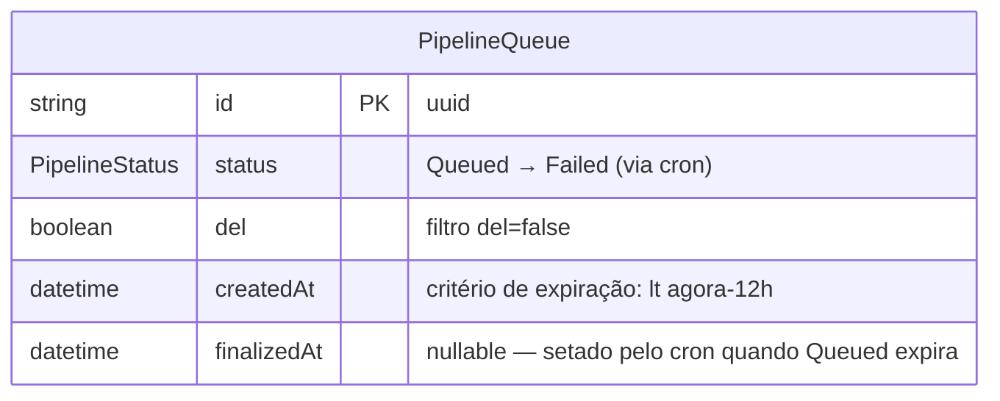
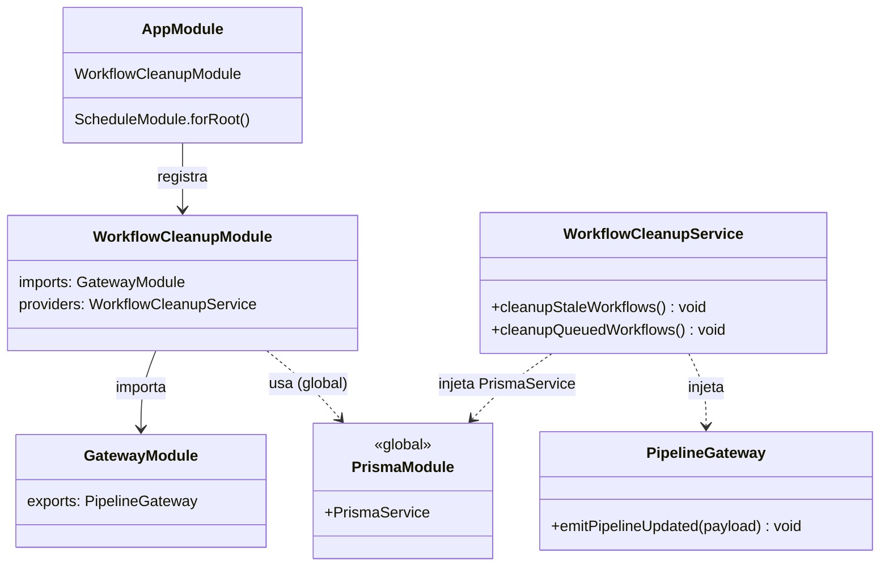
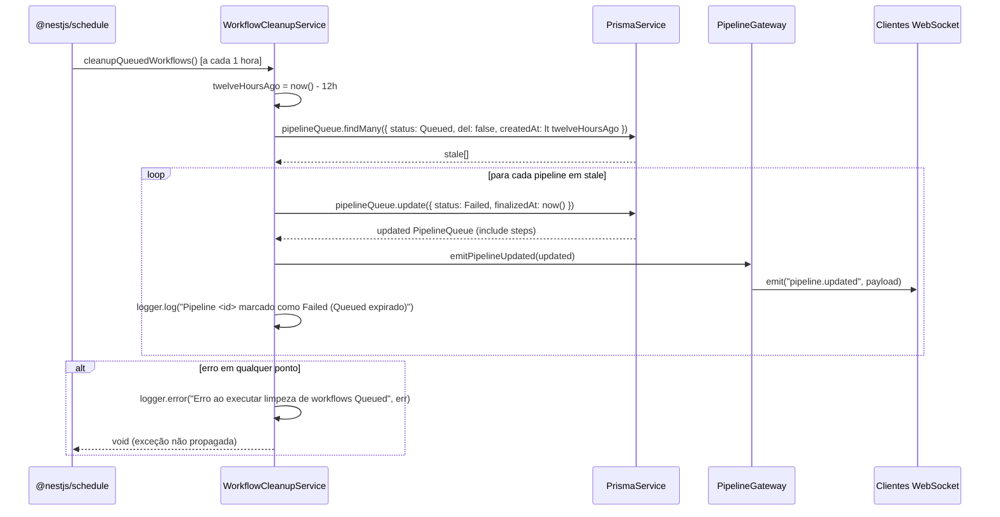
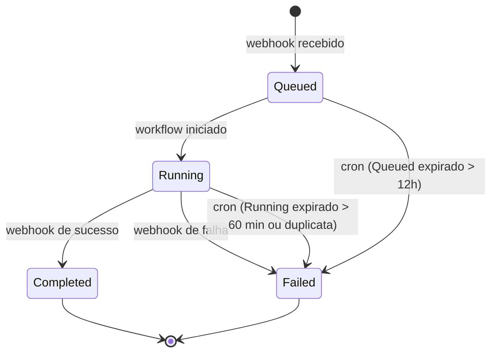
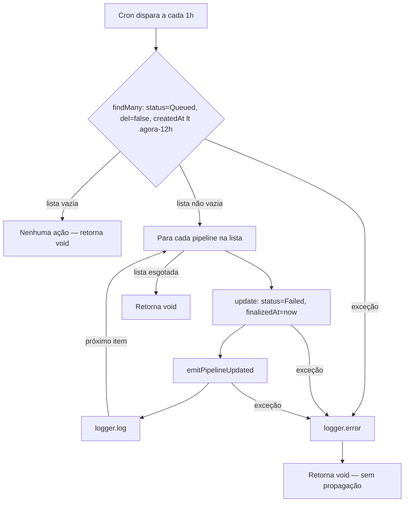

# Workflow Queued Timeout

## 1. Context

Pipelines criados com `status = Queued` dependem de um runner de CI para consumir o webhook e iniciar a execução. Quando o runner falha silenciosamente ou nunca é acionado, a entrada fica presa em `Queued` indefinidamente, poluindo o dashboard com pipelines "ativos" fantasmas e inflando contadores de forma incorreta.

O mecanismo `WorkflowCleanupService` já resolve o mesmo problema para pipelines `Running` (threshold: 60 min, cron: 5 min). Esta feature estende o mesmo serviço com um segundo cron job dedicado a pipelines `Queued` estagnados, marcando-os como `Failed` após **12 horas** e notificando o dashboard via WebSocket.

**Usuários afetados:** equipes que monitoram o dashboard; pipelines cujos runners falharam silenciosamente.

---

## 2. Scope

**In scope:**
- Novo método `cleanupQueuedWorkflows()` em `WorkflowCleanupService`
- Cron `EVERY_HOUR` — filtra `status = Queued`, `del = false`, `createdAt < agora - 12h`
- Para cada pipeline expirado: update `status = Failed`, `finalizedAt = now()`
- Emit WebSocket `pipeline.updated` após cada update
- Log por pipeline processado; captura de erro sem propagação

**Out of scope:**
- Alteração de schema Prisma (nenhuma coluna ou enum novo)
- Novo módulo ou registro em `AppModule` (módulo já existente)
- Mudanças em frontend (status `Failed` já renderiza corretamente)
- Mudanças em k8s/infra
- Endpoints HTTP expostos
- Configuração de threshold via variável de ambiente

---

## 3. Glossary

| Termo | Definição |
|---|---|
| Pipeline expirado (Queued) | `PipelineQueue` com `status = Queued`, `del = false` e `createdAt` anterior a `agora - 12h` |
| Threshold de expiração | 12 horas em milissegundos: `12 * 60 * 60 * 1000` |
| Leaf module | Módulo NestJS sem exports; `WorkflowCleanupModule` já tem esse perfil |

---

## 4. Functional Requirements

- **FR-1:** O sistema deve executar um cron job a cada hora que busca todos os `PipelineQueue` com `status = Queued`, `del = false` e `createdAt < agora - 12h`.
- **FR-2:** Para cada pipeline encontrado pelo cron, o sistema deve atualizá-lo para `status = Failed` e `finalizedAt = now()` em uma única operação `update`.
- **FR-3:** Após cada update, o sistema deve emitir o evento `pipeline.updated` via `PipelineGateway` com o payload do pipeline atualizado (incluindo `steps`).
- **FR-4:** O sistema deve registrar um log informativo por pipeline processado: `Pipeline <id> marcado como Failed (Queued expirado)`.
- **FR-5:** Qualquer exceção lançada durante o cron (falha no Prisma, falha no emit) deve ser capturada, logada via `logger.error`, e não propagada — o scheduler deve programar a próxima execução normalmente.
- **FR-6:** Pipelines `Queued` com `createdAt` dentro das últimas 12 horas **não devem** ser afetados.

---

## 5. Non-Functional Requirements

- **NFR-1:** O cron job deve executar a cada **1 hora** (`CronExpression.EVERY_HOUR`) — proporcional ao threshold de 12h.
- **NFR-2:** A busca de pipelines expirados deve ser feita em **uma única query** ao banco (sem processamento in-memory para filtragem de tempo).
- **NFR-3:** Falha em um pipeline individual (update ou emit) não deve impedir o processamento dos demais — o bloco `try/catch` envolve o loop inteiro mas erros individuais são aceitáveis se `findMany` e o loop completarem sem exceção.
- **NFR-4:** Threshold e intervalo do cron são **hardcoded** — não expostos via variável de ambiente ou configuração externa.

---

## 6. Data Model

Nenhuma alteração de schema. O feature consome os campos existentes:

| Campo | Tipo | Constraint | Uso nesta feature |
|---|---|---|---|
| `status` | `PipelineStatus` enum | `default Queued` | Filtrado em `Queued`; atualizado para `Failed` |
| `del` | `Boolean` | `default false` | Filtra `del = false` |
| `createdAt` | `DateTime` | auto `now()` | Critério de expiração (`lt agora - 12h`) |
| `finalizedAt` | `DateTime?` | nullable | Setado para `now()` na transição Queued→Failed |

---

## 7. API Contract

### HTTP

N/A — sem endpoints HTTP expostos.

### WebSocket — evento emitido

| Namespace | Evento | Payload | Quando |
|---|---|---|---|
| `/pipeline` | `pipeline.updated` | Objeto Prisma `PipelineQueue` com `include: { steps: true }` | A cada pipeline Queued expirado processado pelo cron |

### Vue Router

N/A — feature backend-only.

---

## 8. Module Boundaries

`WorkflowCleanupModule` **não requer alteração** — já importa `GatewayModule` e usa `PrismaService` global. O novo método é adicionado diretamente ao `WorkflowCleanupService` existente.

---

## 9. Flows

### Execução do cron job `cleanupQueuedWorkflows`

---

## 10. State Machines

A transição `Queued → Failed` via cron é **terminal** — nenhuma transição sai de `Failed`. Somente o cron job `cleanupQueuedWorkflows` pode realizar esta transição específica.

---

## 11. Business Rules

---

## 12. Edge Cases & Error Handling

- **Lista vazia:** `findMany` retorna `[]` → loop não executa → sem log, sem emit → retorna void silenciosamente.
- **Pipeline deletado (`del = true`):** filtro `del: false` na query exclui esses registros — nunca processados.
- **Pipeline em outro status (Running, Completed, Failed):** filtro `status: Queued` exclui — nunca afetados.
- **Pipeline Queued com `createdAt` < 12h:** filtro `createdAt: { lt: twelveHoursAgo }` exclui — permanece `Queued`.
- **Falha no Prisma `update`:** capturada no `try/catch` externo → logada → cron retorna void, sem derrubar a aplicação.
- **Falha no emit WebSocket:** capturada no mesmo `try/catch` → DB já está correto; dashboard atualiza na próxima recarga.
- **Execuções concorrentes do cron:** `@nestjs/schedule` não executa instâncias concorrentes do mesmo job por padrão — sem race condition.
- **Idempotência:** um pipeline já marcado `Failed` pelo cron anterior não será retornado pelo filtro `status: Queued` — sem double-processing.

---

## 13. Acceptance Criteria

- **AC-1** `[backend]`: Dado um pipeline com `status = Queued`, `del = false` e `createdAt = agora - 13h`, quando `cleanupQueuedWorkflows()` é invocado, então o pipeline é atualizado para `status = Failed`, `finalizedAt` é definido com valor não-nulo, e `emitPipelineUpdated` é chamado uma vez com o pipeline atualizado.

- **AC-2** `[backend]`: Dado um pipeline com `status = Queued`, `del = false` e `createdAt = agora - 1h`, quando `cleanupQueuedWorkflows()` é invocado, então o pipeline permanece `Queued` e `emitPipelineUpdated` não é chamado.

- **AC-3** `[backend]`: Dados dois pipelines — pipeline A com `createdAt = agora - 13h` e pipeline B com `createdAt = agora - 1h` — ambos `Queued`, quando `cleanupQueuedWorkflows()` é invocado, então somente pipeline A é marcado `Failed` e `emitPipelineUpdated` é chamado exatamente uma vez.

- **AC-4** `[backend]`: Dado que `PrismaService.pipelineQueue.findMany` lança uma exceção, quando `cleanupQueuedWorkflows()` é invocado, então a exceção é capturada, `logger.error` é chamado, e o método retorna void sem propagar a exceção.

- **AC-5** `[backend]`: Dado o código-fonte de `WorkflowCleanupService`, quando inspecionado, então `cleanupQueuedWorkflows` possui o decorator `@Cron(CronExpression.EVERY_HOUR)`.

- **AC-6** `[backend]`: Dado um pipeline com `status = Running` e `createdAt = agora - 13h`, quando `cleanupQueuedWorkflows()` é invocado, então o pipeline `Running` não é afetado (filtro por status).

- **AC-7** `[e2e]`: Dado um pipeline criado com `status = Queued` e `createdAt` atualizado para `agora - 13h` via Prisma direto, quando `cleanupQueuedWorkflows()` é invocado diretamente no service, então a query ao banco retorna o pipeline com `status = Failed` e `finalizedAt != null`.

---

## 14. Open Questions

N/A — todos os requisitos foram esclarecidos pelo usuário antes da spec.

---

## 15. Frontend Component Hierarchy

N/A — feature backend-only. Nenhum componente Vue novo ou modificado.

---

## 16. Infra Topology

N/A — nenhum recurso Kubernetes adicionado ou modificado. O cron roda dentro do container `api` existente.
