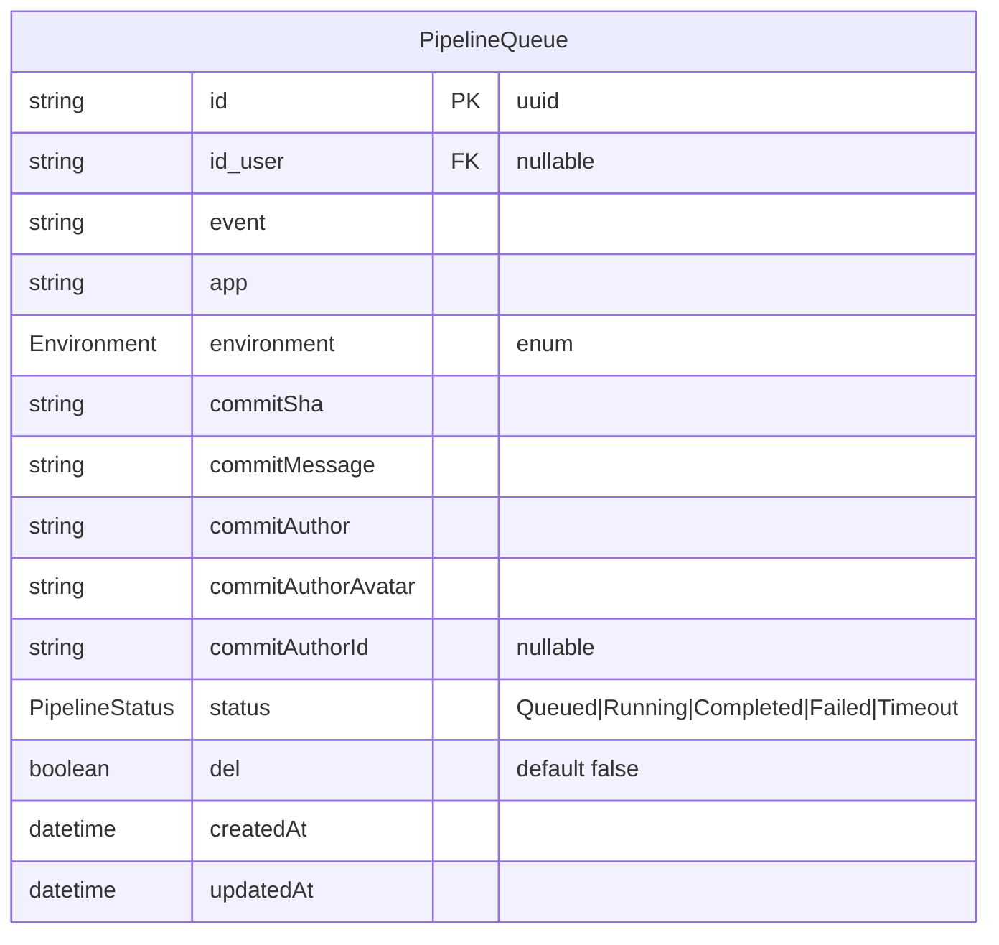
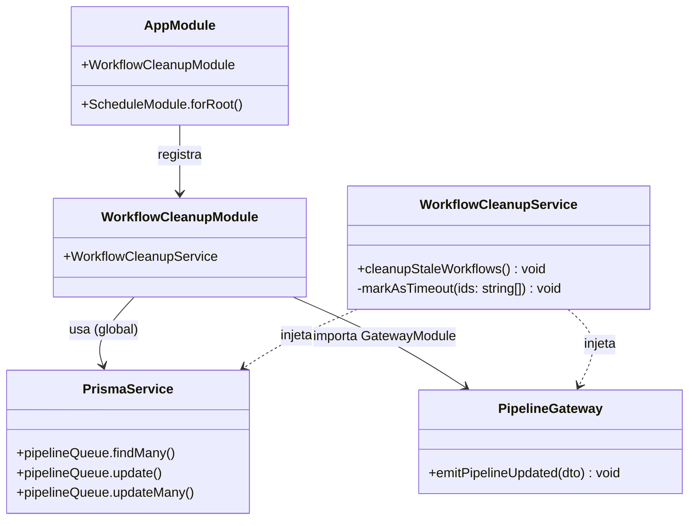
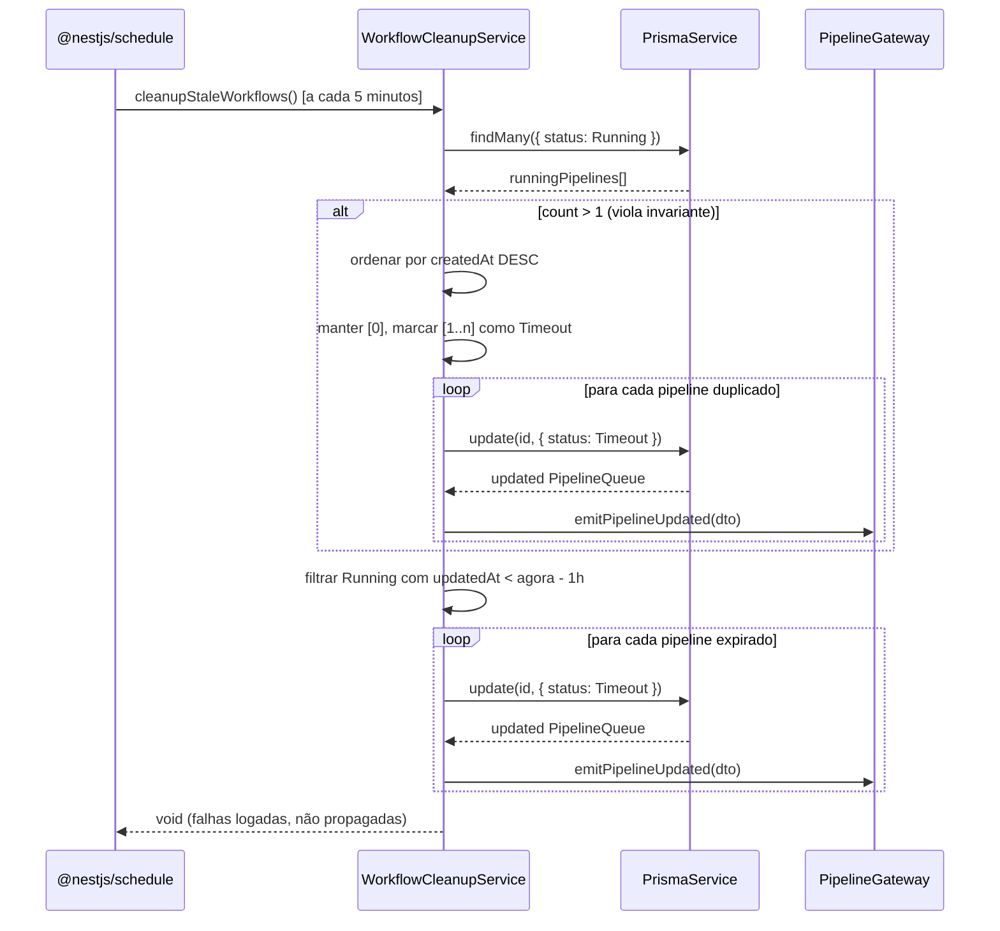
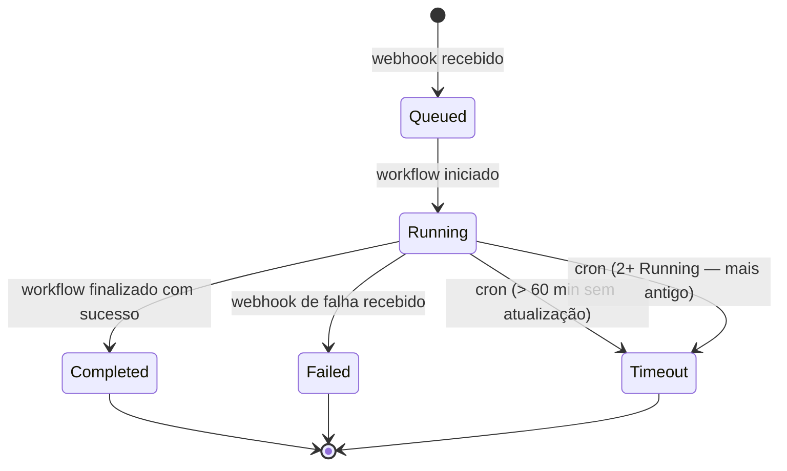
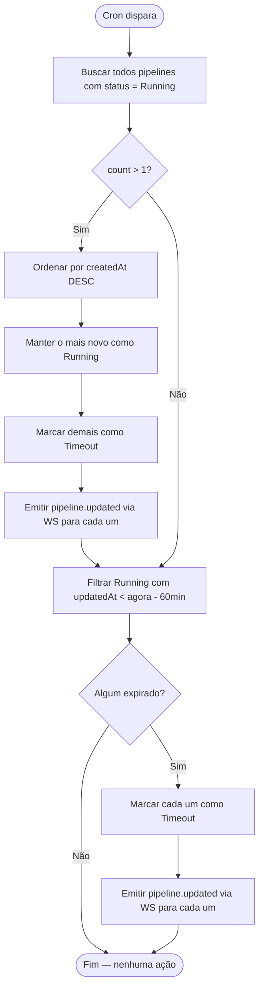
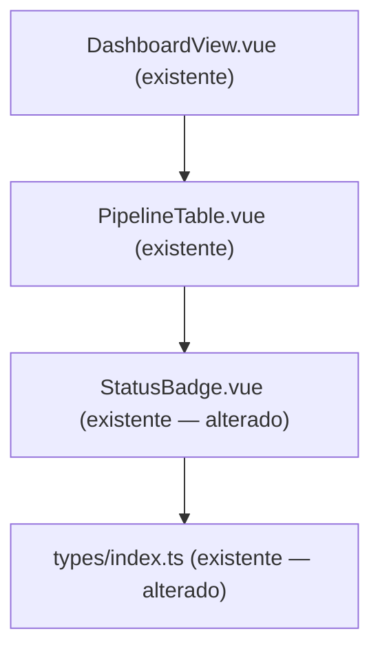

# Workflow Timeout

## 1. Contexto

Pipelines em status `Running` podem ficar presos indefinidamente quando eventos do webhook do GitHub falham ou há problemas de infraestrutura. Sem um mecanismo de limpeza, o dashboard exibe pipelines "zumbis" como ativos e impede a criação de novos deployments válidos. Esta feature adiciona um job periódico que detecta e resolve automaticamente dois cenários inválidos: pipelines Running por mais de 1 hora, e múltiplos pipelines Running simultaneamente (invariante do sistema: no máximo 1 Running por vez).

---

## 2. Escopo

**In scope:**
- Novo status `Timeout` no enum `PipelineStatus` (Prisma migration)
- Módulo NestJS `WorkflowCleanupModule` com cron job (`@Cron(EVERY_5_MINUTES)`)
- Regra única: pipeline Running com `updatedAt` há > 60 minutos → marcar `Timeout`
- Filtro feito na query ao banco (`updatedAt: { lt: oneHourAgo }`) — sem processamento em memória
- Emissão de evento `pipeline.updated` via WebSocket (`PipelineGateway`) para cada pipeline marcado como `Timeout`
- Atualização de `StatusBadge.vue` com caso `Timeout` (cor laranja/warning)
- Atualização de `PipelineStatus` em `frontend/src/types/index.ts`

**Out of scope:**
- Notificações externas (Slack, email) ao marcar Timeout
- Endpoint HTTP para forçar limpeza manual
- Histórico de motivo do Timeout (campo separado)
- Reprocessamento automático de pipeline após Timeout
- Alteração de regras via configuração dinâmica (threshold hardcoded em 60 min)

---

## 3. Glossário

| Termo | Definição |
|---|---|
| **Timeout** | Novo status de pipeline: foi interrompido automaticamente por exceder o tempo máximo permitido em `Running` ou por violar a invariante de unicidade |
| **Pipeline zumbi** | Pipeline em status `Running` sem atividade por tempo indeterminado |
| **Invariante de unicidade** | Regra de negócio: no máximo 1 pipeline com status `Running` em qualquer momento |
| **Cron job** | Tarefa agendada executada a cada minuto pelo `@nestjs/schedule` |

---

## 4. Requisitos Funcionais

- **FR-1:** O sistema deve executar um cron job a cada 5 minutos que consulte todos os pipelines com `status = Running` e `updatedAt < agora - 60 minutos` diretamente na query ao banco, e atualize o status de cada um para `Timeout`.
- **FR-2:** Após cada pipeline marcado como `Timeout`, o sistema deve emitir o evento `pipeline.updated` com o payload atualizado via `PipelineGateway`.
- **FR-3:** O enum `PipelineStatus` no schema Prisma deve incluir o valor `Timeout`. Uma migration deve ser gerada para adicionar este valor ao tipo enum no PostgreSQL.
- **FR-4:** O frontend `StatusBadge.vue` deve renderizar o status `Timeout` com badge de cor laranja (`bg-warning text-dark` Bootstrap 5).
- **FR-5:** A interface `PipelineQueue` em `frontend/src/types/index.ts` deve incluir `Timeout` como valor válido do campo `status`.

---

## 5. Requisitos Não-Funcionais

- **NFR-1:** O cron job deve concluir sua execução em menos de 5 segundos para a grande maioria dos cenários (esperado 0–2 pipelines afetados por execução). Intervalo de disparo: a cada 5 minutos (`CronExpression.EVERY_5_MINUTES`).
- **NFR-2:** Falhas no cron job (ex.: banco indisponível) devem ser logadas via `Logger` do NestJS sem derrubar a aplicação. O job tenta novamente na próxima invocação (1 min depois).
- **NFR-3:** A execução do cron não deve bloquear requisições HTTP em curso (operação assíncrona, sem lock global).
- **NFR-4:** Nenhuma variável de ambiente nova é necessária; threshold de 60 minutos é constante no código.

---

## 6. Modelo de Dados

### Alteração no Schema Prisma

O enum `PipelineStatus` recebe o novo valor `Timeout`:

```prisma
enum PipelineStatus {
  Queued
  Running
  Completed
  Failed
  Timeout
}
```

### ERD (sem novas entidades — apenas alteração de enum)



---

## 7. Contrato de API

### Endpoints HTTP

Nenhum endpoint novo. O cron job é interno — sem exposição HTTP.

### Rotas Vue Router

Nenhuma rota nova. A mudança de status `Timeout` é refletida automaticamente no `DashboardView` existente via WebSocket (`pipeline.updated`).

---

## 8. Limites de Módulos



**Módulos importados por `WorkflowCleanupModule`:**
- `PrismaModule` — global, disponível sem import explícito
- `GatewayModule` — para usar `PipelineGateway`
- `ScheduleModule` — registrado em `AppModule` via `ScheduleModule.forRoot()`

---

## 9. Fluxos

### Fluxo principal: execução do cron job



---

## 10. Máquinas de Estado



**Transições novas introduzidas por esta feature:**
- `Running → Timeout`: única transição para o novo status; realizada exclusivamente pelo cron job.

---

## 11. Regras de Negócio / Lógica de Decisão



**Nota:** A verificação de duplicatas (FR-2) ocorre **antes** da verificação de expiração (FR-1) na mesma execução, para evitar que um pipeline que já seria marcado por duplicata também seja processado pelo filtro de tempo.

---

## 12. Edge Cases e Tratamento de Erros

- **Nenhum pipeline Running:** cron finaliza sem operação.
- **Exatamente 1 pipeline Running < 60 min:** nenhuma ação.
- **Exatamente 1 pipeline Running ≥ 60 min:** marcado Timeout por FR-1.
- **2 pipelines Running, ambos < 60 min:** o mais antigo é marcado Timeout por FR-2 (invariante viola mesmo se recentes).
- **2 pipelines Running, ambos ≥ 60 min:** o mais novo é marcado Timeout primeiro por FR-2; o mais antigo em seguida por FR-1 (ou ambos por FR-2 se implementado via `updateMany`).
- **Falha no Prisma durante update:** erro é capturado, logado via `Logger.error()`, cron não propaga exceção. Pipeline permanece `Running` até próxima execução.
- **Falha no emit WebSocket:** erro é capturado e logado; o update no banco já foi persistido. Dashboard atualizará na próxima recarga.
- **Pipeline deletado (`del: true`) em Running:** `findMany` filtra `del: false` — não processado.

---

## 13. Critérios de Aceitação

- **AC-1** `[backend]`: Dado um pipeline com `status = Running` e `updatedAt` há 61 minutos, quando o cron executa, então o pipeline é atualizado para `status = Timeout` e o evento `pipeline.updated` é emitido via gateway.
- **AC-2** `[backend]`: Dado que nenhum pipeline `Running` tem `updatedAt` anterior a 60 minutos, quando o cron executa, então nenhum update é realizado.
- **AC-3** `[backend]`: Dados múltiplos pipelines `Running` há mais de 60 minutos, quando o cron executa, então todos são marcados `Timeout` e o gateway emite para cada um.
- **AC-4** `[backend]`: Dado que o Prisma lança erro durante o update, quando o cron executa, então a exceção é capturada e logada sem derrubar a aplicação.
- **AC-5** `[frontend]`: Dado um pipeline com `status = 'Timeout'`, quando `StatusBadge` renderiza, então exibe badge com classe Bootstrap `bg-warning text-dark` e texto "Timeout".
- **AC-6** `[frontend]`: Dado que `PipelineStatus` em `types/index.ts` inclui `'Timeout'`, quando o tipo é compilado, então não há erros de TypeScript em componentes que usam o campo `status`.

---

## 14. Questões Abertas

Nenhuma. Todos os requisitos foram esclarecidos antes da escrita desta spec.

---

## 15. Hierarquia de Componentes Frontend



**Alterações:**
- `StatusBadge.vue`: adicionar caso `Timeout` → `badge bg-warning text-dark` com texto "Timeout"
- `types/index.ts`: tipo/union de `status` em `PipelineQueue` deve incluir `'Timeout'`

Nenhum novo componente, view, store ou composable criado.

---

## 16. Topologia de Infra

N/A — nenhum recurso k8s adicionado ou modificado. O cron job roda dentro do container `api` existente, inicializado pelo `ScheduleModule.forRoot()` no bootstrap da aplicação.
